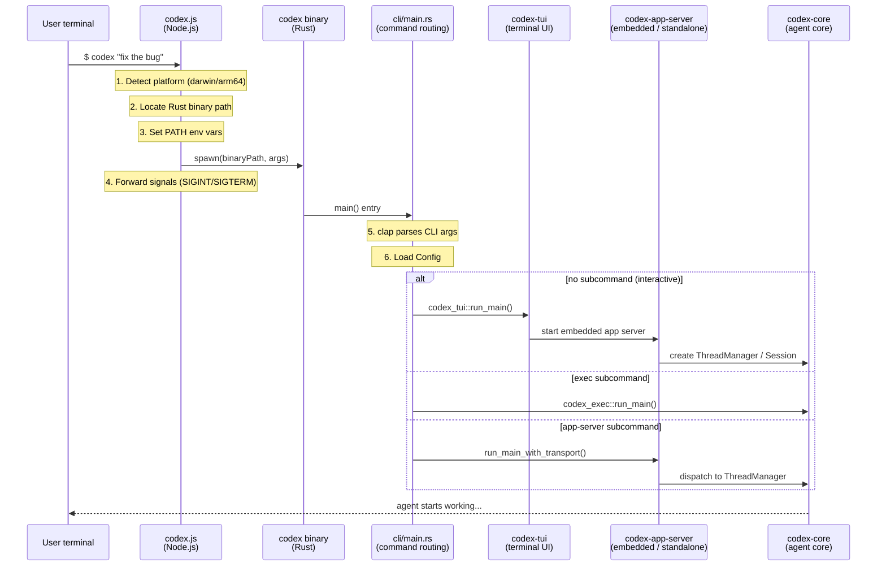
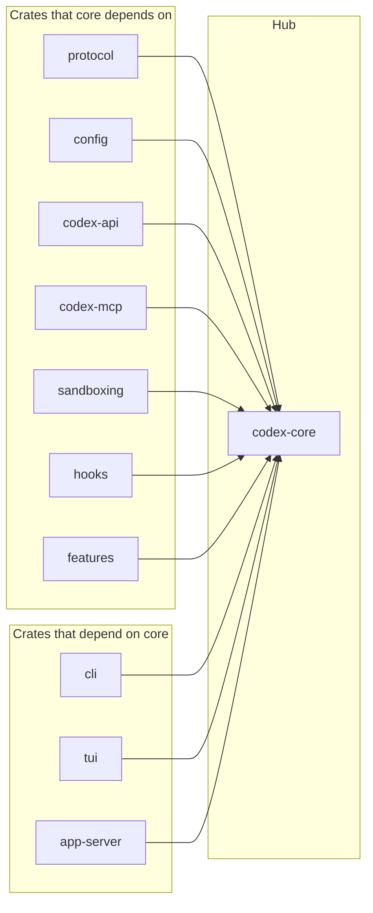

> **Language**: **English** · [中文](00-project-overview.zh.md)

# 00 — Project Overview

> Codex CLI is OpenAI's locally-run coding AI agent. This chapter takes a top-down look at how the project is laid out, what tech stack it uses, and how it boots.

## 1. What is Codex CLI?

Codex CLI is **a coding AI agent that runs locally**. It is a complete agent system with the following core capabilities:

- **Autonomous execution**: runs shell commands, edits files, and searches code on its own
- **Multi-turn conversation**: maintains the full conversation context, with automatic compaction
- **Multi-model support**: works with OpenAI, Azure, Ollama, LMStudio, and other LLM providers
- **Safety sandbox**: a three-layer safety architecture protects the user's environment
- **Sub-agents**: supports parallel agents and task delegation
- **IDE integration**: connects to VS Code, Cursor, Windsurf, and other editors via the App Server
- **SDKs**: TypeScript and Python SDKs for programmatic integration

Users invoke Codex like this:

```bash
# Install
npm install -g @openai/codex
# or
brew install --cask codex

# Run interactively (TUI)
codex

# Non-interactive execution
codex exec "fix this bug"

# Run as an MCP server
codex mcp-server
```

## 2. Monorepo layout

Codex is a **monorepo** — TypeScript and Rust code live side by side in a single repository.

- **Source repository**: https://github.com/openai/codex

The directory tree below shows the role of **every directory** in the repo:

```
codex/                              # repo root
│
├── codex-cli/                      # TypeScript entry (npm global command wrapper)
│   ├── bin/codex.js               # detect platform, launch the Rust binary (229 lines)
│   ├── package.json               # @openai/codex npm package definition
│   ├── scripts/                   # release / build scripts
│   └── vendor/                    # locally pre-built binaries (fallback)
│
├── codex-rs/                       # Rust core engine (Cargo workspace)
│   ├── Cargo.toml                 # workspace members + compile-time optimizations
│   │
│   │  ── Entry & UI ──
│   ├── cli/                       # CLI command routing (clap parsing + subcommand dispatch)
│   ├── tui/                       # terminal UI (Ratatui framework)
│   ├── app-server/                # JSON-RPC server for IDE integration
│   ├── mcp-server/                # MCP-protocol server mode
│   │
│   │  ── Agent core ──
│   ├── core/                      # agent main loop, tool registry, context manager
│   ├── protocol/                  # core protocol (Op / Event message definitions)
│   ├── config/                    # config loading + merging (CLI + TOML + env vars)
│   ├── state/                     # session state persistence (SQLite)
│   ├── hooks/                     # execution hook system
│   ├── features/                  # feature-flag management
│   ├── rollout/                   # session log persistence + discovery
│   │
│   │  ── Models & API ──
│   ├── codex-api/                 # OpenAI API client wrapper
│   ├── codex-client/              # Codex backend client
│   ├── backend-client/            # backend API communication layer
│   ├── models-manager/            # model lifecycle management
│   ├── model-provider-info/       # model-provider metadata
│   ├── ollama/                    # Ollama local-model adapter
│   ├── lmstudio/                  # LM Studio local-model adapter
│   ├── login/                     # auth system (ChatGPT / API key / device code)
│   ├── keyring-store/             # OS keyring integration
│   │
│   │  ── Safety & sandbox ──
│   ├── exec-server/               # sandboxed command-execution service (separate process)
│   ├── sandboxing/                # cross-platform sandbox-policy management
│   ├── linux-sandbox/             # Linux Landlock sandbox implementation
│   ├── windows-sandbox-rs/        # Windows AppContainer sandbox implementation
│   ├── exec/                      # low-level command execution primitives
│   ├── execpolicy/                # execution-policy engine (rule matching)
│   ├── execpolicy-legacy/         # legacy execution policy (compat)
│   ├── process-hardening/         # process hardening utilities
│   ├── secrets/                   # secrets / credential protection
│   │
│   │  ── Tools & execution ──
│   ├── tools/                     # tool registry and dispatch
│   ├── skills/                    # custom skills system
│   ├── core-skills/               # built-in skill implementations
│   ├── codex-mcp/                 # MCP client implementation
│   ├── rmcp-client/               # RMCP (Resource MCP) client
│   ├── apply-patch/               # file patch application
│   ├── shell-command/             # shell command wrapper
│   ├── code-mode/                 # code-mode execution
│   ├── file-search/               # file-search functionality
│   ├── git-utils/                 # Git utilities
│   │
│   │  ── Plugins & extensions ──
│   ├── plugin/                    # plugin architecture (loading, discovery, marketplace)
│   ├── connectors/                # external-service connectors
│   ├── instructions/              # system-instruction assembly
│   ├── collaboration-mode-templates/ # collaboration-mode templates
│   │
│   │  ── Protocol & communication ──
│   ├── app-server-protocol/       # App Server JSON-RPC protocol definitions
│   ├── app-server-client/         # App Server client library
│   ├── app-server-test-client/    # App Server test client
│   ├── codex-backend-openapi-models/ # OpenAPI model definitions (auto-generated)
│   │
│   │  ── Cloud & remote ──
│   ├── cloud-tasks/               # cloud task management
│   ├── cloud-tasks-client/        # cloud-task client
│   ├── cloud-tasks-mock-client/   # cloud-task mock client (for testing)
│   ├── cloud-requirements/        # cloud-side runtime requirement definitions
│   ├── realtime-webrtc/           # WebRTC realtime communication
│   ├── network-proxy/             # network-request proxy
│   ├── responses-api-proxy/       # Responses API proxy/forwarder
│   ├── stdio-to-uds/             # Stdio ↔ Unix Domain Socket bridge
│   │
│   │  ── Observability ──
│   ├── analytics/                 # usage analytics & telemetry
│   ├── otel/                      # OpenTelemetry integration
│   ├── feedback/                  # user-feedback collection
│   ├── response-debug-context/    # response debug context
│   │
│   │  ── Utility libraries ──
│   ├── utils/                     # 22 utility sub-crates
│   │   ├── absolute-path/         #   absolute-path handling
│   │   ├── approval-presets/      #   approval-preset templates
│   │   ├── cache/                 #   generic cache
│   │   ├── cargo-bin/             #   cargo binary path lookup
│   │   ├── cli/                   #   CLI helpers
│   │   ├── elapsed/               #   elapsed-time measurement
│   │   ├── fuzzy-match/           #   fuzzy match
│   │   ├── home-dir/              #   home-dir detection
│   │   ├── image/                 #   image handling
│   │   ├── json-to-toml/          #   JSON ↔ TOML conversion
│   │   ├── oss/                   #   open-source info
│   │   ├── output-truncation/     #   output truncation
│   │   ├── path-utils/            #   path utilities
│   │   ├── plugins/               #   plugin utilities
│   │   ├── pty/                   #   pseudo-terminal (PTY) utilities
│   │   ├── readiness/             #   readiness checks
│   │   ├── rustls-provider/       #   TLS provider
│   │   ├── sandbox-summary/       #   sandbox report
│   │   ├── sleep-inhibitor/       #   sleep inhibitor (long tasks)
│   │   ├── stream-parser/         #   streaming parser
│   │   ├── string/                #   string helpers
│   │   └── template/              #   template rendering
│   │
│   │  ── Other ──
│   ├── async-utils/               # async utilities
│   ├── ansi-escape/               # ANSI escape-code handling
│   ├── arg0/                      # process argv[0] context
│   ├── chatgpt/                   # ChatGPT integration
│   ├── codex-experimental-api-macros/ # experimental API macros
│   ├── debug-client/              # debug client
│   ├── shell-escalation/          # shell privilege-escalation detection
│   ├── terminal-detection/        # terminal-type detection
│   └── v8-poc/                    # V8 engine proof-of-concept
│
├── sdk/                            # official SDKs
│   ├── typescript/                # TypeScript SDK
│   ├── python/                    # Python SDK
│   └── python-runtime/            # Python runtime support
│
├── docs/                           # user docs (install, config, sandbox, ...)
├── scripts/                        # dev / build scripts (install, tests, mock servers)
├── patches/                        # Bazel build patches (30+, mostly Windows compat)
├── third_party/                    # third-party deps (managed by Bazel)
├── tools/                          # code-quality tools (e.g. argument-comment-lint)
│
├── .codex/                         # Codex's own agent-instruction config (AGENTS.md, etc.)
├── .devcontainer/                  # Dev Container definition
├── .github/                        # GitHub Actions CI/CD workflows
├── .vscode/                        # VS Code workspace config
│
│  ── Build & config files ──
├── BUILD.bazel                     # Bazel top-level build entry
├── MODULE.bazel                    # Bazel module declaration (external deps + versions)
├── defs.bzl                        # custom Bazel build rules
├── justfile                        # `just` task commands (dev shortcuts)
├── flake.nix                       # Nix package and dev-environment definition
├── package.json                    # pnpm workspace root config
└── pnpm-workspace.yaml             # pnpm workspace member declaration
```

### Top-level directories explained

| Directory / file | Language / tech | Description |
|------------------|-----------------|-------------|
| `codex-cli/` | TypeScript | The npm global command entry. Detects platform and `spawn`s the Rust binary; contains no business logic itself. |
| `codex-rs/` | Rust | **Core engine.** Cargo workspace that holds all agent logic. |
| `sdk/typescript/` | TypeScript | Official TypeScript SDK for programmatic integration. |
| `sdk/python/` | Python | Official Python SDK. |
| `sdk/python-runtime/` | Python | Python SDK runtime support. |
| `docs/` | Markdown | User documentation: install guide, config reference, sandbox notes, Skills docs, etc. |
| `scripts/` | Shell / Python | Dev scripts: install scripts, ASCII checks, binary-size checks, mock servers. |
| `patches/` | Starlark | 30+ Bazel build patches, mostly fixing Windows MSVC/GnuLLVM compat and dep issues. |
| `third_party/` | — | Third-party dependencies managed by Bazel. |
| `tools/` | Rust | Code-quality tools, e.g. `argument-comment-lint`. |
| `.codex/` | TOML / MD | Codex's own agent-instruction configuration directory. |
| `.devcontainer/` | JSON | VS Code Dev Container config defining a containerized dev environment. |
| `.github/` | YAML | GitHub Actions workflows (CI/CD pipelines). |
| `.vscode/` | JSON | Recommended VS Code workspace settings and extensions. |
| `BUILD.bazel` | Starlark | Bazel top-level build entry point. |
| `MODULE.bazel` | Starlark | Bazel module declaration: external deps and versions. |
| `justfile` | just | Shortcut commands for common dev tasks (Makefile-like). |
| `flake.nix` | Nix | Nix-managed build and dev-environment definition. |
| `package.json` | JSON | pnpm workspace root config; manages TypeScript dependencies. |
| `pnpm-workspace.yaml` | YAML | Declares the member packages of the pnpm workspace. |

### Why migrate from TypeScript to Rust?

Codex was originally written entirely in TypeScript. Mid-2025 saw the launch of a full migration to Rust, and by December the npm-default install was already the Rust version. The official [GitHub Discussion #1174 "Codex CLI is Going Native"](https://github.com/openai/codex/discussions/1174) lists four core reasons:

1. **Zero-dep install** — the old version required Node.js 22+, a hurdle for many users; Rust compiles to a standalone binary with no runtime needed
2. **Native sandbox** — OS-level sandbox APIs like Linux Landlock/seccomp and macOS Seatbelt can be called directly from Rust
3. **Performance** — no GC means lower memory footprint and more predictable latency
4. **Extensibility** — a wire-protocol-based design enables multi-language extensions and the MCP protocol

Codex lead Thibault Sottiaux added two more points in [his interview with The Pragmatic Engineer](https://newsletter.pragmaticengineer.com/p/how-codex-is-built): the **supply-chain security** of the npm ecosystem is hard to audit, and Rust's strong type system forces the team to maintain a higher implementation bar. He also disclosed that the team employs a full-time Ratatui (Rust TUI library) maintainer, and that roughly 90% of the code is written by Codex itself.

The current TypeScript + Rust split is the artifact of that migration:

- **TypeScript layer** (`codex-cli/`): only handles npm packaging. `codex.js`'s entire job is to detect the current platform, locate the matching Rust binary, and `spawn` it.
- **Rust layer** (`codex-rs/`): holds all core logic. The legacy TypeScript implementation was fully removed in August 2025.

> **Further reading**: OpenAI also published two architecture deep-dive blog posts: [Unrolling the Codex agent loop](https://openai.com/index/unrolling-the-codex-agent-loop/) (agent main loop, by Michael Bolin) and [Unlocking the Codex harness](https://openai.com/index/unlocking-the-codex-harness/) (App Server architecture and unified CLI / Web / IDE entry points).

> **Tip — `spawn`**: in `codex.js`, Node.js uses `child_process.spawn()` to launch the Rust-compiled native binary as a child process. The child inherits the parent's stdio, so keyboard input and terminal output flow through transparently.

## 3. The Rust workspace: crate map

The Rust side of Codex is a large Cargo workspace (see [Cargo.toml:1-91](https://github.com/openai/codex/blob/main/codex-rs/Cargo.toml#L1-L91)). The crates fall into the following functional categories:

> Here, a `crate` is a self-contained sub-package / compilation unit inside a Rust workspace; some crates produce executables, others are libraries used by other crates. The architecture-level layering is covered in [01 — Architecture overview](01-architecture-overview.md).

### Crate categories

| Category | Crates | Responsibility |
|----------|--------|----------------|
| **Entry layer** | `cli`, `tui`, `app-server`, `mcp-server` | Command routing, terminal UI, IDE JSON-RPC service, MCP server |
| **Agent core** | `core`, `protocol`, `config`, `state`, `hooks` | Agent main loop, protocol definitions, config management, session-state persistence, execution hooks |
| **Tools & execution** | `exec`, `tools`, `skills`, `core-skills`, `codex-mcp`, `rmcp-client`, `apply-patch`, `shell-command`, `code-mode`, `file-search`, `git-utils` | Command execution, tool registry/dispatch, MCP protocol, file patching, code mode, file search, Git operations |
| **Safety & sandbox** | `exec-server`, `sandboxing`, `execpolicy`, `execpolicy-legacy`, `linux-sandbox`, `windows-sandbox-rs`, `process-hardening`, `secrets`, `keyring-store`, `shell-escalation` | Sandboxed command-execution service, sandbox management, execution policy, Landlock/AppContainer sandboxes, process hardening, secret protection, escalation detection |
| **Models & API** | `codex-api`, `codex-client`, `backend-client`, `login`, `models-manager`, `ollama`, `lmstudio`, `model-provider-info`, `chatgpt`, `codex-backend-openapi-models` | API client, auth, model management, multi-provider adapters, OpenAPI model definitions |
| **Protocol & comms** | `protocol`, `app-server-protocol`, `app-server-client`, `app-server-test-client`, `stdio-to-uds` | Op/Event protocol, JSON-RPC protocol, test clients, Stdio ↔ UDS bridge |
| **Infrastructure** | `analytics`, `otel`, `features`, `rollout`, `feedback`, `response-debug-context` | Telemetry, OpenTelemetry, feature flags, session-log persistence, user feedback, debug context |
| **Plugins & collaboration** | `plugin`, `connectors`, `instructions`, `collaboration-mode-templates` | Plugin loading + discovery, external connectors, instruction assembly, collaboration-mode templates |
| **Cloud & remote** | `cloud-requirements`, `cloud-tasks`, `cloud-tasks-client`, `cloud-tasks-mock-client`, `realtime-webrtc`, `network-proxy`, `responses-api-proxy` | Cloud tasks, remote control, mock clients, WebRTC realtime, network proxy |
| **Utility libs** | `utils/*` (22 crates) | Absolute paths, cache, image handling, PTY, fuzzy match, TLS, template rendering, etc. |
| **Other** | `async-utils`, `ansi-escape`, `arg0`, `terminal-detection`, `debug-client`, `codex-experimental-api-macros`, `v8-poc` | Async utilities, ANSI escape handling, terminal detection, debug client, experimental macros, V8 PoC |

> **Tip — crate**: a `crate` is the basic unit of compilation and distribution in Rust. Think of it as "a single Rust package / module boundary." A crate with `main()` is a binary crate (executable); one that exposes a library API is a library crate that other crates depend on. The Codex `codex-rs/` directory is a workspace containing many crates.

> **Tip — Cargo workspace**: Rust's Cargo workspace lets you manage multiple related crates in one repo. They share a single `Cargo.lock` file and a common `target/` build directory, which keeps dependency versions consistent while still letting you build and test individual crates.

## 4. Startup chain — full trace

What actually happens when a user types `codex` in their terminal? Let's trace a complete startup end-to-end.

### Figure 0.2: startup sequence



### 4.1 Step 1: TypeScript entry ([codex-cli/bin/codex.js](https://github.com/openai/codex/blob/main/codex-cli/bin/codex.js))

`codex.js` is the entry point of the entire system, but it is intentionally minimal (229 lines). Its job is single-purpose:

```javascript
// 1. Detect current platform and arch
const { platform, arch } = process;
// platform: "darwin" | "linux" | "win32"
// arch: "x64" | "arm64"

// 2. Map to Rust target triple
const PLATFORM_PACKAGE_BY_TARGET = {
  "aarch64-apple-darwin": "@openai/codex-darwin-arm64",
  "x86_64-unknown-linux-musl": "@openai/codex-linux-x64",
  // ...6 platforms total
};

// 3. Locate the binary
// Prefer the npm optional-dependency package; fall back to local vendor/
const binaryPath = path.join(archRoot, "codex", codexBinaryName);

// 4. Spawn the child process asynchronously (key!)
const child = spawn(binaryPath, process.argv.slice(2), {
  stdio: "inherit",  // inherit stdio
  env,               // forward env vars
});

// 5. Signal forwarding so Ctrl+C reaches the Rust process
["SIGINT", "SIGTERM", "SIGHUP"].forEach((sig) => {
  process.on(sig, () => child.kill(sig));
});
```

**Key design choice**: async `spawn` (not `spawnSync`) keeps the Node.js event loop alive so signals can be received and forwarded correctly.

### 4.2 Step 2: Rust CLI routing ([cli/src/main.rs:63-163](https://github.com/openai/codex/blob/main/codex-rs/cli/src/main.rs#L63-L163))

Once the Rust binary is up, it enters `main.rs`, which uses the `clap` library to parse CLI args:

```rust
// Top-level command struct
#[derive(Debug, Parser)]
struct MultitoolCli {
    pub config_overrides: CliConfigOverrides,  // --model, --config, etc.
    pub feature_toggles: FeatureToggles,        // feature switches
    pub interactive: TuiCli,                    // interactive-mode args
    subcommand: Option<Subcommand>,             // optional subcommand
}

// Subcommand enum — covers every run mode
enum Subcommand {
    Exec(ExecCli),           // non-interactive execution
    Review(ReviewArgs),       // code review
    Login(LoginCommand),      // auth management
    Mcp(McpCli),             // MCP server management
    McpServer,               // run as MCP server
    AppServer(AppServerCommand), // IDE-integration server
    Sandbox(SandboxArgs),    // sandbox commands
    Resume(ResumeCommand),   // resume a session
    Fork(ForkCommand),       // fork a session
    // ... more subcommands
}
```

**Routing logic**:
- **No subcommand** → enter the interactive TUI (terminal UI)
- **`exec`** → non-interactive execution mode
- **`app-server`** → start the JSON-RPC server for IDE extensions
- **`mcp-server`** → run as an MCP (Model Context Protocol) server

> **Tip — `clap`**: clap is the most popular CLI argument-parser in the Rust ecosystem. The `#[derive(Parser)]` macro auto-generates parsing logic — including help, type validation, and error messages — directly from a struct definition.

### 4.3 Step 3: into the agent core

Whichever path is taken, control eventually reaches `codex-core` — the heart of the AI agent.

**Interactive mode (TUI)** startup chain:
```
codex_tui::run_main()
  → build Config (merge CLI args + config.toml + env vars)
  → choose AppServerTarget (default Embedded; Remote when in remote mode)
  → start the embedded app server
  → TUI talks to the backend through AppServerSession
  → app-server creates a ThreadManager
  → ThreadManager creates a CodexThread / Session
  → enter the Agent Loop (wait for user input, run a Turn)
```

The relevant entry points are at [tui/src/lib.rs:654-838](https://github.com/openai/codex/blob/main/codex-rs/tui/src/lib.rs#L654-L838), [tui/src/lib.rs:1059-1073](https://github.com/openai/codex/blob/main/codex-rs/tui/src/lib.rs#L1059-L1073), [app-server/src/message_processor.rs:231-242](https://github.com/openai/codex/blob/main/codex-rs/app-server/src/message_processor.rs#L231-L242), and [core/src/codex.rs:668-686](https://github.com/openai/codex/blob/main/codex-rs/core/src/codex.rs#L668-L686).

**Non-interactive mode (Exec)** startup chain:
```
codex_exec::run_main()
  → build Config
  → submit the user's prompt directly
  → run a single Turn
  → emit results and exit
```

Entry point: [exec/src/lib.rs:214-330](https://github.com/openai/codex/blob/main/codex-rs/exec/src/lib.rs#L214-L330).

**IDE mode (App Server)** startup chain:
```
codex_app_server::run_main_with_transport()
  → listen on a stdio:// or ws:// endpoint
  → wait for JSON-RPC requests
  → create a ThreadManager and a MessageProcessor
  → dispatch each request to a Thread / Session
  → return results via a JSON-RPC event stream
```

Entry points: [cli/src/main.rs:724-749](https://github.com/openai/codex/blob/main/codex-rs/cli/src/main.rs#L724-L749), [app-server/src/lib.rs:354-420](https://github.com/openai/codex/blob/main/codex-rs/app-server/src/lib.rs#L354-L420), and [app-server/src/message_processor.rs:231-267](https://github.com/openai/codex/blob/main/codex-rs/app-server/src/message_processor.rs#L231-L267).

## 5. Core crate dependencies

### Figure 0.3: codex-core dependency graph



`codex-core` is the hub of the whole system; nearly every other crate funnels into it. That is also why `codex-core` is the largest crate (398 `.rs` files), and why the repo's `AGENTS.md` explicitly tells contributors to "resist adding code to codex-core" ([AGENTS.md:56-67](https://github.com/openai/codex/blob/main/AGENTS.md#L56-L67)).

## 6. Build and task toolchain

Codex combines several build and task tools:

| Build tool | Purpose | Notes |
|------------|---------|-------|
| **Cargo** | Rust dependency management and compilation | The standard Rust toolchain; large workspace |
| **Bazel** | Cross-language deterministic builds | Used in CI/CD for reproducible builds |
| **pnpm** | TypeScript package management | Manages npm deps for codex-cli and the SDKs |
| **just** | Task automation | Makefile-like command runner |

**Release-build optimizations** (from [Cargo.toml](https://github.com/openai/codex/blob/main/codex-rs/Cargo.toml#L412-L426)):
```toml
[profile.release]
lto = "fat"           # link-time optimization across crates
strip = "symbols"     # strip the symbol table to shrink the binary
codegen-units = 1     # single codegen unit for maximum optimization
```

## 7. Chapter summary

| Aspect | Value |
|--------|-------|
| Languages | TypeScript (entry) + Rust (core) |
| Core file | `codex.rs` |
| Platforms | macOS (arm64/x64), Linux (arm64/x64), Windows (arm64/x64) |
| Run modes | Interactive TUI, non-interactive Exec, App Server (IDE), MCP Server |
| Install methods | npm, Homebrew, GitHub Release |

---

> **Source-version note**: this chapter analyzes the main branch of [openai/codex](https://github.com/openai/codex). Crate counts, file counts, and the startup chain are based on the source revision in use at the time of analysis.

---

**Next**: [01 — Architecture overview](01-architecture-overview.md)
