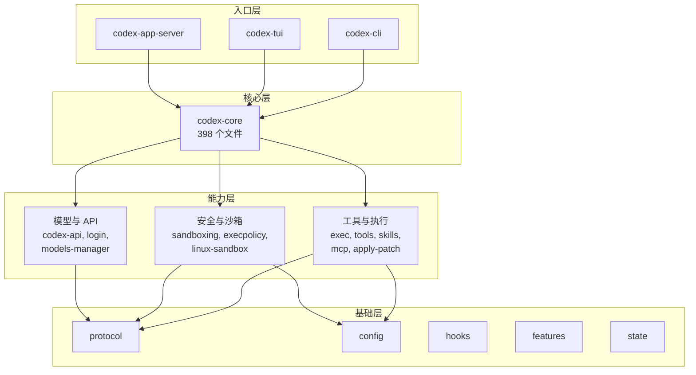
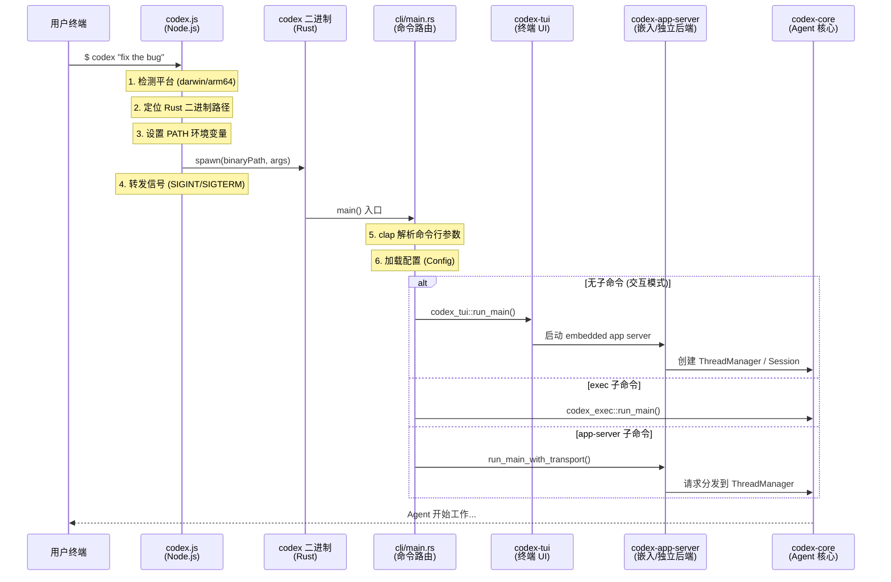
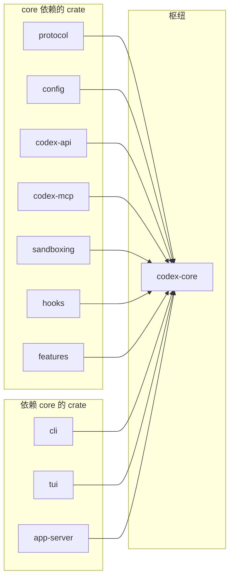

# 00 — 项目全景概览

> Codex CLI 是 OpenAI 出品的本地编码 AI Agent，本章从整体视角剖析这个项目的组成结构、技术栈选择和启动链路。

## 1. Codex CLI 是什么

Codex CLI 是一个**运行在本地的编码 AI Agent**。它不是一个简单的 API 包装器，而是一个完整的 Agent 系统，具备以下核心能力：

- **自主执行**: 能自主执行 shell 命令、编辑文件、搜索代码
- **多轮对话**: 维护完整的对话上下文，支持上下文压缩
- **多模型支持**: 支持 OpenAI、Azure、Ollama、LMStudio 等多种 LLM 供应商
- **安全沙箱**: 三层安全机制保护用户环境
- **子 Agent**: 支持多 Agent 并行工作和任务委派
- **IDE 集成**: 通过 App Server 支持 VS Code、Cursor、Windsurf 等编辑器
- **SDK**: 提供 TypeScript 和 Python SDK，支持编程式调用

用户可以通过以下方式使用 Codex：

```bash
# 安装
npm install -g @openai/codex
# 或
brew install --cask codex

# 直接运行（进入交互式 TUI）
codex

# 非交互式执行
codex exec "修复这个 bug"

# 作为 MCP 服务器
codex mcp-server
```

## 2. 单仓结构总览

Codex 采用 **Monorepo（单仓）** 架构，TypeScript 与 Rust 代码共存于一个仓库中：

```
codex/                          # 仓库根目录
├── codex-cli/                  # TypeScript 入口包装
│   ├── bin/codex.js           # npm 全局命令入口（229 行）
│   └── package.json           # npm 包定义
│
├── codex-rs/                   # Rust 核心引擎（主体）
│   ├── Cargo.toml             # 88 个 crate 的 workspace 定义
│   ├── core/                  # 核心 Agent 逻辑（398 个 .rs 文件）
│   ├── tui/                   # 终端交互界面（171 个 .rs 文件）
│   ├── cli/                   # CLI 命令路由（22 个 .rs 文件）
│   ├── app-server/            # IDE 集成服务器（104 个 .rs 文件）
│   ├── protocol/              # 通信协议定义
│   ├── codex-api/             # OpenAI API 客户端
│   ├── sandboxing/            # 跨平台沙箱
│   └── ...                    # 60+ 其他 crate
│
├── sdk/                        # 官方 SDK
│   ├── typescript/            # TypeScript SDK
│   └── python/                # Python SDK
│
├── docs/                       # 用户与开发文档
├── scripts/                    # 构建脚本
├── patches/                    # 第三方依赖补丁
├── BUILD.bazel                 # Bazel 顶层构建入口
├── justfile                    # 常用开发任务
└── tools/                      # 开发工具
```

### 为什么是 TypeScript + Rust？

Codex 的架构选择体现了一个务实的工程决策：

- **TypeScript 层**（`codex-cli/`）：仅做 npm 包分发和平台二进制分发。`codex.js` 的全部职责就是检测当前平台、找到对应的 Rust 编译产物、然后 `spawn` 启动它。
- **Rust 层**（`codex-rs/`）：承载所有核心逻辑。选择 Rust 是为了性能（Agent 循环需要低延迟）、安全性（内存安全、类型系统）和跨平台能力（编译为原生二进制）。

> **知识点 — `spawn`**: 在 `codex.js` 中，Node.js 通过 `child_process.spawn()` 启动 Rust 编译的原生二进制程序作为子进程。子进程继承了父进程的标准输入/输出，因此用户的键盘输入和终端输出可以直接传递。

## 3. Rust 工作空间：88 个 Crate 全景

Codex 的 Rust 部分是一个包含 **88 个 crate** 的 Cargo workspace（见 `codex-rs/Cargo.toml:1-91`）。这些 crate 按功能可以分为以下几大类：

### 图 0.1: 88 个 Crate 的分层架构

这里的 `crate` 可以理解为 Rust workspace 里的一个独立子包/编译单元；有些 crate 会产出可执行程序，有些则作为库被其他 crate 依赖。

下图展示了 Codex 的 crate 按**调用层级**的分布，自上而下调用：



> 这张图是“阅读视角”的分层，不是 Cargo.toml 中的官方分组。`codex-core` 是中间枢纽，向上被 `cli`、`tui`、`app-server` 等入口 crate 调用，向下再组合模型、工具、沙箱等能力。

### Crate 分类详表

| 类别 | Crate 名称 | 职责 |
|------|-----------|------|
| **入口层** | `cli`, `tui`, `app-server` | 命令路由、终端 UI、IDE JSON-RPC 服务 |
| **Agent 核心** | `core`, `protocol`, `config` | Agent 主循环、协议定义、配置管理 |
| **工具与执行** | `exec`, `exec-server`, `tools`, `skills`, `core-skills`, `codex-mcp`, `apply-patch`, `shell-command` | 命令执行、工具注册/分发、MCP 协议、文件补丁 |
| **安全与沙箱** | `sandboxing`, `execpolicy`, `execpolicy-legacy`, `linux-sandbox`, `process-hardening`, `secrets` | 沙箱管理、执行策略、进程加固、密钥保护 |
| **模型与 API** | `codex-api`, `codex-client`, `login`, `models-manager`, `ollama`, `lmstudio`, `model-provider-info` | API 客户端、认证、模型管理、多供应商适配 |
| **协议与 SDK** | `protocol`, `app-server-protocol`, `app-server-client` | Op/Event 协议、JSON-RPC 协议、测试客户端 |
| **基础设施** | `analytics`, `otel`, `hooks`, `features`, `state`, `rollout`, `feedback` | 遥测、Feature Flags、SQLite 持久化、会话回放 |
| **插件与协作** | `plugin`, `connectors`, `instructions`, `collaboration-mode-templates` | 插件装载、外部连接器、协作模式模板、指令拼装 |
| **云与远程** | `cloud-requirements`, `cloud-tasks`, `cloud-tasks-client`, `realtime-webrtc`, `network-proxy`, `responses-api-proxy` | 云端任务、远程控制、代理与实时能力 |
| **工具库** | `utils/*` (22 个) | 绝对路径、缓存、图片处理、PTY、模糊匹配等 |

### 3.1 从总体结构看，最容易遗漏的三层

如果只看“CLI + core + TUI”这条主线，很容易漏掉下面三类对理解 Codex 很关键的结构：

1. **TUI 背后其实站着一个 App Server**

   现在的 TUI 并不是直接把用户输入塞进 `codex-core`。默认情况下，它会先启动一个 **embedded app server**，再通过 app-server client 与后端通信（`codex-rs/tui/src/lib.rs:654-672`, `1059-1073`）。这意味着：

   - TUI 更像前端壳层
   - App Server 是统一的请求分发后端
   - IDE 集成和 TUI 共享了大量后端能力

2. **插件 / Skills / Connectors 是一条独立的扩展轴**

   第一眼看仓库时，很多人会把注意力全部放到 `core/`。但从产品能力上看，`skills`、`core-skills`、`plugin`、`connectors`、`instructions` 这条线同样重要，它决定了 Agent 能看见什么指令、能连接什么外部系统、能以什么方式扩展自身。

3. **Cloud / Remote 模块说明它不只是“本地命令行工具”**

   `cloud-*`、`realtime-webrtc`、`network-proxy`、`responses-api-proxy` 这些 crate 表明，Codex 的设计目标已经超出“本地 TUI + 一次性调用模型 API”。它同时在兼容云任务、远程连接和更复杂的运行环境。

> **知识点 — crate**: `crate` 是 Rust 中最基本的编译与发布单元。可以把它理解成“一个独立的 Rust 包/模块边界”。带 `main()` 的叫 binary crate，可执行；提供库接口的叫 library crate，可被其他 crate 依赖。Codex 的 `codex-rs/` 就是一个包含 88 个 crate 的 workspace。

> **知识点 — Cargo Workspace**: Rust 的 Cargo workspace 允许在一个仓库中管理多个相关的 crate（库/包）。它们共享同一个 `Cargo.lock` 锁文件和编译产物目录 `target/`，既保证依赖版本一致，又允许独立编译和测试单个 crate。

## 4. 启动链路全追踪

当用户在终端输入 `codex` 时，究竟发生了什么？让我们从头到尾追踪一次完整的启动过程。

### 图 0.2: 启动链路流程



### 4.1 第一步：TypeScript 入口 (`codex-cli/bin/codex.js:1-229`)

`codex.js` 是整个系统的起点，但它极其轻量（229 行）。它的职责单一：

```javascript
// 1. 检测当前平台和架构
const { platform, arch } = process;
// platform: "darwin" | "linux" | "win32"
// arch: "x64" | "arm64"

// 2. 映射到 Rust 编译目标 (target triple)
const PLATFORM_PACKAGE_BY_TARGET = {
  "aarch64-apple-darwin": "@openai/codex-darwin-arm64",
  "x86_64-unknown-linux-musl": "@openai/codex-linux-x64",
  // ...共 6 个平台
};

// 3. 定位二进制文件路径
// 优先从 npm optional dependency 包中查找
// 回退到本地 vendor 目录
const binaryPath = path.join(archRoot, "codex", codexBinaryName);

// 4. 异步启动子进程（关键！）
const child = spawn(binaryPath, process.argv.slice(2), {
  stdio: "inherit",  // 继承标准输入/输出
  env,               // 传递环境变量
});

// 5. 信号转发：确保 Ctrl+C 能正确传递到 Rust 进程
["SIGINT", "SIGTERM", "SIGHUP"].forEach((sig) => {
  process.on(sig, () => child.kill(sig));
});
```

**关键设计**：使用异步 `spawn` 而非 `spawnSync`，这样 Node.js 进程能保持事件循环活跃，正确响应和转发信号。

### 4.2 第二步：Rust CLI 路由 (`codex-rs/cli/src/main.rs:63-163,653-750`)

Rust 二进制启动后，进入 `main.rs`，使用 `clap` 库解析命令行参数：

```rust
// 主命令结构
#[derive(Debug, Parser)]
struct MultitoolCli {
    pub config_overrides: CliConfigOverrides,  // --model, --config 等
    pub feature_toggles: FeatureToggles,        // 功能开关
    pub interactive: TuiCli,                    // 交互模式参数
    subcommand: Option<Subcommand>,             // 可选子命令
}

// 子命令枚举 — 覆盖所有运行模式
enum Subcommand {
    Exec(ExecCli),           // 非交互式执行
    Review(ReviewArgs),       // 代码审查
    Login(LoginCommand),      // 登录管理
    Mcp(McpCli),             // MCP 服务器管理
    McpServer,               // 作为 MCP 服务器运行
    AppServer(AppServerCommand), // IDE 集成服务器
    Sandbox(SandboxArgs),    // 沙箱命令
    Resume(ResumeCommand),   // 恢复会话
    Fork(ForkCommand),       // 分叉会话
    // ... 更多子命令
}
```

**路由逻辑**：
- **无子命令** → 进入交互式 TUI（终端用户界面）
- **`exec`** → 非交互式执行模式
- **`app-server`** → 启动 JSON-RPC 服务器，供 IDE 扩展连接
- **`mcp-server`** → 作为 MCP (Model Context Protocol) 服务器运行

> **知识点 — `clap`**: clap 是 Rust 生态中最流行的命令行参数解析库。通过 `#[derive(Parser)]` 宏，可以直接从 struct 定义自动生成参数解析逻辑，包括帮助信息、类型验证和错误提示。

### 4.3 第三步：进入 Agent 核心

无论走哪条路径，最终都会到达 `codex-core`，这里是 AI Agent 真正的心脏。

**交互模式** (TUI) 的启动链：
```
codex_tui::run_main()
  → 创建 Config（合并 CLI 参数 + config.toml + 环境变量）
  → 选择 AppServerTarget（默认 Embedded，远程模式则是 Remote）
  → 启动 embedded app server
  → TUI 通过 AppServerSession 与后端通信
  → app-server 内部创建 ThreadManager
  → ThreadManager 再创建 CodexThread / Session
  → 进入 Agent Loop（等待用户输入，执行 Turn）
```

源码入口分别在 `codex-rs/tui/src/lib.rs:654-838`、`codex-rs/tui/src/lib.rs:1059-1073`、`codex-rs/app-server/src/message_processor.rs:231-242`、`codex-rs/core/src/codex.rs:668-686`。

**非交互模式** (Exec) 的启动链：
```
codex_exec::run_main()
  → 创建 Config
  → 直接将用户 prompt 提交
  → 运行单个 Turn
  → 输出结果并退出
```

对应入口见 `codex-rs/exec/src/lib.rs:214-330`。

**IDE 模式** (App Server) 的启动链：
```
codex_app_server::run_main_with_transport()
  → 监听 stdio:// 或 ws:// 端点
  → 等待 JSON-RPC 请求
  → 创建 ThreadManager 与 MessageProcessor
  → 请求被分发到具体 Thread / Session
  → 通过 JSON-RPC 事件流返回结果
```

对应入口见 `codex-rs/cli/src/main.rs:724-749`、`codex-rs/app-server/src/lib.rs:354-420`、`codex-rs/app-server/src/message_processor.rs:231-267`。

## 5. 核心 Crate 依赖关系

### 图 0.3: codex-core 的依赖关系



`codex-core` 是整个系统的枢纽，几乎所有其他 crate 都向它汇聚。这也是为什么 `codex-core` 是最大的 crate（398 个 .rs 文件），源码仓库的 `AGENTS.md` 中明确提醒开发者「resist adding code to codex-core」（`/Users/zoujie.wu/workspace/codex-source/AGENTS.md:56-67`）。

## 6. 构建与任务工具链

Codex 并不是只靠单一构建工具，而是组合了多套构建与任务工具：

| 构建工具 | 用途 | 特点 |
|---------|------|------|
| **Cargo** | Rust 依赖管理和编译 | 标准 Rust 工具链，88 个 crate 的 workspace |
| **Bazel** | 跨语言的确定性构建 | 用于 CI/CD，确保可复现构建 |
| **pnpm** | TypeScript 包管理 | 管理 codex-cli 和 SDK 的 npm 依赖 |
| **just** | 任务自动化 | 类似 Makefile 的命令运行器 |

**Release 构建优化**（来自 `Cargo.toml`）：
```toml
[profile.release]
lto = "fat"           # 链接时优化 — 跨 crate 优化
strip = "symbols"     # 去除符号表 — 减小二进制体积
codegen-units = 1     # 单代码生成单元 — 最大化优化
```

## 7. 本章小结

| 特征 | 数据 |
|------|------|
| 语言 | TypeScript (入口) + Rust (核心) |
| Rust 文件数 | 1,418 个 .rs 文件 |
| Crate 数量 | 88 个 |
| 核心文件 | `codex.rs` — 7,931 行 |
| 支持平台 | macOS (arm64/x64), Linux (arm64/x64), Windows (arm64/x64) |
| 运行模式 | 交互式 TUI、非交互 Exec、App Server (IDE)、MCP Server |
| 安装方式 | npm、Homebrew、GitHub Release |

**下一章预告**: 第 01 章《架构总览》将深入分析 Codex 的四层架构设计，揭示 Session、Turn、ThreadManager 等核心抽象之间的关系。

---

> **源码版本说明**: 本文基于本地源码快照 `/Users/zoujie.wu/workspace/codex-source/` 分析，对应上游仓库为 [openai/codex](https://github.com/openai/codex)。其中 crate 数量、文件数、入口链路等统计均以这份本地快照为准。
