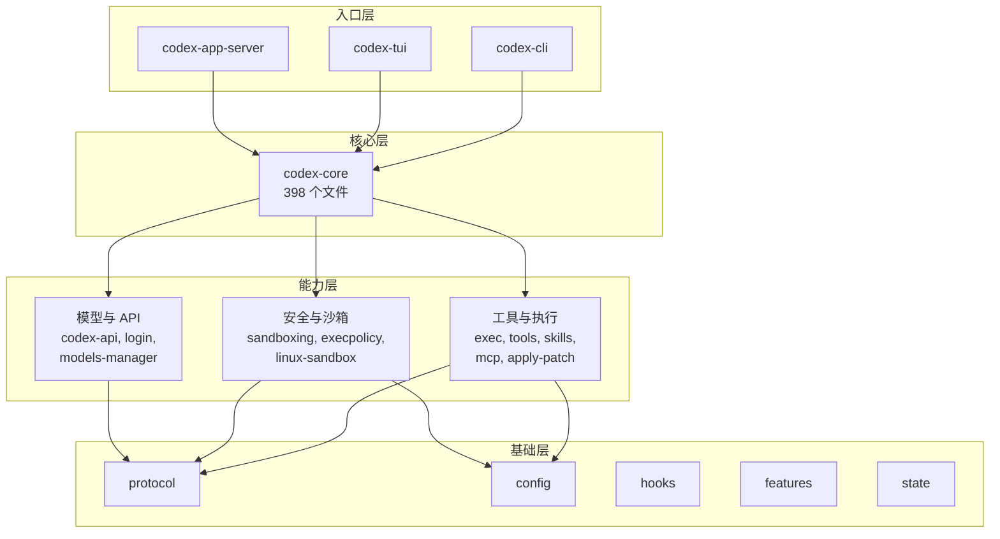
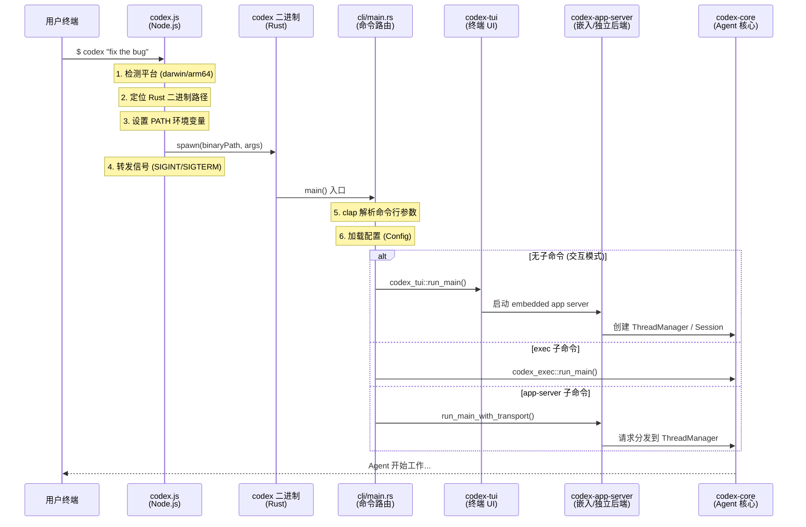
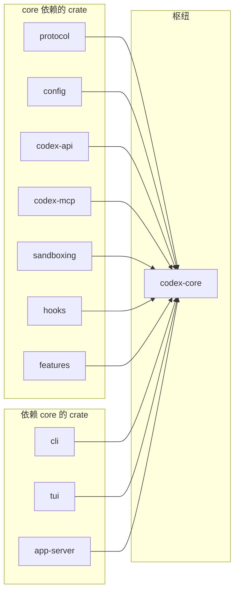

# 00 — 项目概览

> Codex CLI 是 OpenAI 出品的本地编码 AI Agent，本章从整体视角剖析这个项目的组成结构、技术栈选择和启动链路。

## 1. Codex CLI 是什么

Codex CLI 是一个**运行在本地的编码 AI Agent**。它是一个完整的 Agent 系统，具备以下核心能力：

- **自主执行**: 能自主执行 shell 命令、编辑文件、搜索代码
- **多轮对话**: 维护完整的对话上下文，支持上下文压缩
- **多模型支持**: 支持 OpenAI、Azure、Ollama、LMStudio 等多种 LLM 供应商
- **安全沙箱**: 三层安全机制保护用户环境
- **子 Agent**: 支持多 Agent 并行工作和任务委派
- **IDE 集成**: 通过 App Server 支持 VS Code、Cursor、Windsurf 等编辑器
- **SDK**: 提供 TypeScript 和 Python SDK，支持编程式调用

用户可以通过以下方式使用 Codex：

```bash
# 安装
npm install -g @openai/codex
# 或
brew install --cask codex

# 直接运行（进入交互式 TUI）
codex

# 非交互式执行
codex exec "修复这个 bug"

# 作为 MCP 服务器
codex mcp-server
```

## 2. 单仓结构总览

Codex 采用 **Monorepo（单仓）** 架构，TypeScript 与 Rust 代码共存于一个仓库中。下面的目录树列出了仓库中**每个目录**的作用：

```
codex/                              # 仓库根目录
│
├── codex-cli/                      # TypeScript 入口（npm 全局命令包装）
│   ├── bin/codex.js               # 检测平台、启动 Rust 二进制（229 行）
│   ├── package.json               # @openai/codex npm 包定义
│   ├── scripts/                   # 发布与构建脚本
│   └── vendor/                    # 本地预编译二进制（回退用）
│
├── codex-rs/                       # Rust 核心引擎（89 crate 的 workspace）
│   ├── Cargo.toml                 # workspace 成员与编译优化定义
│   │
│   │  ── 入口与 UI ──
│   ├── cli/                       # CLI 命令路由（clap 参数解析 + 子命令分发）
│   ├── tui/                       # 终端交互界面（Ratatui 框架）
│   ├── app-server/                # IDE 集成 JSON-RPC 服务器
│   ├── exec-server/               # 沙箱命令执行服务（独立进程）
│   ├── mcp-server/                # MCP 协议服务器模式
│   │
│   │  ── Agent 核心 ──
│   ├── core/                      # Agent 主循环、工具注册、上下文管理
│   ├── protocol/                  # 核心通信协议（Op/Event 消息定义）
│   ├── config/                    # 配置加载与合并（CLI + TOML + 环境变量）
│   ├── state/                     # 会话状态持久化（SQLite）
│   ├── hooks/                     # 执行钩子系统
│   ├── features/                  # Feature Flag 管理
│   ├── rollout/                   # 会话记录持久化与发现
│   │
│   │  ── 模型与 API ──
│   ├── codex-api/                 # OpenAI API 客户端封装
│   ├── codex-client/              # Codex 后端客户端
│   ├── backend-client/            # 后端 API 通信层
│   ├── models-manager/            # 模型生命周期管理
│   ├── model-provider-info/       # 模型供应商元数据
│   ├── ollama/                    # Ollama 本地模型适配器
│   ├── lmstudio/                  # LM Studio 本地模型适配器
│   ├── login/                     # 认证系统（ChatGPT/API Key/设备码）
│   ├── keyring-store/             # OS 密钥环集成
│   │
│   │  ── 安全与沙箱 ──
│   ├── sandboxing/                # 跨平台沙箱策略管理
│   ├── linux-sandbox/             # Linux Landlock 沙箱实现
│   ├── windows-sandbox-rs/        # Windows AppContainer 沙箱实现
│   ├── exec/                      # 底层命令执行原语
│   ├── execpolicy/                # 执行策略引擎（规则匹配）
│   ├── execpolicy-legacy/         # 旧版执行策略（兼容）
│   ├── process-hardening/         # 进程加固工具
│   ├── secrets/                   # 密钥与凭证保护
│   │
│   │  ── 工具与执行 ──
│   ├── tools/                     # 工具注册与分发
│   ├── skills/                    # 自定义技能系统
│   ├── core-skills/               # 内置技能实现
│   ├── codex-mcp/                 # MCP 客户端实现
│   ├── rmcp-client/               # RMCP（Resource MCP）客户端
│   ├── apply-patch/               # 文件补丁应用
│   ├── shell-command/             # Shell 命令封装
│   ├── code-mode/                 # 代码模式执行
│   ├── file-search/               # 文件搜索功能
│   ├── git-utils/                 # Git 操作工具
│   │
│   │  ── 插件与扩展 ──
│   ├── plugin/                    # 插件架构（加载、发现、市场）
│   ├── connectors/                # 外部服务连接器
│   ├── instructions/              # 系统指令拼装
│   ├── collaboration-mode-templates/ # 协作模式模板
│   │
│   │  ── 协议与通信 ──
│   ├── app-server-protocol/       # App Server JSON-RPC 协议定义
│   ├── app-server-client/         # App Server 客户端库
│   ├── app-server-test-client/    # App Server 测试客户端
│   ├── codex-backend-openapi-models/ # OpenAPI 模型定义（自动生成）
│   │
│   │  ── 云与远程 ──
│   ├── cloud-tasks/               # 云端任务管理
│   ├── cloud-tasks-client/        # 云任务客户端
│   ├── cloud-tasks-mock-client/   # 云任务 Mock 客户端（测试用）
│   ├── cloud-requirements/        # 云端运行需求定义
│   ├── realtime-webrtc/           # WebRTC 实时通信
│   ├── network-proxy/             # 网络请求代理
│   ├── responses-api-proxy/       # Responses API 代理转发
│   ├── stdio-to-uds/             # Stdio ↔ Unix Domain Socket 桥接
│   │
│   │  ── 可观测性 ──
│   ├── analytics/                 # 使用分析与遥测
│   ├── otel/                      # OpenTelemetry 集成
│   ├── feedback/                  # 用户反馈收集
│   ├── response-debug-context/    # 响应调试上下文
│   │
│   │  ── 工具库 ──
│   ├── utils/                     # 22 个工具子 crate
│   │   ├── absolute-path/         #   绝对路径处理
│   │   ├── approval-presets/      #   审批模板预设
│   │   ├── cache/                 #   通用缓存
│   │   ├── cargo-bin/             #   Cargo 二进制路径
│   │   ├── cli/                   #   CLI 辅助工具
│   │   ├── elapsed/               #   耗时测量
│   │   ├── fuzzy-match/           #   模糊匹配
│   │   ├── home-dir/              #   主目录检测
│   │   ├── image/                 #   图片处理
│   │   ├── json-to-toml/          #   JSON ↔ TOML 转换
│   │   ├── oss/                   #   开源信息
│   │   ├── output-truncation/     #   输出截断
│   │   ├── path-utils/            #   路径操作
│   │   ├── plugins/               #   插件工具
│   │   ├── pty/                   #   伪终端（PTY）工具
│   │   ├── readiness/             #   就绪检查
│   │   ├── rustls-provider/       #   TLS 提供者
│   │   ├── sandbox-summary/       #   沙箱报告
│   │   ├── sleep-inhibitor/       #   防休眠（长任务）
│   │   ├── stream-parser/         #   流式解析
│   │   ├── string/                #   字符串工具
│   │   └── template/              #   模板渲染
│   │
│   │  ── 其他 ──
│   ├── async-utils/               # 异步工具
│   ├── ansi-escape/               # ANSI 转义码处理
│   ├── arg0/                      # 进程 argv[0] 上下文
│   ├── chatgpt/                   # ChatGPT 集成
│   ├── codex-experimental-api-macros/ # 实验性 API 宏
│   ├── debug-client/              # 调试客户端
│   ├── shell-escalation/          # Shell 提权检测
│   ├── terminal-detection/        # 终端类型检测
│   └── v8-poc/                    # V8 引擎概念验证
│
├── sdk/                            # 官方 SDK
│   ├── typescript/                # TypeScript SDK
│   ├── python/                    # Python SDK
│   └── python-runtime/            # Python 运行时支持
│
├── docs/                           # 用户文档（安装、配置、沙箱等）
├── scripts/                        # 开发与构建脚本（安装、测试、Mock 服务器）
├── patches/                        # Bazel 构建补丁（30+，主要修复 Windows 兼容性）
├── third_party/                    # 第三方依赖（Bazel 管理）
├── tools/                          # 代码质量工具（argument-comment-lint 等）
│
├── .codex/                         # Codex Agent 自身指令配置（AGENTS.md 等）
├── .devcontainer/                  # Dev Container 开发环境定义
├── .github/                        # GitHub Actions CI/CD 工作流
├── .vscode/                        # VS Code 工作区配置
│
│  ── 构建与配置文件 ──
├── BUILD.bazel                     # Bazel 顶层构建入口
├── MODULE.bazel                    # Bazel 模块声明（外部依赖与版本）
├── defs.bzl                        # Bazel 自定义构建规则
├── justfile                        # just 任务命令（开发快捷操作）
├── flake.nix                       # Nix 包构建与开发环境定义
├── package.json                    # pnpm workspace 根配置
└── pnpm-workspace.yaml             # pnpm 工作空间成员声明
```

### 根目录说明

| 目录/文件 | 语言/技术 | 说明 |
|-----------|----------|------|
| `codex-cli/` | TypeScript | npm 全局命令入口，检测平台后 `spawn` 启动 Rust 二进制，自身不含业务逻辑 |
| `codex-rs/` | Rust | **核心引擎**，包含 89 个 crate 的 Cargo workspace，承载全部 Agent 逻辑 |
| `sdk/typescript/` | TypeScript | 官方 TypeScript SDK，供开发者以编程方式集成 Codex |
| `sdk/python/` | Python | 官方 Python SDK |
| `sdk/python-runtime/` | Python | Python SDK 运行时支持 |
| `docs/` | Markdown | 用户文档：安装指南、配置参考、沙箱说明、Skills 文档等 |
| `scripts/` | Shell/Python | 开发脚本：安装脚本、ASCII 检查、二进制大小检查、Mock 服务器等 |
| `patches/` | Starlark | 30+ Bazel 构建补丁，主要解决 Windows MSVC/GnuLLVM 兼容和依赖修复 |
| `third_party/` | — | Bazel 管理的第三方依赖 |
| `tools/` | Rust | 代码质量工具，如 `argument-comment-lint`（参数注释检查） |
| `.codex/` | TOML/MD | Codex 的 Agent 指令配置目录 |
| `.devcontainer/` | JSON | VS Code Dev Container 配置，定义容器化开发环境 |
| `.github/` | YAML | GitHub Actions 工作流（CI/CD 流水线） |
| `.vscode/` | JSON | VS Code 工作区推荐设置和扩展 |
| `BUILD.bazel` | Starlark | Bazel 顶层构建入口 |
| `MODULE.bazel` | Starlark | Bazel 模块声明，定义外部依赖和版本 |
| `justfile` | just | 常用开发任务的快捷命令（类似 Makefile） |
| `flake.nix` | Nix | Nix 包管理器的构建和开发环境定义 |
| `package.json` | JSON | pnpm workspace 根配置，管理 TypeScript 依赖 |
| `pnpm-workspace.yaml` | YAML | 声明 pnpm workspace 的成员包 |

### 为什么从 TypeScript 迁移到 Rust？

Codex 最初完全用 TypeScript 编写，2025 年中启动了向 Rust 的全面迁移，同年 12 月 npm 默认安装的已经是 Rust 版本。官方在 [GitHub Discussion #1174 "Codex CLI is Going Native"](https://github.com/openai/codex/discussions/1174) 中给出了四个核心理由：

1. **零依赖安装** — 旧版要求 Node.js 22+，对很多用户是障碍；Rust 编译为独立二进制，无需运行时
2. **原生沙箱** — Linux 的 Landlock/seccomp、macOS 的 Seatbelt 等 OS 级沙箱 API，Rust 可以直接调用
3. **性能** — 无 GC 带来更低的内存占用和更可预测的延迟
4. **可扩展性** — 基于 wire protocol 支持多语言扩展和 MCP 协议

Codex 负责人 Thibault Sottiaux 在 [The Pragmatic Engineer 的采访](https://newsletter.pragmaticengineer.com/p/how-codex-is-built)中补充了两点：npm 生态的**供应链安全**难以审计，以及 Rust 的强类型系统迫使团队维持更高的实现质量。他还透露团队全职雇佣了 Ratatui（Rust TUI 库）的维护者，且约 90% 的代码由 Codex 自身生成。

目前的 TypeScript + Rust 结构是迁移的产物：

- **TypeScript 层**（`codex-cli/`）：仅做 npm 包分发。`codex.js` 的全部职责就是检测当前平台、找到对应的 Rust 二进制、然后 `spawn` 启动它。
- **Rust 层**（`codex-rs/`）：承载全部核心逻辑。旧版 TypeScript 实现已在 2025 年 8 月完全删除。

> **延伸阅读**: OpenAI 官方还发布了两篇深入架构的博客：[Unrolling the Codex agent loop](https://openai.com/index/unrolling-the-codex-agent-loop/)（Agent 主循环剖析，作者 Michael Bolin）和 [Unlocking the Codex harness](https://openai.com/index/unlocking-the-codex-harness/)（App Server 架构，统一 CLI/Web/IDE 多入口）。

> **知识点 — `spawn`**: 在 `codex.js` 中，Node.js 通过 `child_process.spawn()` 启动 Rust 编译的原生二进制程序作为子进程。子进程继承了父进程的标准输入/输出，因此用户的键盘输入和终端输出可以直接传递。

## 3. Rust 工作空间：89 个 Crate 全景

Codex 的 Rust 部分是一个包含 **89 个 crate** 的 Cargo workspace（见 [Cargo.toml:1-91](https://github.com/openai/codex/blob/main/codex-rs/Cargo.toml#L1-L91)）。这些 crate 按功能可以分为以下几大类：

### 图 0.1: 89 个 Crate 的分层架构

这里的 `crate` 可以理解为 Rust workspace 里的一个独立子包/编译单元；有些 crate 会产出可执行程序，有些则作为库被其他 crate 依赖。

下图展示了 Codex 的 crate 按**调用层级**的分布，自上而下调用：



> 这张图是“阅读视角”的分层，不是 Cargo.toml 中的官方分组。`codex-core` 是中间枢纽，向上被 `cli`、`tui`、`app-server` 等入口 crate 调用，向下再组合模型、工具、沙箱等能力。

### Crate 分类详表

| 类别 | Crate 名称 | 职责 |
|------|-----------|------|
| **入口层** | `cli`, `tui`, `app-server`, `exec-server`, `mcp-server` | 命令路由、终端 UI、IDE JSON-RPC 服务、沙箱执行服务、MCP 服务器 |
| **Agent 核心** | `core`, `protocol`, `config`, `state`, `hooks` | Agent 主循环、协议定义、配置管理、会话状态持久化、执行钩子 |
| **工具与执行** | `exec`, `tools`, `skills`, `core-skills`, `codex-mcp`, `rmcp-client`, `apply-patch`, `shell-command`, `code-mode`, `file-search`, `git-utils` | 命令执行、工具注册/分发、MCP 协议、文件补丁、代码模式、文件搜索、Git 操作 |
| **安全与沙箱** | `sandboxing`, `execpolicy`, `execpolicy-legacy`, `linux-sandbox`, `windows-sandbox-rs`, `process-hardening`, `secrets`, `keyring-store`, `shell-escalation` | 沙箱管理、执行策略、Landlock/AppContainer 沙箱、进程加固、密钥保护、提权检测 |
| **模型与 API** | `codex-api`, `codex-client`, `backend-client`, `login`, `models-manager`, `ollama`, `lmstudio`, `model-provider-info`, `chatgpt`, `codex-backend-openapi-models` | API 客户端、认证、模型管理、多供应商适配、OpenAPI 模型定义 |
| **协议与通信** | `protocol`, `app-server-protocol`, `app-server-client`, `app-server-test-client`, `stdio-to-uds` | Op/Event 协议、JSON-RPC 协议、测试客户端、Stdio ↔ UDS 桥接 |
| **基础设施** | `analytics`, `otel`, `features`, `rollout`, `feedback`, `response-debug-context` | 遥测、OpenTelemetry、Feature Flags、会话记录持久化、用户反馈、调试上下文 |
| **插件与协作** | `plugin`, `connectors`, `instructions`, `collaboration-mode-templates` | 插件装载与发现、外部连接器、指令拼装、协作模式模板 |
| **云与远程** | `cloud-requirements`, `cloud-tasks`, `cloud-tasks-client`, `cloud-tasks-mock-client`, `realtime-webrtc`, `network-proxy`, `responses-api-proxy` | 云端任务、远程控制、Mock 测试、WebRTC 实时通信、网络代理 |
| **工具库** | `utils/*` (22 个) | 绝对路径、缓存、图片处理、PTY、模糊匹配、TLS、模板渲染等 |
| **其他** | `async-utils`, `ansi-escape`, `arg0`, `terminal-detection`, `debug-client`, `codex-experimental-api-macros`, `v8-poc` | 异步工具、ANSI 转义、终端检测、调试客户端、实验性宏、V8 概念验证 |

### 3.1 从总体结构看，最容易遗漏的三层

如果只看“CLI + core + TUI”这条主线，很容易漏掉下面三类对理解 Codex 很关键的结构：

1. **TUI 背后其实站着一个 App Server**

   现在的 TUI 并不是直接把用户输入塞进 `codex-core`。默认情况下，它会先启动一个 **embedded app server**，再通过 app-server client 与后端通信（[tui/src/lib.rs:654-672](https://github.com/openai/codex/blob/main/codex-rs/tui/src/lib.rs#L654-L672), [1059-1073](https://github.com/openai/codex/blob/main/codex-rs/tui/src/lib.rs#L1059-L1073)）。这意味着：

   - TUI 更像前端壳层
   - App Server 是统一的请求分发后端
   - IDE 集成和 TUI 共享了大量后端能力

2. **插件 / Skills / Connectors 是一条独立的扩展轴**

   第一眼看仓库时，很多人会把注意力全部放到 `core/`。但从产品能力上看，`skills`、`core-skills`、`plugin`、`connectors`、`instructions` 这条线同样重要，它决定了 Agent 能看见什么指令、能连接什么外部系统、能以什么方式扩展自身。

3. **Cloud / Remote 模块说明它不只是“本地命令行工具”**

   `cloud-*`、`realtime-webrtc`、`network-proxy`、`responses-api-proxy` 这些 crate 表明，Codex 的设计目标已经超出“本地 TUI + 一次性调用模型 API”。它同时在兼容云任务、远程连接和更复杂的运行环境。

> **知识点 — crate**: `crate` 是 Rust 中最基本的编译与发布单元。可以把它理解成“一个独立的 Rust 包/模块边界”。带 `main()` 的叫 binary crate，可执行；提供库接口的叫 library crate，可被其他 crate 依赖。Codex 的 `codex-rs/` 就是一个包含 89 个 crate 的 workspace。

> **知识点 — Cargo Workspace**: Rust 的 Cargo workspace 允许在一个仓库中管理多个相关的 crate（库/包）。它们共享同一个 `Cargo.lock` 锁文件和编译产物目录 `target/`，既保证依赖版本一致，又允许独立编译和测试单个 crate。

## 4. 启动链路全追踪

当用户在终端输入 `codex` 时，究竟发生了什么？让我们从头到尾追踪一次完整的启动过程。

### 图 0.2: 启动链路流程



### 4.1 第一步：TypeScript 入口（[codex-cli/bin/codex.js](https://github.com/openai/codex/blob/main/codex-cli/bin/codex.js)）

`codex.js` 是整个系统的起点，但它极其轻量（229 行）。它的职责单一：

```javascript
// 1. 检测当前平台和架构
const { platform, arch } = process;
// platform: "darwin" | "linux" | "win32"
// arch: "x64" | "arm64"

// 2. 映射到 Rust 编译目标 (target triple)
const PLATFORM_PACKAGE_BY_TARGET = {
  "aarch64-apple-darwin": "@openai/codex-darwin-arm64",
  "x86_64-unknown-linux-musl": "@openai/codex-linux-x64",
  // ...共 6 个平台
};

// 3. 定位二进制文件路径
// 优先从 npm optional dependency 包中查找
// 回退到本地 vendor 目录
const binaryPath = path.join(archRoot, "codex", codexBinaryName);

// 4. 异步启动子进程（关键！）
const child = spawn(binaryPath, process.argv.slice(2), {
  stdio: "inherit",  // 继承标准输入/输出
  env,               // 传递环境变量
});

// 5. 信号转发：确保 Ctrl+C 能正确传递到 Rust 进程
["SIGINT", "SIGTERM", "SIGHUP"].forEach((sig) => {
  process.on(sig, () => child.kill(sig));
});
```

**关键设计**：使用异步 `spawn` 而非 `spawnSync`，这样 Node.js 进程能保持事件循环活跃，正确响应和转发信号。

### 4.2 第二步：Rust CLI 路由（[cli/src/main.rs:63-163](https://github.com/openai/codex/blob/main/codex-rs/cli/src/main.rs#L63-L163)）

Rust 二进制启动后，进入 `main.rs`，使用 `clap` 库解析命令行参数：

```rust
// 主命令结构
#[derive(Debug, Parser)]
struct MultitoolCli {
    pub config_overrides: CliConfigOverrides,  // --model, --config 等
    pub feature_toggles: FeatureToggles,        // 功能开关
    pub interactive: TuiCli,                    // 交互模式参数
    subcommand: Option<Subcommand>,             // 可选子命令
}

// 子命令枚举 — 覆盖所有运行模式
enum Subcommand {
    Exec(ExecCli),           // 非交互式执行
    Review(ReviewArgs),       // 代码审查
    Login(LoginCommand),      // 登录管理
    Mcp(McpCli),             // MCP 服务器管理
    McpServer,               // 作为 MCP 服务器运行
    AppServer(AppServerCommand), // IDE 集成服务器
    Sandbox(SandboxArgs),    // 沙箱命令
    Resume(ResumeCommand),   // 恢复会话
    Fork(ForkCommand),       // 分叉会话
    // ... 更多子命令
}
```

**路由逻辑**：
- **无子命令** → 进入交互式 TUI（终端用户界面）
- **`exec`** → 非交互式执行模式
- **`app-server`** → 启动 JSON-RPC 服务器，供 IDE 扩展连接
- **`mcp-server`** → 作为 MCP (Model Context Protocol) 服务器运行

> **知识点 — `clap`**: clap 是 Rust 生态中最流行的命令行参数解析库。通过 `#[derive(Parser)]` 宏，可以直接从 struct 定义自动生成参数解析逻辑，包括帮助信息、类型验证和错误提示。

### 4.3 第三步：进入 Agent 核心

无论走哪条路径，最终都会到达 `codex-core`，这里是 AI Agent 真正的心脏。

**交互模式** (TUI) 的启动链：
```
codex_tui::run_main()
  → 创建 Config（合并 CLI 参数 + config.toml + 环境变量）
  → 选择 AppServerTarget（默认 Embedded，远程模式则是 Remote）
  → 启动 embedded app server
  → TUI 通过 AppServerSession 与后端通信
  → app-server 内部创建 ThreadManager
  → ThreadManager 再创建 CodexThread / Session
  → 进入 Agent Loop（等待用户输入，执行 Turn）
```

源码入口分别在 [tui/src/lib.rs:654-838](https://github.com/openai/codex/blob/main/codex-rs/tui/src/lib.rs#L654-L838)、[tui/src/lib.rs:1059-1073](https://github.com/openai/codex/blob/main/codex-rs/tui/src/lib.rs#L1059-L1073)、[app-server/src/message_processor.rs:231-242](https://github.com/openai/codex/blob/main/codex-rs/app-server/src/message_processor.rs#L231-L242)、[core/src/codex.rs:668-686](https://github.com/openai/codex/blob/main/codex-rs/core/src/codex.rs#L668-L686)。

**非交互模式** (Exec) 的启动链：
```
codex_exec::run_main()
  → 创建 Config
  → 直接将用户 prompt 提交
  → 运行单个 Turn
  → 输出结果并退出
```

对应入口见 [exec/src/lib.rs:214-330](https://github.com/openai/codex/blob/main/codex-rs/exec/src/lib.rs#L214-L330)。

**IDE 模式** (App Server) 的启动链：
```
codex_app_server::run_main_with_transport()
  → 监听 stdio:// 或 ws:// 端点
  → 等待 JSON-RPC 请求
  → 创建 ThreadManager 与 MessageProcessor
  → 请求被分发到具体 Thread / Session
  → 通过 JSON-RPC 事件流返回结果
```

对应入口见 [cli/src/main.rs:724-749](https://github.com/openai/codex/blob/main/codex-rs/cli/src/main.rs#L724-L749)、[app-server/src/lib.rs:354-420](https://github.com/openai/codex/blob/main/codex-rs/app-server/src/lib.rs#L354-L420)、[app-server/src/message_processor.rs:231-267](https://github.com/openai/codex/blob/main/codex-rs/app-server/src/message_processor.rs#L231-L267)。

## 5. 核心 Crate 依赖关系

### 图 0.3: codex-core 的依赖关系



`codex-core` 是整个系统的枢纽，几乎所有其他 crate 都向它汇聚。这也是为什么 `codex-core` 是最大的 crate（398 个 .rs 文件），源码仓库的 `AGENTS.md` 中明确提醒开发者「resist adding code to codex-core」（[AGENTS.md:56-67](https://github.com/openai/codex/blob/main/AGENTS.md#L56-L67)）。

## 6. 构建与任务工具链

Codex 组合了多套构建与任务工具：

| 构建工具 | 用途 | 特点 |
|---------|------|------|
| **Cargo** | Rust 依赖管理和编译 | 标准 Rust 工具链，89 个 crate 的 workspace |
| **Bazel** | 跨语言的确定性构建 | 用于 CI/CD，确保可复现构建 |
| **pnpm** | TypeScript 包管理 | 管理 codex-cli 和 SDK 的 npm 依赖 |
| **just** | 任务自动化 | 类似 Makefile 的命令运行器 |

**Release 构建优化**（来自 [Cargo.toml](https://github.com/openai/codex/blob/main/codex-rs/Cargo.toml#L412-L426)）：
```toml
[profile.release]
lto = "fat"           # 链接时优化 — 跨 crate 优化
strip = "symbols"     # 去除符号表 — 减小二进制体积
codegen-units = 1     # 单代码生成单元 — 最大化优化
```

## 7. 本章小结

| 特征 | 数据 |
|------|------|
| 语言 | TypeScript (入口) + Rust (核心) |
| Rust 文件数 | 1,418 个 .rs 文件 |
| Crate 数量 | 89 个 |
| 核心文件 | `codex.rs` — 7,931 行 |
| 支持平台 | macOS (arm64/x64), Linux (arm64/x64), Windows (arm64/x64) |
| 运行模式 | 交互式 TUI、非交互 Exec、App Server (IDE)、MCP Server |
| 安装方式 | npm、Homebrew、GitHub Release |

---

> **源码版本说明**: 本文基于 [openai/codex](https://github.com/openai/codex) 主分支源码分析。其中 crate 数量、文件数、入口链路等统计均以分析时的源码版本为准。

---

**下一章**: [01 — 架构总览](01-architecture-overview.md)
