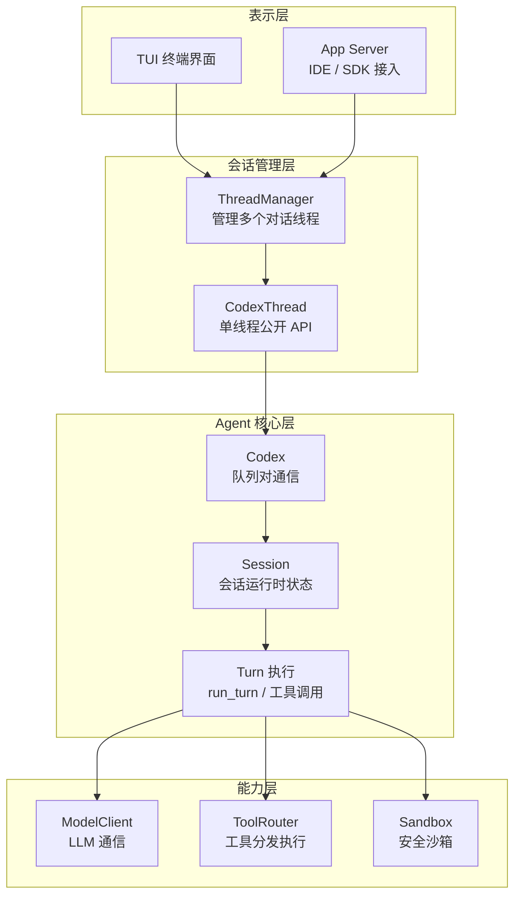
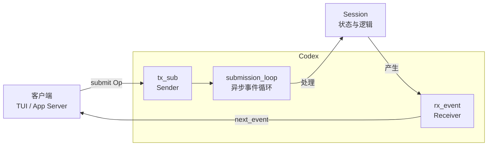
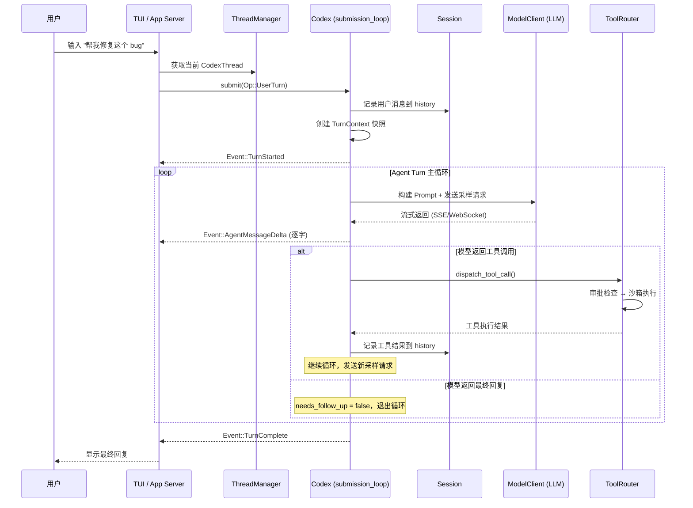
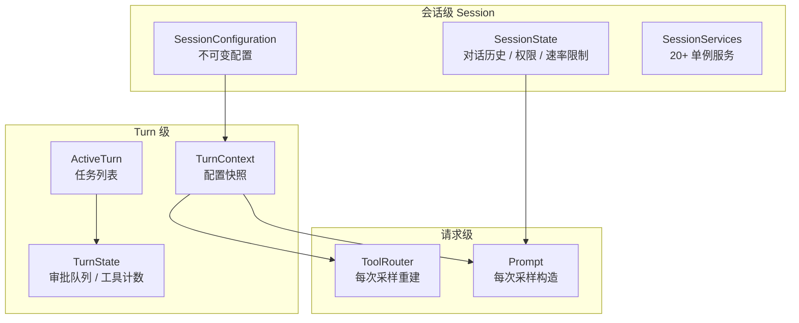

# 01 — 架构总览

> 本章从宏观视角剖析 Codex 的分层架构、核心抽象和数据流转方式。读完本章，你将了解一个用户请求是如何从终端输入流经各层、到达 LLM、再返回结果的。

## 1. 四层架构

Codex 的代码可以按职责分为四层，每一层只依赖下层：



| 层 | 职责 | 关键 crate |
|---|------|-----------|
| **表示层** | 用户交互界面、IDE 集成 | `tui`, `app-server`, `app-server-protocol` |
| **会话管理层** | 多线程管理、线程生命周期 | `core`（ThreadManager, CodexThread） |
| **Agent 核心层** | 队列通信、Session 状态、Turn 执行 | `core`（Codex, Session, run_turn） |
| **能力层** | LLM 调用、工具执行、沙箱隔离 | `codex-api`, `tools`, `sandboxing` |

## 2. 核心抽象：六个关键概念

理解 Codex 架构，只需要抓住六个核心概念：

### 2.1 ThreadManager — 多线程管理器

`ThreadManager` 是入口层（TUI / App Server）首先接触的对象。它管理多个独立的对话线程（`CodexThread`），支持新建、分叉和恢复。

```
ThreadManager
  ├── 持有所有共享资源（auth、model、mcp、skills...）
  ├── threads: HashMap<ThreadId, Arc<CodexThread>>
  └── 支持操作：
      ├── new_thread()   → 创建新对话
      ├── fork_thread()  → 从已有对话分叉
      └── 广播新线程创建事件
```

**源码**: [core/src/thread_manager.rs](https://github.com/openai/codex/blob/main/codex-rs/core/src/thread_manager.rs)

> **知识点 — `Arc`**: `Arc<T>`（Atomic Reference Counting）是 Rust 的线程安全引用计数智能指针。多个线程可以同时持有同一个 `Arc<CodexThread>` 的引用，底层通过原子操作管理引用计数。当最后一个引用被释放时，数据自动销毁。

### 2.2 CodexThread — 线程公开 API

`CodexThread` 是对外暴露的公开接口，它包装了内部的 `Codex` 实例，提供了更简洁的 API：

```rust
// 核心 API（简化表示）
pub struct CodexThread {
    codex: Codex,                    // 内部实例
    rollout_path: Option<PathBuf>,   // 持久化路径
}

impl CodexThread {
    async fn submit(&self, op: Op) -> Result<String>;   // 提交操作
    async fn next_event(&self) -> Result<Event>;         // 接收事件
    async fn agent_status(&self) -> AgentStatus;         // 查询状态
    async fn steer_input(&self, ...);                    // 中途注入输入
}
```

**源码**: [core/src/codex_thread.rs](https://github.com/openai/codex/blob/main/codex-rs/core/src/codex_thread.rs)（292 行）

### 2.3 Codex — 队列对通信模型

`Codex` 是架构中最关键的抽象。它不是一个 RPC 接口，而是一个**异步队列对**：



```rust
// Codex 的核心结构
// 源码: https://github.com/openai/codex/blob/main/codex-rs/core/src/codex.rs#L400-L409
pub(crate) struct Codex {
    tx_sub: Sender<Submission>,              // 客户端提交操作
    rx_event: Receiver<Event>,               // 客户端接收事件
    agent_status: watch::Receiver<AgentStatus>,  // 状态监听
    session: Arc<Session>,                   // 会话状态
    session_loop_termination: SessionLoopTermination,
}
```

**为什么用队列而不是直接函数调用？**

- **解耦**：提交方和处理方完全异步，互不阻塞
- **背压**：Submission channel 容量为 512，超出时自动背压
- **并发安全**：单一 `submission_loop` 串行处理所有操作，避免状态竞争
- **可观测**：所有操作都通过 Event 流输出，便于 TUI/IDE 展示

> **知识点 — async channel**: Rust 的异步 channel 类似于 Go 的 channel。`Sender` 和 `Receiver` 分别用于发送和接收消息。Codex 使用 `async-channel` 库，支持多生产者多消费者模式，`submit` 是 `send().await`，`next_event` 是 `recv().await`。

### 2.4 Session — 会话运行时状态

`Session` 持有一个对话的全部运行时状态：

```
Session
  ├── conversation_id: ThreadId        ← 对话唯一标识
  ├── tx_event: Sender<Event>          ← 向客户端发事件
  ├── agent_status: watch::Sender      ← 广播 Agent 状态变化
  ├── state: Mutex<SessionState>       ← 可变状态（加锁保护）
  │   ├── history: ContextManager      ← 对话历史
  │   ├── latest_rate_limits           ← 速率限制
  │   └── granted_permissions          ← 已授权权限
  ├── active_turn: Mutex<ActiveTurn>   ← 当前 Turn 的任务列表
  ├── mailbox: Mailbox                 ← 子 Agent 通信信箱
  └── services: SessionServices        ← 会话级单例服务
      ├── model_client                 ← LLM 客户端
      ├── mcp_connection_manager       ← MCP 服务器连接
      ├── exec_policy                  ← 执行策略管理
      ├── hooks                        ← 用户自定义钩子
      ├── rollout                      ← 事件持久化
      └── ... (共 20+ 个服务)
```

**源码**: [core/src/codex.rs:825-847](https://github.com/openai/codex/blob/main/codex-rs/core/src/codex.rs#L825-L847)（Session）, [core/src/state/session.rs](https://github.com/openai/codex/blob/main/codex-rs/core/src/state/session.rs)（SessionState）, [core/src/state/service.rs](https://github.com/openai/codex/blob/main/codex-rs/core/src/state/service.rs)（SessionServices）

> **知识点 — `Mutex`**: `Mutex<T>`（互斥锁）确保同一时间只有一个线程能访问被保护的数据。`session.state.lock()` 会等待获取锁，修改完后自动释放。Codex 中的 `Mutex` 来自 `tokio`，是异步友好的版本。

### 2.5 TurnContext — 单次 Turn 的配置快照

每次 Turn（一次用户输入 → Agent 响应的完整周期）开始时，会创建一份 `TurnContext`，它是该 Turn 的**不可变配置快照**：

```
TurnContext
  ├── model_info: ModelInfo           ← 当前使用的模型及能力
  ├── reasoning_effort                ← 推理强度（low/medium/high）
  ├── approval_policy                 ← 审批策略
  ├── sandbox_policy                  ← 沙箱策略
  ├── tools_config: ToolsConfig       ← 可用工具配置
  ├── cwd: AbsolutePathBuf           ← 工作目录
  ├── user_instructions               ← 用户自定义指令
  ├── developer_instructions          ← 开发者指令
  └── features: ManagedFeatures       ← Feature Flags
```

**为什么不直接读 Session 的配置？** 因为 Turn 执行过程中，用户可能通过 `Op::OverrideTurnContext` 修改了下一个 Turn 的配置。用快照保证当前 Turn 的一致性。

**源码**: [core/src/codex.rs:864-911](https://github.com/openai/codex/blob/main/codex-rs/core/src/codex.rs#L864-L911)

### 2.6 Op / Event — 双向通信协议

Codex 的所有通信通过两个枚举类型完成：

**Op（操作）— 客户端 → 服务端**

| 类别 | 关键操作 | 说明 |
|------|---------|------|
| **用户输入** | `UserTurn` | 提交用户消息，可附带模型、策略覆盖 |
| **流程控制** | `Interrupt`, `Shutdown` | 中断当前任务、关闭会话 |
| **审批响应** | `ExecApproval`, `PatchApproval` | 回复命令执行/代码补丁的审批请求 |
| **上下文管理** | `Compact`, `Undo`, `ThreadRollback` | 压缩对话、撤销、回滚 |
| **配置变更** | `OverrideTurnContext`, `ReloadUserConfig` | 修改 Turn 配置、重载用户配置 |
| **查询** | `ListMcpTools`, `ListSkills`, `ListModels` | 查询可用工具/技能/模型 |

**Event（事件）— 服务端 → 客户端**

| 类别 | 关键事件 | 说明 |
|------|---------|------|
| **生命周期** | `SessionConfigured`, `TurnStarted`, `TurnComplete` | 会话/Turn 生命周期 |
| **模型输出** | `AgentMessage`, `AgentMessageDelta` | 完整消息 / 流式增量 |
| **推理过程** | `AgentReasoning`, `AgentReasoningDelta` | 思维链输出 |
| **工具执行** | `ExecCommandBegin/End`, `McpToolCallBegin/End` | Shell 命令、MCP 工具调用 |
| **审批请求** | `ExecApprovalRequest`, `RequestPermissions` | 等待用户审批 |
| **上下文** | `TokenCount`, `ContextCompacted` | Token 使用、对话压缩 |
| **错误** | `Error`, `Warning`, `StreamError` | 错误与警告 |

**源码**: [protocol/src/protocol.rs](https://github.com/openai/codex/blob/main/codex-rs/protocol/src/protocol.rs)（5081 行）

## 3. 数据流全追踪

### 3.1 一次完整请求的旅程

下图展示了从用户输入到 Agent 回复的完整数据流：



### 3.2 submission_loop：事件循环的核心

`Codex` 的内部运行着一个 `submission_loop`，这是整个系统的事件调度中心：

```
submission_loop (codex.rs:4616+)
  永久循环:
    1. 从 rx_sub 接收一个 Submission { id, op, trace }
    2. 根据 op 类型分发到对应 handler：
       ├── Op::UserTurn      → 启动新 Turn（spawn run_turn 任务）
       ├── Op::Interrupt     → 取消当前 Turn
       ├── Op::Compact       → 执行上下文压缩
       ├── Op::Undo          → 回滚上一次 Turn
       ├── Op::ExecApproval  → 恢复等待审批的工具调用
       └── ...
    3. Handler 执行过程中通过 tx_event 发送事件
    4. 回到步骤 1
```

关键设计：所有 Op 在**同一个异步任务**中串行分发（但 Turn 执行本身是 `spawn` 出去的独立任务），保证了状态变更的有序性。

## 4. 表示层如何接入

### 4.1 TUI 模式：嵌入式 App Server

TUI 并不直接调用 `codex-core`。默认情况下，它启动一个**嵌入式 App Server**，然后通过 `AppServerSession` 进行通信：

```
codex_tui::run_main()
  → 加载配置，确定 AppServerTarget::Embedded
  → start_app_server() — 启动嵌入式后端
  → AppServerSession::new(app_server)
  → TUI 通过 AppServerSession 发送 JSON-RPC 请求
  → App Server 内部创建 ThreadManager → CodexThread → Codex
```

这意味着 TUI 和 IDE 扩展**共享完全相同的后端逻辑**，差异只在前端渲染。

**源码**: [tui/src/lib.rs:654-838](https://github.com/openai/codex/blob/main/codex-rs/tui/src/lib.rs#L654-L838), [tui/src/lib.rs:1059-1073](https://github.com/openai/codex/blob/main/codex-rs/tui/src/lib.rs#L1059-L1073)

### 4.2 App Server 模式：JSON-RPC 服务

当通过 `codex app-server --listen stdio://` 启动时，App Server 作为独立进程运行：

```
codex_app_server::run_main_with_transport()
  → 监听 stdio:// 或 ws:// 端点
  → 创建 MessageProcessor
  │   ├── ThreadManager  → 管理线程
  │   ├── ConfigApi      → 配置读写
  │   └── FsApi          → 文件操作
  → 等待 JSON-RPC 请求
  → 分发到对应处理器
  → 通过 JSON-RPC 返回事件流
```

**MessageProcessor** 是 App Server 的请求路由器，它将 JSON-RPC 请求路由到 `ThreadManager`、`ConfigApi` 等具体处理器。

**源码**: [app-server/src/message_processor.rs:162-246](https://github.com/openai/codex/blob/main/codex-rs/app-server/src/message_processor.rs#L162-L246)

### 4.3 SDK 模式

TypeScript SDK 和 Python SDK 的接入方式不同：

**TypeScript SDK** — 包装 `codex` CLI，通过 JSONL 事件流通信：

```
TypeScript SDK
  → spawn("codex", ["exec", "--experimental-json", ...])
  → 通过 stdout 接收 JSONL 事件流（每行一个 JSON 对象）
  → SDK 封装为 Codex / Thread / TurnOptions 等高级 API
```

**Python SDK** — 作为 `codex app-server` 的 JSON-RPC v2 客户端：

```
Python SDK
  → spawn("codex", ["app-server", "--listen", "stdio://"])
  → 通过 stdin/stdout 发送 JSON-RPC 请求和接收响应
  → SDK 封装为 async/sync 客户端 API
```

两者的核心区别：TypeScript SDK 走的是 CLI 的 JSONL 协议，Python SDK 走的是 App Server 的 JSON-RPC 协议。

## 5. 状态管理三层模型

Codex 的状态分为三个生命周期层：



| 层级 | 生命周期 | 可变性 | 示例 |
|------|---------|-------|------|
| **会话级** | 整个对话过程 | SessionState 可变，其余不可变 | 对话历史、MCP 连接、Model 客户端 |
| **Turn 级** | 单次 Turn | TurnState 可变，TurnContext 不可变 | 模型选择、审批策略、工具配置 |
| **请求级** | 单次 LLM 请求 | 每次重建 | 工具列表、Prompt 内容 |

## 6. 本章小结

| 概念 | 说明 | 源码位置 |
|------|------|---------|
| **ThreadManager** | 管理多个对话线程，支持新建/分叉 | [core/src/thread_manager.rs](https://github.com/openai/codex/blob/main/codex-rs/core/src/thread_manager.rs) |
| **CodexThread** | 线程公开 API，包装 Codex | [core/src/codex_thread.rs](https://github.com/openai/codex/blob/main/codex-rs/core/src/codex_thread.rs) |
| **Codex** | 队列对通信模型，submit(Op) / next_event() | [core/src/codex.rs:400-409](https://github.com/openai/codex/blob/main/codex-rs/core/src/codex.rs#L400-L409) |
| **Session** | 会话状态 + 服务集合 | [core/src/codex.rs:825-847](https://github.com/openai/codex/blob/main/codex-rs/core/src/codex.rs#L825-L847) |
| **TurnContext** | 单次 Turn 的不可变配置快照 | [core/src/codex.rs:864-911](https://github.com/openai/codex/blob/main/codex-rs/core/src/codex.rs#L864-L911) |
| **Op / Event** | 双向通信协议（120+ 种消息类型） | [protocol/src/protocol.rs](https://github.com/openai/codex/blob/main/codex-rs/protocol/src/protocol.rs) |

---

> **源码版本说明**: 本文基于 [openai/codex](https://github.com/openai/codex) 主分支分析，源码本地路径为 `/Users/zoujie.wu/workspace/codex-source/`。

---

**上一章**: [00 — 项目全景概览](00-project-overview.md) | **下一章**: [02 — 提示词与工具解析](02-prompt-and-tools.md)
