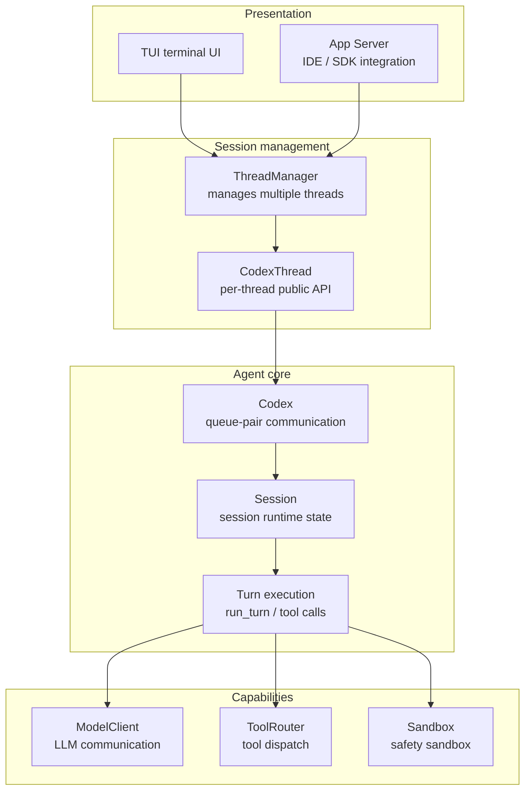
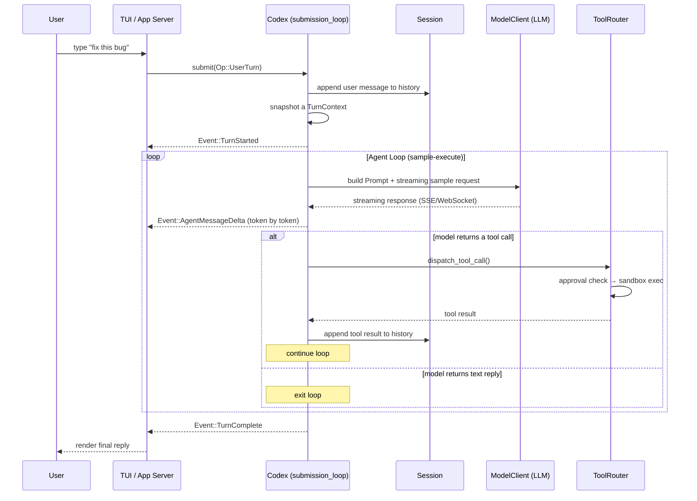
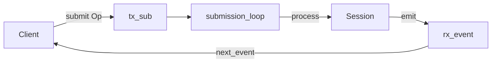
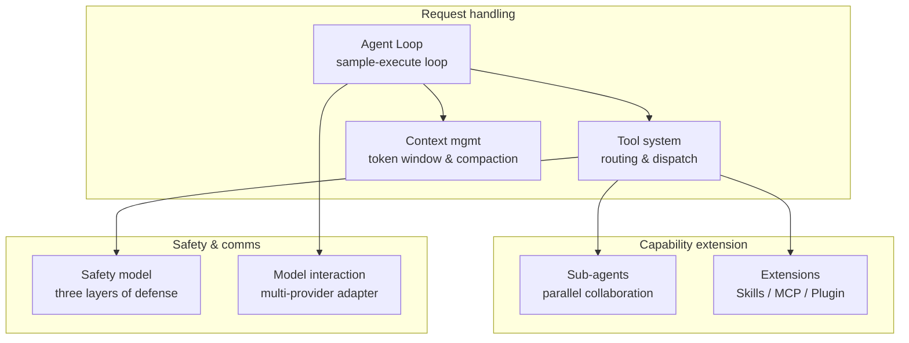
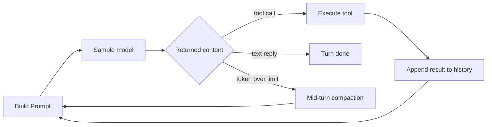
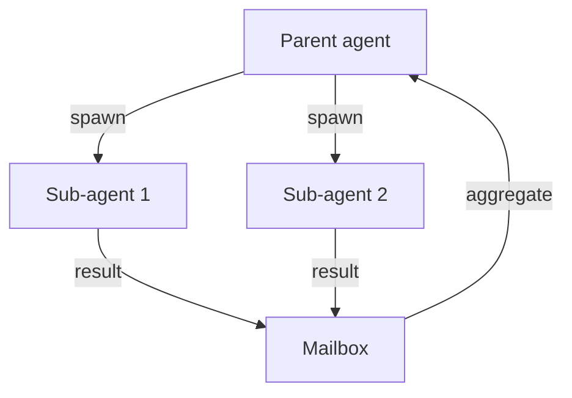

> **Language**: **English** · [中文](01-architecture-overview.zh.md)

# 01 — Architecture overview

> This chapter builds a complete mental model of Codex from a top-down view. After reading it you will understand how a user request flows through each layer to the LLM and back, how the core abstractions inside the agent cooperate, and where each subsystem sits in the whole.

## 1. The big picture: a four-layer model

Codex's code is organized into four layers by responsibility, and each layer only depends on the layer below it:



| Layer | Responsibility | Key crates |
|---|------|-----------|
| **Presentation** | User-facing UI, IDE integration, SDK integration | `tui`, `app-server`, `app-server-protocol` |
| **Session management** | Multi-thread management, thread lifecycle | `core` (ThreadManager, CodexThread) |
| **Agent core** | Queue-based communication, Session state, Turn execution loop | `core` (Codex, Session, run_turn) |
| **Capabilities** | LLM calls, tool execution, safety sandbox, MCP external tools | `codex-api`, `tools`, `sandboxing`, `codex-mcp` |

The point of this four-layer split is that the upper layer can be swapped out (replace TUI with an IDE plugin), the lower layer can be extended (add a new tool type or model provider), while the agent core in the middle stays stable.

## 2. The full journey of a single request

Before diving into each abstraction, here is the global picture in a sequence diagram — what happens inside the system when the user types "fix this bug":



This flow exposes the core pattern of Codex: the **Agent Loop** — the model repeatedly "thinks → acts → observes" until the task is done. The rest of this chapter walks through the key roles in that flow one at a time.

## 3. Core abstractions

Six core concepts are enough to make sense of the Codex architecture. They are listed from outer to inner by containment:

### 3.1 ThreadManager — multi-thread manager

`ThreadManager` is the first object the presentation layer touches. It manages multiple independent conversation threads, each of which is a complete user-agent dialogue.

```
ThreadManager
  ├── owns all shared resources (auth, model, mcp, skills, ...)
  ├── threads: HashMap<ThreadId, CodexThread>
  └── operations: new_thread() / fork_thread() / resume_thread()
```

**Source**: [core/src/thread_manager.rs](https://github.com/openai/codex/blob/main/codex-rs/core/src/thread_manager.rs)

### 3.2 CodexThread — the public API for a thread

Each thread corresponds to a `CodexThread`, the public interface exposed to the outside world:

```
CodexThread
  ├── submit(op)       → submit an operation (user input, approval response, ...)
  ├── next_event()     → receive an event (agent message, tool execution, ...)
  ├── agent_status()   → query the agent's current status
  └── steer_input()    → inject input mid-Turn
```

**Source**: [core/src/codex_thread.rs](https://github.com/openai/codex/blob/main/codex-rs/core/src/codex_thread.rs)

### 3.3 Codex — the queue-pair communication model

`Codex` is the most important abstraction in the architecture — an **async pair of queues**. The client submits operations through one channel and receives events through another:



Why use a queue pair instead of direct function calls?

- **Decoupling**: the producer and consumer are fully async; neither blocks the other.
- **Concurrency safety**: a single `submission_loop` processes all operations serially, avoiding state races.
- **Observability**: every interaction flows through the Event stream, so the TUI/IDE can render it in real time.

`submission_loop` is the event scheduler at the heart of the system — it pulls an Op off the queue and dispatches it to the right handler by type (`UserTurn` starts a new Turn, `Interrupt` cancels the current Turn, `ExecApproval` resumes a tool call that was waiting for approval, and so on). Turn execution itself is `spawn`ed onto a separate async task, so it never blocks the scheduler loop.

**Source**: [core/src/codex.rs:400-409](https://github.com/openai/codex/blob/main/codex-rs/core/src/codex.rs#L400-L409)

> **Tip — async channel**: a Rust async channel is similar to a Go channel. `Sender` and `Receiver` send and receive messages respectively; `submit` is `send().await`, and `next_event` is `recv().await`.

### 3.4 Session — runtime state of a conversation

`Session` holds all of the runtime state for a conversation; it is the "memory" of the agent core:

```
Session
  ├── state (mutable, lock-protected)
  │   ├── history: ContextManager      ← conversation history + token mgmt
  │   ├── granted_permissions          ← already-granted permissions
  │   └── latest_rate_limits           ← rate limits
  ├── mailbox: Mailbox                 ← inbox for sub-agent communication
  └── services: SessionServices        ← session-level singletons (20+)
      ├── model_client                 ← LLM client
      ├── mcp_connection_manager       ← MCP server connection pool
      ├── exec_policy                  ← execution-policy manager
      ├── hooks                        ← user-defined hooks
      └── rollout                      ← event persistence (JSONL)
```

**Source**: [core/src/codex.rs:825-847](https://github.com/openai/codex/blob/main/codex-rs/core/src/codex.rs#L825-L847), [core/src/state/](https://github.com/openai/codex/blob/main/codex-rs/core/src/state/)

### 3.5 TurnContext — a configuration snapshot for a Turn

When a Turn starts, an **immutable snapshot** is taken from the Session config:

```
TurnContext
  ├── model_info          ← model and its capabilities
  ├── approval_policy     ← approval policy
  ├── sandbox_policy      ← sandbox policy
  ├── tools_config        ← available tool configuration
  ├── cwd                 ← working directory
  └── features            ← feature flags
```

Why not just read from the Session config directly? Because while a Turn is running, the user might change configuration through the UI. The snapshot guarantees behavior stays consistent within the Turn — you will not start a Turn on `gpt-5` and suddenly find yourself on `o3` halfway through.

**Source**: [core/src/codex.rs:864-911](https://github.com/openai/codex/blob/main/codex-rs/core/src/codex.rs#L864-L911)

### 3.6 Op / Event — the bidirectional protocol

All Codex interactions flow through two enums defined in the `protocol` crate:

| Direction | Type | Key messages |
|------|------|---------|
| **Client → server** | Op | `UserTurn` (user input), `Interrupt` (interrupt), `ExecApproval` (approval response), `Compact` (compaction) |
| **Server → client** | Event | `TurnStarted/Complete` (lifecycle), `AgentMessageDelta` (streaming output), `ExecCommandBegin/End` (tool execution), `ExecApprovalRequest` (approval request) |

Op and Event together define **120+ message types**, covering every interaction the agent participates in. This protocol is internal to `codex-core`; the public protocol facing IDEs and SDKs is the JSON-RPC interface exposed by the App Server (see Section 5).

**Source**: [protocol/src/protocol.rs](https://github.com/openai/codex/blob/main/codex-rs/protocol/src/protocol.rs)

## 4. The subsystem map

The six core abstractions form Codex's skeleton, but what actually makes the agent do work are **seven subsystems** built on top of it. The diagram below shows how they relate:



### 4.1 Agent Loop: sample, execute, decide

`run_turn()` implements the agent's core behavior pattern — repeatedly sample the model, execute tools, and decide whether to keep going:



The loop exits under three conditions: the model returns plain text (task complete), the model returns nothing (no work left to do), or Stop Hooks fire (user-defined termination). The model can return multiple tool calls in a single response, and Codex executes them **concurrently**.

**See**: [03 — Agent Loop deep dive](03-agent-loop.md)

### 4.2 Tool system: routing and dispatch

A tool call from the model goes through a **five-stage pipeline**:

```
model emits tool_call
  → ToolRouter         route to the right handler
  → approval check     whether user confirmation is needed
  → runtime selection  sandbox vs. direct execution
  → handler execution  Shell / ApplyPatch / MCP / Agent
  → result back to the model
```

Built-in tool types include shell commands, file edits (apply-patch), MCP external tools, sub-agent spawning, web search, and more. Each tool has its own approval rules and sandbox policy.

**See**: [04 — Tool system design](04-tool-system.md)

### 4.3 Context management: token window and compaction

The LLM's context window is finite, but agent conversations can grow long. `ContextManager` keeps the conversation history within the token budget and offers two compaction triggers:

| Trigger | Condition | Notes |
|------|---------|------|
| **Pre-turn compaction** | Before a Turn starts, history is near the limit | Runs silently; the user does not notice |
| **Mid-turn compaction** | Mid-Turn, token budget is exceeded | Agent Loop pauses, compacts, then resumes |

The compaction strategy asks the model to summarize older messages itself and keep the most recent context.

**See**: [05 — Context and conversation management](05-context-management.md)

### 4.4 Sub-agents: parallel collaboration

Codex can spawn sub-agents through tool calls. Each sub-agent has its own Session and communicates asynchronously through a `Mailbox`:



A depth limit (default 3 levels) and concurrency slots prevent unbounded recursion. A sub-agent can choose to inherit the parent's full history, or only the most recent N turns.

**See**: [06 — Sub-agents and task delegation](06-sub-agent-system.md)

### 4.5 Safety model: three layers of defense

Codex enforces three layers of safety checks on tool execution:

| Layer | Mechanism | Notes |
|----|------|------|
| **ExecPolicy** | Rule engine | Pattern-matches commands and decides auto-allow / require-approval / deny |
| **Guardian** | AI review | Uses a model to judge command safety (optional) |
| **OS sandbox** | System isolation | Landlock (Linux), Seatbelt (macOS) restrict file and network access |

The three layers tighten progressively: ExecPolicy filters out the obviously safe and obviously dangerous, Guardian uses an AI to judge ambiguous cases, and the OS sandbox is the last line of defense.

**See**: [07 — Approval and safety system](07-approval-safety.md)

### 4.6 Model interaction: a four-layer pipeline

A request from the Agent Loop to the LLM API passes through four layers:

| Layer | Module | Responsibility |
|----|------|------|
| **Orchestration** | `core/client.rs` | Transport selection (WebSocket preferred, HTTP SSE fallback), connection reuse |
| **Model management** | `models-manager` | Model discovery and caching, multi-provider metadata |
| **API abstraction** | `codex-api` | Building Responses API requests, parsing streams |
| **Transport** | `codex-client` | HTTP transport, exponential backoff retries |

Codex uses **stateless requests** (each one carries the full context) and reuses the server-side KV cache via `prompt_cache_key`, bringing computation cost from O(n²) down to O(n).

**See**: [08 — API and model interaction](08-api-model-interaction.md)

### 4.7 Extension system: Skills / MCP / Plugin

Codex extends its capabilities through three mechanisms:

| Mechanism | Essence | How it takes effect |
|------|------|---------|
| **Skills** | Markdown instructions | Injected into the context; guides the model's behavior ("how to do it") |
| **MCP** | Tool protocol | Registered as callable tools ("what can be done") |
| **Plugin** | Distribution unit | Bundles Skills + MCP + Apps for distribution |

**See**: [09 — MCP, Skills and plugins](09-mcp-skills-plugins.md)

## 5. Product integration

Codex drives multiple product surfaces with the same agent core. OpenAI calls the infrastructure outside the core the **Harness** — the runtime skeleton. Different products share the same Harness; they only differ in **how they talk to it**:

| Product | Integration | Transport |
|------|---------|------|
| **TUI** | Embedded App Server | in-process channel (no serialization) |
| **VS Code / macOS App** | Standalone App Server subprocess | stdio JSONL |
| **Web** | Cloud-hosted App Server | HTTP event stream |
| **Python SDK** | App Server subprocess | stdio JSON-RPC |
| **TypeScript SDK** | `codex exec` | stdout JSONL |

The App Server exposes a JSON-RPC protocol that defines three session primitives:

- **Thread** — one complete conversation
- **Turn** — one round of user input → agent response
- **Item** — an atomic unit inside a Turn (message, tool call, file edit, ...)

These three primitives are at a **different layer** from the Op/Event protocol inside `codex-core`: Op/Event is the kernel protocol, while Thread/Turn/Item is the public client-facing protocol. The App Server translates between the two.

**See**: [10 — Product integration and the App Server](10-sdk-protocol.md)

## 6. State management: a three-layer lifecycle

Codex's runtime state is split into three layers by lifecycle, each with a clear mutability constraint:

| Layer | Lifecycle | Mutability | Typical contents |
|------|---------|-------|---------|
| **Session-level** | The whole conversation | SessionState mutable, the rest immutable | Conversation history, MCP connections, model client |
| **Turn-level** | A single Turn | TurnState mutable, TurnContext immutable | Model choice, approval policy, tool config |
| **Request-level** | A single LLM request | Rebuilt every time | Tool list, prompt content |

The intent of this split: session-level state accumulates across Turns (e.g. the conversation history keeps growing), Turn-level state uses a snapshot to stay consistent, and request-level state is built on demand to avoid going stale.

## 7. Configuration system

Codex's configuration splits into a **value layer** (under user control) and a **constraint layer** (enforced by admin/cloud). The value layer merges by priority: CLI flags > project `codex.toml` > user `config.toml` > defaults. The constraint layer can override any value-layer setting and is used for compliance enforcement in enterprise scenarios.

**See**: [11 — Configuration system](11-config-system.md)

## 8. Chapter summary

### Core abstractions

| Concept | Description | Source |
|------|------|------|
| **ThreadManager** | Manages multiple conversation threads | [thread_manager.rs](https://github.com/openai/codex/blob/main/codex-rs/core/src/thread_manager.rs) |
| **CodexThread** | Public API for a thread | [codex_thread.rs](https://github.com/openai/codex/blob/main/codex-rs/core/src/codex_thread.rs) |
| **Codex** | Queue-pair communication, submit(Op) / next_event() | [codex.rs:400-409](https://github.com/openai/codex/blob/main/codex-rs/core/src/codex.rs#L400-L409) |
| **Session** | Session state + 20+ singleton services | [codex.rs:825-847](https://github.com/openai/codex/blob/main/codex-rs/core/src/codex.rs#L825-L847) |
| **TurnContext** | Immutable per-Turn config snapshot | [codex.rs:864-911](https://github.com/openai/codex/blob/main/codex-rs/core/src/codex.rs#L864-L911) |
| **Op / Event** | Kernel-level bidirectional protocol (120+ messages) | [protocol.rs](https://github.com/openai/codex/blob/main/codex-rs/protocol/src/protocol.rs) |

### Subsystem index

| Subsystem | Core question | Chapter |
|--------|---------|------|
| Agent Loop | How does the model drive multi-step tool calls? | [03](03-agent-loop.md) |
| Tool system | How are tool calls routed, approved, and executed? | [04](04-tool-system.md) |
| Context management | How do we compact when the conversation gets too long? | [05](05-context-management.md) |
| Sub-agents | How do we spawn parallel agents? | [06](06-sub-agent-system.md) |
| Safety model | How do the three layers protect the user's environment? | [07](07-approval-safety.md) |
| Model interaction | How do we talk to multiple LLM providers? | [08](08-api-model-interaction.md) |
| Extension system | How do Skills/MCP/Plugin extend capabilities? | [09](09-mcp-skills-plugins.md) |
| Product integration | How do multiple products share one agent core? | [10](10-sdk-protocol.md) |
| Configuration system | How do the value and constraint layers merge? | [11](11-config-system.md) |

---

**Previous**: [00 — Project Overview](00-project-overview.md) | **Next**: [02 — Prompt and tool resolution](02-prompt-and-tools.md)
