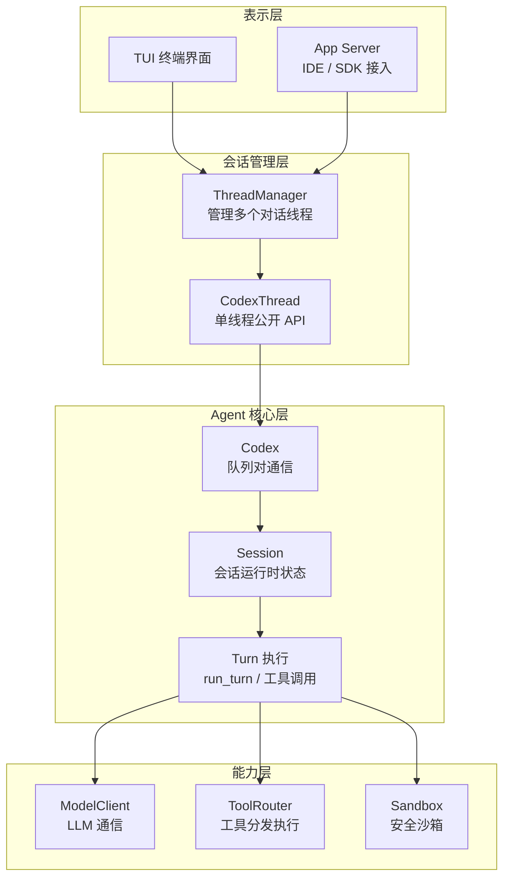
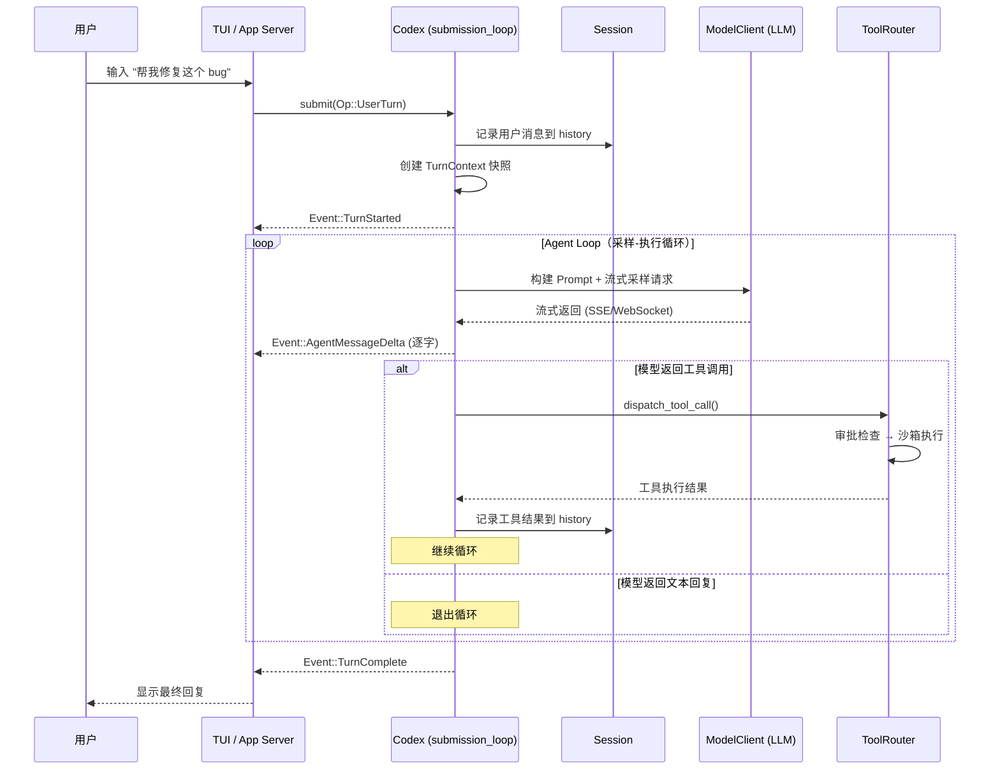
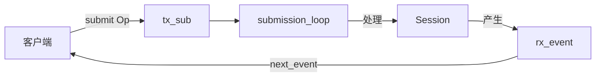
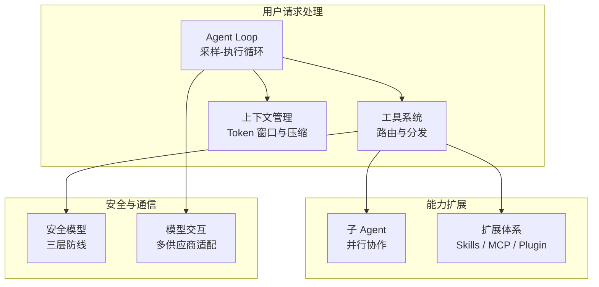
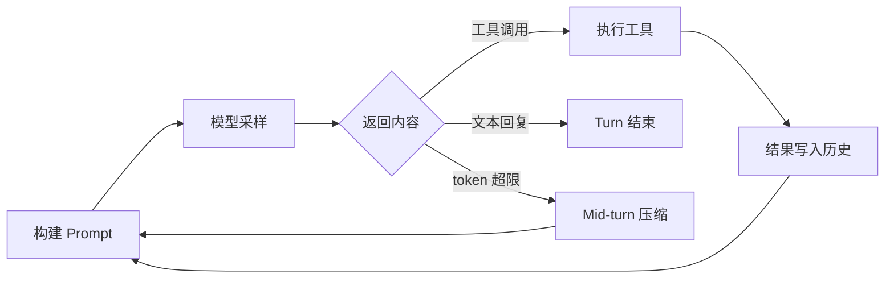
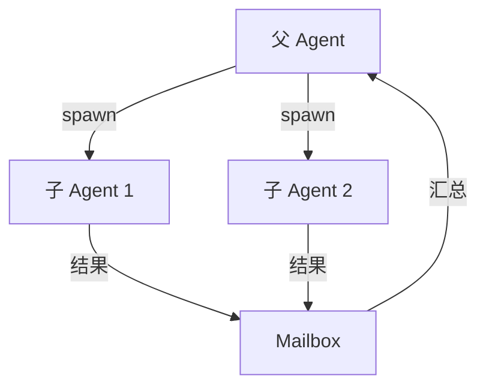

# 01 — 架构总览

> 本章从宏观视角建立 Codex 的完整架构认知。读完本章，你将理解：一个用户请求如何流经各层到达 LLM 并返回结果、Agent 内部的核心抽象如何协作、以及各子系统在整体中的位置。

## 1. 总体架构：四层模型

Codex 的代码按职责分为四层，每一层只依赖下层：



| 层 | 职责 | 关键 crate |
|---|------|-----------|
| **表示层** | 用户交互界面、IDE 集成、SDK 接入 | `tui`, `app-server`, `app-server-protocol` |
| **会话管理层** | 多线程管理、线程生命周期 | `core`（ThreadManager, CodexThread） |
| **Agent 核心层** | 队列通信、Session 状态、Turn 执行循环 | `core`（Codex, Session, run_turn） |
| **能力层** | LLM 调用、工具执行、安全沙箱、MCP 外部工具 | `codex-api`, `tools`, `sandboxing`, `codex-mcp` |

这四层划分的意义在于：上层可以替换（TUI 换成 IDE 插件），下层可以扩展（增加新的工具类型或模型供应商），中间的 Agent 核心层保持稳定。

## 2. 一个请求的完整旅程

在深入各个抽象之前，先用一张时序图看清全局——当用户输入"帮我修复这个 bug"时，系统内部发生了什么：



这个流程揭示了 Codex 的核心模式：**Agent Loop**——模型反复"思考 → 行动 → 观察"直到任务完成。接下来逐一认识流程中的关键角色。

## 3. 核心抽象

理解 Codex 架构，需要抓住六个核心概念。它们按包含关系从外到内排列：

### 3.1 ThreadManager — 多线程管理器

`ThreadManager` 是表示层首先接触的对象。它管理多个独立的对话线程（Thread），每个 Thread 是一次完整的用户-Agent 对话。

```
ThreadManager
  ├── 持有所有共享资源（auth、model、mcp、skills...）
  ├── threads: HashMap<ThreadId, CodexThread>
  └── 操作：new_thread() / fork_thread() / resume_thread()
```

**源码**: [core/src/thread_manager.rs](https://github.com/openai/codex/blob/main/codex-rs/core/src/thread_manager.rs)

### 3.2 CodexThread — 线程公开 API

每个 Thread 对应一个 `CodexThread`，它是对外暴露的公开接口：

```
CodexThread
  ├── submit(op)       → 提交操作（用户输入、审批响应等）
  ├── next_event()     → 接收事件（Agent 消息、工具执行等）
  ├── agent_status()   → 查询 Agent 当前状态
  └── steer_input()    → 在 Turn 执行中途注入输入
```

**源码**: [core/src/codex_thread.rs](https://github.com/openai/codex/blob/main/codex-rs/core/src/codex_thread.rs)

### 3.3 Codex — 队列对通信模型

`Codex` 是架构中最关键的抽象——一个**异步队列对**，客户端通过一个 channel 提交操作，通过另一个 channel 接收事件：



为什么用队列而不是直接函数调用？

- **解耦**：提交方和处理方完全异步，互不阻塞
- **并发安全**：单一 `submission_loop` 串行处理所有操作，避免状态竞争
- **可观测**：所有交互都通过 Event 流输出，TUI/IDE 可以实时展示

`submission_loop` 是整个系统的事件调度中心——它从队列中取出 Op，根据类型分发到对应 handler（`UserTurn` 启动新 Turn，`Interrupt` 取消当前 Turn，`ExecApproval` 恢复等待审批的工具调用，等等）。Turn 执行本身是 `spawn` 出去的独立异步任务，不会阻塞调度循环。

**源码**: [core/src/codex.rs:400-409](https://github.com/openai/codex/blob/main/codex-rs/core/src/codex.rs#L400-L409)

> **知识点 — async channel**: Rust 的异步 channel 类似于 Go 的 channel。`Sender` 和 `Receiver` 分别用于发送和接收消息，`submit` 是 `send().await`，`next_event` 是 `recv().await`。

### 3.4 Session — 会话运行时状态

`Session` 持有一个对话的全部运行时状态，是 Agent 核心层的"记忆"：

```
Session
  ├── state (可变，加锁保护)
  │   ├── history: ContextManager      ← 对话历史与 token 管理
  │   ├── granted_permissions          ← 已授权的权限集合
  │   └── latest_rate_limits           ← 速率限制
  ├── mailbox: Mailbox                 ← 子 Agent 通信信箱
  └── services: SessionServices        ← 会话级单例服务（20+）
      ├── model_client                 ← LLM 客户端
      ├── mcp_connection_manager       ← MCP 服务器连接池
      ├── exec_policy                  ← 执行策略管理器
      ├── hooks                        ← 用户自定义钩子
      └── rollout                      ← 事件持久化（JSONL）
```

**源码**: [core/src/codex.rs:825-847](https://github.com/openai/codex/blob/main/codex-rs/core/src/codex.rs#L825-L847), [core/src/state/](https://github.com/openai/codex/blob/main/codex-rs/core/src/state/)

### 3.5 TurnContext — Turn 的配置快照

每次 Turn 开始时，从 Session 配置中创建一份**不可变快照**：

```
TurnContext
  ├── model_info          ← 模型及其能力
  ├── approval_policy     ← 审批策略
  ├── sandbox_policy      ← 沙箱策略
  ├── tools_config        ← 可用工具配置
  ├── cwd                 ← 工作目录
  └── features            ← Feature Flags
```

为什么不直接读 Session 的配置？因为 Turn 执行过程中，用户可能通过 UI 修改了配置。快照保证当前 Turn 内的行为一致——你不会在一个 Turn 的前半段用 `gpt-5` 而后半段突然切到 `o3`。

**源码**: [core/src/codex.rs:864-911](https://github.com/openai/codex/blob/main/codex-rs/core/src/codex.rs#L864-L911)

### 3.6 Op / Event — 双向通信协议

Codex 的所有交互通过两个枚举完成，定义在 `protocol` crate 中：

| 方向 | 类型 | 关键消息 |
|------|------|---------|
| **客户端 → 服务端** | Op | `UserTurn`（用户输入）、`Interrupt`（中断）、`ExecApproval`（审批响应）、`Compact`（压缩） |
| **服务端 → 客户端** | Event | `TurnStarted/Complete`（生命周期）、`AgentMessageDelta`（流式输出）、`ExecCommandBegin/End`（工具执行）、`ExecApprovalRequest`（审批请求） |

Op 和 Event 共定义了 **120+ 种消息类型**，覆盖了 Agent 的全部交互场景。这套协议是 `codex-core` 内部使用的；面向 IDE 和 SDK 的公开协议由 App Server 的 JSON-RPC 接口提供（见第 5 节）。

**源码**: [protocol/src/protocol.rs](https://github.com/openai/codex/blob/main/codex-rs/protocol/src/protocol.rs)

## 4. 子系统全景

六个核心抽象构成了 Codex 的骨架，而真正让 Agent 能工作的是骨架上的**七个子系统**。下图展示了它们之间的关系：



### 4.1 Agent Loop：采样-执行-判断循环

`run_turn()` 实现了 Agent 的核心行为模式——反复向模型采样、执行工具、判断是否继续：



循环退出的三个条件：模型返回纯文本（任务完成）、输出为空（无事可做）、触发 Stop Hooks（用户自定义终止条件）。模型一次可返回多个工具调用，Codex 会**并发执行**它们。

**详见**: [03 — Agent Loop 深度剖析](03-agent-loop.md)

### 4.2 工具系统：路由与分发

模型输出的工具调用经过一条**五阶段管线**：

```
模型输出 tool_call
  → ToolRouter     路由到正确的 Handler
  → 审批检查        是否需要用户确认
  → Runtime 选择    沙箱 / 直接执行
  → Handler 执行    Shell / ApplyPatch / MCP / Agent
  → 结果返回模型
```

内置工具类型包括 Shell 命令、文件编辑（apply-patch）、MCP 外部工具、子 Agent 派生、Web 搜索等。每种工具有独立的审批规则和沙箱策略。

**详见**: [04 — 工具系统设计](04-tool-system.md)

### 4.3 上下文管理：Token 窗口与压缩

LLM 的上下文窗口有限，而 Agent 对话可以很长。`ContextManager` 在 Token 预算内维护对话历史，提供两种压缩时机：

| 时机 | 触发条件 | 特点 |
|------|---------|------|
| **Pre-turn 压缩** | Turn 开始前，历史已接近上限 | 静默执行，用户无感知 |
| **Mid-turn 压缩** | Turn 执行中，token 超限 | 暂停 Agent Loop，压缩后继续 |

压缩策略是让模型自己总结旧消息为摘要，保留最近上下文。

**详见**: [05 — 上下文与对话管理](05-context-management.md)

### 4.4 子 Agent：并行协作

Codex 支持通过工具调用派生子 Agent，每个子 Agent 拥有独立 Session，通过 `Mailbox` 异步通信：



系统通过深度限制（默认 3 层）和并发槽位防止无限递归。子 Agent 可选择继承父 Agent 的完整历史或仅最近 N 轮。

**详见**: [06 — 子 Agent 与任务委派](06-sub-agent-system.md)

### 4.5 安全模型：三层防线

Codex 对工具执行实施三层安全检查：

| 层 | 机制 | 说明 |
|----|------|------|
| **ExecPolicy** | 规则引擎 | 基于命令模式匹配，决定自动放行 / 需审批 / 拒绝 |
| **Guardian** | AI 审查 | 用模型评估命令安全性（可选） |
| **OS 沙箱** | 系统隔离 | Landlock (Linux)、Seatbelt (macOS) 限制文件和网络访问 |

三层由外到内逐层收紧：ExecPolicy 过滤大部分已知安全/危险命令，Guardian 对模糊地带做 AI 判断，OS 沙箱作为最后一道防线兜底。

**详见**: [07 — 审批与安全系统](07-approval-safety.md)

### 4.6 模型交互：四层管线

从 Agent Loop 到 LLM API，请求经过四层：

| 层 | 模块 | 职责 |
|----|------|------|
| **编排** | `core/client.rs` | 传输选择（WebSocket 优先，HTTP SSE 回退）、连接复用 |
| **模型管理** | `models-manager` | 模型发现与缓存、多供应商元数据 |
| **API 抽象** | `codex-api` | Responses API 请求构建、流式解析 |
| **传输** | `codex-client` | HTTP 传输、指数退避重试 |

Codex 采用**无状态请求**（每次携带完整上下文），通过 `prompt_cache_key` 实现服务端 KV cache 复用，将计算成本从 O(n²) 降为 O(n)。

**详见**: [08 — API 与模型交互](08-api-model-interaction.md)

### 4.7 扩展体系：Skills / MCP / Plugin

Codex 通过三种机制扩展能力：

| 机制 | 本质 | 生效方式 |
|------|------|---------|
| **Skills** | Markdown 指令 | 注入上下文，指导模型行为（"怎么做"） |
| **MCP** | 工具协议 | 注册为可调用工具（"能做什么"） |
| **Plugin** | 打包单元 | 将 Skills + MCP + Apps 捆绑分发 |

**详见**: [09 — MCP、Skills 与插件](09-mcp-skills-plugins.md)

## 5. 产品集成

Codex 以同一个 Agent 内核驱动多个产品形态。OpenAI 将内核之外的基础设施称为 **Harness**（运行骨架）——不同产品共享同一套 Harness，差异仅在**如何与 Harness 通信**：

| 产品 | 接入方式 | 传输 |
|------|---------|------|
| **TUI** | 嵌入式 App Server | in-process 通道（无序列化） |
| **VS Code / macOS App** | 独立 App Server 子进程 | stdio JSONL |
| **Web** | 云端 App Server | HTTP 事件流 |
| **Python SDK** | App Server 子进程 | stdio JSON-RPC |
| **TypeScript SDK** | `codex exec` | stdout JSONL |

App Server 对外暴露 JSON-RPC 协议，定义了三层会话原语：

- **Thread** — 一次完整对话
- **Turn** — 一轮用户输入 → Agent 响应
- **Item** — Turn 内的原子单元（消息、工具调用、文件编辑等）

这三层原语与 `codex-core` 内部的 Op/Event 协议是**不同的层次**：Op/Event 是内核协议，Thread/Turn/Item 是面向客户端的公开协议。App Server 负责在两者之间翻译。

**详见**: [10 — 产品集成与 App Server](10-sdk-protocol.md)

## 6. 状态管理：三层生命周期

Codex 的运行时状态按生命周期分为三层，每层有明确的可变性约束：

| 层级 | 生命周期 | 可变性 | 典型内容 |
|------|---------|-------|---------|
| **会话级** | 整个对话过程 | SessionState 可变，其余不可变 | 对话历史、MCP 连接、Model 客户端 |
| **Turn 级** | 单次 Turn | TurnState 可变，TurnContext 不可变 | 模型选择、审批策略、工具配置 |
| **请求级** | 单次 LLM 请求 | 每次重建 | 工具列表、Prompt 内容 |

这三层划分的设计意图是：会话级状态跨 Turn 积累（如对话历史持续增长），Turn 级状态通过快照保证一致性，请求级状态按需构建避免过时。

## 7. 配置体系

Codex 的配置分为**值层**（用户可控）和**约束层**（管理员/云端强制）。值层按优先级合并：CLI 参数 > 项目 `codex.toml` > 用户 `config.toml` > 默认值。约束层可覆盖值层的任何设置，用于企业场景下的合规管控。

**详见**: [11 — 配置系统](11-config-system.md)

## 8. 本章小结

### 核心抽象

| 概念 | 说明 | 源码 |
|------|------|------|
| **ThreadManager** | 管理多个对话线程 | [thread_manager.rs](https://github.com/openai/codex/blob/main/codex-rs/core/src/thread_manager.rs) |
| **CodexThread** | 线程公开 API | [codex_thread.rs](https://github.com/openai/codex/blob/main/codex-rs/core/src/codex_thread.rs) |
| **Codex** | 队列对通信，submit(Op) / next_event() | [codex.rs:400-409](https://github.com/openai/codex/blob/main/codex-rs/core/src/codex.rs#L400-L409) |
| **Session** | 会话状态 + 20+ 单例服务 | [codex.rs:825-847](https://github.com/openai/codex/blob/main/codex-rs/core/src/codex.rs#L825-L847) |
| **TurnContext** | Turn 的不可变配置快照 | [codex.rs:864-911](https://github.com/openai/codex/blob/main/codex-rs/core/src/codex.rs#L864-L911) |
| **Op / Event** | 内核双向通信协议（120+ 种消息） | [protocol.rs](https://github.com/openai/codex/blob/main/codex-rs/protocol/src/protocol.rs) |

### 子系统导读

| 子系统 | 核心问题 | 章节 |
|--------|---------|------|
| Agent Loop | 模型如何驱动多轮工具调用？ | [03](03-agent-loop.md) |
| 工具系统 | 工具调用如何路由、审批和执行？ | [04](04-tool-system.md) |
| 上下文管理 | 对话超长时如何压缩？ | [05](05-context-management.md) |
| 子 Agent | 如何派生并行 Agent？ | [06](06-sub-agent-system.md) |
| 安全模型 | 三层防线如何保护用户环境？ | [07](07-approval-safety.md) |
| 模型交互 | 如何与多种 LLM 供应商通信？ | [08](08-api-model-interaction.md) |
| 扩展体系 | Skills/MCP/Plugin 如何扩展能力？ | [09](09-mcp-skills-plugins.md) |
| 产品集成 | 多产品如何共享同一 Agent 内核？ | [10](10-sdk-protocol.md) |
| 配置系统 | 值层与约束层如何合并？ | [11](11-config-system.md) |

---

**上一章**: [00 — 项目概览](00-project-overview.md) | **下一章**: [02 — 提示词与工具解析](02-prompt-and-tools.md)
