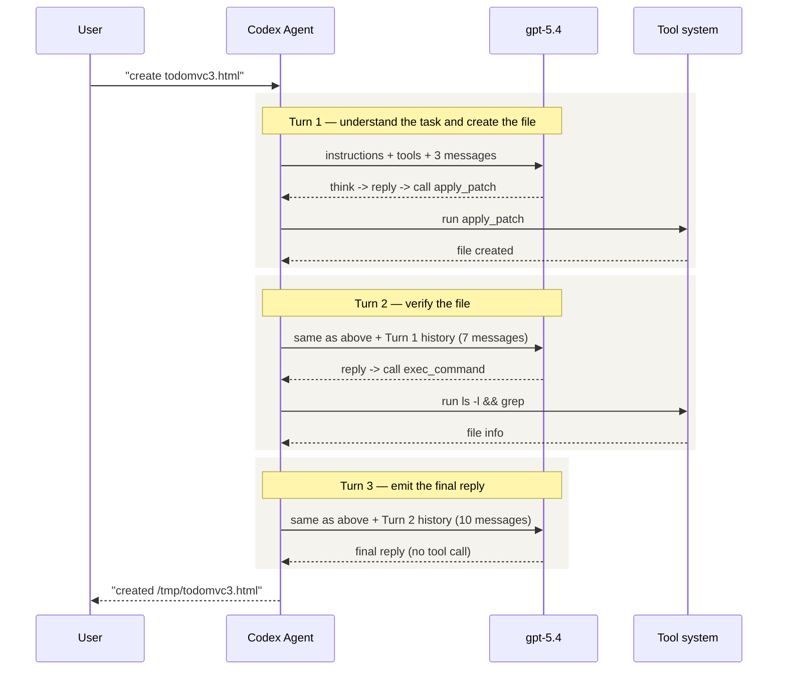

> **Language**: **English** · [中文](02-prompt-and-tools.zh.md)

# 02 — Prompts and Tools

> This chapter walks through a real TODOMVC task to show the full multi-turn exchange between Codex and the LLM. We start with a bird's-eye view, then peel apart the System Prompt, the tools, and the structure of every message.

## 1. The big picture: 3 LLM calls to create one file

We give Codex a simple task:

```
Create a file called /tmp/todomvc3.html with a minimal TODOMVC page using HTML CSS JS
```

In total, Codex makes **3 LLM calls** to finish the job. The diagram below shows the complete flow:



### What every request contains

Every LLM call sends **exactly the same structure**; only `messages` grows as the conversation progresses:

| | Turn 1 | Turn 2 | Turn 3 |
|---|---------|---------|---------|
| **instructions** | 14,732 chars | 14,732 chars | 14,732 chars |
| **tools** | 16 | 16 | 16 |
| **messages** | 3 | 7 | 10 |
| **Request body size** | 125 KB | 138 KB | 139 KB |

> Note: every turn **resends** the full instructions and the full tool definitions. This is exactly why long conversations need context compaction — `messages` keeps accumulating and the request body keeps growing.

### When does the loop stop?

```
Model reply contains a tool call    -> needs_follow_up = true  -> continue to next turn
Model reply contains no tool call   -> needs_follow_up = false -> task complete
```

In Turns 1 and 2 the model invoked tools, so the loop continues. In Turn 3 the model returns plain text only, and the loop ends.

## 2. System Prompt: the agent's personality foundation

The `instructions` field is Codex's system prompt — about **14,732 characters** — and is embedded into the binary at compile time from a markdown file. It defines who the agent **is** and how it **operates**.

### Main sections

| Section | Core rules |
|---------|-----------|
| **Identity** | "You are Codex, a coding agent based on GPT-5" |
| **Personality** | Values: Clarity / Pragmatism / Rigor; no fluff, no flattery |
| **Editing** | Must use `apply_patch` to change files; do not revert the user's edits; no interactive git |
| **Autonomy** | "Persist until the task is fully handled end-to-end" — do not stop halfway |
| **Frontend** | Avoid "AI slop" — no cookie-cutter purple-on-white layouts |
| **Output** | Two channels: `commentary` (progress updates) and `final` (final reply); progress update every 30 seconds |
| **Format** | Markdown; no nested lists; code blocks need an info string; final reply capped at 50–70 lines |

### A few rules worth highlighting

**"No fluff"**:
```
You avoid cheerleading, motivational language, or artificial reassurance,
or any kind of fluff.
```

**"No AI slop"**:
```
When doing frontend design tasks, avoid collapsing into "AI slop" or
safe, average-looking layouts.
```

**Source**: [protocol/src/prompts/base_instructions/default.md](https://github.com/openai/codex/blob/main/codex-rs/protocol/src/prompts/base_instructions/default.md)

## 3. Tools: 16 core tools

Each request carries 16 core tool definitions (this run also has 61 GitHub MCP plugin tools, omitted here).

### Grouped by purpose

| Category | Tool | Description |
|----------|------|-------------|
| **Command execution** | `exec_command` | Run a shell command in a PTY, with sandbox-escalation support |
| | `write_stdin` | Write input to a running process |
| **File editing** | `apply_patch` | Create / modify files using a unified-diff-like free-text format |
| **Images** | `view_image` | View a local image file |
| **Search** | `web_search` | Search the web |
| **Planning** | `update_plan` | Update task-plan steps |
| **User interaction** | `request_user_input` | Ask the user a question (Plan mode only) |
| **Tool discovery** | `tool_suggest` | Suggest missing tools / connectors |
| **MCP resources** | `list_mcp_resources` | List resources exposed by an MCP server |
| | `list_mcp_resource_templates` | List MCP resource templates |
| | `read_mcp_resource` | Read a resource from an MCP server |
| **Sub-agents** | `spawn_agent` | Create a sub-agent (can pin model + reasoning effort) |
| | `send_input` | Send a message to a sub-agent |
| | `resume_agent` | Resume a closed sub-agent |
| | `wait_agent` | Wait for a sub-agent to finish |
| | `close_agent` | Close a sub-agent |

### Two tool kinds

- **function tools** (e.g. `exec_command`): parameters defined as standard JSON Schema; the model invokes them in JSON format.
- **custom tools** (e.g. `apply_patch`): free-text format; the model emits the patch body directly without going through JSON.

**Source**: tools are registered in [core/src/tools/spec.rs](https://github.com/openai/codex/blob/main/codex-rs/core/src/tools/spec.rs)

## 4. Turn-by-turn breakdown

### 4.1 Turn 1: understand the task -> create the file

**Input** (3 messages):

| # | Role | Content |
|---|------|---------|
| 0 | `developer` | Sandbox permission rules + collaboration mode + Skills list + Plugins list (10,132 chars) |
| 1 | `user` | AGENTS.md project rules injection + environment context cwd/shell/date (3,650 chars) |
| 2 | `user` | "Create a file called /tmp/todomvc3.html..." (user input, 85 chars) |

**Output**:
1. **reasoning** — the model's internal thinking (encrypted, not visible)
2. **assistant message** — "Creating `/tmp/todomvc3.html`..." (84 chars, commentary channel)
3. **apply_patch call** — emits the full HTML/CSS/JS patch (~7,900 chars)

**Tool result**: `Success. Updated files: A /tmp/todomvc3.html`

> `needs_follow_up = true` (a tool was called) -> proceed to Turn 2

### 4.2 Turn 2: verify the file

**Input** (7 messages) = Turn 1's 3 messages + Turn 1's 4 output items (reasoning + assistant + tool_call + tool_output)

**The 4 newly added items**:

| # | Type | Content |
|---|------|---------|
| 3 | `reasoning` | Model thinking (encrypted) |
| 4 | `assistant` | "Creating..." |
| 5 | `apply_patch` call | Patch body that creates the file |
| 6 | `tool_output` | "Success" |

**Output**:
1. **assistant message** — "File written; running a quick verification..." (36 chars)
2. **exec_command call** — `ls -l /tmp/todomvc3.html && grep -n "TodoMVC" /tmp/todomvc3.html`

**Tool result**: file exists, 129 lines, title contains "TodoMVC"

> `needs_follow_up = true` -> proceed to Turn 3

### 4.3 Turn 3: final reply

**Input** (10 messages) = the previous 7 + Turn 2's 3 new items (assistant + exec_command + output)

**Output**:
1. **assistant message** — final reply summarising the result (no tool call)

> `needs_follow_up = false` -> **task complete**

### Message accumulation, at a glance

```
Turn 1:  [developer] [user:ctx] [user:input]                                               -> 3
Turn 2:  ────── same as above ────── [reasoning] [assistant] [apply_patch] [tool_output]   -> 7
Turn 3:  ─────────── same as above ─────────── [assistant] [exec_command] [cmd_output]    -> 10
```

## 5. Full request data

The analysis above is based on real API capture data. Full content:

- [Annotated full request, section by section](02-appendix/02-full-request-annotated.md) — Turn 3's instructions + tools + 10 messages + LLM reply, field by field
- [Raw JSON of the full request](02-appendix/02-full-request.json) — the same request as raw JSON (75 KB)

> **Capture method**: a custom `model_provider` (with `supports_websockets=false`) plus a Node.js proxy. See the command reference for Round 6 in [PROGRESS.md](../PROGRESS.md).

---

**Previous**: [01 — Architecture overview](01-architecture-overview.md) | **Next**: [03 — Agent Loop deep dive](03-agent-loop.md)
