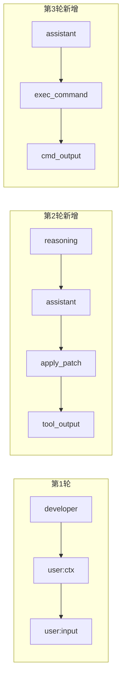
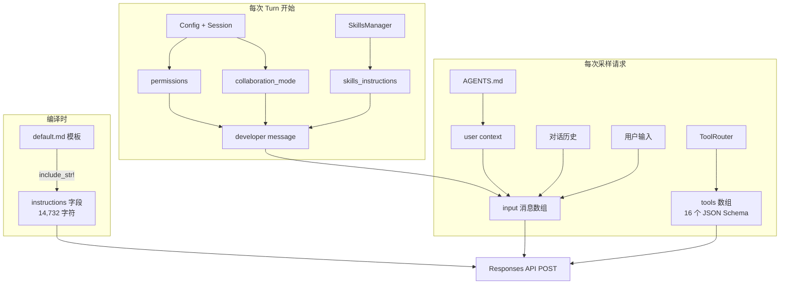

# 02 — 提示词与工具解析

> 本章完整展示 Codex 向 LLM 发送的一次真实 API 请求，逐条拆解 instructions、tools、messages 三大部分。所有数据均来自对一个 TODOMVC 任务的实际抓包。

## 1. 一次 API 请求的完整结构

Codex 使用 OpenAI 的 [Responses API](https://platform.openai.com/docs/api-reference/responses)。每次请求包含以下顶层字段：

```json
{
  "model": "gpt-5.4",
  "instructions": "You are Codex, a coding agent...",  // 系统指令，14,732 字符
  "input": [ ... ],    // 消息列表，3~10+ 条（随对话累积）
  "tools": [ ... ],    // 工具定义，16 个核心工具
  "stream": true,      // 始终流式返回
  "parallel_tool_calls": true,
  "reasoning": { "effort": "high", "summary": "none" }
}
```

以下按 `instructions` → `tools` → `input` 的顺序逐一展开。

## 2. instructions：系统指令（14,732 字符）

`instructions` 字段是 Codex 的「人格底座」，定义了 Agent 是谁、怎么做事、怎么说话。这段文本在 Rust 编译时通过 `include_str!` 从 markdown 文件嵌入二进制，运行时不可修改。

> 完整原文见：[完整 API 请求逐段注解 - Section 2](02-appendix/02-full-request-annotated.md)

### 2.1 内容模块拆解

| 模块 | 内容要点 | 约字符数 |
|------|---------|---------|
| **身份声明** | "You are Codex, a coding agent based on GPT-5" | 50 |
| **人格设定 (Personality)** | 价值观：Clarity / Pragmatism / Rigor；交互风格：简洁、不说废话 | 1,200 |
| **通用指南 (General)** | 用 `rg` 搜索、并行工具调用、默认 ASCII 编码 | 800 |
| **编辑约束 (Editing)** | 必须用 `apply_patch`、不 revert 用户修改、不用交互式 git | 1,500 |
| **自主性 (Autonomy)** | "Persist until the task is fully handled end-to-end" | 600 |
| **前端任务 (Frontend)** | 避免 "AI slop"、排版/配色/动画指南 | 800 |
| **用户交互 (Working with user)** | commentary vs final 两个输出通道、30 秒更新频率 | 3,000 |
| **格式规则 (Formatting)** | Markdown 格式、不用嵌套列表、代码块要有 info string | 2,000 |
| **最终回复 (Final answer)** | 简洁优先、不超过 50-70 行、不开头说 "Got it" | 1,500 |

### 2.2 值得注意的设计决策

**"不说废话"规则**：
```
You avoid cheerleading, motivational language, or artificial reassurance,
or any kind of fluff. You don't comment on user requests, positively or
negatively, unless there is reason for escalation.
```

**"不要 AI slop"规则**：
```
When doing frontend design tasks, avoid collapsing into "AI slop" or
safe, average-looking layouts. Aim for interfaces that feel intentional,
bold, and a bit surprising.
```

**双通道输出**：
```
You have 2 ways of communicating with the users:
- Share intermediary updates in `commentary` channel.
- After you have completed all your work, send a message to the `final` channel.
```

**源码**: [protocol/src/prompts/base_instructions/default.md](https://github.com/openai/codex/blob/main/codex-rs/protocol/src/prompts/base_instructions/default.md)

## 3. tools：16 个核心工具定义

每次请求携带完整的工具 JSON Schema 列表。以下是从抓包中提取的 16 个核心工具（已过滤 61 个 GitHub MCP 插件工具）：

### 3.1 工具总览

| 工具名 | 类型 | 说明 | 必填参数 |
|--------|------|------|---------|
| `exec_command` | function | 在 PTY 中执行 shell 命令 | `cmd` |
| `write_stdin` | function | 向运行中的进程写入 stdin | `session_id` |
| `apply_patch` | custom | 创建/修改文件（自由格式补丁） | (自由文本) |
| `update_plan` | function | 更新任务计划步骤 | `plan` |
| `view_image` | function | 查看本地图片文件 | `path` |
| `request_user_input` | function | 向用户提问（仅 Plan 模式） | `questions` |
| `tool_suggest` | function | 建议缺失的工具/连接器 | `tool_type`, `action_type`, `tool_id`, `suggest_reason` |
| `web_search` | web_search | 网页搜索 | (内置) |
| `list_mcp_resources` | function | 列出 MCP 服务器资源 | 无 |
| `list_mcp_resource_templates` | function | 列出 MCP 资源模板 | 无 |
| `read_mcp_resource` | function | 读取 MCP 服务器资源 | `server`, `uri` |
| `spawn_agent` | function | 创建子 Agent | 无 |
| `send_input` | function | 向子 Agent 发送消息 | `target` |
| `resume_agent` | function | 恢复已关闭的子 Agent | `id` |
| `wait_agent` | function | 等待子 Agent 完成 | `targets` |
| `close_agent` | function | 关闭子 Agent | `target` |

### 3.2 核心工具详解

#### exec_command — Shell 命令执行

这是 Codex 最常用的工具，每个编码任务几乎都会用到。

```json
{
  "type": "function",
  "name": "exec_command",
  "description": "Runs a command in a PTY, returning output or a session ID for ongoing interaction.",
  "strict": false,
  "parameters": {
    "type": "object",
    "properties": {
      "cmd":                 { "type": "string",  "description": "Shell command to execute." },
      "workdir":             { "type": "string",  "description": "Optional working directory; defaults to the turn cwd." },
      "shell":               { "type": "string",  "description": "Shell binary to launch. Defaults to user's default shell." },
      "tty":                 { "type": "boolean", "description": "Whether to allocate a TTY. Defaults to false." },
      "yield_time_ms":       { "type": "number",  "description": "How long to wait for output before yielding." },
      "max_output_tokens":   { "type": "number",  "description": "Maximum tokens to return. Excess is truncated." },
      "sandbox_permissions": { "type": "string",  "description": "Set to \"require_escalated\" to request running outside sandbox." },
      "justification":       { "type": "string",  "description": "Only set if sandbox_permissions is \"require_escalated\"." },
      "prefix_rule":         { "type": "array",   "description": "Suggest a command prefix pattern for future approvals." }
    },
    "required": ["cmd"],
    "additionalProperties": false
  }
}
```

注意 `sandbox_permissions` 和 `justification` 参数——它们是沙箱审批机制的 API 入口，Agent 通过这些参数请求用户授权。

#### apply_patch — 文件创建与修改

这是一个 **custom 类型**工具（不是标准 function calling），使用自由文本格式：

```json
{
  "type": "custom",
  "name": "apply_patch",
  "description": "Use the `apply_patch` tool to edit files. This is a FREEFORM tool..."
}
```

调用时 Agent 直接输出补丁文本，格式类似 unified diff：

```
*** Begin Patch
*** Add File: /tmp/todomvc.html
+<!DOCTYPE html>
+<html lang="en">
+...
*** End Patch
```

#### spawn_agent / send_input / wait_agent / close_agent — 子 Agent 协调

这四个工具构成了多 Agent 协调系统的 API。`spawn_agent` 的定义中直接列出了可用模型：

```json
{
  "type": "function",
  "name": "spawn_agent",
  "description": "...\n- gpt-5.4 (`gpt-5.4`): Latest frontier agent model...\n- o3 (`o3`): Strong reasoning model...",
  "parameters": {
    "properties": {
      "agent_type":       { "type": "string", "description": "Type of agent: 'background' or 'worktree'" },
      "message":          { "type": "string", "description": "Instructions for the agent" },
      "model":            { "type": "string", "description": "Model to use" },
      "reasoning_effort": { "type": "string", "description": "Reasoning effort: low, medium, high" },
      "fork_context":     { "type": "string", "description": "How much context to share" }
    }
  }
}
```

> 全部 16 个工具的参数定义见：[完整 API 请求逐段注解 - Section 3](02-appendix/02-full-request-annotated.md)

**源码**: 工具规格构建在 [core/src/tools/spec.rs](https://github.com/openai/codex/blob/main/codex-rs/core/src/tools/spec.rs)，路由在 [core/src/tools/router.rs](https://github.com/openai/codex/blob/main/codex-rs/core/src/tools/router.rs)。

## 4. input：消息列表逐条注解

`input` 是一个有序的消息数组，包含所有对话历史。以下是 TODOMVC 任务 **3 轮请求**的完整消息列表，逐条注解。

### 4.1 第 1 轮请求（3 条消息）

这是 Turn 开始时的第一次 LLM 调用，input 只包含初始上下文和用户输入：

---

**消息 [0] — developer message（4 块，10,132 字符）**

以 `developer` 角色发送的运行时指令，由 4 个 `input_text` 块组成：

| Block | XML 标签 | 字符数 | 内容 |
|-------|---------|--------|------|
| 1 | `<permissions instructions>` | ~7,500 | 沙箱规则、命令审批机制、已批准的 prefix_rules 列表 |
| 2 | `<collaboration_mode>` | ~500 | 当前协作模式（Default：直接执行，不主动提问） |
| 3 | `<apps_instructions>` | ~400 | Apps/Connectors 使用方式 |
| 4 | `<skills_instructions>` | ~1,700 | 可用 Skills 列表（13 个）和触发规则 |

> Block 1 的 permissions instructions 是最大的一块，因为它包含了用户之前累积批准的所有命令前缀。新安装的 Codex 这部分会短很多。

> 完整原文见：[完整 API 请求逐段注解 - Section 4.1](02-appendix/02-full-request-annotated.md)

---

**消息 [1] — user message（2 块，3,650 字符）**

自动注入的项目上下文，包含两部分：

**Block 1 — AGENTS.md 注入**：Codex 自动发现项目根目录的 `AGENTS.md`，将其包装在 `<INSTRUCTIONS>` 标签中注入。

```
# AGENTS.md instructions for /Users/zoujie.wu/workspace/learn-codex

<INSTRUCTIONS>
# learn-codex 项目开发规则
## 中文内容输出规则
...
</INSTRUCTIONS>
```

**Block 2 — 环境上下文**：

```xml
<environment_context>
  <cwd>/Users/zoujie.wu/workspace/learn-codex</cwd>
  <shell>zsh</shell>
  <current_date>2026-04-12</current_date>
  <timezone>Asia/Singapore</timezone>
</environment_context>
```

**源码**: AGENTS.md 发现逻辑在 [core/src/project_doc.rs](https://github.com/openai/codex/blob/main/codex-rs/core/src/project_doc.rs)。

---

**消息 [2] — user message（1 块，85 字符）**

用户的实际输入，原样传递：

```
Create a file called /tmp/todomvc3.html with a minimal TODOMVC page using HTML CSS JS
```

### 4.2 第 2 轮请求（7 条消息）

第 1 轮 LLM 返回了 `apply_patch` 工具调用，Codex 执行后需要将结果反馈给 LLM。第 2 轮请求包含第 1 轮的所有消息 **加上** 模型回复和工具执行结果：

---

**消息 [0]~[2]** — 与第 1 轮相同（developer + user context + user input），略。

---

**消息 [3] — reasoning（加密的思维链）**

模型的内部推理过程。内容被加密，对外不可见，但占据请求体空间。

---

**消息 [4] — assistant message（84 字符）**

模型的第一次文本回复（commentary 通道）：

```
正在创建 `/tmp/todomvc3.html`，我会直接写成单文件的最小 TodoMVC：
包含 HTML 结构、基础样式和原生 JS 的新增/切换/删除/筛选功能。
```

---

**消息 [5] — custom_tool_call: apply_patch**

模型调用 `apply_patch` 工具创建文件。请求体是自由文本格式的补丁：

```
*** Begin Patch
*** Add File: /tmp/todomvc3.html
+<!DOCTYPE html>
+<html lang="en">
+<head>
+  <meta charset="UTF-8">
+  <title>TodoMVC</title>
+  <style>
+    ...（CSS 样式）
+  </style>
+</head>
+<body>
+  ...（HTML 结构）
+  <script>
+    ...（JavaScript 逻辑）
+  </script>
+</body>
+</html>
*** End Patch
```

---

**消息 [6] — custom_tool_call_output**

Codex 执行 `apply_patch` 后返回的结果：

```
Exit code: 0
Wall time: 0 seconds
Output:
Success. Updated the following files:
A /tmp/todomvc3.html
```

> 此时 `needs_follow_up = true`（有工具调用），所以 Agent Loop 继续迭代，发起第 3 轮请求。

### 4.3 第 3 轮请求（10 条消息）

第 2 轮 LLM 返回了 `exec_command` 工具调用来验证文件，执行后需要再次反馈。第 3 轮在第 2 轮基础上再追加 3 条消息：

---

**消息 [0]~[6]** — 与第 2 轮相同，略。

---

**消息 [7] — assistant message（36 字符）**

模型的第二次文本回复：

```
文件已写入。我在做一次快速校验，确认它已落盘且是可直接打开的单文件页面。
```

---

**消息 [8] — function_call: exec_command**

模型调用 `exec_command` 验证文件：

```json
{
  "name": "exec_command",
  "arguments": {
    "cmd": "ls -l /tmp/todomvc3.html && grep -n \"TodoMVC\" /tmp/todomvc3.html"
  }
}
```

---

**消息 [9] — function_call_output**

命令执行结果：

```
Chunk ID: e080db
Wall time: 0.0000 seconds
Process exited with code 0
Original token count: 12
Output:
-rw-r--r--  1 zoujie.wu  wheel  4231 Apr 12 16:22 /tmp/todomvc3.html
5:  <title>TodoMVC</title>
```

> 第 3 轮 LLM 返回最终回复（无工具调用），`needs_follow_up = false`，Turn 结束。

### 4.4 消息累积全景

```
第 1 轮:  [developer] [user:context] [user:input]                                    = 3 条
第 2 轮:  [developer] [user:context] [user:input] [reasoning] [assistant] [tool_call] [tool_output]  = 7 条
第 3 轮:  ...同上...                              [assistant] [exec_command] [cmd_output]            = 10 条
```



每一轮请求都**重发全部历史消息 + instructions + 全部工具定义**。这就是为什么上下文压缩（Compaction）如此重要——对话越长，每轮请求的 Token 消耗越大。

## 5. 消息角色汇总

| 角色 | 用途 | 谁生成 | 何时出现 |
|------|------|--------|---------|
| `developer` | 运行时指令（权限、Skills、Plugins） | Codex 自动拼装 | 每轮请求的第 1 条 |
| `user` | 项目上下文 + 用户输入 | Codex 注入 + 用户 | 每轮请求的第 2~3 条 |
| `assistant` | 模型的文本回复 | LLM 返回 | 模型回复后追加 |
| `reasoning` | 模型思维链（加密） | LLM 返回 | 模型回复后追加 |
| `custom_tool_call` | apply_patch 等自由格式工具调用 | LLM 返回 | 模型调用工具时 |
| `custom_tool_call_output` | 自由格式工具执行结果 | Codex 工具系统 | 工具执行后追加 |
| `function_call` | exec_command 等标准函数调用 | LLM 返回 | 模型调用工具时 |
| `function_call_output` | 标准函数执行结果 | Codex 工具系统 | 工具执行后追加 |

## 6. Prompt 拼装流程



**源码**: Prompt 结构体在 [core/src/client_common.rs:25-45](https://github.com/openai/codex/blob/main/codex-rs/core/src/client_common.rs#L25-L45)，组装在 [codex.rs:6719-6749](https://github.com/openai/codex/blob/main/codex-rs/core/src/codex.rs#L6719-L6749)。

## 7. 本章小结

| 部分 | 内容 | 大小 | 生命周期 |
|------|------|------|---------|
| **instructions** | Agent 人格、行为准则、格式规则 | 14,732 字符 | 编译时固定 |
| **tools** | 16 个核心工具 JSON Schema | ~10,000 字符 | 每次采样重建 |
| **input[0]: developer** | 沙箱权限、协作模式、Skills | ~10,000 字符 | 每 Turn 拼装 |
| **input[1]: user context** | AGENTS.md + 环境信息 | ~3,650 字符 | 每 Turn 注入 |
| **input[2]: user** | 用户实际输入 | 可变 | 用户提供 |
| **input[3+]: history** | assistant / tool_call / tool_output | 累积增长 | 每轮追加 |

完整请求数据：
- [完整 API 请求逐段注解](02-appendix/02-full-request-annotated.md) — 第 3 轮请求的 instructions + 16 个 tools + 10 条 messages + LLM 回复，逐段展示并注解
- [完整请求原始 JSON](02-appendix/02-full-request.json) — 同一请求的原始 JSON 格式（75KB）

---

> **数据来源**: 通过自定义 `model_provider`（`supports_websockets=false`）+ Node.js 代理抓取的真实 API 请求。Codex v0.120.0, model gpt-5.4。

---

**上一章**: [01 — 架构总览](01-architecture-overview.md) | **下一章**: [03 — Agent Loop 深度剖析](03-agent-loop.md)
