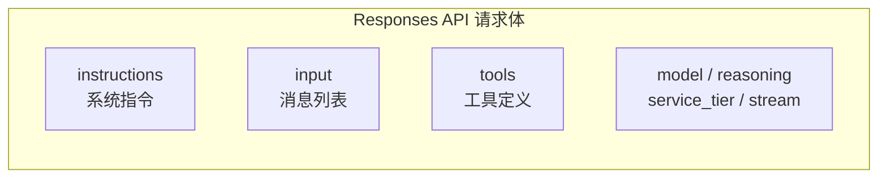
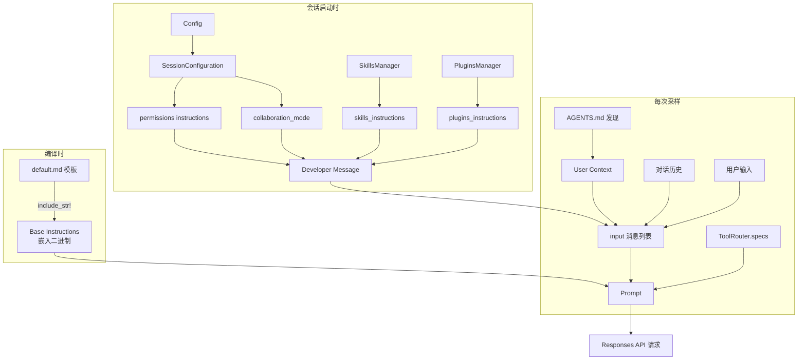

# 02 — 提示词与工具解析

> Agent 的行为由提示词（Prompt）决定。本章逐层拆解 Codex 发送给 LLM 的完整 Prompt 结构，包括系统人格、运行时指令、工具定义和消息格式，配合真实抓取数据逐一说明。

## 1. 概览：一个完整请求包含什么

每次 Codex 向 LLM 发送采样请求时，请求体包含以下部分：



| 字段 | 内容 | 来源 |
|------|------|------|
| `instructions` | Base Instructions — Agent 的人格和行为准则 | 编译时嵌入的 markdown 模板 |
| `input` | 有序的消息列表（developer → user → assistant → tool_output → ...） | 运行时动态拼装 |
| `tools` | 工具的 JSON Schema 定义 | 每次采样请求动态构建 |
| `model` | 模型名称（如 `gpt-5.4`） | 配置 + TurnContext |
| `stream` | `true` — 始终使用流式返回 | 固定 |

**源码**: 请求构建在 [core/src/client.rs](https://github.com/openai/codex/blob/main/codex-rs/core/src/client.rs) 约第 819-888 行。

## 2. Base Instructions：系统人格（14,700 字符）

这是 Codex 最底层的系统指令，定义了 Agent「是谁」和「怎么做事」。这段文本在 Rust 编译时通过 `include_str!` 嵌入二进制，运行时不可修改。

> 完整原文（一字不改）见附录：[02a — Base Instructions 完整原文](02a-system-prompt-full.md)

### 2.1 内容结构

Base Instructions 分为以下几个模块：

| 模块 | 内容要点 | 约字符数 |
|------|---------|---------|
| **身份声明** | "You are Codex, a coding agent based on GPT-5" | 50 |
| **人格设定** | 价值观（Clarity / Pragmatism / Rigor）+ 交互风格（简洁、不说废话、不拍马屁） | 1,200 |
| **通用指南** | 用 `rg` 搜索、并行工具调用、默认 ASCII 编码 | 800 |
| **编辑约束** | 必须用 `apply_patch`、不 revert 用户修改、不用交互式 git | 1,500 |
| **自主性** | "Persist until the task is fully handled end-to-end" — 不要半途而废 | 600 |
| **前端任务** | 避免 "AI slop"、排版/配色/动画指南 | 800 |
| **用户交互** | commentary vs final 两个输出通道、30 秒更新频率 | 3,000 |
| **格式规则** | Markdown 格式、不用嵌套列表、代码块要有 info string | 2,000 |
| **最终回复** | 简洁优先、不超过 50-70 行、不开头说 "Got it" | 1,500 |

### 2.2 几个值得关注的设计决策

**"不说废话"规则**（原文摘录）：

```
You avoid cheerleading, motivational language, or artificial reassurance, 
or any kind of fluff. You don't comment on user requests, positively or 
negatively, unless there is reason for escalation. You don't feel like 
you need to fill the space with words.
```

这条规则解释了为什么 Codex 不会像很多 AI 助手那样说「好的！」「没问题！」——它被训练为直接做事。

**"不要 AI slop"规则**（原文摘录）：

```
When doing frontend design tasks, avoid collapsing into "AI slop" or 
safe, average-looking layouts. Aim for interfaces that feel intentional, 
bold, and a bit surprising.
```

OpenAI 在 base instructions 中明确对抗 AI 生成物的同质化倾向。

**双通道输出**（原文摘录）：

```
You interact with the user through a terminal. You have 2 ways of 
communicating with the users:
- Share intermediary updates in `commentary` channel. 
- After you have completed all your work, send a message to the `final` channel.
```

这就是为什么 Codex 在工作时会不断输出中间进展，最后才给出总结。

**源码**: [protocol/src/prompts/base_instructions/default.md](https://github.com/openai/codex/blob/main/codex-rs/protocol/src/prompts/base_instructions/default.md)

## 3. Developer Message：运行时指令（19,800 字符）

Developer Message 是以 `developer` 角色发送的消息（在 OpenAI API 中，`developer` 角色的消息优先级高于 `user`，但低于 `system`/`instructions`）。它由 5 个独立的 XML 标签块组成，运行时动态拼装。

> 完整原文见附录：[02b — Developer Message 完整原文](02b-developer-message-full.md)

### 3.1 Block 1: `<permissions instructions>`（约 13,000 字符）

这是最大的一个块，定义了**沙箱规则和命令审批机制**。

**沙箱声明**：

```
Filesystem sandboxing defines which files can be read or written.
`sandbox_mode` is `workspace-write`: The sandbox permits reading files, 
and editing files in `cwd` and `writable_roots`. Editing files in other 
directories requires approval. Network access is restricted.
```

**命令分段规则**：
Codex 会将复杂的 shell 命令按控制操作符（`|`, `&&`, `||`, `;`）拆分为独立段，每段独立评估权限：

```
git pull | tee output.txt
→ ["git", "pull"]        // 段 1
→ ["tee", "output.txt"]  // 段 2，独立评估
```

**权限提升机制**：
当命令需要超出沙箱的权限时，Agent 需要通过特殊参数请求用户审批：

```
- Provide `sandbox_permissions` parameter with value "require_escalated"
- Include a short question in `justification` parameter
- Optionally suggest a `prefix_rule` for future sessions
```

**已批准的命令前缀**：
这部分会列出用户之前已批准的所有命令前缀规则，例如：

```
- ["npm", "ci"]
- ["git", "add"]
- ["cargo", "test"]
```

### 3.2 Block 2: `<collaboration_mode>`（约 500 字符）

定义当前的协作模式。Codex 有两种模式：

| 模式 | 行为 |
|------|------|
| **Default** | 直接执行，不主动提问，`request_user_input` 工具不可用 |
| **Plan** | 先规划后执行，可以使用 `request_user_input` 向用户提问 |

Default 模式的核心指令：

```
In Default mode, strongly prefer making reasonable assumptions and 
executing the user's request rather than stopping to ask questions.
```

### 3.3 Block 3: `<apps_instructions>`（约 400 字符）

定义 Apps/Connectors 的使用方式。Apps 本质上是 MCP 工具的封装，用户可以通过 `[$app-name](app://{connector_id})` 格式触发。

### 3.4 Block 4: `<skills_instructions>`（约 4,500 字符）

列出当前会话中可用的所有 Skills 及其使用规则。以下是真实抓取中注册的 Skills：

| Skill 名称 | 来源 | 说明 |
|------------|------|------|
| `changelog-automation` | 用户安装 | Changelog 自动化 |
| `find-skills` | 用户安装 | 搜索可安装的 Skills |
| `github:gh-address-comments` | GitHub 插件 | 处理 PR review 意见 |
| `github:gh-fix-ci` | GitHub 插件 | 修复 CI 失败 |
| `github:github` | GitHub 插件 | GitHub 仓库管理 |
| `github:yeet` | GitHub 插件 | 提交并创建 PR |
| `pencil-design` | 用户安装 | Pencil UI 设计 |
| `ui-ux-pro-max` | 用户安装 | UI/UX 设计优化 |
| `imagegen` | 系统内置 | AI 图片生成 |
| `openai-docs` | 系统内置 | OpenAI 文档查询 |
| `plugin-creator` | 系统内置 | 创建新插件 |
| `skill-creator` | 系统内置 | 创建新 Skill |
| `skill-installer` | 系统内置 | 安装 Skill |

Skills 的**触发规则**非常重要：

```
If the user names a skill (with `$SkillName` or plain text) OR the task 
clearly matches a skill's description shown above, you must use that skill 
for that turn. Multiple mentions mean use them all. Do not carry skills 
across turns unless re-mentioned.
```

### 3.5 Block 5: `<plugins_instructions>`（约 600 字符）

列出已启用的插件。本例中只有一个 `GitHub` 插件。插件是 Skills、MCP 服务器和 Apps 的捆绑包。

## 4. User Context：项目与环境注入

在 developer message 之后，Codex 以 `user` 角色发送两条上下文消息：

### 4.1 AGENTS.md / CLAUDE.md 注入

Codex 会自动发现项目根目录下的 `AGENTS.md`（或 `.codex/AGENTS.md`），将其完整内容包装在 `<INSTRUCTIONS>` 标签中注入。本项目的 AGENTS.md 包含了我们定义的所有 wiki 编写规则。

```
# AGENTS.md instructions for /Users/zoujie.wu/workspace/learn-codex

<INSTRUCTIONS>
# learn-codex 项目开发规则

## 中文内容输出规则
- 禁止产生 Unicode 乱码...

## Wiki 编写规范
- 所有 Wiki 内容使用中文编写...

## 源码引用规则
- 引用 Codex 源码时，必须使用可点击的 GitHub 链接...
</INSTRUCTIONS>
```

**源码**: 项目文档发现逻辑在 [core/src/project_doc.rs](https://github.com/openai/codex/blob/main/codex-rs/core/src/project_doc.rs)。

### 4.2 环境上下文

紧随其后的是结构化的环境信息：

```xml
<environment_context>
  <cwd>/Users/zoujie.wu/workspace/learn-codex</cwd>
  <shell>zsh</shell>
  <current_date>2026-04-12</current_date>
  <timezone>Asia/Singapore</timezone>
</environment_context>
```

## 5. 工具定义：Tools

工具以 JSON Schema 格式传递给 LLM，分为两种类型：

### 5.1 Function 类型工具

以标准的 OpenAI function calling 格式定义，示例（`exec_command`）：

```json
{
  "type": "function",
  "name": "exec_command",
  "description": "Execute a shell command",
  "parameters": {
    "type": "object",
    "properties": {
      "cmd": {
        "type": "string",
        "description": "The command to execute"
      },
      "workdir": {
        "type": "string",
        "description": "Working directory"
      },
      "sandbox_permissions": {
        "type": "string",
        "enum": ["require_escalated"]
      },
      "justification": {
        "type": "string"
      },
      "prefix_rule": {
        "type": "array",
        "items": { "type": "string" }
      }
    },
    "required": ["cmd"]
  }
}
```

### 5.2 Custom 类型工具

Codex 的 `apply_patch` 是一个 custom 类型工具（不使用标准 function calling），它有自己的输入格式：

```
*** Begin Patch
*** Add File: /tmp/todomvc.html
+<!DOCTYPE html>
+<html lang="en">
...
```

### 5.3 工具注册清单

每次采样请求，Codex 会根据当前配置动态构建工具列表：

| 工具名 | 类型 | 常驻/延迟 | 说明 |
|--------|------|----------|------|
| `exec_command` | function | 常驻 | 执行 shell 命令 |
| `apply_patch` | custom | 常驻 | 创建/修改文件 |
| `tool_search` | custom | 常驻 | 搜索延迟加载的工具 |
| `list_dir` | function | 常驻 | 列出目录 |
| `view_image` | function | 常驻 | 查看图片 |
| `request_permissions` | custom | 常驻 | 请求权限提升 |
| MCP 工具 | 动态 | 延迟 | 通过 `tool_search` 发现 |
| Agent 工具 | 动态 | 延迟 | spawn_agent, send_message 等 |

> **延迟加载**: 为了减少 Token 占用，部分工具不会出现在初始的 tools 列表中。模型如果需要，先调用 `tool_search` 搜索，Codex 再将匹配的工具定义注入后续请求。

**源码**: 工具规格构建在 [core/src/tools/spec.rs](https://github.com/openai/codex/blob/main/codex-rs/core/src/tools/spec.rs)。

## 6. 消息格式：Messages

### 6.1 完整的消息流（真实数据）

以下是 TODOMVC 任务的完整消息序列，展示了一个 Turn 中所有消息的角色和类型：

```
 #   角色        类型              内容摘要
 ─── ─────────── ───────────────── ──────────────────────────────
 01  developer   message           permissions + collaboration_mode
                                   + apps + skills + plugins
                                   (5 个 input_text 块, 19,800 字符)

 02  user        message           AGENTS.md 注入 + 环境上下文
                                   (2 个 input_text 块, 3,650 字符)

 03  user        message           "Create a file called todomvc.html..."
                                   (用户实际输入, 96 字符)

 --- 以上是第 1 轮采样的输入 ---

 04  (reasoning)                   模型内部思考 (不可见)

 05  assistant   message           "我会直接创建文件..." (89 字符)

 06  assistant   custom_tool_call  apply_patch → 创建 todomvc.html

 07  (system)    tool_output       "Success. Updated files: A /tmp/todomvc.html"

 --- 第 1 轮采样结束，needs_follow_up=true ---
 --- 以上全部 + 工具输出作为第 2 轮采样的输入 ---

 08  assistant   message           "文件已写好，做一个快速校验..." (33 字符)

 09  assistant   function_call     exec_command: wc -l (并行 1)
 10  assistant   function_call     exec_command: sed -n '1,20p' (并行 2)

 11  (system)    function_output   "129 行" (并行 1 结果)
 12  (system)    function_output   文件头部内容 (并行 2 结果)

 13  assistant   message           "Created /tmp/todomvc.html..." (最终回复)

 --- 第 2 轮采样结束，needs_follow_up=false → Turn 完成 ---
```

### 6.2 消息角色说明

| 角色 | 用途 | 谁生成 |
|------|------|--------|
| `developer` | 系统级运行时指令（权限、Skills、Plugins） | Codex 自动注入 |
| `user` | 项目上下文 + 用户实际输入 | Codex 注入 + 用户输入 |
| `assistant` | 模型的回复、工具调用 | LLM 返回 |
| (tool_output) | 工具执行结果 | Codex 工具系统 |
| (reasoning) | 模型思维链 | LLM 内部 |

### 6.3 Turn Context 快照

每个 Turn 开始时会创建一个配置快照，决定了本次 Turn 的运行参数：

```json
{
  "model": "gpt-5.4",
  "effort": "high",
  "approval_policy": "on-request",
  "sandbox_policy": {
    "type": "workspace-write",
    "network_access": false
  },
  "personality": "pragmatic",
  "collaboration_mode": { "mode": "default" },
  "truncation_policy": { "mode": "tokens", "limit": 10000 }
}
```

## 7. Prompt 拼装流程图



**源码**: Prompt 结构体定义在 [core/src/client_common.rs:25-45](https://github.com/openai/codex/blob/main/codex-rs/core/src/client_common.rs#L25-L45)，组装逻辑在 [codex.rs:6719-6749](https://github.com/openai/codex/blob/main/codex-rs/core/src/codex.rs#L6719-L6749)。AGENTS.md 发现逻辑在 [core/src/project_doc.rs](https://github.com/openai/codex/blob/main/codex-rs/core/src/project_doc.rs)。

## 8. 本章小结

| 层级 | 内容 | 大小 | 生命周期 |
|------|------|------|---------|
| **Base Instructions** | Agent 人格、行为准则、格式规则 | ~14,700 字符 | 编译时固定 |
| **Developer Message** | 沙箱权限、协作模式、Skills、Plugins | ~19,800 字符 | 每 Turn 动态拼装 |
| **User Context** | AGENTS.md + 环境信息 | ~3,600 字符 | 每 Turn 注入 |
| **Tools** | 工具 JSON Schema | 可变 | 每次采样重建 |
| **对话历史** | 前轮的 assistant / tool_call / tool_output | 累积增长 | 会话级，可压缩 |

完整原文附录：
- [02a — Base Instructions 完整原文](02a-system-prompt-full.md)（14,700 字符）
- [02b — Developer Message 完整原文](02b-developer-message-full.md)（19,800 字符，5 个 Block）

---

> **源码版本说明**: 本文基于 [openai/codex](https://github.com/openai/codex) 主分支分析。真实数据通过 `codex debug prompt-input` + rollout JSONL 抓取（Codex v0.120.0, model gpt-5.4）。

---

**上一章**: [01 — 架构总览](01-architecture-overview.md) | **下一章**: [03 — Agent Loop 深度剖析](03-agent-loop.md)
