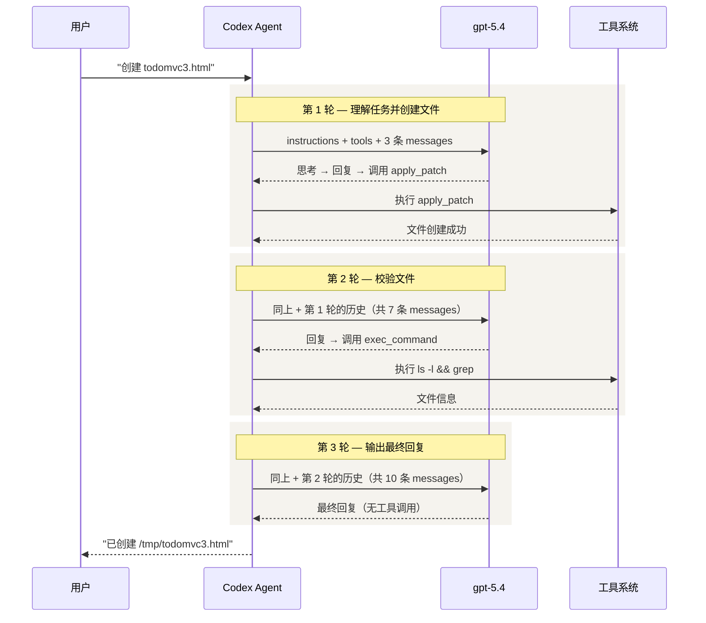

# 02 — 提示词与工具解析

> 本章通过一个真实的 TODOMVC 任务，完整展示 Codex 与 LLM 之间的多轮交互过程。先建立全局视角，再逐层拆解 System Prompt、Tools 和每轮消息的构成。

## 1. 任务全景：3 轮 LLM 调用完成一个文件创建

我们让 Codex 执行一个简单任务：

```
Create a file called /tmp/todomvc3.html with a minimal TODOMVC page using HTML CSS JS
```

Codex 总共发起了 **3 轮 LLM 调用**才完成这个任务。下图展示了完整流程：



### 每轮请求的构成

每一轮 LLM 调用，Codex 都发送**完全相同的结构**，只是 messages 随对话推进而增长：

| | 第 1 轮 | 第 2 轮 | 第 3 轮 |
|---|---------|---------|---------|
| **instructions** | 14,732 字符 | 14,732 字符 | 14,732 字符 |
| **tools** | 16 个 | 16 个 | 16 个 |
| **messages** | 3 条 | 7 条 | 10 条 |
| **请求体大小** | 125 KB | 138 KB | 139 KB |

> 注意：每轮都**重发**完整的 instructions 和全部 tools 定义。这就是为什么长对话需要上下文压缩——messages 不断累积，请求体持续膨胀。

### 循环何时停止？

```
模型回复中包含工具调用 → needs_follow_up = true  → 继续下一轮
模型回复中没有工具调用 → needs_follow_up = false → 任务完成
```

第 1、2 轮模型都调用了工具，所以继续；第 3 轮模型只返回文本回复，循环结束。

## 2. System Prompt：Agent 的人格底座

`instructions` 字段是 Codex 的系统指令，约 **14,732 字符**，编译时从 markdown 文件嵌入二进制。它定义了 Agent「是谁」和「怎么做事」。

### 主要模块

| 模块 | 核心规则 |
|------|---------|
| **身份** | "You are Codex, a coding agent based on GPT-5" |
| **人格** | 价值观 Clarity / Pragmatism / Rigor；不说废话、不拍马屁 |
| **编辑** | 必须用 `apply_patch` 改文件；不 revert 用户的修改；不用交互式 git |
| **自主性** | "Persist until the task is fully handled end-to-end"——不要半途而废 |
| **前端** | 避免 "AI slop"——不要千篇一律的 purple-on-white 布局 |
| **输出** | 两个通道：`commentary`（过程更新）和 `final`（最终回复）；30 秒一次进展更新 |
| **格式** | Markdown、不用嵌套列表、代码块要有 info string、最终回复不超 50-70 行 |

### 几条有意思的规则

**"不说废话"**：
```
You avoid cheerleading, motivational language, or artificial reassurance,
or any kind of fluff.
```

**"不要 AI slop"**：
```
When doing frontend design tasks, avoid collapsing into "AI slop" or
safe, average-looking layouts.
```

**源码**: [protocol/src/prompts/base_instructions/default.md](https://github.com/openai/codex/blob/main/codex-rs/protocol/src/prompts/base_instructions/default.md)

## 3. Tools：16 个核心工具

每次请求携带 16 个核心工具定义（本例中还有 61 个 GitHub MCP 插件工具，此处省略）。

### 按功能分类

| 类别 | 工具 | 说明 |
|------|------|------|
| **命令执行** | `exec_command` | 在 PTY 中执行 shell 命令，支持沙箱权限提升 |
| | `write_stdin` | 向运行中的进程写入输入 |
| **文件编辑** | `apply_patch` | 创建/修改文件，使用类 unified diff 的自由文本格式 |
| **图片** | `view_image` | 查看本地图片文件 |
| **搜索** | `web_search` | 网页搜索 |
| **规划** | `update_plan` | 更新任务计划步骤 |
| **用户交互** | `request_user_input` | 向用户提问（仅 Plan 模式可用） |
| **工具发现** | `tool_suggest` | 建议缺失的工具/连接器 |
| **MCP 资源** | `list_mcp_resources` | 列出 MCP 服务器提供的资源 |
| | `list_mcp_resource_templates` | 列出 MCP 资源模板 |
| | `read_mcp_resource` | 读取 MCP 服务器资源 |
| **子 Agent** | `spawn_agent` | 创建子 Agent（可指定模型和推理强度） |
| | `send_input` | 向子 Agent 发送消息 |
| | `resume_agent` | 恢复已关闭的子 Agent |
| | `wait_agent` | 等待子 Agent 完成 |
| | `close_agent` | 关闭子 Agent |

### 两种工具类型

- **function 类型**（如 `exec_command`）：标准 JSON Schema 定义参数，模型以 JSON 格式调用
- **custom 类型**（如 `apply_patch`）：自由文本格式，模型直接输出补丁内容，不走 JSON

**源码**: 工具注册在 [core/src/tools/spec.rs](https://github.com/openai/codex/blob/main/codex-rs/core/src/tools/spec.rs)

## 4. 三轮对话逐轮拆解

### 4.1 第 1 轮：理解任务 → 创建文件

**输入**（3 条 messages）：

| # | 角色 | 内容 |
|---|------|------|
| 0 | `developer` | 沙箱权限规则 + 协作模式 + Skills 列表 + Plugins 列表（10,132 字符） |
| 1 | `user` | AGENTS.md 项目规则注入 + 环境上下文 cwd/shell/date（3,650 字符） |
| 2 | `user` | "Create a file called /tmp/todomvc3.html..."（用户输入，85 字符） |

**输出**：
1. **reasoning** — 模型内部思考（加密，不可见）
2. **assistant message** — "正在创建 `/tmp/todomvc3.html`..."（84 字符，commentary 通道）
3. **apply_patch 调用** — 输出完整的 HTML/CSS/JS 补丁（约 7,900 字符）

**工具执行结果**: `Success. Updated files: A /tmp/todomvc3.html`

> `needs_follow_up = true`（有工具调用）→ 进入第 2 轮

### 4.2 第 2 轮：校验文件

**输入**（7 条 messages）= 第 1 轮的 3 条 + 第 1 轮的输出 4 条（reasoning + assistant + tool_call + tool_output）

**新增的 4 条**：

| # | 类型 | 内容 |
|---|------|------|
| 3 | `reasoning` | 模型思考过程（加密） |
| 4 | `assistant` | "正在创建..." |
| 5 | `apply_patch` 调用 | 创建文件的补丁内容 |
| 6 | `tool_output` | "Success" |

**输出**：
1. **assistant message** — "文件已写入，做一次快速校验..."（36 字符）
2. **exec_command 调用** — `ls -l /tmp/todomvc3.html && grep -n "TodoMVC" /tmp/todomvc3.html`

**工具执行结果**: 文件存在，129 行，标题包含 "TodoMVC"

> `needs_follow_up = true` → 进入第 3 轮

### 4.3 第 3 轮：最终回复

**输入**（10 条 messages）= 前 7 条 + 第 2 轮新增 3 条（assistant + exec_command + output）

**输出**：
1. **assistant message** — 最终回复，总结创建结果（无工具调用）

> `needs_follow_up = false` → **任务完成**

### 消息累积全景

```
第 1 轮:  [developer] [user:ctx] [user:input]                                               → 3 条
第 2 轮:  ────────同上──────── [reasoning] [assistant] [apply_patch] [tool_output]            → 7 条
第 3 轮:  ──────────────同上────────────── [assistant] [exec_command] [cmd_output]            → 10 条
```

## 5. 完整请求数据

以上分析基于真实的 API 抓包数据。完整内容：

- [完整请求逐段注解](02-appendix/02-full-request-annotated.md) — 第 3 轮请求的 instructions + tools + 10 条 messages + LLM 回复，逐字段展示
- [完整请求原始 JSON](02-appendix/02-full-request.json) — 同一请求的原始 JSON（75KB）

> **抓包方法**: 通过自定义 `model_provider`（设置 `supports_websockets=false`）+ Node.js 代理抓取。详见 [PROGRESS.md](../PROGRESS.md) Round 6 的命令参考。

---

**上一章**: [01 — 架构总览](01-architecture-overview.md) | **下一章**: [03 — Agent Loop 深度剖析](03-agent-loop.md)
