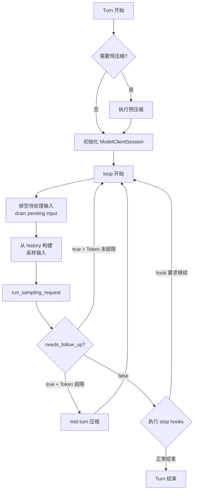
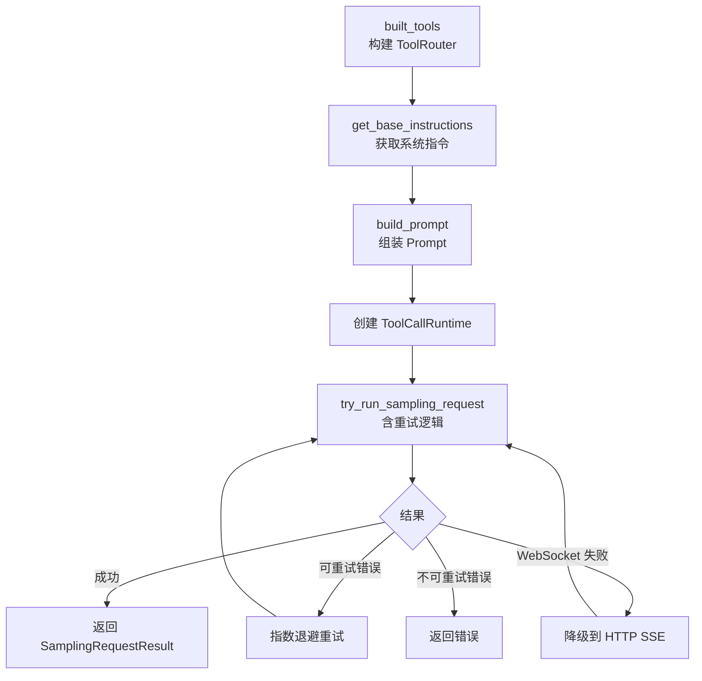

# 03 — Agent Loop 深度剖析

> 本章从源码层面剖析 Codex 的核心控制循环——`run_turn()` 函数。它是 Agent 从接收用户输入到输出最终回复的完整执行引擎，约 500 行代码，管理着采样、工具执行、上下文压缩和 Hook 系统的协调。

## 1. run_turn() 的控制流全景

`run_turn()` 是整个 Agent 的主循环函数。它的核心是一个 `loop {}`，每次迭代完成一轮「采样 → 工具执行 → 检查是否继续」的流程。



**源码**: [codex.rs:5971-6483](https://github.com/openai/codex/blob/main/codex-rs/core/src/codex.rs#L5971-L6483)

### 伪代码总览

```
async fn run_turn(sess, turn_context, input) {
    // ── 预处理 ──
    if should_pre_compact() { run_auto_compact(); }
    let client_session = ModelClientSession::new();  // 整个 Turn 复用

    // ── 主循环 ──
    loop {
        drain_pending_input(&sess);                  // 1. 排空 mailbox / 用户注入
        let input = sess.history.clone_for_prompt(); // 2. 构建采样输入

        let result = run_sampling_request(           // 3. 执行采样
            &sess, &turn_context, input, &client_session
        ).await;
        //   → built_tools() → build_prompt() → stream()
        //   → 处理事件流 → handle_output_item_done() → drain_in_flight()

        let needs_follow_up = result.needs_follow_up // 4. 判断是否继续
            || sess.has_pending_input();
        let token_limit_reached = total_tokens >= compact_limit;

        if needs_follow_up && token_limit_reached {
            run_auto_compact();                      // mid-turn 压缩
            continue;
        }
        if needs_follow_up { continue; }             // 工具结果已入 history

        match run_stop_hooks().await {               // 5. Stop hooks
            Continue => continue,                    // hook 要求继续
            Stop => break,                           // 正常结束
        }
    }
    emit_event(TurnComplete { usage });
}
```

### 关键点

1. **单一 loop**：不是递归，是一个平坦的无限循环，每次迭代 = 一轮 LLM 采样
2. **每次都重新构建工具列表**：`built_tools()` 在每轮采样前调用，因为可用工具可能变化
3. **ModelClientSession 在整个 Turn 内复用**：WebSocket 连接不会每轮重建

## 2. 循环内部：每次迭代做什么

### 2.1 排空待处理输入

```rust
// codex.rs 约 6210-6247
if can_drain_pending_input {
    // 从 mailbox（子 Agent 通信）和 pending_input 中取出排队的消息
    // 追加到 history
}
```

这一步处理两种场景：
- 子 Agent 通过 mailbox 发来的消息
- 用户在 Turn 执行过程中通过 `steer_input()` 注入的新输入

### 2.2 构建采样输入

```rust
// codex.rs 约 6257-6261
let sampling_request_input = sess.state.lock().history.clone_for_prompt();
```

从 `ContextManager` 中克隆当前完整的对话历史，作为本轮 LLM 请求的 `input`。

### 2.3 调用 run_sampling_request()

这是每次迭代的核心——构建 Prompt、发送 LLM 请求、处理流式响应。详见第 3 节。

### 2.4 检查是否继续

```rust
// codex.rs 约 6287-6295
let model_needs_follow_up = sampling_request_output.needs_follow_up;
let has_pending_input = sess.has_pending_input().await;
let needs_follow_up = model_needs_follow_up || has_pending_input;
let token_limit_reached = total_usage_tokens >= auto_compact_limit;
```

| 条件 | 动作 |
|------|------|
| `needs_follow_up = true` + Token 未超限 | 直接 `continue`，进入下一轮采样 |
| `needs_follow_up = true` + Token 超限 | 先执行 mid-turn 压缩，再 `continue` |
| `needs_follow_up = false` | 进入 stop hooks 阶段 |

`needs_follow_up` 为 true 的原因：
- 模型返回了工具调用（最常见）
- 用户在 Turn 中途注入了新输入
- mailbox 中有子 Agent 的消息

### 2.5 Stop Hooks 阶段

当 `needs_follow_up = false` 时，Turn **不会立即结束**，而是先执行 stop hooks：

```rust
// codex.rs 约 6331-6388
let hook_result = run_stop_hooks(&sess, &turn_context).await;
match hook_result {
    StopHookOutcome::Continue => {
        // Hook 要求继续——注入新 prompt，continue 回循环
        stop_hook_active = true;
        continue;
    }
    StopHookOutcome::Stop => {
        // 正常结束
        break;
    }
}
```

> Stop hooks 是用户自定义的收尾逻辑（通过 `config.toml` 中的 hooks 配置）。它们可以在模型给出最终回复后检查结果，决定是否要求 Agent 继续工作。这是一个容易被忽略但很重要的控制流分支。

**源码**: [codex.rs:6331-6388](https://github.com/openai/codex/blob/main/codex-rs/core/src/codex.rs#L6331-L6388)

## 3. run_sampling_request()：单次 LLM 调用

每次循环迭代调用一次 `run_sampling_request()`，它负责从构建请求到处理响应的完整流程：



### 3.1 构建工具路由

```rust
// codex.rs 约 6895-6998
let router = built_tools(sess, turn_context, &input, ...).await?;
```

`built_tools()` 每次采样请求都重新构建 `ToolRouter`，因为：
- MCP 服务器可能新增/移除工具
- Skills/Plugins 可能热重载
- 动态工具可能变化

### 3.2 组装 Prompt

```rust
// codex.rs 约 6719-6749
let prompt = build_prompt(input, router, turn_context, base_instructions);
```

```rust
// client_common.rs:25-45
pub struct Prompt {
    pub input: Vec<ResponseItem>,        // 对话历史
    pub tools: Vec<ToolSpec>,            // 工具定义
    pub parallel_tool_calls: bool,       // 是否允许并行调用
    pub base_instructions: BaseInstructions,  // 系统指令
    pub personality: Option<Personality>,
    pub output_schema: Option<Value>,
}
```

**源码**: [client_common.rs:25-45](https://github.com/openai/codex/blob/main/codex-rs/core/src/client_common.rs#L25-L45), [codex.rs:6719-6749](https://github.com/openai/codex/blob/main/codex-rs/core/src/codex.rs#L6719-L6749)

### 3.3 发送请求与传输层

```rust
// client.rs 约 1434-1482
pub async fn stream(&mut self, prompt, ...) -> Result<ResponseStream> {
    if self.client.responses_websocket_enabled() {
        match self.stream_responses_websocket(...).await? {
            WebsocketStreamOutcome::Stream(stream) => return Ok(stream),
            WebsocketStreamOutcome::FallbackToHttp => {
                self.try_switch_fallback_transport(...);
            }
        }
    }
    self.stream_responses_api(...).await  // HTTP SSE 回退
}
```

传输优先级：WebSocket → HTTP SSE。WebSocket 失败后会自动降级，且在同一 Turn 内记住降级状态，后续请求直接走 HTTP。

**源码**: [client.rs:1434-1482](https://github.com/openai/codex/blob/main/codex-rs/core/src/client.rs#L1434-L1482)

### 3.4 重试逻辑

`try_run_sampling_request()` 包含指数退避重试：

| 错误类型 | 处理 |
|---------|------|
| Stream 断连 | 指数退避重试（最多 5 次） |
| WebSocket 失败 | 降级到 HTTP SSE |
| `ContextWindowExceeded` | 终止，需要压缩 |
| `UsageLimitReached` | 终止，配额用完 |
| 其他 | 终止，返回错误 |

**源码**: [codex.rs:6807-6892](https://github.com/openai/codex/blob/main/codex-rs/core/src/codex.rs#L6807-L6892)

## 4. 流式响应处理：try_run_sampling_request() 内部

LLM 返回的是一个 SSE 事件流。`try_run_sampling_request()` 逐事件处理：

```
Response 事件流:
  ResponseEvent::Created          → 记录 response_id
  ResponseEvent::OutputItemAdded  → 处理新项（reasoning / message / tool_call）
  ResponseEvent::OutputTextDelta  → 流式文本增量 → 发送 AgentMessageDelta 事件
  ResponseEvent::OutputItemDone   → handle_output_item_done() ← 关键函数
  ResponseEvent::Completed        → 返回 SamplingRequestResult
```

### handle_output_item_done()：工具调用的关键判定

这个函数决定了 `needs_follow_up`：

```rust
// stream_events_utils.rs 约 205-259
fn handle_output_item_done(item: ResponseItem) -> OutputItemResult {
    if item.is_tool_call() {
        // 创建工具执行 Future，由 ToolCallRuntime 调度
        OutputItemResult {
            needs_follow_up: true,
            tool_future: Some(tool_call_runtime.handle_tool_call(item)),
            ..
        }
    } else {
        // 纯文本/reasoning，不需要后续
        OutputItemResult {
            needs_follow_up: false,
            tool_future: None,
            ..
        }
    }
}
```

工具调用的 Future 会被收集到 `in_flight` 列表中，在响应流结束后通过 `drain_in_flight()` 统一 await：

```rust
// codex.rs 约 7688-7694
// 响应流完成后
for future in in_flight_futures {
    let result = future.await;
    // 工具输出追加到 history
    sess.record_items(result.to_response_item());
}
```

**源码**: [stream_events_utils.rs](https://github.com/openai/codex/blob/main/codex-rs/core/src/stream_events_utils.rs), [codex.rs:7688-7694](https://github.com/openai/codex/blob/main/codex-rs/core/src/codex.rs#L7688-L7694)

## 5. 自动压缩：Token 窗口管理

对话历史会不断增长，最终超出模型的上下文窗口。Codex 在两个时机触发压缩：

| 时机 | 触发条件 | 行为 |
|------|---------|------|
| **Pre-turn** | Turn 开始前检查上一轮 Token 使用 | 在首次采样前压缩 |
| **Mid-turn** | 循环中 `token_limit_reached && needs_follow_up` | 压缩后继续循环 |

两种压缩实现：

| 方式 | 实现 | 说明 |
|------|------|------|
| **本地压缩** | 调用同一模型生成摘要 | 使用 `SUMMARIZATION_PROMPT` 模板 |
| **远程压缩** | 调用 OpenAI 专用 API | 更高效，服务端支持时优先使用 |

压缩后，`ContextManager` 的 `history_version` 递增，WebSocket 连接重置（因为服务端的 prompt cache 失效）。

**源码**: [compact.rs](https://github.com/openai/codex/blob/main/codex-rs/core/src/compact.rs), [compact_remote.rs](https://github.com/openai/codex/blob/main/codex-rs/core/src/compact_remote.rs)

## 6. TaskKind：不只有 Regular Turn

`run_turn()` 不只处理普通用户对话。它通过 `TaskKind` 区分多种任务类型：

| TaskKind | 触发方式 | 说明 |
|----------|---------|------|
| `Regular` | 用户输入 `Op::UserTurn` | 最常见——用户发消息，Agent 回复 |
| `Compact` | 用户手动 `Op::Compact` | 手动触发上下文压缩 |
| `Review` | 用户 `Op::Review` | 代码审查模式 |
| `Undo` | 用户 `Op::Undo` | 撤销上一次 Turn |
| `UserShell` | 用户 `Op::RunUserShellCommand` | 用户直接执行 shell 命令（不经过 LLM） |
| `GhostSnapshot` | 内部触发 | 后台快照，用于上下文恢复 |

每种 TaskKind 都会创建对应的 `RunningTask`，挂载到 `ActiveTurn` 上：

```rust
pub struct RunningTask {
    pub done: Arc<Notify>,              // 完成信号
    pub kind: TaskKind,                 // 任务类型
    pub cancellation_token: CancellationToken,  // 取消令牌
    pub turn_context: Arc<TurnContext>,  // 配置快照
    pub handle: Arc<AbortOnDropHandle<()>>,  // 异步任务句柄
}
```

**源码**: [state/turn.rs](https://github.com/openai/codex/blob/main/codex-rs/core/src/state/turn.rs), [tasks/mod.rs](https://github.com/openai/codex/blob/main/codex-rs/core/src/tasks/mod.rs)

## 7. 本章小结

| 概念 | 说明 | 源码 |
|------|------|------|
| **run_turn()** | 外层主循环，管理采样-工具-压缩-hooks 的迭代 | [codex.rs:5971-6483](https://github.com/openai/codex/blob/main/codex-rs/core/src/codex.rs#L5971-L6483) |
| **run_sampling_request()** | 单次采样：构建工具 → 组装 Prompt → 发送请求 → 重试 | [codex.rs:6760-6893](https://github.com/openai/codex/blob/main/codex-rs/core/src/codex.rs#L6760-L6893) |
| **try_run_sampling_request()** | 流式响应处理 + 工具调用判定 + drain_in_flight | [codex.rs:7552+](https://github.com/openai/codex/blob/main/codex-rs/core/src/codex.rs#L7552) |
| **handle_output_item_done()** | 判定 needs_follow_up，创建工具执行 Future | [stream_events_utils.rs](https://github.com/openai/codex/blob/main/codex-rs/core/src/stream_events_utils.rs) |
| **Stop Hooks** | Turn 收尾阶段，hooks 可阻止结束并注入新 prompt | [codex.rs:6331-6388](https://github.com/openai/codex/blob/main/codex-rs/core/src/codex.rs#L6331-L6388) |
| **TaskKind** | 6 种任务类型：Regular / Compact / Review / Undo / UserShell / GhostSnapshot | [tasks/mod.rs](https://github.com/openai/codex/blob/main/codex-rs/core/src/tasks/mod.rs) |

---

> **源码版本说明**: 本文基于 [openai/codex](https://github.com/openai/codex) 主分支分析。

---

**上一章**: [02 — 提示词与工具解析](02-prompt-and-tools.md) | **下一章**: [04 — 工具系统设计](04-tool-system.md)
