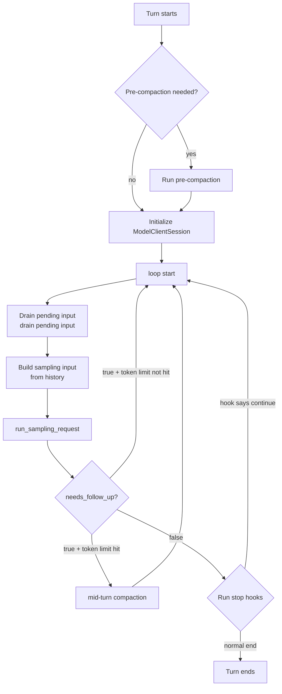
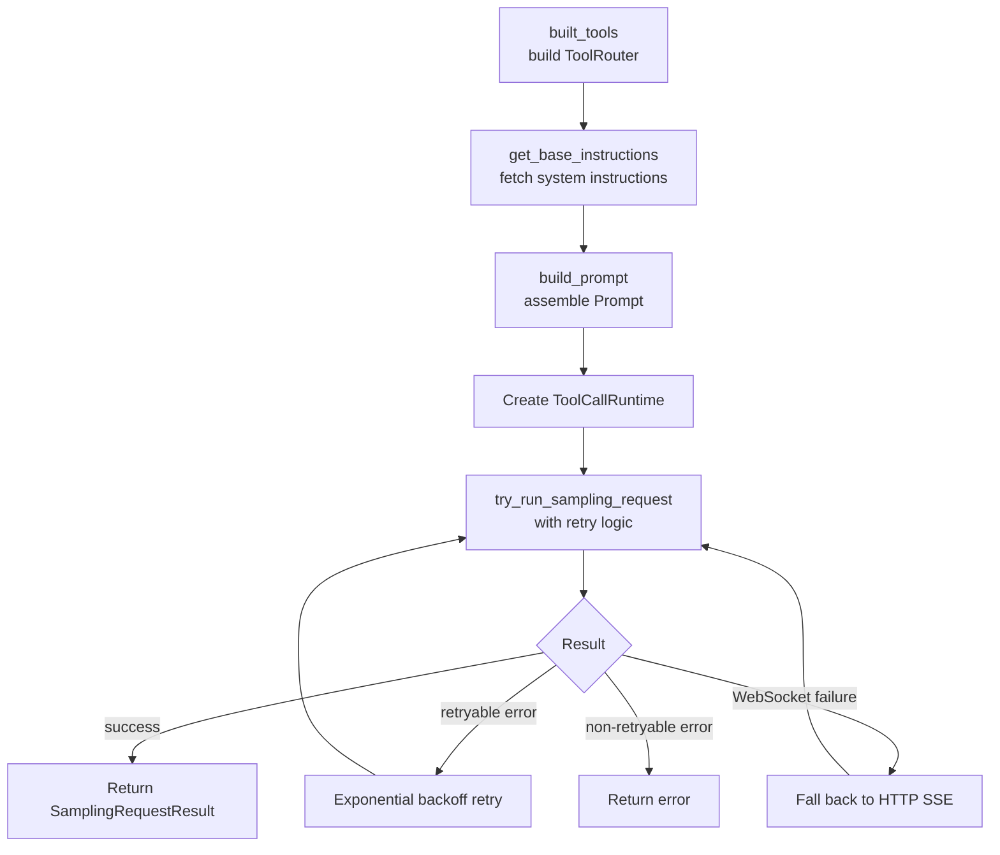

> **Language**: **English** · [中文](03-agent-loop.zh.md)

# 03 — Agent Loop deep dive

> This chapter dissects Codex's core control loop — the `run_turn()` function — at the source level. It is the complete execution engine that takes the agent from "user input received" to "final response emitted". At roughly 500 lines of code, it coordinates sampling, tool execution, context compaction, and the hook system.

## 1. The big picture of run_turn()

`run_turn()` is the main loop function for the entire agent. At its heart sits a `loop {}`, and each iteration completes one round of "sample → run tools → decide whether to continue".



**Source**: [codex.rs:6011+](https://github.com/openai/codex/blob/main/codex-rs/core/src/codex.rs#L6011)

### Pseudocode overview

```
async fn run_turn(sess, turn_context, input) {
    // ── Pre-processing ──
    if should_pre_compact() { run_auto_compact(); }
    let client_session = ModelClientSession::new();  // reused across the whole Turn

    // ── Main loop ──
    loop {
        drain_pending_input(&sess);                  // 1. drain mailbox / user-injected input
        let input = sess.history.clone_for_prompt(); // 2. build sampling input

        let result = run_sampling_request(           // 3. run sampling
            &sess, &turn_context, input, &client_session
        ).await;
        //   → built_tools() → build_prompt() → stream()
        //   → process event stream → handle_output_item_done() → drain_in_flight()

        let needs_follow_up = result.needs_follow_up // 4. decide whether to continue
            || sess.has_pending_input();
        let token_limit_reached = total_tokens >= compact_limit;

        if needs_follow_up && token_limit_reached {
            run_auto_compact();                      // mid-turn compaction
            continue;
        }
        if needs_follow_up { continue; }             // tool results already in history

        match run_stop_hooks().await {               // 5. stop hooks
            Continue => continue,                    // hook asks to continue
            Stop => break,                           // normal end
        }
    }
    emit_event(TurnComplete { usage });
}
```

### Key takeaways

1. **A single loop**: this is not recursion — it is a flat infinite loop, where each iteration equals one round of LLM sampling.
2. **Tool list is rebuilt every iteration**: `built_tools()` is called before every sampling call, because the set of available tools may change.
3. **ModelClientSession is reused for the entire Turn**: the WebSocket connection is not rebuilt every iteration.

## 2. Inside the loop: what each iteration does

### 2.1 Drain pending input

```rust
// codex.rs — drain pending input
if can_drain_pending_input {
    // Pull queued messages from the mailbox (sub-agent communication) and pending_input,
    // then append them to history.
}
```

**Source**: [codex.rs:6240-6254](https://github.com/openai/codex/blob/main/codex-rs/core/src/codex.rs#L6240-L6254)

This step handles two scenarios:
- Messages coming in from a sub-agent through the mailbox
- New input the user injected mid-Turn via `steer_input()`

### 2.2 Build the sampling input

```rust
let sampling_request_input = sess.state.lock().history.clone_for_prompt();
```

**Source**: [codex.rs:6298-6301](https://github.com/openai/codex/blob/main/codex-rs/core/src/codex.rs#L6298-L6301)

We clone the full conversation history out of the `ContextManager` and use it as the `input` for this round's LLM request.

### 2.3 Call run_sampling_request()

This is the core of each iteration — building the Prompt, sending the LLM request, and processing the streaming response. See section 3 for details.

### 2.4 Decide whether to continue

```rust
let model_needs_follow_up = sampling_request_output.needs_follow_up;
let has_pending_input = sess.has_pending_input().await;
let needs_follow_up = model_needs_follow_up || has_pending_input;
let token_limit_reached = total_usage_tokens >= auto_compact_limit;
```

**Source**: [codex.rs:6328-6371](https://github.com/openai/codex/blob/main/codex-rs/core/src/codex.rs#L6328-L6371)

| Condition | Action |
|-----------|--------|
| `needs_follow_up = true` + token limit not reached | `continue` directly into the next sampling round |
| `needs_follow_up = true` + token limit reached | Run mid-turn compaction first, then `continue` |
| `needs_follow_up = false` | Move on to the stop-hooks phase |

Why `needs_follow_up` becomes true:
- The model returned a tool call (most common)
- The user injected new input mid-Turn
- The mailbox has a message from a sub-agent

### 2.5 The stop-hooks phase

When `needs_follow_up = false`, the Turn does **not** end immediately — it first runs the stop hooks:

```rust
let hook_result = run_stop_hooks(&sess, &turn_context).await;
match hook_result {
    StopHookOutcome::Continue => {
        // Hook asks to continue — inject a new prompt and continue the loop.
        stop_hook_active = true;
        continue;
    }
    StopHookOutcome::Stop => {
        // Normal end.
        break;
    }
}
```

> Stop hooks are user-defined wrap-up logic (configured via `hooks` in `config.toml`). They can inspect the result after the model has produced its final reply and decide whether to ask the agent to keep working. This is an easily overlooked but important branch of the control flow.

**Source**: [codex.rs:6373-6415](https://github.com/openai/codex/blob/main/codex-rs/core/src/codex.rs#L6373-L6415)

## 3. run_sampling_request(): a single LLM call

Every loop iteration calls `run_sampling_request()` once. It owns the full pipeline from building the request to processing the response:



### 3.1 Build the tool router

```rust
let router = built_tools(sess, turn_context, &input, ...).await?;
```

**Source**: [codex.rs:6935-7004](https://github.com/openai/codex/blob/main/codex-rs/core/src/codex.rs#L6935-L7004)

`built_tools()` rebuilds the `ToolRouter` for every sampling call because:
- MCP servers may add or remove tools
- Skills/Plugins may hot-reload
- Dynamic tools may change

### 3.2 Assemble the Prompt

```rust
let prompt = build_prompt(input, router, turn_context, base_instructions);
```

**Source**: [codex.rs:6719-6749](https://github.com/openai/codex/blob/main/codex-rs/core/src/codex.rs#L6719-L6749)

```rust
// client_common.rs:25-45
pub struct Prompt {
    pub input: Vec<ResponseItem>,        // conversation history
    pub tools: Vec<ToolSpec>,            // tool definitions
    pub parallel_tool_calls: bool,       // whether parallel calls are allowed
    pub base_instructions: BaseInstructions,  // system instructions
    pub personality: Option<Personality>,
    pub output_schema: Option<Value>,
}
```

**Source**: [client_common.rs:25-45](https://github.com/openai/codex/blob/main/codex-rs/core/src/client_common.rs#L25-L45), [codex.rs:6759+](https://github.com/openai/codex/blob/main/codex-rs/core/src/codex.rs#L6759)

### 3.3 Sending the request and the transport layer

```rust
pub async fn stream(&mut self, prompt, ...) -> Result<ResponseStream> {
    if self.client.responses_websocket_enabled() {
        match self.stream_responses_websocket(...).await? {
            WebsocketStreamOutcome::Stream(stream) => return Ok(stream),
            WebsocketStreamOutcome::FallbackToHttp => {
                self.try_switch_fallback_transport(...);
            }
        }
    }
    self.stream_responses_api(...).await  // HTTP SSE fallback
}
```

Transport priority: WebSocket → HTTP SSE. After a WebSocket failure the client falls back automatically and remembers the fallback state for the rest of the Turn, so subsequent requests go straight to HTTP.

**Source**: [client.rs:1434-1482](https://github.com/openai/codex/blob/main/codex-rs/core/src/client.rs#L1434-L1482)

### 3.4 Retry logic

`try_run_sampling_request()` includes exponential-backoff retry:

| Error type | Behavior |
|------------|----------|
| Stream disconnect | Exponential-backoff retry (up to 5 times) |
| WebSocket failure | Fall back to HTTP SSE |
| `ContextWindowExceeded` | Abort — compaction needed |
| `UsageLimitReached` | Abort — quota exhausted |
| Other | Abort and return the error |

**Source**: [codex.rs:6800-6933](https://github.com/openai/codex/blob/main/codex-rs/core/src/codex.rs#L6800-L6933)

## 4. Streaming response handling: inside try_run_sampling_request()

The LLM returns an SSE event stream. `try_run_sampling_request()` processes events one by one:

```
Response event stream:
  ResponseEvent::Created          → record response_id
  ResponseEvent::OutputItemAdded  → handle the new item (reasoning / message / tool_call)
  ResponseEvent::OutputTextDelta  → streaming text delta → emit AgentMessageDelta event
  ResponseEvent::OutputItemDone   → handle_output_item_done() ← key function
  ResponseEvent::Completed        → return SamplingRequestResult
```

### handle_output_item_done(): the key tool-call decision

This function decides `needs_follow_up`:

```rust
fn handle_output_item_done(item: ResponseItem) -> OutputItemResult {
    if item.is_tool_call() {
        // Build a tool-execution Future, scheduled by ToolCallRuntime.
        OutputItemResult {
            needs_follow_up: true,
            tool_future: Some(tool_call_runtime.handle_tool_call(item)),
            ..
        }
    } else {
        // Plain text / reasoning — no follow-up needed.
        OutputItemResult {
            needs_follow_up: false,
            tool_future: None,
            ..
        }
    }
}
```

Tool-call Futures are collected into the `in_flight` list and awaited together via `drain_in_flight()` after the response stream ends:

```rust
// After the response stream completes
for future in in_flight_futures {
    let result = future.await;
    // Append tool output to history.
    sess.record_items(result.to_response_item());
}
```

**Source**: [stream_events_utils.rs](https://github.com/openai/codex/blob/main/codex-rs/core/src/stream_events_utils.rs), [codex.rs:7565-7570](https://github.com/openai/codex/blob/main/codex-rs/core/src/codex.rs#L7565-L7570)

## 5. Auto-compaction: managing the token window

Conversation history grows continuously and eventually exceeds the model's context window. Codex triggers compaction at two points:

| Timing | Trigger condition | Behavior |
|--------|------------------|----------|
| **Pre-turn** | Check token usage from the last round before the Turn starts | Compact before the first sampling call |
| **Mid-turn** | `token_limit_reached && needs_follow_up` mid-loop | Compact, then keep looping |

There are two compaction implementations:

| Approach | Implementation | Notes |
|----------|----------------|-------|
| **Local compaction** | Call the same model to produce a summary | Uses the `SUMMARIZATION_PROMPT` template |
| **Remote compaction** | Call a dedicated OpenAI API | More efficient; preferred when the server supports it |

After compaction, the `ContextManager`'s `history_version` is bumped and the WebSocket connection is reset (because the server-side prompt cache is invalidated).

**Source**: [compact.rs](https://github.com/openai/codex/blob/main/codex-rs/core/src/compact.rs), [compact_remote.rs](https://github.com/openai/codex/blob/main/codex-rs/core/src/compact_remote.rs)

## 6. TaskKind: more than just a regular Turn

`run_turn()` does not only handle ordinary user conversation. It uses `TaskKind` to distinguish several task types:

| TaskKind | Trigger | Notes |
|----------|---------|-------|
| `Regular` | User-issued `Op::UserTurn` | The most common — user sends a message, agent replies |
| `Compact` | User-issued `Op::Compact` | Manually trigger context compaction |
| `Review` | User-issued `Op::Review` | Code-review mode |
| `Undo` | User-issued `Op::Undo` | Undo the previous Turn |
| `UserShell` | User-issued `Op::RunUserShellCommand` | User runs a shell command directly (LLM is bypassed) |
| `GhostSnapshot` | Internally triggered | Background snapshot used for context recovery |

Each TaskKind creates a corresponding `RunningTask`, attached to the `ActiveTurn`:

```rust
pub struct RunningTask {
    pub done: Arc<Notify>,              // completion signal
    pub kind: TaskKind,                 // task type
    pub cancellation_token: CancellationToken,  // cancellation token
    pub turn_context: Arc<TurnContext>,  // configuration snapshot
    pub handle: Arc<AbortOnDropHandle<()>>,  // async task handle
}
```

> **Tip — `Arc<T>`**: `Arc` (Atomic Reference Counted) is Rust's atomic reference-counted smart pointer, allowing multiple threads to share the same data safely. The data is reclaimed only when the last `Arc` reference is dropped. Several fields of `RunningTask` are wrapped in `Arc` because they need to be shared across multiple concurrent contexts — async tasks, cancellation logic, and so on.

**Source**: [state/turn.rs](https://github.com/openai/codex/blob/main/codex-rs/core/src/state/turn.rs), [tasks/mod.rs](https://github.com/openai/codex/blob/main/codex-rs/core/src/tasks/mod.rs)

## 7. Chapter summary

| Concept | Description | Source |
|---------|-------------|--------|
| **run_turn()** | Outer main loop; manages iterations of sample-tool-compact-hooks | [codex.rs:6011+](https://github.com/openai/codex/blob/main/codex-rs/core/src/codex.rs#L6011) |
| **run_sampling_request()** | A single sampling round: build tools → assemble Prompt → send request → retry | [codex.rs:6800+](https://github.com/openai/codex/blob/main/codex-rs/core/src/codex.rs#L6800) |
| **try_run_sampling_request()** | Streaming response handling + tool-call decision + drain_in_flight | [codex.rs:7592+](https://github.com/openai/codex/blob/main/codex-rs/core/src/codex.rs#L7592) |
| **handle_output_item_done()** | Decides needs_follow_up; creates the tool-execution Future | [stream_events_utils.rs](https://github.com/openai/codex/blob/main/codex-rs/core/src/stream_events_utils.rs) |
| **Stop Hooks** | Turn wrap-up phase; hooks can prevent termination and inject a new prompt | [codex.rs:6373-6415](https://github.com/openai/codex/blob/main/codex-rs/core/src/codex.rs#L6373-L6415) |
| **TaskKind** | 6 task types: Regular / Compact / Review / Undo / UserShell / GhostSnapshot | [tasks/mod.rs](https://github.com/openai/codex/blob/main/codex-rs/core/src/tasks/mod.rs) |

---

**Previous**: [02 — Prompt and tool resolution](02-prompt-and-tools.md) | **Next**: [04 — Tool system design](04-tool-system.md)
