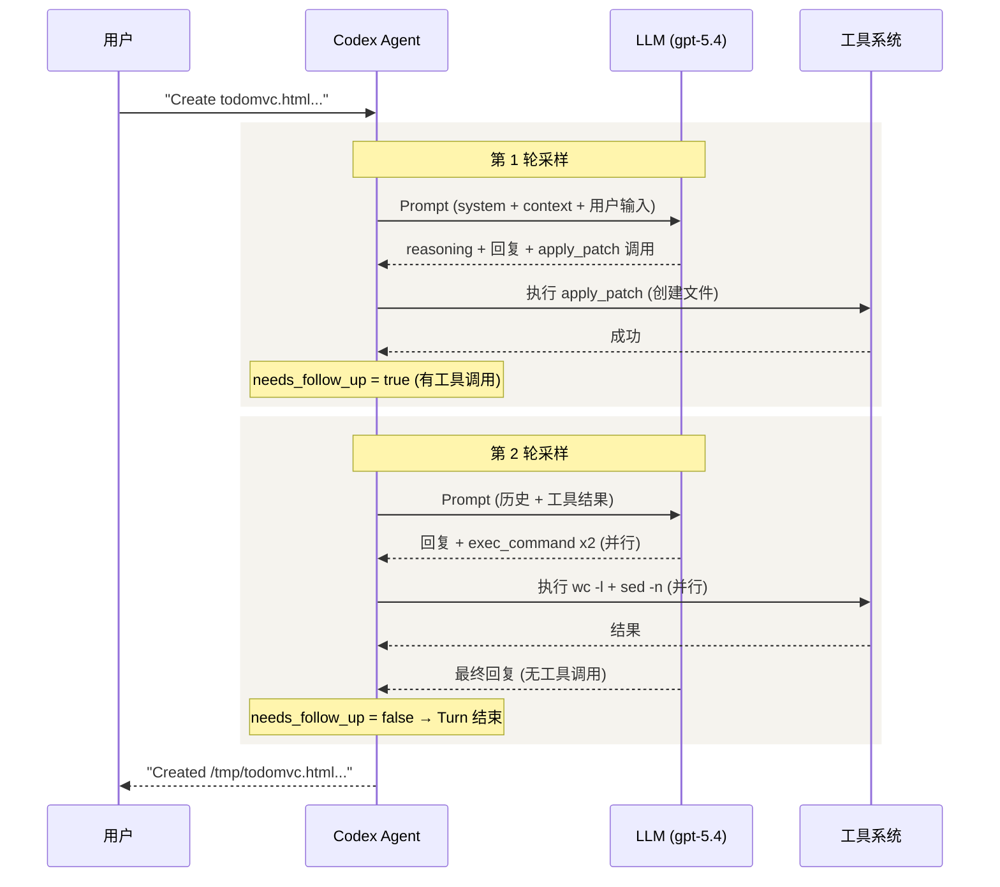
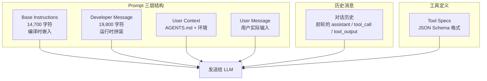
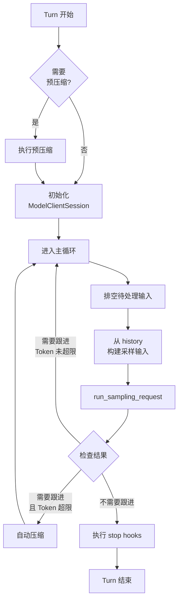
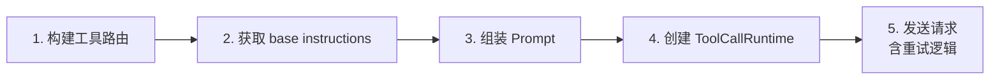

# 03 — Agent Loop 深度剖析

> 本章以一个真实的 TODOMVC 任务为主线，逐步揭示 Codex Agent 的核心循环：从用户输入到 Prompt 构建、模型采样、工具调用，再到最终回复的完整生命周期。

## 1. 一个真实任务的完整旅程

我们用 Codex 执行了一个简单任务：`"Create a file called todomvc.html with a simple TODOMVC page using HTML, CSS and JavaScript"`。以下是抓取到的完整交互过程（共 13 个 ResponseItem）：

```
 步骤  类型                   内容摘要
 ──── ────────────────────── ──────────────────────────────
 [00] developer message      permissions + skills + plugins 指令 (19,790 字符)
 [01] user message           AGENTS.md 注入 + 环境上下文 (3,650 字符)
 [02] user message           "Create a file called todomvc.html..." (用户输入)
 [03] reasoning              模型内部思考（不可见）
 [04] assistant message      "我会直接创建文件..."（计划说明）
 [05] custom_tool_call       apply_patch — 创建 /tmp/todomvc.html
 [06] tool_output            "Success. Updated files: A /tmp/todomvc.html"
 [07] assistant message      "文件已写好，做一个快速校验..."
 [08] function_call          exec_command: wc -l（并行调用 1）
 [09] function_call          exec_command: sed -n '1,20p'（并行调用 2）
 [10] function_output        行数：129 行
 [11] function_output        文件头部 20 行内容
 [12] assistant message      "Created /tmp/todomvc.html..."（最终回复）
```

这个看似简单的任务，背后经历了 **2 轮采样循环**：



## 2. Prompt 的三层结构

每次采样请求发给 LLM 的 Prompt 由三层内容组成：

### 2.1 第一层：Base Instructions（系统人格，约 14,700 字符）

这是 Codex 的「人格底座」，定义了 Agent 的身份、价值观和行为准则。完整内容编译时从 markdown 文件嵌入二进制。

> **知识点 — `include_str!`**: Rust 的 `include_str!("path")` 宏在编译时将文件内容嵌入为字符串常量。Codex 用它把 markdown 模板编译进二进制，避免运行时读取文件。

**主要内容**（摘自真实抓取）：

| 模块 | 内容 | 字符数 |
|------|------|--------|
| 身份与人格 | "You are Codex, a coding agent based on GPT-5" + 价值观（Clarity / Pragmatism / Rigor） | ~1,200 |
| 通用指南 | 搜索优先用 `rg`、并行工具调用、编辑约束 | ~2,500 |
| 前端任务 | 避免 "AI slop"、排版/配色/动画指南 | ~800 |
| 用户交互 | commentary vs final 两个输出通道、格式规则 | ~3,000 |
| 自主性 | "Persist until the task is fully handled end-to-end" | ~600 |
| 工具使用 | apply_patch 优先、不用 Python 读写文件 | ~1,500 |
| Git 规则 | 不 revert 用户修改、不用交互式 git | ~800 |

**源码**: base instructions 模板位于 [protocol/src/prompts/base_instructions/default.md](https://github.com/openai/codex/blob/main/codex-rs/protocol/src/prompts/base_instructions/default.md)，通过 `include_str!` 嵌入。

### 2.2 第二层：Developer Message（运行时注入，约 19,800 字符）

以 `developer` 角色的消息发送，包含 5 个独立的 `input_text` 块：

| 块 | 标签 | 内容 | 字符数 |
|----|------|------|--------|
| 1 | `<permissions instructions>` | 沙箱规则、命令审批、已批准的 prefix_rules | ~13,000 |
| 2 | `<collaboration_mode>` | 当前协作模式（Default / Plan） | ~500 |
| 3 | `<apps_instructions>` | Apps (Connectors) 使用说明 | ~400 |
| 4 | `<skills_instructions>` | 可用 Skills 列表和使用规则 | ~4,500 |
| 5 | `<plugins_instructions>` | 已安装 Plugins 列表和触发规则 | ~600 |

这些内容在每次 Turn 开始时动态拼装，反映当前会话的实际配置。

### 2.3 第三层：User Context（上下文注入）

以 `user` 角色的消息发送，包含两部分：

1. **AGENTS.md 注入**：将项目根目录的 `AGENTS.md`（即 `CLAUDE.md`）内容包装在 `<INSTRUCTIONS>` 标签中注入
2. **环境上下文**：工作目录、shell 类型、日期、时区等

```xml
<environment_context>
  <cwd>/Users/zoujie.wu/workspace/learn-codex</cwd>
  <shell>zsh</shell>
  <current_date>2026-04-12</current_date>
  <timezone>Asia/Singapore</timezone>
</environment_context>
```

### Prompt 组装全图



**源码**: Prompt 结构体定义在 [core/src/client_common.rs:25-45](https://github.com/openai/codex/blob/main/codex-rs/core/src/client_common.rs#L25-L45)，组装逻辑在 [codex.rs:6719-6749](https://github.com/openai/codex/blob/main/codex-rs/core/src/codex.rs#L6719-L6749)。

## 3. Turn 主循环：`run_turn()`

一个 Turn 是用户输入到 Agent 最终回复的完整周期。核心函数 `run_turn()` 约 500 行，结构如下：



### 3.1 关键判断逻辑

Turn 循环的核心在于 `needs_follow_up` 的判定：

```rust
// codex.rs 约第 6293 行
let model_needs_follow_up = sampling_request_output.needs_follow_up;
let has_pending_input = sess.has_pending_input().await;
let needs_follow_up = model_needs_follow_up || has_pending_input;
```

| 条件 | 含义 | 动作 |
|------|------|------|
| `model_needs_follow_up = true` | 模型返回了工具调用 | 继续循环，执行工具后再采样 |
| `has_pending_input = true` | 用户在 Turn 中途注入了新输入 | 继续循环，带上新输入 |
| 两者都为 false | 模型给出了最终回复 | 退出循环，Turn 结束 |
| `token_limit_reached = true` | Token 使用超过自动压缩阈值 | 先执行压缩，再继续循环 |

**源码**: [codex.rs:5971-6483](https://github.com/openai/codex/blob/main/codex-rs/core/src/codex.rs#L5971-L6483)

### 3.2 回到 TODOMVC 例子

对照真实数据，这个任务的 Turn 主循环执行了 **2 次迭代**：

**迭代 1**：
- 输入：developer message + user context + 用户输入
- 模型返回：reasoning + assistant message + `apply_patch` 工具调用
- `needs_follow_up = true`（有工具调用）→ 继续循环

**迭代 2**：
- 输入：前一轮完整历史 + 工具执行结果
- 模型返回：assistant message + `exec_command` x2（并行）→ 执行后模型给出最终回复
- `needs_follow_up = false`（无工具调用）→ Turn 结束

## 4. 采样请求：`run_sampling_request()`

每次循环迭代调用 `run_sampling_request()`，它负责构建完整请求并发送给 LLM。

### 4.1 五步流程



**Step 1 — 构建工具路由** `built_tools()`：每次采样请求都重新构建 `ToolRouter`，动态加载当前可用的 MCP 工具、Skills、Apps。

**Step 2 — 获取 base instructions**：从 Session 获取系统指令（即第 2.1 节的内容）。

**Step 3 — 组装 Prompt**：将 input（历史消息）、tools（工具定义）、base_instructions 打包成 `Prompt` 结构体。

```rust
// Prompt 结构体 (client_common.rs:25-45)
pub struct Prompt {
    pub input: Vec<ResponseItem>,           // 对话历史 + 当前输入
    pub(crate) tools: Vec<ToolSpec>,        // 工具 JSON Schema
    pub(crate) parallel_tool_calls: bool,   // 是否允许并行工具调用
    pub base_instructions: BaseInstructions, // 系统指令
    pub personality: Option<Personality>,    // 人格覆盖
    pub output_schema: Option<Value>,       // 结构化输出 schema
}
```

**Step 4 — 创建 ToolCallRuntime**：包装了工具分发和并行执行能力。

**Step 5 — 发送请求**：包含重试逻辑和传输降级（WebSocket → HTTP SSE）。

**源码**: [codex.rs:6760-6893](https://github.com/openai/codex/blob/main/codex-rs/core/src/codex.rs#L6760-L6893)

### 4.2 传输层：WebSocket 优先，HTTP SSE 回退

Codex 的 API 通信优先使用 WebSocket，失败后回退到 HTTP SSE：

```
try_run_sampling_request()
  → client_session.stream()
    ├─ 尝试 WebSocket 流式连接（低延迟，支持连接复用）
    └─ 失败？回退到 HTTP SSE（Server-Sent Events）
      └─ 构建 ResponsesApiRequest
        ├─ instructions: base_instructions.text
        ├─ input: prompt.get_formatted_input()
        ├─ tools: create_tools_json_for_responses_api()
        ├─ model: "gpt-5.4"
        ├─ stream: true
        └─ reasoning, service_tier, prompt_cache_key...
```

**源码**: 流式传输在 [core/src/client.rs:1434-1482](https://github.com/openai/codex/blob/main/codex-rs/core/src/client.rs#L1434-L1482)，API 请求构建在同文件约第 819-888 行。

## 5. 工具调用的生命周期

### 5.1 从模型输出到工具执行

当 LLM 返回一个工具调用时，处理链是：

```
模型返回 ResponseEvent::OutputItemDone
  → handle_output_item_done()
    → 检测到 FunctionCall / CustomToolCall
      → 创建工具执行 Future
      → 设置 needs_follow_up = true
        → ToolCallRuntime::handle_tool_call()
          → ToolRouter::dispatch_tool_call()
            → 路由到具体 Handler
              → 审批检查 → 沙箱执行 → 返回结果
```

### 5.2 TODOMVC 任务中的两种工具

**`apply_patch`（自定义工具）**：

Codex 创建文件使用的是 `apply_patch`，它接收类似 unified diff 的补丁格式：

```
*** Begin Patch
*** Add File: /tmp/todomvc.html
+<!DOCTYPE html>
+<html lang="en">
+<head>
+  <meta charset="UTF-8">
+  ...
```

返回结果：`"Success. Updated files: A /tmp/todomvc.html"`

**`exec_command`（函数调用）**：

Codex 验证文件使用的是 `exec_command`（shell 命令执行），并且是**两个并行调用**：

```json
// 调用 1: 统计行数
{"cmd": "wc -l /tmp/todomvc.html", "workdir": "..."}

// 调用 2: 查看文件头部
{"cmd": "sed -n '1,20p' /tmp/todomvc.html", "workdir": "..."}
```

> **知识点 — 并行工具调用**: Codex 支持模型在单次回复中返回多个工具调用，这些调用通过 `RwLock` 并行执行。并行安全的工具（如只读命令）获取读锁，需要串行执行的工具获取写锁。

### 5.3 Codex 注册的工具清单

Codex 注册了丰富的工具类型，分为两大类：

**原生工具**（通过 Responses API 的 `tools` 参数传递）：

| 工具名 | 类型 | 说明 |
|--------|------|------|
| `exec_command` | function | 执行 shell 命令 |
| `apply_patch` | custom | 创建/修改文件（unified diff 格式） |
| `tool_search` | custom | 搜索可用工具（延迟加载） |
| `request_user_input` | custom | 向用户请求输入（仅 Plan 模式） |
| `request_permissions` | custom | 请求权限提升 |
| `list_dir` | function | 列出目录内容 |
| `view_image` | function | 查看图片 |

**可发现工具**（通过 `tool_search` 延迟加载）：

| 工具名 | 说明 |
|--------|------|
| MCP 工具 | 来自 MCP 服务器的外部工具 |
| App 工具 | 来自 Connectors/Apps 的工具 |
| Agent 工具 | spawn_agent, send_message 等多 Agent 协调工具 |

**源码**: 工具注册逻辑在 [core/src/tools/spec.rs](https://github.com/openai/codex/blob/main/codex-rs/core/src/tools/spec.rs)，路由在 [core/src/tools/router.rs](https://github.com/openai/codex/blob/main/codex-rs/core/src/tools/router.rs)。

## 6. Turn Context：每轮快照

前面的章节提过 `TurnContext`，这里通过真实数据展示它包含什么：

```json
{
  "turn_id": "019d809b-e419-7d60-bff7-4388ed0557b4",
  "model": "gpt-5.4",
  "effort": "high",
  "approval_policy": "on-request",
  "sandbox_policy": {
    "type": "workspace-write",
    "writable_roots": ["/Users/zoujie.wu/.codex/memories"],
    "network_access": false
  },
  "personality": "pragmatic",
  "collaboration_mode": { "mode": "default" },
  "cwd": "/Users/zoujie.wu/workspace/learn-codex",
  "current_date": "2026-04-12",
  "timezone": "Asia/Singapore"
}
```

每个 Turn 开始时，这些配置被冻结为一份快照。即使用户在 Turn 执行过程中修改了全局配置，当前 Turn 仍使用快照中的值，保证一致性。

**源码**: [codex.rs:864-911](https://github.com/openai/codex/blob/main/codex-rs/core/src/codex.rs#L864-L911)

## 7. 自动压缩：Token 窗口管理

当对话历史的 Token 使用量超过模型上下文窗口的一定比例时，Codex 会自动触发**压缩**（Compaction），将历史消息摘要化以释放 Token 空间。

```
Turn 主循环中：
  if token_limit_reached && needs_follow_up {
    → run_auto_compact()  // 压缩历史
    → 重置 WebSocket 连接
    → continue  // 继续循环
  }
```

压缩有两种实现：

| 类型 | 方式 | 说明 |
|------|------|------|
| **本地压缩** | 调用同一模型生成摘要 | 使用 `SUMMARIZATION_PROMPT` 模板 |
| **远程压缩** | 调用 OpenAI 专用压缩 API | 更高效，但依赖服务端支持 |

压缩触发时机有两种：
- **Pre-turn**（Turn 开始前）：检查上一轮的 Token 使用，提前压缩
- **Mid-turn**（Turn 循环中）：当前轮 Token 超限时即时压缩

**源码**: 压缩逻辑在 [core/src/compact.rs](https://github.com/openai/codex/blob/main/codex-rs/core/src/compact.rs)，远程压缩在 [core/src/compact_remote.rs](https://github.com/openai/codex/blob/main/codex-rs/core/src/compact_remote.rs)。

## 8. 本章小结

| 概念 | 说明 | 源码位置 |
|------|------|---------|
| **run_turn()** | Turn 主循环，管理采样-工具-压缩的迭代 | [codex.rs:5971-6483](https://github.com/openai/codex/blob/main/codex-rs/core/src/codex.rs#L5971-L6483) |
| **run_sampling_request()** | 单次采样：构建工具→组装Prompt→发送请求 | [codex.rs:6760-6893](https://github.com/openai/codex/blob/main/codex-rs/core/src/codex.rs#L6760-L6893) |
| **needs_follow_up** | 循环判定：有工具调用或待处理输入则继续 | [codex.rs:6293](https://github.com/openai/codex/blob/main/codex-rs/core/src/codex.rs#L6293) |
| **Prompt** | 三层结构：base_instructions + developer + user | [client_common.rs:25-45](https://github.com/openai/codex/blob/main/codex-rs/core/src/client_common.rs#L25-L45) |
| **ToolRouter** | 每次采样重建，动态加载可用工具 | [tools/router.rs](https://github.com/openai/codex/blob/main/codex-rs/core/src/tools/router.rs) |
| **自动压缩** | Token 超限时摘要化历史，释放窗口空间 | [compact.rs](https://github.com/openai/codex/blob/main/codex-rs/core/src/compact.rs) |

---

> **源码版本说明**: 本文基于 [openai/codex](https://github.com/openai/codex) 主分支分析，源码本地路径为 `/Users/zoujie.wu/workspace/codex-source/`。真实任务数据通过 `codex debug prompt-input` + rollout JSONL 抓取。

---

**上一章**: [02 — 提示词与工具解析](02-prompt-and-tools.md) | **下一章**: [04 — 工具系统设计](04-tool-system.md)
