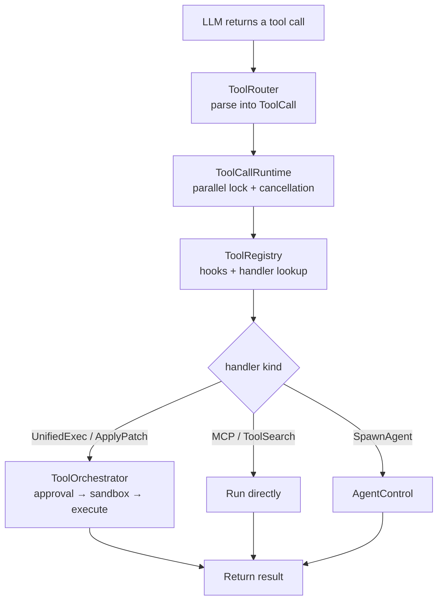
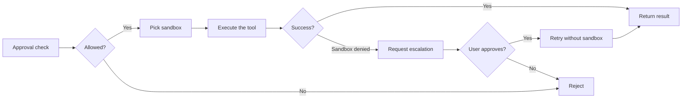

> **Language**: **English** · [中文](04-tool-system.zh.md)

# 04 — Tool System Design

> Tools are the only channel through which the agent interacts with the outside world. This chapter dissects how Codex's tool system carries a tool call from model output all the way to actual execution — covering routing/dispatch, parallelism control, the approval flow, and sandbox isolation.

## 1. Overall architecture and pseudocode

A tool call goes through the following pipeline from the moment the LLM returns it until execution finishes:

```
async fn handle_tool_call(response_item: ResponseItem) {
    // 1. Parse: turn the raw model output into a unified ToolCall
    let call = ToolRouter::build_tool_call(response_item);

    // 2. Parallelism control: pick the lock kind based on tool_supports_parallel()
    let _lock = if router.tool_supports_parallel(&call.name) {
        parallel_execution.read().await     // shared lock — multiple in parallel
    } else {
        parallel_execution.write().await    // exclusive lock — serialized
    };

    // 3. Dispatch: look up the handler, run hooks
    let handler = registry.lookup(&call.name);
    run_pre_tool_use_hooks();               // can block execution
    let result = handler.handle(call);      // path differs per handler:
    //   ├── UnifiedExecHandler  → ToolOrchestrator (approval + sandbox)
    //   ├── ApplyPatchHandler   → ToolOrchestrator (approval + sandbox)
    //   ├── McpHandler          → run directly (skips Orchestrator)
    //   ├── ToolSearchHandler   → run directly
    //   └── SpawnAgentHandler   → AgentControl
    run_post_tool_use_hooks();              // can rewrite the output

    // 4. Return the result, append to the conversation history
    return result.to_response_item();
}
```

**Source**: [tools/parallel.rs](https://github.com/openai/codex/blob/main/codex-rs/core/src/tools/parallel.rs) (parallelism control and dispatch), [tools/registry.rs](https://github.com/openai/codex/blob/main/codex-rs/core/src/tools/registry.rs) (handler registration and hooks), [tools/orchestrator.rs](https://github.com/openai/codex/blob/main/codex-rs/core/src/tools/orchestrator.rs) (approval → sandbox → execute)

Key insight: **not every tool goes through approval and the sandbox**. Only tools that touch the filesystem or spawn processes (`exec_command`, `apply_patch`, etc.) flow through `ToolOrchestrator`'s approval → sandbox → execute pipeline. MCP tools, ToolSearch, and friends finish entirely inside their handler.



**Source**: the tool module lives under [core/src/tools/](https://github.com/openai/codex/blob/main/codex-rs/core/src/tools/).

## 2. ToolRouter: parsing and routing

On every sampling request Codex **rebuilds** the ToolRouter, because the set of available tools can change between turns — MCP servers may hot-reload, Skills may change, and so on.

### Parsing: 4 call formats → one unified ToolCall

```rust
pub struct ToolCall {
    pub tool_name: ToolName,
    pub call_id: String,
    pub payload: ToolPayload,
}
```

| Model output kind | Mapped to | Examples |
|-------------------|-----------|----------|
| `FunctionCall` | `Function` or `Mcp` | exec_command, MCP tools |
| `CustomToolCall` | `Custom` | apply_patch |
| `ToolSearchCall` | `ToolSearch` | tool_search |
| `LocalShellCall` | `LocalShell` | local_shell |

> If a `FunctionCall`'s name matches a registered MCP tool, it is automatically wrapped into an `Mcp` payload.

**Source**: [tools/router.rs:117-214](https://github.com/openai/codex/blob/main/codex-rs/core/src/tools/router.rs#L117-L214) (the `build_tool_call` function)

## 3. ToolCallRuntime: parallelism control and cancellation

### 3.1 Parallel decision: tool_supports_parallel()

Parallelism control uses an `RwLock`, but the deciding signal is `tool_supports_parallel()` — **not** whether the tool is read-only:

```rust
// parallel.rs:81
let supports_parallel = self.router.tool_supports_parallel(&call.tool_name);
if supports_parallel {
    let _guard = self.parallel_execution.read().await;   // shared lock
    dispatch(call).await
} else {
    let _guard = self.parallel_execution.write().await;  // exclusive lock
    dispatch(call).await
}
```

`tool_supports_parallel()` is set at registration time via `push_spec_with_parallel_support()`, not decided dynamically at runtime. Most built-in tools support parallel execution.

> **Tip — `RwLock`**: an `RwLock` (read-write lock) lets many threads hold the read (shared) lock simultaneously, while the write lock is exclusive. Codex uses the read lock to mean "may run in parallel" and the write lock to mean "must run alone."

### 3.2 Cancellation

Every tool call carries a `CancellationToken` for cancellation (when the user hits Ctrl+C, the token is flipped to cancelled and every async task that holds it gets notified):

```
tokio::select! {
    _ = cancellation_token.cancelled() => AbortedToolOutput,
    result = dispatch(call) => result,
}
```

**Source**: [tools/parallel.rs:74-133](https://github.com/openai/codex/blob/main/codex-rs/core/src/tools/parallel.rs#L74-L133)

## 4. ToolRegistry: handler registration and dispatch

### 4.1 Registration pattern

`ToolRegistryBuilder` registers tool definitions (specs) and handlers separately:

```
builder.push_spec(tool_spec)            // tool definition (what the LLM sees)
builder.register_handler(name, handler) // handler (what Codex executes)
builder.build() → (specs, registry)
```

**Source**: [tools/registry.rs:432-468](https://github.com/openai/codex/blob/main/codex-rs/core/src/tools/registry.rs#L432-L468)

Definitions and handlers are **decoupled**: the same handler can serve multiple tool names. For example, `UnifiedExecHandler` handles both `exec_command` and `write_stdin`.

> **Tip — `trait`**: a Rust `trait` is similar to a Java interface or a Go interface — it declares a set of method signatures that different types implement. The `ToolHandler` trait declares methods like `handle()` and `is_mutating()`, and every tool handler (ShellHandler, McpHandler, ...) implements it.

### 4.2 Dispatch flow

`registry.dispatch_any()` is the central dispatcher:

```
dispatch_any(invocation)
  1. Look up the handler (by tool_name)
  2. is_mutating check → if true, wait on the tool_call_gate (not the RwLock)
  3. Run pre_tool_use hooks → if blocked, abort
  4. handler.handle(invocation)
  5. Run post_tool_use hooks → may rewrite the output
  6. Return AnyToolResult
```

Note: the `is_mutating()` check and the parallel lock are **two independent mechanisms**. `is_mutating()` controls the `tool_call_gate` (a readiness flag) used to wait for a previous mutating operation to finish before starting a new mutation. That is different from the `RwLock`'s parallel/serial control.

**Source**: [tools/registry.rs:209-429](https://github.com/openai/codex/blob/main/codex-rs/core/src/tools/registry.rs#L209-L429) (the `dispatch_any` function)

## 5. ToolOrchestrator: approval → sandbox → execute

**Only some handlers use the Orchestrator.** Concretely, tools that implement the `ToolRuntime` trait (such as shell and apply_patch) flow through this pipeline. MCP, ToolSearch, and the agent tools do not.

### 5.1 The three-step pipeline



### 5.2 Approval

```rust
enum ExecApprovalRequirement {
    Skip { bypass_sandbox: bool },       // auto-approved (matched a prefix_rule)
    NeedsApproval { reason: String },    // needs user / Guardian confirmation
    Forbidden { reason: String },        // forbidden
}
```

Approval results are cached in `ApprovalStore`, but the rules have nuance:

- **Only `ApprovedForSession` is cached and reused**; a plain `Approved` is not.
- The shell approval key is `cmd + cwd + sandbox_permissions + additional_permissions` — not just the command string.
- ApplyPatch caches **per file path**, not per whole patch.

**Source**: [tools/sandboxing.rs:67-113](https://github.com/openai/codex/blob/main/codex-rs/core/src/tools/sandboxing.rs#L67-L113)

### 5.3 Sandbox

| Platform | Sandbox implementation | Notes |
|----------|------------------------|-------|
| macOS | Seatbelt (`sandbox-exec`) | A `.sbpl` profile restricts file/network access |
| Linux | Landlock + Bubblewrap | Kernel-level file access control + user-space isolation |
| Windows | Restricted Token | A demoted process token |

### 5.4 Failure and retry

If the tool is denied inside the sandbox (`SandboxErr::Denied`):
1. Check whether the tool supports privilege escalation (`escalate_on_failure()`).
2. Ask the user to approve a retry.
3. Re-run with `SandboxType::None` (no sandbox).

**Source**: [tools/orchestrator.rs](https://github.com/openai/codex/blob/main/codex-rs/core/src/tools/orchestrator.rs)

## 6. Core tool handlers

### 6.1 exec_command — UnifiedExecHandler

`exec_command` is the most heavily used tool. On the current main branch it is handled by `UnifiedExecHandler` (not the older `ShellHandler`):

```
UnifiedExecHandler.handle()
  → Parse arguments (cmd, workdir, sandbox_permissions, tty, yield_time_ms, ...)
  → ToolOrchestrator::run()
    → Approval check (ExecApprovalRequirement)
    → Pick sandbox (Seatbelt / Landlock / None)
    → UnifiedExecProcessManager runs the command
      → Spawn the process (optionally a PTY)
      → Wait for output (governed by yield_time_ms)
      → Truncate over-long output (max_output_tokens)
    → Return ExecToolCallOutput (carries session_id so write_stdin can follow up)
```

`exec_command` and `write_stdin` share the same `UnifiedExecHandler`. `write_stdin` writes input into a running process identified by its `session_id`.

**Source**: [tools/handlers/unified_exec.rs](https://github.com/openai/codex/blob/main/codex-rs/core/src/tools/handlers/unified_exec.rs), [tools/spec.rs:132-145](https://github.com/openai/codex/blob/main/codex-rs/core/src/tools/spec.rs#L132-L145)

### 6.2 apply_patch — file creation and modification

```
ApplyPatchHandler.handle()
  → Parse the patch (lists of files to create / modify / delete)
  → Compute approval keys per file path (each file cached independently)
  → ToolOrchestrator::run()
    → Approval (independent per file path)
    → Apply the patch inside the sandbox
  → Return success / failure
```

**Source**: [tools/handlers/apply_patch.rs](https://github.com/openai/codex/blob/main/codex-rs/core/src/tools/handlers/apply_patch.rs)

### 6.3 MCP tools — run directly, no Orchestrator

```
McpHandler.handle()
  → Call the external MCP server through McpConnectionManager
  → Return the result directly (no approval, no sandbox)
```

The safety of an MCP tool is the responsibility of the MCP server itself; Codex does not add an extra sandbox on top.

**Source**: [tools/handlers/mcp.rs](https://github.com/openai/codex/blob/main/codex-rs/core/src/tools/handlers/mcp.rs)

### 6.4 Multi-agent tools — spawn_agent / send_input / wait_agent / close_agent

Sub-agent coordination tools, covered in detail in chapter 06.

```
SpawnAgentHandler.handle()
  → AgentControl::spawn_agent()
    → Create a new CodexThread + Session
    → Return the agent_id
```

**Source**: [tools/handlers/multi_agents_v2/](https://github.com/openai/codex/blob/main/codex-rs/core/src/tools/handlers/multi_agents_v2)

## 7. Chapter summary

| Component | Responsibility | Key detail | Source |
|-----------|----------------|------------|--------|
| **ToolRouter** | Parse the 4 call formats into a unified ToolCall | Rebuilt on every sampling request | [tools/router.rs](https://github.com/openai/codex/blob/main/codex-rs/core/src/tools/router.rs) |
| **ToolCallRuntime** | Parallelism control + cancellation | Decided by `tool_supports_parallel()`, not read/write semantics | [tools/parallel.rs](https://github.com/openai/codex/blob/main/codex-rs/core/src/tools/parallel.rs) |
| **ToolRegistry** | Handler lookup + hooks | `is_mutating` drives the gate, independent from the parallel lock | [tools/registry.rs](https://github.com/openai/codex/blob/main/codex-rs/core/src/tools/registry.rs) |
| **ToolOrchestrator** | Approval → sandbox → execute → retry | **Only some handlers use it** (shell, patch) | [tools/orchestrator.rs](https://github.com/openai/codex/blob/main/codex-rs/core/src/tools/orchestrator.rs) |
| **ApprovalStore** | Approval cache | Only caches `ApprovedForSession`; key includes cmd+cwd+permissions | [tools/sandboxing.rs](https://github.com/openai/codex/blob/main/codex-rs/core/src/tools/sandboxing.rs) |

---

**Previous**: [03 — Agent Loop deep dive](03-agent-loop.md) | **Next**: [05 — Context and conversation management](05-context-management.md)
