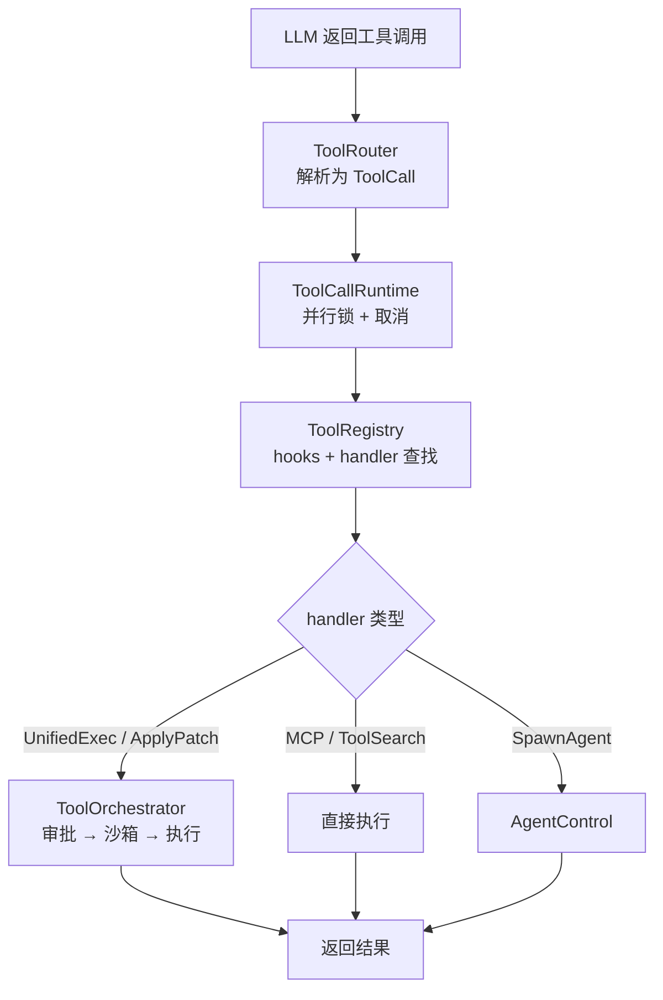
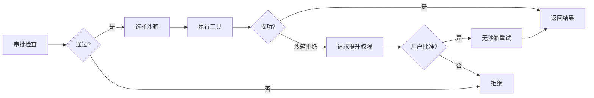

# 04 — 工具系统设计

> 工具是 Agent 与外部世界交互的唯一通道。本章剖析 Codex 的工具系统如何从模型输出到实际执行完成一次完整调用，包括路由分发、并行控制、审批流程和沙箱隔离。

## 1. 整体架构与伪代码

一个工具调用从 LLM 返回到执行完成，经过以下流程：

```
async fn handle_tool_call(response_item: ResponseItem) {
    // 1. 解析：将模型输出转为统一的 ToolCall
    let call = ToolRouter::build_tool_call(response_item);

    // 2. 并行控制：按 tool_supports_parallel() 决定锁类型
    let _lock = if router.tool_supports_parallel(&call.name) {
        parallel_execution.read().await     // 共享锁，多个并行
    } else {
        parallel_execution.write().await    // 独占锁，串行
    };

    // 3. 分发：查找 handler，执行 hooks
    let handler = registry.lookup(&call.name);
    run_pre_tool_use_hooks();               // 可阻止执行
    let result = handler.handle(call);      // 不同 handler 路径不同：
    //   ├── UnifiedExecHandler  → ToolOrchestrator（审批+沙箱）
    //   ├── ApplyPatchHandler   → ToolOrchestrator（审批+沙箱）
    //   ├── McpHandler          → 直接执行（不经过 Orchestrator）
    //   ├── ToolSearchHandler   → 直接执行
    //   └── SpawnAgentHandler   → AgentControl
    run_post_tool_use_hooks();              // 可修改输出

    // 4. 返回结果，追加到对话历史
    return result.to_response_item();
}
```

**源码**: [tools/parallel.rs](https://github.com/openai/codex/blob/main/codex-rs/core/src/tools/parallel.rs)（并行控制与分发）, [tools/registry.rs](https://github.com/openai/codex/blob/main/codex-rs/core/src/tools/registry.rs)（handler 注册与 hooks）, [tools/orchestrator.rs](https://github.com/openai/codex/blob/main/codex-rs/core/src/tools/orchestrator.rs)（审批→沙箱→执行）

关键认知：**不是所有工具都走审批和沙箱**。只有涉及文件系统/进程执行的工具（exec_command、apply_patch 等）才经过 `ToolOrchestrator` 的审批→沙箱→执行管线。MCP 工具、ToolSearch 等直接在 handler 内完成。



**源码**: 工具模块在 [core/src/tools/](https://github.com/openai/codex/blob/main/codex-rs/core/src/tools/) 目录下。

## 2. ToolRouter：解析与路由

每次采样请求时，Codex **重新构建** ToolRouter（因为可用工具可能变化——MCP 服务器热重载、Skills 变更等）。

### 解析：4 种调用格式 → 统一 ToolCall

```rust
pub struct ToolCall {
    pub tool_name: ToolName,
    pub call_id: String,
    pub payload: ToolPayload,
}
```

| 模型输出类型 | 转换为 | 示例 |
|-------------|--------|------|
| `FunctionCall` | `Function` 或 `Mcp` | exec_command、MCP 工具 |
| `CustomToolCall` | `Custom` | apply_patch |
| `ToolSearchCall` | `ToolSearch` | tool_search |
| `LocalShellCall` | `LocalShell` | local_shell |

> 如果 FunctionCall 的名称匹配到已注册的 MCP 工具，自动包装为 `Mcp` payload。

**源码**: [tools/router.rs:117-214](https://github.com/openai/codex/blob/main/codex-rs/core/src/tools/router.rs#L117-L214)（`build_tool_call` 函数）

## 3. ToolCallRuntime：并行控制与取消

### 3.1 并行判定：tool_supports_parallel()

并行控制使用 `RwLock`，但判定依据是 `tool_supports_parallel()` 而**不是**工具是否只读：

```rust
// parallel.rs:81
let supports_parallel = self.router.tool_supports_parallel(&call.tool_name);
if supports_parallel {
    let _guard = self.parallel_execution.read().await;   // 共享锁
    dispatch(call).await
} else {
    let _guard = self.parallel_execution.write().await;  // 独占锁
    dispatch(call).await
}
```

`tool_supports_parallel()` 在注册工具时通过 `push_spec_with_parallel_support()` 标记，而不是运行时动态判断。大多数内置工具都支持并行。

> **知识点 — `RwLock`**: `RwLock`（读写锁）允许多个线程同时获取读锁（共享），但写锁是独占的。这里 Codex 用读锁表示"可以并行"，写锁表示"必须独占"。

### 3.2 取消机制

每个工具调用通过 `CancellationToken` 支持取消（用户按 Ctrl+C 中断时，token 会被标记为 cancelled，所有持有它的异步任务都会收到通知）：

```
tokio::select! {
    _ = cancellation_token.cancelled() => AbortedToolOutput,
    result = dispatch(call) => result,
}
```

**源码**: [tools/parallel.rs:74-133](https://github.com/openai/codex/blob/main/codex-rs/core/src/tools/parallel.rs#L74-L133)

## 4. ToolRegistry：Handler 注册与分发

### 4.1 注册模式

通过 `ToolRegistryBuilder` 分别注册工具定义（spec）和处理器（handler）：

```
builder.push_spec(tool_spec)            // 工具定义（给 LLM 看）
builder.register_handler(name, handler) // 处理器（给 Codex 执行）
builder.build() → (specs, registry)
```

**源码**: [tools/registry.rs:432-468](https://github.com/openai/codex/blob/main/codex-rs/core/src/tools/registry.rs#L432-L468)

定义和处理器**解耦**：同一个 handler 可以服务多个工具名。例如 `UnifiedExecHandler` 同时处理 `exec_command` 和 `write_stdin`。

> **知识点 — `trait`**: Rust 的 `trait` 类似于 Java 的 interface 或 Go 的 interface——定义一组方法签名，不同类型可以各自实现。`ToolHandler` trait 定义了 `handle()`、`is_mutating()` 等方法，每个工具处理器（ShellHandler、McpHandler 等）都实现了这个 trait。

### 4.2 分发流程

`registry.dispatch_any()` 是中央分发器：

```
dispatch_any(invocation)
  1. 查找 handler（按 tool_name）
  2. is_mutating 检查 → 若是，等待 tool_call_gate（不是 RwLock）
  3. 执行 pre_tool_use hooks → 若 blocked，终止
  4. handler.handle(invocation)
  5. 执行 post_tool_use hooks → 可修改输出
  6. 返回 AnyToolResult
```

注意：`is_mutating()` 检查和并行锁是**两个独立的机制**。`is_mutating()` 控制的是 `tool_call_gate`（一个 readiness flag），用于等待前一个变更操作完成后再开始新的变更。这和 `RwLock` 的并行/串行控制不同。

**源码**: [tools/registry.rs:209-429](https://github.com/openai/codex/blob/main/codex-rs/core/src/tools/registry.rs#L209-L429)（`dispatch_any` 函数）

## 5. ToolOrchestrator：审批 → 沙箱 → 执行

**只有部分 handler 使用 Orchestrator**。具体来说，实现了 `ToolRuntime` trait 的工具（如 shell、apply_patch）才会走这个管线。MCP、ToolSearch、Agent 工具不走 Orchestrator。

### 5.1 三步管线



### 5.2 审批（Approval）

```rust
enum ExecApprovalRequirement {
    Skip { bypass_sandbox: bool },       // 自动批准（匹配 prefix_rule）
    NeedsApproval { reason: String },    // 需要用户/Guardian 确认
    Forbidden { reason: String },        // 禁止执行
}
```

审批结果缓存在 `ApprovalStore`，但规则比较细：

- **只有 `ApprovedForSession` 才会被缓存复用**，普通 `Approved` 不会
- Shell 的 approval key 由 `cmd + cwd + sandbox_permissions + additional_permissions` 组成，不是简单的命令字符串
- ApplyPatch 按**文件路径**独立缓存，不是按整个补丁

**源码**: [tools/sandboxing.rs:67-113](https://github.com/openai/codex/blob/main/codex-rs/core/src/tools/sandboxing.rs#L67-L113)

### 5.3 沙箱（Sandbox）

| 平台 | 沙箱实现 | 说明 |
|------|---------|------|
| macOS | Seatbelt (`sandbox-exec`) | `.sbpl` 配置限制文件/网络 |
| Linux | Landlock + Bubblewrap | 内核级文件访问控制 + 用户空间隔离 |
| Windows | Restricted Token | 降权进程 Token |

### 5.4 失败重试

如果工具在沙箱中被拒绝（`SandboxErr::Denied`）：
1. 检查工具是否支持权限提升（`escalate_on_failure()`）
2. 向用户请求重试审批
3. 用 `SandboxType::None`（无沙箱）重新执行

**源码**: [tools/orchestrator.rs](https://github.com/openai/codex/blob/main/codex-rs/core/src/tools/orchestrator.rs)

## 6. 核心工具 Handler

### 6.1 exec_command — UnifiedExecHandler

`exec_command` 是最常用的工具。当前主分支由 `UnifiedExecHandler` 处理（不是旧的 `ShellHandler`）：

```
UnifiedExecHandler.handle()
  → 解析参数（cmd, workdir, sandbox_permissions, tty, yield_time_ms...）
  → ToolOrchestrator::run()
    → 审批检查（ExecApprovalRequirement）
    → 选择沙箱（Seatbelt / Landlock / None）
    → UnifiedExecProcessManager 执行命令
      → 创建进程（可选 PTY）
      → 等待输出（受 yield_time_ms 控制）
      → 截断过长输出（max_output_tokens）
    → 返回 ExecToolCallOutput（含 session_id，支持后续 write_stdin）
```

`exec_command` 和 `write_stdin` 共用同一个 `UnifiedExecHandler`。`write_stdin` 用于向一个运行中的进程（通过 `session_id` 标识）写入输入。

**源码**: [tools/handlers/unified_exec.rs](https://github.com/openai/codex/blob/main/codex-rs/core/src/tools/handlers/unified_exec.rs), [tools/spec.rs:132-145](https://github.com/openai/codex/blob/main/codex-rs/core/src/tools/spec.rs#L132-L145)

### 6.2 apply_patch — 文件创建与修改

```
ApplyPatchHandler.handle()
  → 解析补丁（新建/修改/删除文件列表）
  → 按文件路径计算 approval keys（每文件独立缓存）
  → ToolOrchestrator::run()
    → 审批（每个文件路径独立）
    → 沙箱执行补丁
  → 返回成功/失败
```

**源码**: [tools/handlers/apply_patch.rs](https://github.com/openai/codex/blob/main/codex-rs/core/src/tools/handlers/apply_patch.rs)

### 6.3 MCP 工具 — 直接执行，不走 Orchestrator

```
McpHandler.handle()
  → 通过 McpConnectionManager 调用外部 MCP 服务器
  → 直接返回结果（无审批、无沙箱）
```

MCP 工具的安全性由 MCP 服务器自身负责，Codex 不额外加沙箱。

**源码**: [tools/handlers/mcp.rs](https://github.com/openai/codex/blob/main/codex-rs/core/src/tools/handlers/mcp.rs)

### 6.4 多 Agent 工具 — spawn_agent / send_input / wait_agent / close_agent

子 Agent 协调工具，详见第 06 章。

```
SpawnAgentHandler.handle()
  → AgentControl::spawn_agent()
    → 创建新的 CodexThread + Session
    → 返回 agent_id
```

**源码**: [tools/handlers/multi_agents_v2/](https://github.com/openai/codex/blob/main/codex-rs/core/src/tools/handlers/multi_agents_v2)

## 7. 本章小结

| 组件 | 职责 | 关键细节 | 源码 |
|------|------|---------|------|
| **ToolRouter** | 解析 4 种调用格式为统一 ToolCall | 每次采样重建 | [tools/router.rs](https://github.com/openai/codex/blob/main/codex-rs/core/src/tools/router.rs) |
| **ToolCallRuntime** | 并行控制 + 取消 | 按 `tool_supports_parallel()` 判定，不是按读写 | [tools/parallel.rs](https://github.com/openai/codex/blob/main/codex-rs/core/src/tools/parallel.rs) |
| **ToolRegistry** | handler 查找 + hooks | `is_mutating` 控制 gate，与并行锁独立 | [tools/registry.rs](https://github.com/openai/codex/blob/main/codex-rs/core/src/tools/registry.rs) |
| **ToolOrchestrator** | 审批→沙箱→执行→重试 | **仅部分 handler 使用**（shell、patch） | [tools/orchestrator.rs](https://github.com/openai/codex/blob/main/codex-rs/core/src/tools/orchestrator.rs) |
| **ApprovalStore** | 审批缓存 | 只缓存 `ApprovedForSession`；key 含 cmd+cwd+permissions | [tools/sandboxing.rs](https://github.com/openai/codex/blob/main/codex-rs/core/src/tools/sandboxing.rs) |

---

**上一章**: [03 — Agent Loop 深度剖析](03-agent-loop.md) | **下一章**: [05 — 上下文与对话管理](05-context-management.md)
