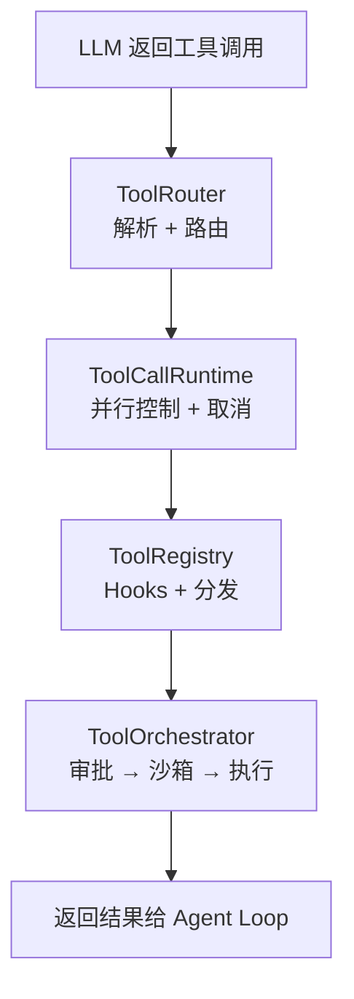
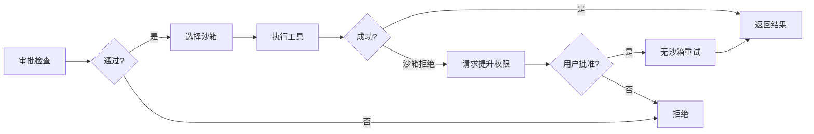
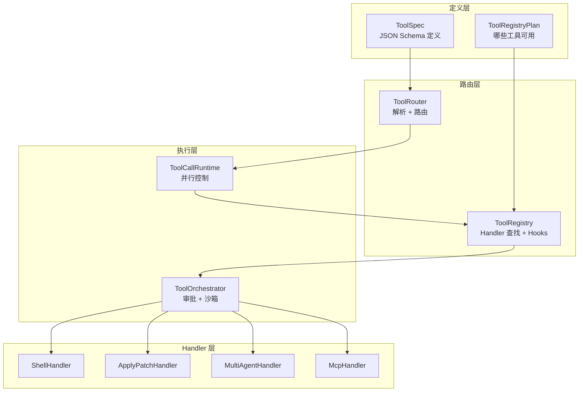

# 04 — 工具系统设计

> 工具是 Agent 与外部世界交互的唯一通道。本章剖析 Codex 的工具系统如何从定义到执行完成一次完整调用，包括分发路由、并行控制、审批流程和沙箱隔离。

## 1. 一次工具调用的完整旅程

当 LLM 在回复中返回一个工具调用（如 `exec_command`），它会经过以下 5 个阶段：



| 阶段 | 组件 | 职责 |
|------|------|------|
| **解析** | ToolRouter | 将模型输出解析为 `ToolCall` 结构体 |
| **并行** | ToolCallRuntime | 控制并行/串行执行，支持取消 |
| **分发** | ToolRegistry | 查找 Handler、执行 pre/post hooks |
| **执行** | ToolOrchestrator | 审批 → 选择沙箱 → 执行 → 失败重试 |
| **返回** | - | 结果转为 `ResponseInputItem`，追加到对话历史 |

## 2. ToolRouter：解析与路由

每次采样请求时，Codex 都会**重新构建** ToolRouter（因为可用工具可能变化）。

### 2.1 构建流程

```
ToolRouter::from_config(tools_config, mcp_tools, ...)
  → build_specs_with_discoverable_tools()    // 决定注册哪些工具
    → codex_tools::build_tool_registry_plan()  // 外部 crate 生成计划
    → 遍历计划，注册每个 handler
  → 返回 (specs, registry) 
  → 过滤 code-mode 工具
  → 构建 ToolRouter { registry, specs, model_visible_specs }
```

### 2.2 解析工具调用

`build_tool_call()` 将 LLM 的原始输出解析为统一的 `ToolCall` 结构：

```rust
pub struct ToolCall {
    pub tool_name: ToolName,    // 工具标识
    pub call_id: String,        // 调用唯一 ID
    pub payload: ToolPayload,   // 调用参数
}
```

模型可能返回 4 种不同格式的工具调用，全部统一为 `ToolPayload`：

| 模型输出类型 | 转换为 | 示例 |
|-------------|--------|------|
| `FunctionCall` | `ToolPayload::Function` 或 `ToolPayload::Mcp` | exec_command、MCP 工具 |
| `CustomToolCall` | `ToolPayload::Custom` | apply_patch |
| `ToolSearchCall` | `ToolPayload::ToolSearch` | tool_search |
| `LocalShellCall` | `ToolPayload::LocalShell` | local_shell |

> 如果 FunctionCall 的名称匹配到已注册的 MCP 工具，会自动包装为 `Mcp` payload。

**源码**: [core/src/tools/router.rs](https://github.com/openai/codex/blob/main/codex-rs/core/src/tools/router.rs)

## 3. ToolCallRuntime：并行与取消

### 3.1 并行控制：RwLock 模式

Codex 支持 LLM 在单次回复中返回多个工具调用。但并非所有工具都可以安全地并行执行。

```rust
pub struct ToolCallRuntime {
    router: Arc<ToolRouter>,
    session: Arc<Session>,
    turn_context: Arc<TurnContext>,
    parallel_execution: Arc<RwLock<()>>,  // 关键：并行控制锁
}
```

| 工具类型 | 锁类型 | 行为 |
|---------|--------|------|
| 只读命令（如 `ls`、`cat`） | **读锁** | 多个并行执行 |
| 写入命令（如 `apply_patch`） | **写锁** | 独占执行，其他等待 |

> **知识点 — `RwLock`**: `RwLock`（读写锁）允许多个线程同时读（共享），但写入时必须独占。Codex 用它实现「只读工具可以并行，写入工具必须串行」的策略。

### 3.2 取消机制

每个工具调用通过 `CancellationToken` 支持取消（用户按 Ctrl+C 中断）：

```
tokio::select! {
    _ = cancellation_token.cancelled() => 返回 AbortedToolOutput,
    result = 工具执行 => 返回结果,
}
```

**源码**: [core/src/tools/parallel.rs](https://github.com/openai/codex/blob/main/codex-rs/core/src/tools/parallel.rs)

## 4. ToolRegistry：Handler 注册与分发

### 4.1 Handler 注册

所有工具通过 `ToolRegistryBuilder` 注册：

```
builder.push_spec(tool_spec)           // 注册工具定义（给 LLM 看）
builder.register_handler(name, handler) // 注册处理器（给 Codex 执行）
builder.build() → (specs, registry)     // 构建完成
```

定义（spec）和处理器（handler）是**解耦**的：同一个 handler 可以服务多个工具名，一个工具定义也可以在不同配置下映射到不同 handler。

### 4.2 Handler 特征

每个工具处理器实现 `ToolHandler` trait：

```rust
pub trait ToolHandler: Send + Sync {
    type Output: ToolOutput;
    fn kind(&self) -> ToolKind;                           // Function / Mcp
    fn is_mutating(&self, invocation: &ToolInvocation) -> bool;  // 是否写操作
    fn handle(&self, invocation: ToolInvocation) -> Result<Self::Output>;
}
```

### 4.3 分发流程

`registry.dispatch_any()` 是中央分发器：

```
dispatch_any(invocation)
  1. 查找 handler（按 tool_name）
  2. 检查 is_mutating → 若是，等待写锁
  3. 执行 pre_tool_use hooks → 若 blocked，终止
  4. handler.handle(invocation) → 执行工具
  5. 执行 post_tool_use hooks → 可修改输出
  6. 返回 AnyToolResult
```

**Hooks 注入点**：用户可以通过 `config.toml` 配置 hooks，在工具执行前后插入自定义逻辑（如日志、审计）。

**源码**: [core/src/tools/registry.rs](https://github.com/openai/codex/blob/main/codex-rs/core/src/tools/registry.rs)

## 5. ToolOrchestrator：审批 → 沙箱 → 执行

这是最复杂的一层，处理安全相关的全部逻辑。

### 5.1 三步管线



### 5.2 审批（Approval）

审批系统决定一个工具调用是否需要用户确认：

```rust
enum ExecApprovalRequirement {
    Skip { bypass_sandbox: bool },     // 自动批准（已知安全）
    NeedsApproval { reason: String },  // 需要用户确认
    Forbidden { reason: String },      // 禁止执行
}
```

判断依据包括：
- 命令是否匹配已批准的 `prefix_rule`
- 执行策略（ExecPolicy）中的规则
- 沙箱权限设置（`sandbox_permissions` 参数）

审批结果会被**缓存**到 `ApprovalStore`，同一 session 内相同命令不会重复询问。

### 5.3 沙箱（Sandbox）

通过审批后，`SandboxManager` 选择合适的沙箱类型：

| 平台 | 沙箱实现 | 说明 |
|------|---------|------|
| macOS | Seatbelt (`sandbox-exec`) | 使用 `.sbpl` 配置限制文件/网络访问 |
| Linux | Landlock + Bubblewrap | 内核级文件访问控制 + 用户空间隔离 |
| Windows | Restricted Token | 降权进程 Token |

沙箱的 `SandboxAttempt` 结构包含了所有策略：

```
SandboxAttempt {
    sandbox: SandboxType,           // Seatbelt / Landlock / None
    policy: SandboxPolicy,          // workspace-write / read-only / full-access
    file_system_policy,             // 文件读写白名单
    network_policy,                 // 网络访问控制
    ...
}
```

### 5.4 失败重试

如果工具在沙箱中执行失败（`SandboxErr::Denied`），Orchestrator 会：

1. 检查该工具是否支持权限提升（`escalate_on_failure()`）
2. 向用户请求重试审批
3. 用 `SandboxType::None`（无沙箱）重新执行

这就是为什么用户有时会看到类似「Command failed due to sandbox. Do you want to run without restrictions?」的提示。

**源码**: [core/src/tools/orchestrator.rs](https://github.com/openai/codex/blob/main/codex-rs/core/src/tools/orchestrator.rs), [core/src/tools/sandboxing.rs](https://github.com/openai/codex/blob/main/codex-rs/core/src/tools/sandboxing.rs)

## 6. 核心工具处理器

### 6.1 Shell（exec_command）

最常用的工具。调用链：

```
ShellHandler.handle()
  → 解析 ShellToolCallParams（cmd, workdir, sandbox_permissions...）
  → ShellRuntime.run()
    → 构建沙箱命令（加 seatbelt/landlock 包装）
    → 执行进程
    → 捕获 stdout/stderr
    → 截断过长输出（max_output_tokens）
    → 返回 ExecToolCallOutput
```

**源码**: [core/src/tools/handlers/shell.rs](https://github.com/openai/codex/blob/main/codex-rs/core/src/tools/handlers/shell.rs)

### 6.2 ApplyPatch（文件操作）

接收自由文本格式的补丁，创建或修改文件：

```
ApplyPatchHandler.handle()
  → 解析补丁内容（新建/修改/删除文件列表）
  → 按文件计算审批 key（每个文件独立审批缓存）
  → ApplyPatchRuntime.run()
    → 执行补丁（create/modify/delete）
    → 返回成功/失败
```

**源码**: [core/src/tools/handlers/apply_patch.rs](https://github.com/openai/codex/blob/main/codex-rs/core/src/tools/handlers/apply_patch.rs)

### 6.3 MultiAgent（spawn_agent / send_input / wait_agent / close_agent）

子 Agent 协调工具，详见第 06 章。简要调用链：

```
SpawnAgentHandler.handle()
  → AgentControl::spawn_agent()
    → 创建新的 CodexThread
    → 分配独立 Session
    → 返回 agent_id
```

**源码**: [core/src/tools/handlers/multi_agents_v2/](https://github.com/openai/codex/blob/main/codex-rs/core/src/tools/handlers/multi_agents_v2)

## 7. 工具系统架构全景



## 8. 本章小结

| 组件 | 职责 | 源码 |
|------|------|------|
| **ToolRouter** | 解析模型输出为 ToolCall，统一 4 种调用格式 | [tools/router.rs](https://github.com/openai/codex/blob/main/codex-rs/core/src/tools/router.rs) |
| **ToolCallRuntime** | 并行/串行控制（RwLock），取消支持 | [tools/parallel.rs](https://github.com/openai/codex/blob/main/codex-rs/core/src/tools/parallel.rs) |
| **ToolRegistry** | Handler 注册、查找、pre/post hooks | [tools/registry.rs](https://github.com/openai/codex/blob/main/codex-rs/core/src/tools/registry.rs) |
| **ToolOrchestrator** | 审批 → 沙箱选择 → 执行 → 失败重试 | [tools/orchestrator.rs](https://github.com/openai/codex/blob/main/codex-rs/core/src/tools/orchestrator.rs) |
| **ApprovalStore** | 审批结果缓存，避免重复询问 | [tools/sandboxing.rs](https://github.com/openai/codex/blob/main/codex-rs/core/src/tools/sandboxing.rs) |

---

> **源码版本说明**: 本文基于 [openai/codex](https://github.com/openai/codex) 主分支分析。

---

**上一章**: [03 — Agent Loop 深度剖析](03-agent-loop.md) | **下一章**: [05 — 上下文与对话管理](05-context-management.md)
