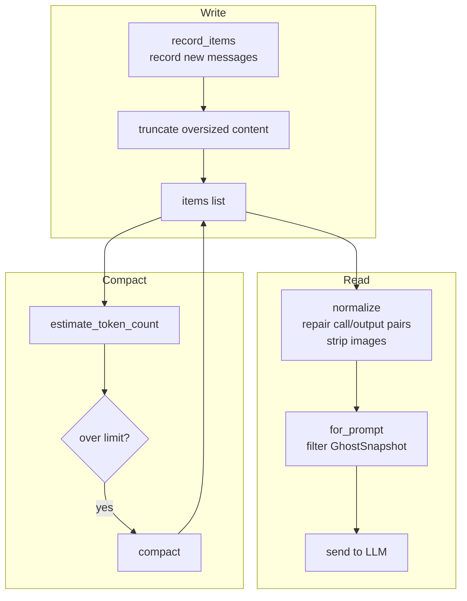

> **Language**: **English** · [中文](05-context-management.zh.md)

# 05 — Context and Conversation Management

> An agent's memory depends on its context management. This chapter dissects how Codex manages conversation history, tracks token usage, automatically compacts when the window overflows, and keeps state consistent across multiple turns.

## 1. Overall architecture and pseudocode

The core of context management is the `ContextManager`, which maintains an ordered list of messages. The pseudocode below shows the **actual order** of context-related operations inside `run_turn()`:

```
async fn run_turn(sess, turn_context, user_input) {
    // ── Step 1: pre-turn compaction (before any new content is written) ──
    // ⚠ Note: differential updates and user input have not been recorded yet
    // Source TODO: the limit check does not yet account for content about to be injected
    if total_tokens >= auto_compact_limit {
        run_auto_compact(DoNotInject);  // clear reference; next turn re-injects in full
    }

    // ── Step 2: record context updates ──
    record_context_updates();    // differential injection of changed settings
    record_user_input();         // record the user message

    // ── Step 3: main loop ──
    loop {
        let input = history.for_prompt();  // normalize + filter
        let result = run_sampling_request(input);

        if result.needs_follow_up && token_limit_reached {
            run_auto_compact(BeforeLastUserMessage);  // mid-turn compaction
            continue;
        }
        if result.needs_follow_up { continue; }
        // ... stop hooks ...
        break;
    }
}
```

**Source**: [codex.rs:5971-6483](https://github.com/openai/codex/blob/main/codex-rs/core/src/codex.rs#L5971-L6483) (context-related flow inside `run_turn`), [context_manager/history.rs](https://github.com/openai/codex/blob/main/codex-rs/core/src/context_manager/history.rs)

> ⚠ **Known limitation**: pre-turn compaction runs **before** the differential update and user input are recorded. That means if the headroom left after pre-turn compaction is just barely enough, but the differential update plus user input then push the token count back over the threshold, no second compaction is triggered — the issue has to wait until the mid-turn stage to be addressed. The source code marks this with an explicit TODO ([codex.rs:5985-5988](https://github.com/openai/codex/blob/main/codex-rs/core/src/codex.rs#L5985-L5988)).



**Source**: [context_manager/history.rs](https://github.com/openai/codex/blob/main/codex-rs/core/src/context_manager/history.rs)

## 2. ContextManager: reading and writing conversation history

```rust
pub struct ContextManager {
    items: Vec<ResponseItem>,              // conversation history (oldest → newest)
    history_version: u64,                  // version number (incremented on compact / rollback)
    token_info: Option<TokenUsageInfo>,    // token-usage statistics
    reference_context_item: Option<...>,   // context baseline (for differential updates)
}
```

### 2.1 Writing: record_items()

After every model reply or tool execution, the result is appended to history through `record_items()`:

```
record_items(items, truncation_policy)
  → filter: keep only API messages and GhostSnapshot
  → truncate: cap each message size per truncation_policy (default 10,000 tokens)
  → append to the items list
```

**Source**: [history.rs:99-114](https://github.com/openai/codex/blob/main/codex-rs/core/src/context_manager/history.rs#L99-L114)

### 2.2 Reading: for_prompt()

Before being sent to the LLM, history needs to be **normalized**:

```
for_prompt(input_modalities)
  → normalize_history():
    1. ensure_call_outputs_present()  — fill in missing tool outputs (insert "aborted")
    2. remove_orphan_outputs()        — remove outputs that have no matching call
    3. strip_images_when_unsupported() — replace images with text placeholders
  → filter out GhostSnapshot (the model must not see them)
  → return the normalized message list
```

> **Tip — GhostSnapshot**: a GhostSnapshot is an invisible history marker used to support the `/undo` operation. It records a context snapshot at a given point in time, making rollback possible. The model never sees them, but they are preserved during compaction.

**Source**: [history.rs:120-125](https://github.com/openai/codex/blob/main/codex-rs/core/src/context_manager/history.rs#L120-L125), [normalize.rs](https://github.com/openai/codex/blob/main/codex-rs/core/src/context_manager/normalize.rs)

### 2.3 Version tracking: history_version

Whenever history is rewritten (compact, rollback, replace), `history_version` increments. Downstream components (such as the prompt cache on a WebSocket connection) compare version numbers to decide whether they need to refresh.

## 3. Differential updates: a partially effective optimization

Codex records the previous turn's settings baseline in `reference_context_item` and tries to inject **only what changed** instead of resending everything:

```
build_settings_update_items(previous_baseline, current_context)
  → compare item by item:
    ├── environment (cwd, env vars)
    ├── permissions (sandbox, approval)
    ├── collaboration_mode
    ├── realtime_active
    ├── personality
    └── model_instructions (when the model is switched)
  → return developer messages that contain only the changed items
```

In most turns (where settings have not changed), this mechanism avoids re-injecting thousands of characters of permissions instructions.

> ⚠ **Known limitation**: the source explicitly notes that `build_settings_update_items` does **not yet** cover everything that `build_initial_context` outputs as model-visible content ([updates.rs:204-207](https://github.com/openai/codex/blob/main/codex-rs/core/src/context_manager/updates.rs#L204-L207)). That means in fork/resume scenarios the differential update alone cannot fully reconstruct the prompt state — some initial-context content still relies on a full re-injection.

**Source**: [context_manager/updates.rs:196-231](https://github.com/openai/codex/blob/main/codex-rs/core/src/context_manager/updates.rs#L196-L231)

## 4. Token tracking and estimation

### 4.1 Two sources

| Source | Precision | When |
|--------|-----------|------|
| **API-returned usage** | exact | after each sampling round ends |
| **Byte-based estimation** | approximate (4 bytes ≈ 1 token) | any time |

### 4.2 Special handling in byte-based estimation

| Content type | Estimation method |
|--------------|-------------------|
| Plain text | bytes of the JSON-serialized form ÷ 4 |
| Image (original detail) | decode the image and compute tokens by 32-px tiles (results cached in an LRU cache) |
| Image (default detail) | fixed at 1,844 tokens |
| Reasoning (encrypted) | base64 length × 3/4 − 650 bytes |
| GhostSnapshot | 0 (invisible) |

### 4.3 Computing the total token count

```
get_total_token_usage()
  = total_tokens from the most recent API response
  + estimated tokens of messages added since that API response
```

**Source**: [history.rs:312-358](https://github.com/openai/codex/blob/main/codex-rs/core/src/context_manager/history.rs#L312-L358)

## 5. Auto compaction: behavior depends on the stage

The core compaction logic lives in `compact.rs`, but **the different trigger stages behave very differently**:

### 5.1 Pre-turn / manual compaction

| Property | Value |
|----------|-------|
| **Trigger condition** | `total_tokens >= auto_compact_limit` before a turn starts, or the user issues `Op::Compact` |
| **InitialContextInjection** | `DoNotInject` |
| **History after compaction** | `[user message] + [summary]` (**no initial context**) |
| **reference_context_item** | set to `None` |
| **Recovery** | the next turn detects `reference = None` and **re-injects all initial context in full** |

```
build_compacted_history(Vec::new(), &user_messages, &summary)
// ↑ first arg Vec::new() = empty initial context
// reference_context_item = None → full re-injection next turn
```

### 5.2 Mid-turn compaction

| Property | Value |
|----------|-------|
| **Trigger condition** | inside the loop, `token_limit_reached && needs_follow_up` |
| **InitialContextInjection** | `BeforeLastUserMessage` |
| **History after compaction** | `[initial context] + [user message] + [summary]` (**includes initial context**) |
| **reference_context_item** | set to a snapshot of the current TurnContext |
| **Recovery** | none needed — the context is already in history; the loop simply continues |

```
// Mid-turn path additionally executes:
let initial_context = sess.build_initial_context(turn_context);
new_history = insert_initial_context_before_last_real_user_or_summary(
    new_history, initial_context
);
// reference_context_item = Some(current) → enables future differential updates
```

### 5.3 Why the distinction?

Mid-turn compaction happens in the middle of a loop and more sampling has to follow — the model must still see the full context to do the right thing. Pre-turn compaction happens between turns, and the next turn's startup will automatically re-inject the context in full, so there is no need to retain it during compaction.

### 5.4 Local vs. remote compaction

| Aspect | Local compaction | Remote compaction |
|--------|------------------|-------------------|
| **Implementation** | call the same model for streaming summarization | call a dedicated OpenAI API |
| **Selection** | default / non-OpenAI providers | OpenAI providers when supported |
| **developer messages** | depends on the stage (see the table above) | **discarded** (post-server format is unreliable) |
| **Summary control** | local `SUMMARIZATION_PROMPT` template | decided server-side |

**Source**: [compact.rs:258-276](https://github.com/openai/codex/blob/main/codex-rs/core/src/compact.rs#L258-L276), [compact_remote.rs](https://github.com/openai/codex/blob/main/codex-rs/core/src/compact_remote.rs)

## 6. Rollback: drop_last_n_user_turns()

When the user runs `/undo`, rollback goes through `drop_last_n_user_turns(n)`:

```
drop_last_n_user_turns(n)
  → walk backward from the end of items to find n user/agent message boundaries
  → truncate at that boundary
  → clean up developer/contextual messages above the cut
  → if a build_initial_context message was truncated → clear reference_context_item
  → history_version += 1
```

If `reference_context_item` is cleared, the next turn re-injects the context in full.

**Source**: [history.rs:240-263](https://github.com/openai/codex/blob/main/codex-rs/core/src/context_manager/history.rs#L240-L263)

## 7. Persistence: the Rollout system

Each session's events are persisted to a JSONL file:

```
~/.codex/sessions/2026/04/12/rollout-<timestamp>-<uuid>.jsonl
```

Each line is a JSON object of the form `{ timestamp, type, payload }`:
- `type: "session_meta"` — session metadata
- `type: "response_item"` — conversation message / tool call
- `type: "event_msg"` — turn-lifecycle event
- `type: "turn_context"` — turn-configuration snapshot

**Source**: [rollout/](https://github.com/openai/codex/blob/main/codex-rs/rollout/src/)

## 8. Chapter summary

| Component | Responsibility | Source |
|-----------|----------------|--------|
| **ContextManager** | Reading and writing conversation history, normalization, version tracking | [context_manager/history.rs](https://github.com/openai/codex/blob/main/codex-rs/core/src/context_manager/history.rs) |
| **normalize** | Repair call/output pairs, strip images, remove orphan outputs | [context_manager/normalize.rs](https://github.com/openai/codex/blob/main/codex-rs/core/src/context_manager/normalize.rs) |
| **updates** | Differential context updates (**partial coverage**, with known limitations) | [context_manager/updates.rs](https://github.com/openai/codex/blob/main/codex-rs/core/src/context_manager/updates.rs) |
| **compact** | Pre-turn: no initial context; mid-turn: includes initial context | [compact.rs](https://github.com/openai/codex/blob/main/codex-rs/core/src/compact.rs) |
| **compact_remote** | Remote compaction (drops developer messages, forces full re-injection) | [compact_remote.rs](https://github.com/openai/codex/blob/main/codex-rs/core/src/compact_remote.rs) |
| **Token estimation** | Byte-level estimation + special-cased images + LRU cache | [history.rs:500-673](https://github.com/openai/codex/blob/main/codex-rs/core/src/context_manager/history.rs#L500-L673) |
| **Rollout** | JSONL persistence, supports session resume | [rollout/](https://github.com/openai/codex/blob/main/codex-rs/rollout/src/) |

---

**Previous**: [04 — Tool system design](04-tool-system.md) | **Next**: [06 — Sub-agents and task delegation](06-sub-agent-system.md)
