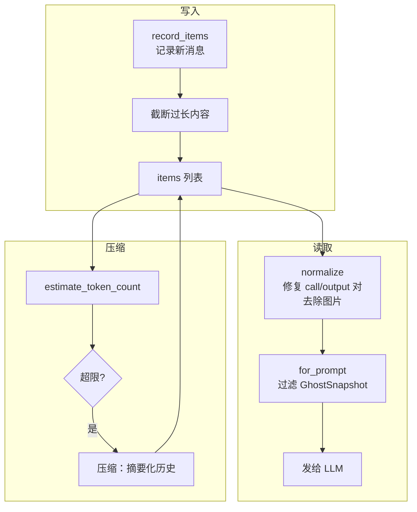

# 05 — 上下文与对话管理

> Agent 的记忆力取决于上下文管理。本章剖析 Codex 如何管理对话历史、追踪 Token 使用、在窗口溢出时自动压缩，以及如何在多轮对话中保持状态一致性。

## 1. 整体架构与伪代码

上下文管理的核心是 `ContextManager`，它维护一个有序的消息列表，并在每轮采样前进行规范化处理：

```
struct ContextManager {
    items: Vec<ResponseItem>,              // 对话历史（oldest → newest）
    history_version: u64,                  // 版本号（压缩/回滚时递增）
    token_info: Option<TokenUsageInfo>,    // Token 使用统计
    reference_context_item: Option<...>,   // 上下文基线（用于差分更新）
}

// 每轮采样前：
fn prepare_for_sampling() {
    // 1. 差分更新：只注入变化的设置（而非完整重发）
    let updates = build_settings_update_items(previous, current);
    history.record_items(updates);

    // 2. 规范化：修复不完整的 call/output 对、去除图片（如模型不支持）
    let normalized = history.for_prompt(model_input_modalities);

    // 3. Token 预估：检查是否需要压缩
    let estimated_tokens = history.estimate_token_count();
    if estimated_tokens >= auto_compact_limit {
        run_auto_compact();  // 压缩历史
    }

    return normalized;  // 发给 LLM
}
```



**源码**: [context_manager/history.rs](https://github.com/openai/codex/blob/main/codex-rs/core/src/context_manager/history.rs)

## 2. ContextManager：对话历史的读写

### 2.1 写入：record_items()

每次模型回复或工具执行后，结果通过 `record_items()` 追加到历史：

```
record_items(items, truncation_policy)
  → 过滤：只保留 API 消息和 GhostSnapshot
  → 截断：按 truncation_policy 限制单条消息大小（默认 10,000 tokens）
  → 追加到 items 列表
```

截断策略防止单条超长输出（如 `exec_command` 返回大量日志）膨胀整个上下文。超出部分被截断，并附加一条说明。

**源码**: [history.rs:99-114](https://github.com/openai/codex/blob/main/codex-rs/core/src/context_manager/history.rs#L99-L114)

### 2.2 读取：for_prompt()

发送给 LLM 前，历史需要**规范化**：

```
for_prompt(input_modalities)
  → normalize_history():
    1. ensure_call_outputs_present()  — 补齐缺失的工具输出（插入 "aborted"）
    2. remove_orphan_outputs()        — 删除没有对应 call 的 output
    3. strip_images_when_unsupported() — 替换为文字占位符
  → 过滤掉 GhostSnapshot（模型不应看到）
  → 返回规范化后的消息列表
```

> **知识点 — GhostSnapshot**: GhostSnapshot 是一种不可见的历史标记，用于支持 `/undo` 操作。它记录了某个时间点的上下文快照，让回滚成为可能。模型永远看不到它们。

**源码**: [history.rs:120-125](https://github.com/openai/codex/blob/main/codex-rs/core/src/context_manager/history.rs#L120-L125), [normalize.rs](https://github.com/openai/codex/blob/main/codex-rs/core/src/context_manager/normalize.rs)

### 2.3 版本追踪：history_version

每次历史被重写（压缩、回滚、替换），`history_version` 递增。下游组件（如 WebSocket 连接的 prompt cache）通过对比版本号来判断是否需要刷新。

## 3. 差分更新：避免重复注入

Codex 不会每轮都完整重发 permissions/collaboration_mode 等上下文。它通过 `reference_context_item` 记录上一轮的设置基线，只注入**变化的部分**：

```
build_settings_update_items(previous_baseline, current_context)
  → 逐项对比：
    ├── environment (cwd, env vars)    — 变了才注入
    ├── permissions (sandbox, approval) — 变了才注入
    ├── collaboration_mode              — 变了才注入
    ├── realtime_active                 — 变了才注入
    ├── personality                     — 变了才注入
    └── model_instructions              — 换模型时注入
  → 返回只包含变化项的 developer messages
```

这样在大多数 Turn 中（设置没变），**不会产生任何差分消息**，节省了 Token。

**源码**: [context_manager/updates.rs:196-231](https://github.com/openai/codex/blob/main/codex-rs/core/src/context_manager/updates.rs#L196-L231)

## 4. Token 追踪与估算

### 4.1 两种来源

| 来源 | 精度 | 时机 |
|------|------|------|
| **API 返回的 usage** | 精确 | 每轮采样结束后 |
| **字节估算** | 近似（4 字节 ≈ 1 token） | 任何时候 |

### 4.2 字节估算的特殊处理

不是所有内容都按 4 字节/token 估算：

| 内容类型 | 估算方式 |
|---------|---------|
| 普通文本 | JSON 序列化后字节数 ÷ 4 |
| 图片（original detail） | 解码图片，按 32px 切片计算 token |
| 图片（默认 detail） | 固定 1,844 tokens |
| Reasoning（加密） | base64 长度 × 3/4 - 650 字节 |
| GhostSnapshot | 0（不可见） |

图片估算结果会缓存在 LRU cache（32 条）中，避免重复解码。

### 4.3 Token 总量计算

```
get_total_token_usage()
  = 最后一次 API 返回的 total_tokens
  + 自上次 API 响应后新增消息的估算 tokens
```

这个值用于判断是否触发自动压缩。

**源码**: [history.rs:312-358](https://github.com/openai/codex/blob/main/codex-rs/core/src/context_manager/history.rs#L312-L358)

## 5. 自动压缩：上下文窗口管理

当 Token 使用量接近模型的上下文窗口上限时，Codex 自动压缩历史。

### 5.1 触发时机

| 时机 | 条件 | InitialContextInjection |
|------|------|------------------------|
| **Pre-turn** | Turn 开始前，`total_tokens >= auto_compact_limit` | `DoNotInject`（下一轮完整注入） |
| **Mid-turn** | 循环中，`token_limit_reached && needs_follow_up` | `BeforeLastUserMessage`（保留上下文） |
| **Model downshift** | 切换到更小窗口的模型 | `DoNotInject` |
| **手动** | 用户发送 `Op::Compact` | `DoNotInject` |

### 5.2 压缩流程

```
run_compact_task()
  1. 调用 LLM 生成摘要
     prompt = SUMMARIZATION_PROMPT + 当前历史
     → "Create a handoff summary for another LLM..."
  
  2. 提取摘要文本
     summary = SUMMARY_PREFIX + model_output
     → "Another language model started to solve this problem..."
  
  3. 重建历史
     new_history = [初始上下文] + [最近的用户消息] + [摘要]
     → 保留最近 20,000 tokens 的用户消息
     → 保留 GhostSnapshot（支持 /undo）
  
  4. 替换历史
     history.replace(new_history)
     history_version += 1     // 触发缓存失效
     WebSocket 连接重置        // prompt cache 失效
```

### 5.3 本地 vs 远程压缩

| 方面 | 本地压缩 | 远程压缩 |
|------|---------|---------|
| **实现** | 调用同一模型做流式摘要 | 调用 OpenAI 专用 API |
| **选择条件** | 默认 / 非 OpenAI 供应商 | OpenAI 供应商且支持时 |
| **developer 消息** | 保留 | 丢弃（需重新注入） |
| **摘要控制** | 本地模板控制格式 | 服务端决定 |

远程压缩的一个重要区别：它会**丢弃 developer 消息**（因为服务端不能保证格式正确），压缩后必须通过 `reference_context_item = None` 强制下一轮完整注入上下文。

**源码**: [compact.rs](https://github.com/openai/codex/blob/main/codex-rs/core/src/compact.rs), [compact_remote.rs](https://github.com/openai/codex/blob/main/codex-rs/core/src/compact_remote.rs)

## 6. 回滚：drop_last_n_user_turns()

用户执行 `/undo` 时，通过 `drop_last_n_user_turns(n)` 回滚：

```
drop_last_n_user_turns(n)
  → 从 items 末尾向前找 n 个用户/Agent 消息边界
  → 截断到该边界
  → 清理截断点上方的 developer/contextual 消息
  → 如果截断了 build_initial_context 消息 → 清除 reference_context_item
  → history_version += 1
```

如果 `reference_context_item` 被清除，下一轮 Turn 会完整重新注入上下文，而不是做差分更新。

**源码**: [history.rs:240-263](https://github.com/openai/codex/blob/main/codex-rs/core/src/context_manager/history.rs#L240-L263)

## 7. 持久化：Rollout 系统

每个 Session 的事件（消息、工具调用、Token 统计等）都持久化到 JSONL 文件，用于会话恢复和历史查看。

```
~/.codex/sessions/2026/04/12/rollout-<timestamp>-<uuid>.jsonl
```

每行一个 JSON 对象，格式为 `{ timestamp, type, payload }`：
- `type: "session_meta"` — 会话元信息（model、cwd、base_instructions）
- `type: "response_item"` — 对话消息/工具调用
- `type: "event_msg"` — Turn 生命周期事件
- `type: "turn_context"` — Turn 配置快照

`RolloutRecorder` 按配置决定记录哪些事件（Limited 模式只记核心消息，Extended 模式包含 Guardian 审查等详细信息）。

**源码**: [rollout/](https://github.com/openai/codex/blob/main/codex-rs/rollout/src/)

## 8. 本章小结

| 组件 | 职责 | 源码 |
|------|------|------|
| **ContextManager** | 对话历史的读写、规范化、版本追踪 | [context_manager/history.rs](https://github.com/openai/codex/blob/main/codex-rs/core/src/context_manager/history.rs) |
| **normalize** | 修复 call/output 对、去除图片、删除孤立输出 | [context_manager/normalize.rs](https://github.com/openai/codex/blob/main/codex-rs/core/src/context_manager/normalize.rs) |
| **updates** | 差分上下文更新（只注入变化的设置） | [context_manager/updates.rs](https://github.com/openai/codex/blob/main/codex-rs/core/src/context_manager/updates.rs) |
| **compact** | 本地压缩（调用同一模型摘要化） | [compact.rs](https://github.com/openai/codex/blob/main/codex-rs/core/src/compact.rs) |
| **compact_remote** | 远程压缩（OpenAI 专用 API） | [compact_remote.rs](https://github.com/openai/codex/blob/main/codex-rs/core/src/compact_remote.rs) |
| **Token 估算** | 字节级估算 + 图片特殊处理 + LRU 缓存 | [history.rs:500-673](https://github.com/openai/codex/blob/main/codex-rs/core/src/context_manager/history.rs#L500-L673) |
| **Rollout** | JSONL 持久化，支持会话恢复 | [rollout/](https://github.com/openai/codex/blob/main/codex-rs/rollout/src/) |

---

> **源码版本说明**: 本文基于 [openai/codex](https://github.com/openai/codex) 主分支分析。

---

**上一章**: [04 — 工具系统设计](04-tool-system.md) | **下一章**: [06 — 子 Agent 与任务委派](06-sub-agent-system.md)
