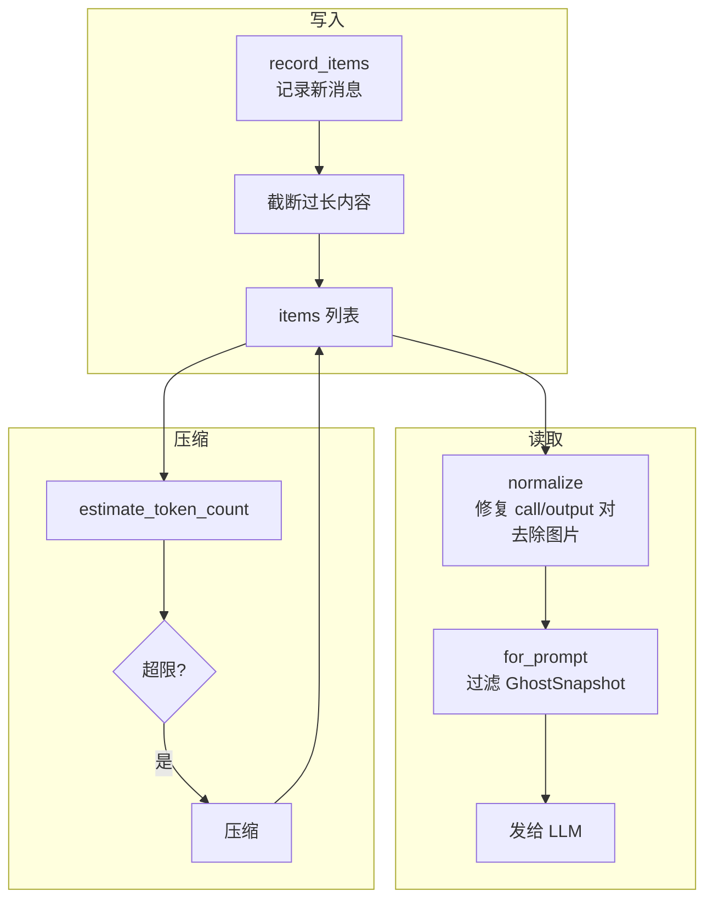

> **语言 / Language**: [English](05-context-management.md) · **中文**

# 05 — 上下文与对话管理

> Agent 的记忆力取决于上下文管理。本章剖析 Codex 如何管理对话历史、追踪 Token 使用、在窗口溢出时自动压缩，以及如何在多轮对话中保持状态一致性。

## 1. 整体架构与伪代码

上下文管理的核心是 `ContextManager`，它维护一个有序的消息列表。以下伪代码展示了 `run_turn()` 中上下文相关操作的**真实顺序**：

```
async fn run_turn(sess, turn_context, user_input) {
    // ── 第 1 步：Pre-turn 压缩（在任何新内容写入之前）──
    // ⚠ 注意：此时尚未记录差分更新和用户输入
    // 源码 TODO：当前不考虑待注入内容可能导致的超限
    if total_tokens >= auto_compact_limit {
        run_auto_compact(DoNotInject);  // 清除 reference，下轮完整注入
    }

    // ── 第 2 步：记录上下文更新 ──
    record_context_updates();    // 差分注入变化的设置
    record_user_input();         // 记录用户消息

    // ── 第 3 步：主循环 ──
    loop {
        let input = history.for_prompt();  // 规范化 + 过滤
        let result = run_sampling_request(input);

        if result.needs_follow_up && token_limit_reached {
            run_auto_compact(BeforeLastUserMessage);  // mid-turn 压缩
            continue;
        }
        if result.needs_follow_up { continue; }
        // ... stop hooks ...
        break;
    }
}
```

**源码**: [codex.rs:5971-6483](https://github.com/openai/codex/blob/main/codex-rs/core/src/codex.rs#L5971-L6483)（run_turn 中上下文相关流程）, [context_manager/history.rs](https://github.com/openai/codex/blob/main/codex-rs/core/src/context_manager/history.rs)

> ⚠ **已知局限**: Pre-turn 压缩在差分更新和用户输入记录**之前**执行。这意味着如果 pre-turn 压缩后剩余空间刚好够用，但差分更新 + 用户输入又把 Token 推过阈值，当前不会再次触发压缩——这需要等到 mid-turn 阶段才处理。源码中有明确 TODO 标注此问题（[codex.rs:5985-5988](https://github.com/openai/codex/blob/main/codex-rs/core/src/codex.rs#L5985-L5988)）。



**源码**: [context_manager/history.rs](https://github.com/openai/codex/blob/main/codex-rs/core/src/context_manager/history.rs)

## 2. ContextManager：对话历史的读写

```rust
pub struct ContextManager {
    items: Vec<ResponseItem>,              // 对话历史（oldest → newest）
    history_version: u64,                  // 版本号（压缩/回滚时递增）
    token_info: Option<TokenUsageInfo>,    // Token 使用统计
    reference_context_item: Option<...>,   // 上下文基线（用于差分更新）
}
```

### 2.1 写入：record_items()

每次模型回复或工具执行后，结果通过 `record_items()` 追加到历史：

```
record_items(items, truncation_policy)
  → 过滤：只保留 API 消息和 GhostSnapshot
  → 截断：按 truncation_policy 限制单条消息大小（默认 10,000 tokens）
  → 追加到 items 列表
```

**源码**: [history.rs:99-114](https://github.com/openai/codex/blob/main/codex-rs/core/src/context_manager/history.rs#L99-L114)

### 2.2 读取：for_prompt()

发送给 LLM 前，历史需要**规范化**：

```
for_prompt(input_modalities)
  → normalize_history():
    1. ensure_call_outputs_present()  — 补齐缺失的工具输出（插入 "aborted"）
    2. remove_orphan_outputs()        — 删除没有对应 call 的 output
    3. strip_images_when_unsupported() — 图片替换为文字占位符
  → 过滤掉 GhostSnapshot（模型不应看到）
  → 返回规范化后的消息列表
```

> **知识点 — GhostSnapshot**: GhostSnapshot 是一种不可见的历史标记，用于支持 `/undo` 操作。它记录了某个时间点的上下文快照，让回滚成为可能。模型永远看不到它们，但压缩时会被保留。

**源码**: [history.rs:120-125](https://github.com/openai/codex/blob/main/codex-rs/core/src/context_manager/history.rs#L120-L125), [normalize.rs](https://github.com/openai/codex/blob/main/codex-rs/core/src/context_manager/normalize.rs)

### 2.3 版本追踪：history_version

每次历史被重写（压缩、回滚、替换），`history_version` 递增。下游组件（如 WebSocket 连接的 prompt cache）通过对比版本号来判断是否需要刷新。

## 3. 差分更新：部分有效的优化

Codex 通过 `reference_context_item` 记录上一轮的设置基线，尝试只注入**变化的部分**而非完整重发：

```
build_settings_update_items(previous_baseline, current_context)
  → 逐项对比：
    ├── environment (cwd, env vars)
    ├── permissions (sandbox, approval)
    ├── collaboration_mode
    ├── realtime_active
    ├── personality
    └── model_instructions（换模型时）
  → 返回只包含变化项的 developer messages
```

在大多数 Turn 中（设置没变），这个机制可以避免重复注入数千字符的 permissions 指令。

> ⚠ **已知局限**: 源码中明确标注 `build_settings_update_items` **尚未覆盖** `build_initial_context` 输出的所有 model-visible 内容（[updates.rs:204-207](https://github.com/openai/codex/blob/main/codex-rs/core/src/context_manager/updates.rs#L204-L207)）。这意味着在 fork/resume 场景下，单靠差分更新不能完全还原 prompt 状态——某些初始上下文内容仍然依赖完整重新注入。

**源码**: [context_manager/updates.rs:196-231](https://github.com/openai/codex/blob/main/codex-rs/core/src/context_manager/updates.rs#L196-L231)

## 4. Token 追踪与估算

### 4.1 两种来源

| 来源 | 精度 | 时机 |
|------|------|------|
| **API 返回的 usage** | 精确 | 每轮采样结束后 |
| **字节估算** | 近似（4 字节 ≈ 1 token） | 任何时候 |

### 4.2 字节估算的特殊处理

| 内容类型 | 估算方式 |
|---------|---------|
| 普通文本 | JSON 序列化后字节数 ÷ 4 |
| 图片（original detail） | 解码图片，按 32px 切片计算 token（结果缓存在 LRU cache） |
| 图片（默认 detail） | 固定 1,844 tokens |
| Reasoning（加密） | base64 长度 × 3/4 - 650 字节 |
| GhostSnapshot | 0（不可见） |

### 4.3 Token 总量计算

```
get_total_token_usage()
  = 最后一次 API 返回的 total_tokens
  + 自上次 API 响应后新增消息的估算 tokens
```

**源码**: [history.rs:312-358](https://github.com/openai/codex/blob/main/codex-rs/core/src/context_manager/history.rs#L312-L358)

## 5. 自动压缩：按阶段区分行为

压缩的核心逻辑在 `compact.rs`，但**不同触发阶段的行为差异很大**：

### 5.1 Pre-turn / 手动压缩

| 属性 | 值 |
|------|-----|
| **触发条件** | Turn 开始前 `total_tokens >= auto_compact_limit`，或用户 `Op::Compact` |
| **InitialContextInjection** | `DoNotInject` |
| **压缩后历史** | `[用户消息] + [摘要]`（**不含初始上下文**） |
| **reference_context_item** | 设为 `None` |
| **恢复方式** | 下一轮 Turn 会检测到 `reference = None`，**完整重新注入**所有初始上下文 |

```
build_compacted_history(Vec::new(), &user_messages, &summary)
// ↑ 第一个参数 Vec::new() = 空的初始上下文
// reference_context_item = None → 下轮完整注入
```

### 5.2 Mid-turn 压缩

| 属性 | 值 |
|------|-----|
| **触发条件** | 循环中 `token_limit_reached && needs_follow_up` |
| **InitialContextInjection** | `BeforeLastUserMessage` |
| **压缩后历史** | `[初始上下文] + [用户消息] + [摘要]`（**包含初始上下文**） |
| **reference_context_item** | 设为当前 TurnContext 快照 |
| **恢复方式** | 无需恢复，上下文已在历史中，循环直接继续 |

```
// Mid-turn 路径额外执行：
let initial_context = sess.build_initial_context(turn_context);
new_history = insert_initial_context_before_last_real_user_or_summary(
    new_history, initial_context
);
// reference_context_item = Some(current) → 后续可做差分
```

### 5.3 为什么要区分？

Mid-turn 压缩发生在循环中间，之后还要继续采样——模型必须能看到完整的上下文才能正确工作。而 pre-turn 压缩发生在 Turn 之间，下一轮 Turn 启动时会自动完整注入上下文，所以压缩时不需要保留。

### 5.4 本地 vs 远程压缩

| 方面 | 本地压缩 | 远程压缩 |
|------|---------|---------|
| **实现** | 调用同一模型做流式摘要 | 调用 OpenAI 专用 API |
| **选择条件** | 默认 / 非 OpenAI 供应商 | OpenAI 供应商且支持时 |
| **developer 消息** | 按阶段决定（见上表） | **丢弃**（服务端处理后格式不可靠） |
| **摘要控制** | 本地 `SUMMARIZATION_PROMPT` 模板 | 服务端决定 |

**源码**: [compact.rs:258-276](https://github.com/openai/codex/blob/main/codex-rs/core/src/compact.rs#L258-L276), [compact_remote.rs](https://github.com/openai/codex/blob/main/codex-rs/core/src/compact_remote.rs)

## 6. 回滚：drop_last_n_user_turns()

用户执行 `/undo` 时，通过 `drop_last_n_user_turns(n)` 回滚：

```
drop_last_n_user_turns(n)
  → 从 items 末尾向前找 n 个用户/Agent 消息边界
  → 截断到该边界
  → 清理截断点上方的 developer/contextual 消息
  → 如果截断了 build_initial_context 消息 → 清除 reference_context_item
  → history_version += 1
```

如果 `reference_context_item` 被清除，下一轮 Turn 会完整重新注入上下文。

**源码**: [history.rs:240-263](https://github.com/openai/codex/blob/main/codex-rs/core/src/context_manager/history.rs#L240-L263)

## 7. 持久化：Rollout 系统

每个 Session 的事件持久化到 JSONL 文件：

```
~/.codex/sessions/2026/04/12/rollout-<timestamp>-<uuid>.jsonl
```

每行一个 JSON 对象，格式为 `{ timestamp, type, payload }`：
- `type: "session_meta"` — 会话元信息
- `type: "response_item"` — 对话消息/工具调用
- `type: "event_msg"` — Turn 生命周期事件
- `type: "turn_context"` — Turn 配置快照

**源码**: [rollout/](https://github.com/openai/codex/blob/main/codex-rs/rollout/src/)

## 8. 本章小结

| 组件 | 职责 | 源码 |
|------|------|------|
| **ContextManager** | 对话历史的读写、规范化、版本追踪 | [context_manager/history.rs](https://github.com/openai/codex/blob/main/codex-rs/core/src/context_manager/history.rs) |
| **normalize** | 修复 call/output 对、去除图片、删除孤立输出 | [context_manager/normalize.rs](https://github.com/openai/codex/blob/main/codex-rs/core/src/context_manager/normalize.rs) |
| **updates** | 差分上下文更新（**部分覆盖**，有已知局限） | [context_manager/updates.rs](https://github.com/openai/codex/blob/main/codex-rs/core/src/context_manager/updates.rs) |
| **compact** | Pre-turn：不含初始上下文；Mid-turn：含初始上下文 | [compact.rs](https://github.com/openai/codex/blob/main/codex-rs/core/src/compact.rs) |
| **compact_remote** | 远程压缩（丢弃 developer 消息，强制完整重注入） | [compact_remote.rs](https://github.com/openai/codex/blob/main/codex-rs/core/src/compact_remote.rs) |
| **Token 估算** | 字节级估算 + 图片特殊处理 + LRU 缓存 | [history.rs:500-673](https://github.com/openai/codex/blob/main/codex-rs/core/src/context_manager/history.rs#L500-L673) |
| **Rollout** | JSONL 持久化，支持会话恢复 | [rollout/](https://github.com/openai/codex/blob/main/codex-rs/rollout/src/) |

---

**上一章**: [04 — 工具系统设计](04-tool-system.zh.md) | **下一章**: [06 — 子 Agent 与任务委派](06-sub-agent-system.zh.md)
