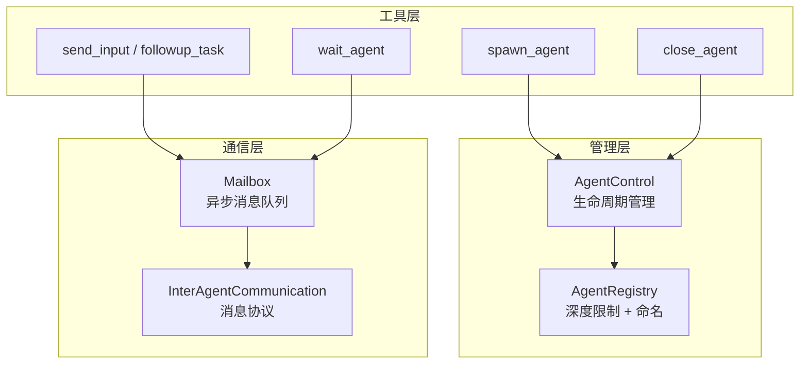

# 06 — 子 Agent 与任务委派

> Codex 不是一个单体 Agent——它可以生成多个子 Agent 并行工作。本章剖析多 Agent 的生成、通信、协调和生命周期管理机制。

## 1. 整体架构与伪代码

多 Agent 系统由三个核心组件构成：

```
// 生成子 Agent
async fn spawn_agent(parent_session, message, role, model) {
    // 1. 检查深度限制
    if depth >= max_agent_depth { return error; }

    // 2. 预留资源（RAII 模式——资源获取即初始化，失败自动释放）
    let reservation = registry.reserve_spawn_slot();
    let nickname = registry.reserve_nickname();  // 随机选名，如 "Euler"

    // 3. 构建子 Agent 配置
    let child_config = parent.turn_context.clone();
    apply_role_overrides(child_config, role);  // explorer / worker / default
    apply_model_overrides(child_config, model);

    // 4. 创建子线程
    let child_thread = thread_manager.new_thread(child_config);
    // 子 Agent 共享 parent 的 AgentRegistry（通过 Weak 引用避免循环）

    // 5. 发送初始消息
    child.mailbox.send(InterAgentCommunication { message, trigger_turn: true });

    return child.thread_id;
}

// Agent 间通信
fn send_message(target, message) {
    let agent_id = resolve_target(target);  // 按路径或 ID 解析
    agent_control.send_inter_agent_communication(agent_id, message);
    // → 消息进入 target 的 Mailbox 队列
    // → target 在下一轮 Turn 的 drain_pending_input 中读取
}
```

**源码**: [agent/control.rs](https://github.com/openai/codex/blob/main/codex-rs/core/src/agent/control.rs)（生成与生命周期管理）, [agent/mailbox.rs](https://github.com/openai/codex/blob/main/codex-rs/core/src/agent/mailbox.rs)（通信）



**源码**: [core/src/agent/](https://github.com/openai/codex/blob/main/codex-rs/core/src/agent/)

## 2. AgentControl：生命周期管理

`AgentControl` 是多 Agent 系统的控制面，每个 Session 持有一个实例，所有子 Agent 共享同一个 `AgentRegistry`：

```rust
pub struct AgentControl {
    manager: Weak<ThreadManagerState>,  // Weak 引用避免循环
    state: Arc<AgentRegistry>,          // 所有 Agent 共享
}
```

> **知识点 — `Weak<T>`**: `Weak` 是 `Arc` 的弱引用版本——它不增加引用计数，不阻止数据被释放。AgentControl 用 Weak 指向 ThreadManagerState，确保子 Agent 不会阻止父 Session 的清理。

### 生成流程

```
spawn_agent_internal()
  1. 检查深度限制（exceeds_thread_spawn_depth_limit）
  2. 预留资源（SpawnReservation — RAII 守卫，离开作用域时自动释放）
     ├── 预留昵称（从 agent_names.txt 随机选）
     └── 预留路径（parent/child 层级）
  3. 决定 fork 模式：
     ├── FullHistory — 继承父 Agent 的完整对话历史
     └── LastNTurns(n) — 只继承最近 N 轮
  4. 构建子 Agent 配置
     ├── 继承父 Agent 的审批/沙箱策略
     ├── 应用角色覆盖（explorer / worker）
     └── 应用模型覆盖（可选不同模型）
  5. 通过 ThreadManager 创建新线程
  6. 注册到 AgentRegistry
  7. 如果 spawn 失败 → SpawnReservation.drop() 自动回滚
```

**源码**: [agent/control.rs:150-402](https://github.com/openai/codex/blob/main/codex-rs/core/src/agent/control.rs#L150-L402)

## 3. Mailbox：异步消息通信

Agent 之间通过 Mailbox 通信。每个 Session 有一个 Mailbox，由发送端和接收端组成：

```rust
pub struct Mailbox {
    tx: mpsc::UnboundedSender<InterAgentCommunication>,
    next_seq: AtomicU64,          // 单调递增序号
    seq_tx: watch::Sender<u64>,   // 通知订阅者
}

pub struct MailboxReceiver {
    rx: mpsc::UnboundedReceiver<InterAgentCommunication>,
    pending_mails: VecDeque<InterAgentCommunication>,
}
```

### 通信流程

```
Agent A 发送消息:
  1. mailbox.send(message)
  2. next_seq 原子递增
  3. 消息进入无界队列
  4. watch channel 通知所有订阅者

Agent B 接收消息:
  1. run_turn() 的 drain_pending_input 阶段
  2. mailbox_receiver.drain() 取出所有排队消息
  3. 消息作为 user input 参与下一轮采样
```

### 两种投递模式（v2）

| 模式 | trigger_turn | 使用工具 | 行为 |
|------|-------------|---------|------|
| **QueueOnly** | false | `send_message` | 消息排队，等 Agent 下一轮 Turn 自然处理 |
| **TriggerTurn** | true | `followup_task` | 消息排队 + 立即唤醒 Agent 开始新 Turn |

> 注意：旧版 `send_input`（`multi_agents/` 目录）绕过 Mailbox，直接提交 `Op::UserInput`。v2 的 `send_message` 和 `followup_task` 才通过 Mailbox 投递。

**源码**: [agent/mailbox.rs](https://github.com/openai/codex/blob/main/codex-rs/core/src/agent/mailbox.rs)

## 4. AgentRegistry：限制与追踪

Registry 负责强制执行安全限制和追踪 Agent 状态：

### 4.1 深度限制

```
root (depth 0)
  └── agent-1 (depth 1)
       └── agent-1a (depth 2)
            └── agent-1a-i (depth 3) ← 可能被拒绝
```

`agent_max_depth` 配置限制最大嵌套深度，防止 Agent 无限递归生成子 Agent。

### 4.2 命名系统

每个子 Agent 被随机分配一个昵称（来自内置的 101 个数学家/哲学家名字，如 "Euler"、"Gauss"），用于人类可读的标识。昵称用完后带序号后缀（"Euler-2nd"）。

### 4.3 SpawnReservation（RAII 守卫）

```rust
pub struct SpawnReservation {
    state: Arc<AgentRegistry>,
    active: bool,
    reserved_agent_nickname: Option<String>,
    reserved_agent_path: Option<AgentPath>,
}
// Drop 时如果 active=true，自动释放预留的昵称和路径
```

这确保了即使 spawn 过程中出错，预留的资源也不会泄漏。

**源码**: [agent/registry.rs](https://github.com/openai/codex/blob/main/codex-rs/core/src/agent/registry.rs)

## 5. Agent 角色

子 Agent 可以指定不同的角色，每种角色有不同的配置：

| 角色 | 用途 | 特点 |
|------|------|------|
| **default** | 通用 Agent | 标准配置 |
| **explorer** | 代码探索 | 快速、权威的代码分析；适合并行 |
| **worker** | 执行实现 | 生产级代码编写 |

角色通过 TOML 配置文件定义，可以覆盖模型、推理强度、审批策略等。用户也可以自定义角色。

```
apply_role_to_config(config, role_name)
  → 加载角色配置（内置或用户自定义）
  → 应用模型/供应商覆盖
  → 保留调用者的 profile/provider（除非角色显式设置）
```

**源码**: [agent/role.rs](https://github.com/openai/codex/blob/main/codex-rs/core/src/agent/role.rs)

## 6. 审批委托：codex_delegate

子 Agent 执行需要审批的操作时（如 shell 命令、文件修改），审批请求会**委托给父 Agent**，但走哪条路径取决于配置：

```
子 Agent 调用 exec_command（需要审批）
  → 子 Agent 发出 ExecApprovalRequest 事件
  → codex_delegate 的 forward_events 任务拦截
  → 检查 routes_approval_to_guardian(parent_ctx)?
    ├── true  → 转发给父 Agent 的 Guardian（AI 审查）
    └── false → 转发给父 Session 的用户审批流程
  → 审查/审批结果返回给子 Agent
  → 子 Agent 继续或放弃执行
```

`codex_delegate` 还负责过滤子 Agent 的事件流——只向父 Agent 转发有意义的事件，过滤掉 delta 增量、token 计数等噪音。

**源码**: [codex_delegate.rs](https://github.com/openai/codex/blob/main/codex-rs/core/src/codex_delegate.rs)

## 7. 多 Agent 工具一览

当前有两套 API 共存：

**v2（multi_agents_v2/，推荐）**：

| 工具 | 说明 | 投递模式 |
|------|------|---------|
| `spawn_agent` | 创建子 Agent（可指定角色、模型、fork 模式） | - |
| `send_message` | 向子 Agent 发送消息 | QueueOnly |
| `followup_task` | 向子 Agent 发送任务并立即唤醒 | TriggerTurn |
| `wait_agent` | 等待当前 Agent 的 mailbox 有新消息（不是等子 Agent 完成） | - |
| `close_agent` | 关闭子 Agent（级联关闭后代） | - |
| `list_agents` | 列出活跃的子 Agent | - |

> ⚠ `wait_agent` 的语义：它订阅的是**当前 Agent 自己的 Mailbox 序号变化**，不是等待某个特定子 Agent 完成。任何 mailbox 消息到达或超时都会触发返回。

**旧版（multi_agents/，兼容）**：

| 工具 | 说明 | 与 v2 区别 |
|------|------|-----------|
| `send_input` | 直接提交 `Op::UserInput`，不走 Mailbox | 绕过了 Mailbox 的排队机制 |
| `resume_agent` | 恢复已关闭的 Agent | v2 中没有对应工具 |

**源码**: [tools/handlers/multi_agents_v2/](https://github.com/openai/codex/blob/main/codex-rs/core/src/tools/handlers/multi_agents_v2), [tools/handlers/multi_agents/](https://github.com/openai/codex/blob/main/codex-rs/core/src/tools/handlers/multi_agents)

## 8. 本章小结

| 组件 | 职责 | 源码 |
|------|------|------|
| **AgentControl** | 生命周期管理（spawn/close/resume），Weak 引用防循环 | [agent/control.rs](https://github.com/openai/codex/blob/main/codex-rs/core/src/agent/control.rs) |
| **Mailbox** | 异步消息队列，单调序号 + watch 通知 | [agent/mailbox.rs](https://github.com/openai/codex/blob/main/codex-rs/core/src/agent/mailbox.rs) |
| **AgentRegistry** | 深度限制、命名、SpawnReservation RAII | [agent/registry.rs](https://github.com/openai/codex/blob/main/codex-rs/core/src/agent/registry.rs) |
| **Agent Role** | 角色配置（default/explorer/worker） | [agent/role.rs](https://github.com/openai/codex/blob/main/codex-rs/core/src/agent/role.rs) |
| **codex_delegate** | 审批委托 + 事件过滤 | [codex_delegate.rs](https://github.com/openai/codex/blob/main/codex-rs/core/src/codex_delegate.rs) |

---

**上一章**: [05 — 上下文与对话管理](05-context-management.md) | **下一章**: [07 — 审批与安全系统](07-approval-safety.md)
