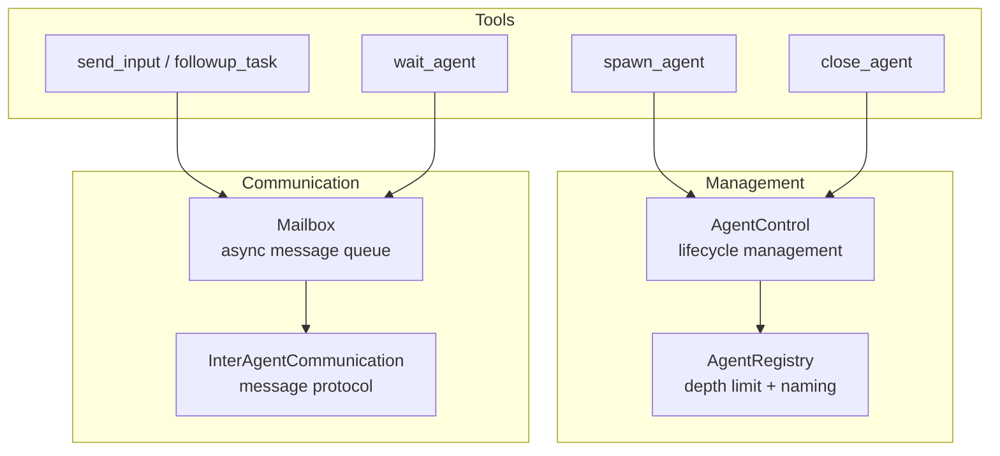

> **Language**: **English** · [中文](06-sub-agent-system.zh.md)

# 06 — Sub-agents and task delegation

> Codex is not a monolithic agent — it can spawn multiple sub-agents that work in parallel. This chapter dissects how multi-agent spawning, communication, coordination, and lifecycle management actually work.

## 1. Overall architecture and pseudocode

The multi-agent system is built from three core components:

```
// Spawn a sub-agent
async fn spawn_agent(parent_session, message, role, model) {
    // 1. Check the depth limit
    if depth >= max_agent_depth { return error; }

    // 2. Reserve resources (RAII pattern — resource acquisition is initialization; auto-released on failure)
    let reservation = registry.reserve_spawn_slot();
    let nickname = registry.reserve_nickname();  // Pick a random name, e.g. "Euler"

    // 3. Build the sub-agent config
    let child_config = parent.turn_context.clone();
    apply_role_overrides(child_config, role);  // explorer / worker / default
    apply_model_overrides(child_config, model);

    // 4. Create the child thread
    let child_thread = thread_manager.new_thread(child_config);
    // The sub-agent shares the parent's AgentRegistry (via a Weak reference to avoid cycles)

    // 5. Send the initial message
    child.mailbox.send(InterAgentCommunication { message, trigger_turn: true });

    return child.thread_id;
}

// Inter-agent communication
fn send_message(target, message) {
    let agent_id = resolve_target(target);  // Resolve by path or ID
    agent_control.send_inter_agent_communication(agent_id, message);
    // → Message lands in target's Mailbox queue
    // → target picks it up in the next Turn's drain_pending_input phase
}
```

**Source**: [agent/control.rs](https://github.com/openai/codex/blob/main/codex-rs/core/src/agent/control.rs) (spawning and lifecycle), [agent/mailbox.rs](https://github.com/openai/codex/blob/main/codex-rs/core/src/agent/mailbox.rs) (communication)



**Source**: [core/src/agent/](https://github.com/openai/codex/blob/main/codex-rs/core/src/agent/)

## 2. AgentControl: lifecycle management

`AgentControl` is the control plane of the multi-agent system. Each Session holds one instance, and all sub-agents share the same `AgentRegistry`:

```rust
pub struct AgentControl {
    manager: Weak<ThreadManagerState>,  // Weak reference to avoid cycles
    state: Arc<AgentRegistry>,          // Shared by all agents
}
```

> **Tip — `Weak<T>`**: `Weak` is the weak-reference counterpart of `Arc` — it does not increment the strong reference count and does not keep the data alive. AgentControl uses `Weak` to point at `ThreadManagerState`, ensuring sub-agents never keep the parent Session from being cleaned up.

### Spawn flow

```
spawn_agent_internal()
  1. Check the depth limit (exceeds_thread_spawn_depth_limit)
  2. Reserve resources (SpawnReservation — an RAII guard that auto-releases when it goes out of scope)
     ├── Reserve a nickname (chosen at random from agent_names.txt)
     └── Reserve a path (parent/child hierarchy)
  3. Decide the fork mode:
     ├── FullHistory — inherit the parent agent's complete conversation history
     └── LastNTurns(n) — inherit only the most recent N turns
  4. Build the sub-agent config
     ├── Inherit the parent's approval / sandbox policy
     ├── Apply role overrides (explorer / worker)
     └── Apply model overrides (optional alternative model)
  5. Create a new thread via ThreadManager
  6. Register it in AgentRegistry
  7. If spawn fails → SpawnReservation.drop() rolls back automatically
```

**Source**: [agent/control.rs:150-402](https://github.com/openai/codex/blob/main/codex-rs/core/src/agent/control.rs#L150-L402)

## 3. Mailbox: asynchronous message communication

Agents talk to each other through a Mailbox. Each Session owns one Mailbox, made up of a sender and a receiver:

```rust
pub struct Mailbox {
    tx: mpsc::UnboundedSender<InterAgentCommunication>,
    next_seq: AtomicU64,          // Monotonically increasing sequence number
    seq_tx: watch::Sender<u64>,   // Notifies subscribers
}

pub struct MailboxReceiver {
    rx: mpsc::UnboundedReceiver<InterAgentCommunication>,
    pending_mails: VecDeque<InterAgentCommunication>,
}
```

### Communication flow

```
Agent A sends a message:
  1. mailbox.send(message)
  2. next_seq is atomically incremented
  3. Message is enqueued onto the unbounded queue
  4. The watch channel notifies all subscribers

Agent B receives the message:
  1. Inside run_turn()'s drain_pending_input phase
  2. mailbox_receiver.drain() pulls every queued message
  3. The messages are fed in as user input for the next sampling round
```

### Two delivery modes (v2)

| Mode | trigger_turn | Tool used | Behavior |
|------|--------------|-----------|----------|
| **QueueOnly** | false | `send_message` | Message is queued; the agent processes it naturally on its next Turn |
| **TriggerTurn** | true | `followup_task` | Message is queued and the agent is woken up to start a new Turn immediately |

> Note: the legacy `send_input` (under `multi_agents/`) bypasses the Mailbox and submits `Op::UserInput` directly. Only v2's `send_message` and `followup_task` deliver through the Mailbox.

**Source**: [agent/mailbox.rs](https://github.com/openai/codex/blob/main/codex-rs/core/src/agent/mailbox.rs)

## 4. AgentRegistry: limits and tracking

The Registry enforces safety limits and tracks agent state:

### 4.1 Depth limit

```
root (depth 0)
  └── agent-1 (depth 1)
       └── agent-1a (depth 2)
            └── agent-1a-i (depth 3) ← may be rejected
```

The `agent_max_depth` setting caps the maximum nesting depth, preventing an agent from recursively spawning sub-agents without bound.

### 4.2 Naming system

Each sub-agent is assigned a random nickname drawn from a built-in list of 101 mathematicians and philosophers (e.g. "Euler", "Gauss"), giving it a human-readable identifier. Once the names are exhausted, suffixes are appended ("Euler-2nd").

### 4.3 SpawnReservation (RAII guard)

```rust
pub struct SpawnReservation {
    state: Arc<AgentRegistry>,
    active: bool,
    reserved_agent_nickname: Option<String>,
    reserved_agent_path: Option<AgentPath>,
}
// On Drop, if active == true the reserved nickname and path are released automatically
```

This guarantees that even if something goes wrong mid-spawn, the reserved resources cannot leak.

**Source**: [agent/registry.rs](https://github.com/openai/codex/blob/main/codex-rs/core/src/agent/registry.rs)

## 5. Agent roles

Sub-agents can be tagged with different roles, each carrying its own configuration:

| Role | Purpose | Characteristics |
|------|---------|-----------------|
| **default** | General-purpose agent | Standard configuration |
| **explorer** | Code exploration | Fast, authoritative code analysis; well suited for parallel use |
| **worker** | Execution and implementation | Production-quality code writing |

Roles are defined via TOML configuration files and can override model, reasoning effort, approval policy, and more. Users can also define their own roles.

```
apply_role_to_config(config, role_name)
  → Load the role config (built-in or user-defined)
  → Apply model / provider overrides
  → Preserve the caller's profile/provider unless the role sets them explicitly
```

**Source**: [agent/role.rs](https://github.com/openai/codex/blob/main/codex-rs/core/src/agent/role.rs)

## 6. Approval delegation: codex_delegate

When a sub-agent performs an operation that requires approval (e.g. a shell command or a file modification), the approval request is **delegated to the parent agent**, with the actual route depending on configuration:

```
Sub-agent invokes exec_command (requires approval)
  → Sub-agent emits an ExecApprovalRequest event
  → codex_delegate's forward_events task intercepts it
  → Check routes_approval_to_guardian(parent_ctx)?
    ├── true  → Forward to the parent agent's Guardian (AI review)
    └── false → Forward to the parent Session's user-approval flow
  → The review/approval result is returned to the sub-agent
  → The sub-agent then either continues or aborts
```

`codex_delegate` is also responsible for filtering the sub-agent's event stream — only meaningful events are forwarded to the parent agent, while delta updates, token counts, and other noise are filtered out.

**Source**: [codex_delegate.rs](https://github.com/openai/codex/blob/main/codex-rs/core/src/codex_delegate.rs)

## 7. Multi-agent tool reference

Two API surfaces currently coexist:

**v2 (`multi_agents_v2/`, recommended)**:

| Tool | Description | Delivery mode |
|------|-------------|---------------|
| `spawn_agent` | Create a sub-agent (role, model, and fork mode all configurable) | - |
| `send_message` | Send a message to a sub-agent | QueueOnly |
| `followup_task` | Send a task to a sub-agent and wake it immediately | TriggerTurn |
| `wait_agent` | Wait until the current agent's mailbox has new messages (not the same as waiting for a sub-agent to finish) | - |
| `close_agent` | Close a sub-agent (descendants are closed cascadingly) | - |
| `list_agents` | List active sub-agents | - |

> ⚠ Semantics of `wait_agent`: it subscribes to **the current agent's own Mailbox sequence number**, not to a particular sub-agent's completion. Any incoming mailbox message or a timeout will cause it to return.

**Legacy (`multi_agents/`, kept for compatibility)**:

| Tool | Description | Difference vs v2 |
|------|-------------|------------------|
| `send_input` | Submits `Op::UserInput` directly, bypassing the Mailbox | Skips the Mailbox queue mechanism |
| `resume_agent` | Resume a closed agent | No equivalent exists in v2 |

**Source**: [tools/handlers/multi_agents_v2/](https://github.com/openai/codex/blob/main/codex-rs/core/src/tools/handlers/multi_agents_v2), [tools/handlers/multi_agents/](https://github.com/openai/codex/blob/main/codex-rs/core/src/tools/handlers/multi_agents)

## 8. Chapter summary

| Component | Responsibility | Source |
|-----------|----------------|--------|
| **AgentControl** | Lifecycle management (spawn / close / resume); uses Weak references to avoid cycles | [agent/control.rs](https://github.com/openai/codex/blob/main/codex-rs/core/src/agent/control.rs) |
| **Mailbox** | Async message queue with monotonic sequence numbers and watch notifications | [agent/mailbox.rs](https://github.com/openai/codex/blob/main/codex-rs/core/src/agent/mailbox.rs) |
| **AgentRegistry** | Depth limits, naming, and RAII via SpawnReservation | [agent/registry.rs](https://github.com/openai/codex/blob/main/codex-rs/core/src/agent/registry.rs) |
| **Agent Role** | Role configuration (default / explorer / worker) | [agent/role.rs](https://github.com/openai/codex/blob/main/codex-rs/core/src/agent/role.rs) |
| **codex_delegate** | Approval delegation and event filtering | [codex_delegate.rs](https://github.com/openai/codex/blob/main/codex-rs/core/src/codex_delegate.rs) |

---

**Previous**: [05 — Context and conversation management](05-context-management.md) | **Next**: [07 — Approval and safety system](07-approval-safety.md)
