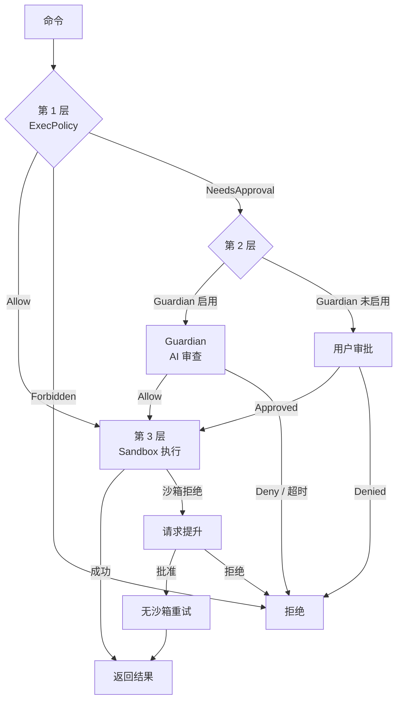

# 07 — 审批与安全系统

> Codex 在本地执行代码——安全性至关重要。本章剖析其三层安全架构：ExecPolicy（规则）→ Guardian（AI 审查）→ Sandbox（OS 隔离），以及网络访问控制和审批模式。

## 1. 三层架构与伪代码

每个需要执行的命令经过三层安全检查：

```
async fn check_and_execute(command, ctx) {
    // ── 第 1 层：ExecPolicy（规则匹配）──
    let requirement = exec_policy.evaluate(command);
    match requirement {
        Skip { bypass_sandbox } => {
            // 匹配到 Allow 规则或已知安全命令
            if bypass_sandbox { execute_without_sandbox(); }
            else { goto layer_3; }
        }
        Forbidden { reason } => return reject(reason),
        NeedsApproval { reason } => {
            // ── 第 2 层：Guardian 或用户审批 ──
            if routes_to_guardian(ctx) {
                // AI 审查（90 秒超时，超时 = 拒绝）
                let assessment = guardian.review(command, transcript);
                if assessment.outcome == Deny { return reject(); }
            } else {
                // 直接询问用户
                let decision = ask_user(reason);
                if decision == Denied { return reject(); }
            }
        }
    }

    // ── 第 3 层：Sandbox（OS 隔离）──
    let sandbox = sandbox_manager.select(platform, policy);
    let result = execute_in_sandbox(command, sandbox);
    if result == SandboxDenied {
        // 请求提升权限，用户批准后无沙箱重试
        ask_escalation() → execute_without_sandbox();
    }
}
```



## 2. 第 1 层：ExecPolicy — 规则匹配

ExecPolicy 使用基于 Starlark 的 `.rules` 文件定义命令级别的访问策略。

### 2.1 Decision 三态

```rust
enum Decision {
    Allow,      // 允许执行
    Prompt,     // 需要审批
    Forbidden,  // 禁止执行
}
```

### 2.2 评估流程

```
evaluate(command)
  1. 将命令按 shell 控制符（|, &&, ||, ;）拆分为独立段
  2. 每段独立匹配 .rules 文件
  3. 匹配到规则 → 返回规则的 Decision
  4. 未匹配到规则 → 启发式判断：
     ├── is_known_safe_command()? → Allow
     ├── command_might_be_dangerous()? → Prompt 或 Forbidden
     └── 根据 approval_policy 决定
```

### 2.3 审批模式

| 模式 | 行为 |
|------|------|
| `Never` | 全部自动批准，从不询问 |
| `OnFailure` | 先在沙箱中执行，失败后才询问。但对危险命令（如 `rm -rf`）会先 Prompt 再执行 |
| `OnRequest` | 由模型决定何时请求审批 |
| `UnlessTrusted` | 只自动批准已知安全的只读命令 |
| `Granular(config)` | 按类别细粒度控制（sandbox/rules/skill/mcp） |

> **默认值取决于信任级别**：trusted 项目（用户已确认信任的目录）默认 `OnRequest`；untrusted 项目默认 `UnlessTrusted`——更严格，大多数命令都需要审批。

### 2.4 命令修正建议

当命令被 Prompt 时，ExecPolicy 会生成一个 `proposed_execpolicy_amendment`——建议的 prefix_rule。但这**只是一个候选项**，不会自动持久化：

- **普通批准** / **Session 批准**：只对当前操作或当前 Session 有效，**不写入** `.rules` 文件
- **显式选择持久化**（`AcceptWithExecpolicyAmendment`）：用户主动选择这个分支时，才会调用 `persist_execpolicy_amendment` 将规则写入磁盘

> 某些前缀被**禁止建议**（`BANNED_PREFIX_SUGGESTIONS`），如 `python3`、`bash`、`node`、`sudo`——因为批准这些前缀等于批准任意脚本执行。

**源码**: [exec_policy.rs](https://github.com/openai/codex/blob/main/codex-rs/core/src/exec_policy.rs)

## 3. 第 2 层：Guardian — AI 审查

Guardian 是一个**独立的 AI 子 Agent**，专门审查主 Agent 的工具调用是否安全。

### 3.1 核心参数

| 参数 | 值 |
|------|-----|
| 模型 | gpt-5.4 |
| 超时 | 90 秒 |
| 最大消息摘要 | 10,000 tokens |
| 最大工具摘要 | 10,000 tokens |
| 最近条目上限 | 40 条 |

### 3.2 审查输出

Guardian 返回一个结构化的 JSON 评估：

```json
{
  "risk_level": "low | medium | high | critical",
  "user_authorization": "unknown | low | medium | high",
  "outcome": "allow | deny",
  "rationale": "..."
}
```

### 3.3 Fail-Closed 设计

| 故障场景 | 结果 |
|---------|------|
| 超时（> 90 秒） | **拒绝** |
| JSON 解析失败 | **拒绝** |
| 被取消（用户中断） | 中止（不执行） |
| Guardian 自身出错 | **拒绝** |

> 所有失败模式都导致拒绝，从不自动批准——这就是 "fail-closed" 设计。

### 3.4 Guardian 的安全隔离

Guardian 自身运行在严格锁定的 Session 中：

| 配置 | 值 | 原因 |
|------|-----|------|
| `approval_policy` | `Never` | 防止 Guardian 递归触发审批 |
| `sandbox_policy` | `ReadOnly` | Guardian 不能写入文件 |
| Collab/Spawn | 禁用 | 不能创建子 Agent |
| WebSearch | 禁用 | 不能联网搜索 |
| ExecPolicy | **不继承** | 防止主 Agent 的规则影响 Guardian 判断 |

### 3.5 Session 复用：Trunk + Ephemeral

Guardian 维护一个长期的 "trunk" Session（复用 prompt cache），并在 trunk 繁忙时创建 "ephemeral" 分叉 Session，支持**并行审查**而不互相阻塞。

### 3.6 触发条件

Guardian 只在两个条件同时满足时启用：

```rust
fn routes_approval_to_guardian(turn: &TurnContext) -> bool {
    turn.approval_policy == AskForApproval::OnRequest
        && turn.config.approvals_reviewer == ApprovalsReviewer::GuardianSubagent
}
```

不满足时，审批请求直接路由到用户。

**源码**: [guardian/](https://github.com/openai/codex/blob/main/codex-rs/core/src/guardian/)

## 4. 第 3 层：Sandbox — OS 级隔离

通过审批后，命令在操作系统沙箱中执行：

### 4.1 沙箱类型

| SandboxType | 平台 | 实现 |
|-------------|------|------|
| `MacosSeatbelt` | macOS | `sandbox-exec` + `.sbpl` 策略文件 |
| `LinuxSeccomp` | Linux | Bubblewrap + Seccomp/Landlock |
| `WindowsRestrictedToken` | Windows | 降权进程 Token |
| `None` | 任意 | 无沙箱（用户显式批准后） |

### 4.2 选择逻辑

```
SandboxManager.select(preference, policy)
  → Forbid   → None（用户请求无沙箱）
  → Require  → 当前平台对应的沙箱
  → Auto     → 检查 file_system_policy / network_policy：
               如果有限制 → 使用平台沙箱
               如果全开放 → None
```

### 4.3 沙箱策略

| SandboxPolicy | 文件系统 | 网络 |
|---------------|---------|------|
| `read-only` | 只读 | 禁止 |
| `workspace-write` | cwd + writable_roots 可写 | 禁止 |
| `full-access` | 全部可写 | 允许 |

**源码**: [sandboxing/src/manager.rs](https://github.com/openai/codex/blob/main/codex-rs/sandboxing/src/manager.rs), [seatbelt.rs](https://github.com/openai/codex/blob/main/codex-rs/core/src/seatbelt.rs), [landlock.rs](https://github.com/openai/codex/blob/main/codex-rs/core/src/landlock.rs)

## 5. 网络访问控制

网络审批**不是独立于沙箱的附加层**，而是受 sandbox policy 和 approval policy 共同约束：

```
网络请求到达:
  → 前置条件检查：
    ├── 当前 Turn 存在？
    ├── sandbox 是 ReadOnly 或 WorkspaceWrite？
    └── approval_policy 允许网络审批？
    → 任一不满足 → 直接 deny（不弹审批）

  → 缓存查找（key = host + protocol + port）：
    ├── session_denied → 直接拒绝
    └── session_approved → 直接放行

  → 首次访问：弹出审批请求
    → AllowOnce / AllowForSession / Deny
```

> ⚠ 在 `full-access` 沙箱、无活动 Turn、或 `approval_policy = Never` 等条件下，**不会进入网络审批流程**——网络请求直接被沙箱层决定。

Guardian 会从父 Session 继承已批准的主机列表，但只用于只读策略检查。

**源码**: [tools/network_approval.rs](https://github.com/openai/codex/blob/main/codex-rs/core/src/tools/network_approval.rs)

## 6. 本章小结

| 层 | 组件 | 职责 | 源码 |
|----|------|------|------|
| **1** | ExecPolicy | 基于规则的命令评估（Allow/Prompt/Forbidden） | [exec_policy.rs](https://github.com/openai/codex/blob/main/codex-rs/core/src/exec_policy.rs) |
| **2** | Guardian | AI 审查（gpt-5.4, 90s 超时, fail-closed） | [guardian/](https://github.com/openai/codex/blob/main/codex-rs/core/src/guardian/) |
| **3** | Sandbox | OS 级隔离（Seatbelt/Landlock/Windows） | [sandboxing/](https://github.com/openai/codex/blob/main/codex-rs/sandboxing/src/) |
| **-** | NetworkApproval | 按主机的网络访问控制 | [network_approval.rs](https://github.com/openai/codex/blob/main/codex-rs/core/src/tools/network_approval.rs) |

---

> **源码版本说明**: 本文基于 [openai/codex](https://github.com/openai/codex) 主分支分析。

---

**上一章**: [06 — 子 Agent 与任务委派](06-sub-agent-system.md) | **下一章**: [08 — API 与模型交互](08-api-model-interaction.md)
