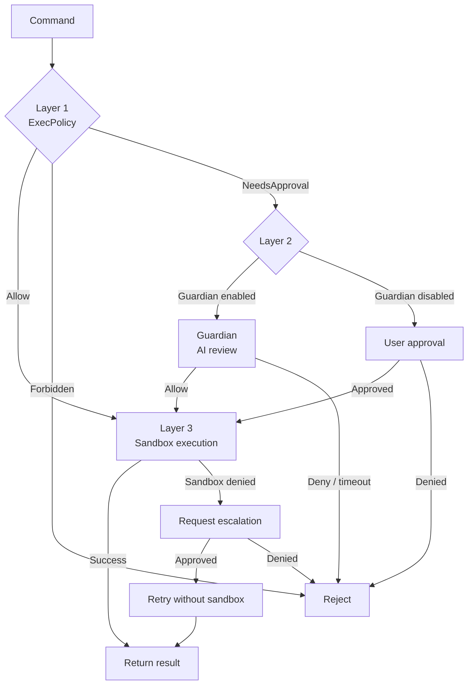

> **Language**: **English** · [中文](07-approval-safety.zh.md)

# 07 — Approval & Safety System

> Codex executes code locally — safety is critical. This chapter dissects the three-layer safety architecture: ExecPolicy (rules) → Guardian (AI review) → Sandbox (OS isolation), along with network access control and approval modes.

## 1. Three-layer architecture and pseudocode

Every command that needs to be executed passes through three layers of safety checks:

```
async fn check_and_execute(command, ctx) {
    // ── Layer 1: ExecPolicy (rule matching) ──
    let requirement = exec_policy.evaluate(command);
    match requirement {
        Skip { bypass_sandbox } => {
            // matched an Allow rule, or a known-safe command
            if bypass_sandbox { execute_without_sandbox(); }
            else { goto layer_3; }
        }
        Forbidden { reason } => return reject(reason),
        NeedsApproval { reason } => {
            // ── Layer 2: Guardian or user approval ──
            if routes_to_guardian(ctx) {
                // AI review (90s timeout, timeout = deny)
                let assessment = guardian.review(command, transcript);
                if assessment.outcome == Deny { return reject(); }
            } else {
                // ask the user directly
                let decision = ask_user(reason);
                if decision == Denied { return reject(); }
            }
        }
    }

    // ── Layer 3: Sandbox (OS isolation) ──
    let sandbox = sandbox_manager.select(platform, policy);
    let result = execute_in_sandbox(command, sandbox);
    if result == SandboxDenied {
        // ask for escalation; on user approval retry without the sandbox
        ask_escalation() → execute_without_sandbox();
    }
}
```

**Source**: [exec_policy.rs](https://github.com/openai/codex/blob/main/codex-rs/core/src/exec_policy.rs) (ExecPolicy rule matching), [guardian/](https://github.com/openai/codex/blob/main/codex-rs/core/src/guardian/) (AI review), [tools/orchestrator.rs](https://github.com/openai/codex/blob/main/codex-rs/core/src/tools/orchestrator.rs) (sandbox execution)



## 2. Layer 1: ExecPolicy — rule matching

ExecPolicy uses Starlark-based `.rules` files to define command-level access policies.

### 2.1 The Decision tri-state

```rust
enum Decision {
    Allow,      // allow execution
    Prompt,     // approval required
    Forbidden,  // execution forbidden
}
```

### 2.2 Evaluation flow

```
evaluate(command)
  1. Split the command at shell control operators (|, &&, ||, ;) into independent segments
  2. Match each segment against the .rules file independently
  3. Rule matched → return the rule's Decision
  4. No rule matched → fall back to heuristics:
     ├── is_known_safe_command()? → Allow
     ├── command_might_be_dangerous()? → Prompt or Forbidden
     └── otherwise decide based on approval_policy
```

### 2.3 Approval modes

| Mode | Behavior |
|------|----------|
| `Never` | Auto-approve everything; never ask |
| `OnFailure` | Run inside the sandbox first; only ask after failure. Dangerous commands (e.g. `rm -rf`) still Prompt up front |
| `OnRequest` | The model decides when to request approval |
| `UnlessTrusted` | Auto-approve only known-safe read-only commands |
| `Granular(config)` | Fine-grained control by category (sandbox/rules/skill/mcp) |

> **The default depends on trust level**: trusted projects (directories the user has explicitly trusted) default to `OnRequest`; untrusted projects default to `UnlessTrusted` — stricter, requiring approval for most commands.

### 2.4 Command-amendment suggestions

When a command is Prompted, ExecPolicy generates a `proposed_execpolicy_amendment` — a suggested prefix_rule. But this is **only a candidate** and is not auto-persisted:

- **Plain approval** / **Session approval**: only valid for the current operation or current session; **not written** to the `.rules` file
- **Explicit persistence** (`AcceptWithExecpolicyAmendment`): only when the user actively picks this branch is `persist_execpolicy_amendment` called to write the rule to disk

> Some prefixes are **forbidden as suggestions** (`BANNED_PREFIX_SUGGESTIONS`) — `python3`, `bash`, `node`, `sudo` — because approving these prefixes would amount to approving the execution of arbitrary scripts.

**Source**: [exec_policy.rs](https://github.com/openai/codex/blob/main/codex-rs/core/src/exec_policy.rs)

## 3. Layer 2: Guardian — AI review

Guardian is a **dedicated AI sub-agent** whose sole job is to review whether the main agent's tool calls are safe.

### 3.1 Core parameters

| Parameter | Value |
|-----------|-------|
| Model | gpt-5.4 |
| Timeout | 90 seconds |
| Max message summary | 10,000 tokens |
| Max tool summary | 10,000 tokens |
| Recent-entry cap | 40 entries |

### 3.2 Review output

Guardian returns a structured JSON assessment:

```json
{
  "risk_level": "low | medium | high | critical",
  "user_authorization": "unknown | low | medium | high",
  "outcome": "allow | deny",
  "rationale": "..."
}
```

### 3.3 Fail-closed design

> **Fail-closed** means the system defaults to **denying** the operation whenever anything goes wrong, rather than letting it through. The opposite is fail-open, where anomalies default to allow. Safety systems usually pick fail-closed.

| Failure scenario | Result |
|------------------|--------|
| Timeout (> 90s) | **Deny** |
| JSON parse failure | **Deny** |
| Cancelled (user interrupt) | Abort (do not execute) |
| Guardian itself errors | **Deny** |

> Every failure mode results in denial — never auto-approval. That is the essence of a fail-closed design.

### 3.4 Guardian's own isolation

Guardian itself runs inside a tightly locked-down session:

| Setting | Value | Reason |
|---------|-------|--------|
| `approval_policy` | `Never` | Prevents Guardian from recursively triggering approvals |
| `sandbox_policy` | `ReadOnly` | Guardian cannot write files |
| Collab/Spawn | Disabled | Cannot spawn sub-agents |
| WebSearch | Disabled | Cannot perform web searches |
| ExecPolicy | **Not inherited** | Prevents the main agent's rules from biasing Guardian's judgement |

### 3.5 Session reuse: trunk + ephemeral

Guardian maintains a long-lived "trunk" session (which reuses the prompt cache) and forks an "ephemeral" session when the trunk is busy, supporting **parallel reviews** without blocking each other.

### 3.6 Trigger conditions

Guardian is only enabled when both of these conditions hold:

```rust
fn routes_approval_to_guardian(turn: &TurnContext) -> bool {
    turn.approval_policy == AskForApproval::OnRequest
        && turn.config.approvals_reviewer == ApprovalsReviewer::GuardianSubagent
}
```

When they don't hold, the approval request is routed straight to the user.

**Source**: [guardian/](https://github.com/openai/codex/blob/main/codex-rs/core/src/guardian/)

## 4. Layer 3: Sandbox — OS-level isolation

Once approved, the command runs inside an OS sandbox:

### 4.1 Sandbox types

| SandboxType | Platform | Implementation |
|-------------|----------|----------------|
| `MacosSeatbelt` | macOS | `sandbox-exec` + `.sbpl` policy file |
| `LinuxSeccomp` | Linux | Bubblewrap + Seccomp/Landlock |
| `WindowsRestrictedToken` | Windows | Down-scoped process token |
| `None` | any | No sandbox (after explicit user approval) |

### 4.2 Selection logic

```
SandboxManager.select(preference, policy)
  → Forbid   → None (user requested no sandbox)
  → Require  → the platform's native sandbox
  → Auto     → inspect file_system_policy / network_policy:
               if any restriction is set → use the platform sandbox
               if everything is open     → None
```

### 4.3 Sandbox policies

| SandboxPolicy | File system | Network |
|---------------|-------------|---------|
| `read-only` | read-only | denied |
| `workspace-write` | cwd + writable_roots writable | denied |
| `full-access` | fully writable | allowed |

**Source**: [sandboxing/src/manager.rs](https://github.com/openai/codex/blob/main/codex-rs/sandboxing/src/manager.rs), [seatbelt.rs](https://github.com/openai/codex/blob/main/codex-rs/core/src/seatbelt.rs), [landlock.rs](https://github.com/openai/codex/blob/main/codex-rs/core/src/landlock.rs)

## 5. Network access control

Network approval is **not a standalone layer on top of the sandbox** — it is jointly constrained by the sandbox policy and the approval policy:

```
A network request arrives:
  → Preconditions:
    ├── Is there an active turn?
    ├── Is the sandbox ReadOnly or WorkspaceWrite?
    └── Does approval_policy permit network approval?
    → If any fails → deny outright (no approval prompt)

  → Cache lookup (key = host + protocol + port):
    ├── session_denied → reject immediately
    └── session_approved → allow immediately

  → First-time access: surface an approval request
    → AllowOnce / AllowForSession / Deny
```

> ⚠ Under `full-access` sandbox, with no active turn, or with `approval_policy = Never`, the network-approval flow is **not entered** — the request is decided directly by the sandbox layer.

Guardian inherits the parent session's approved-host list, but uses it only for read-only policy checks.

**Source**: [tools/network_approval.rs](https://github.com/openai/codex/blob/main/codex-rs/core/src/tools/network_approval.rs)

## 6. Chapter summary

| Layer | Component | Responsibility | Source |
|-------|-----------|----------------|--------|
| **1** | ExecPolicy | Rule-based command evaluation (Allow/Prompt/Forbidden) | [exec_policy.rs](https://github.com/openai/codex/blob/main/codex-rs/core/src/exec_policy.rs) |
| **2** | Guardian | AI review (gpt-5.4, 90s timeout, fail-closed) | [guardian/](https://github.com/openai/codex/blob/main/codex-rs/core/src/guardian/) |
| **3** | Sandbox | OS-level isolation (Seatbelt/Landlock/Windows) | [sandboxing/](https://github.com/openai/codex/blob/main/codex-rs/sandboxing/src/) |
| **-** | NetworkApproval | Per-host network access control | [network_approval.rs](https://github.com/openai/codex/blob/main/codex-rs/core/src/tools/network_approval.rs) |

---

**Previous**: [06 — Sub-agent system & task delegation](06-sub-agent-system.md) | **Next**: [08 — API and model interaction](08-api-model-interaction.md)
