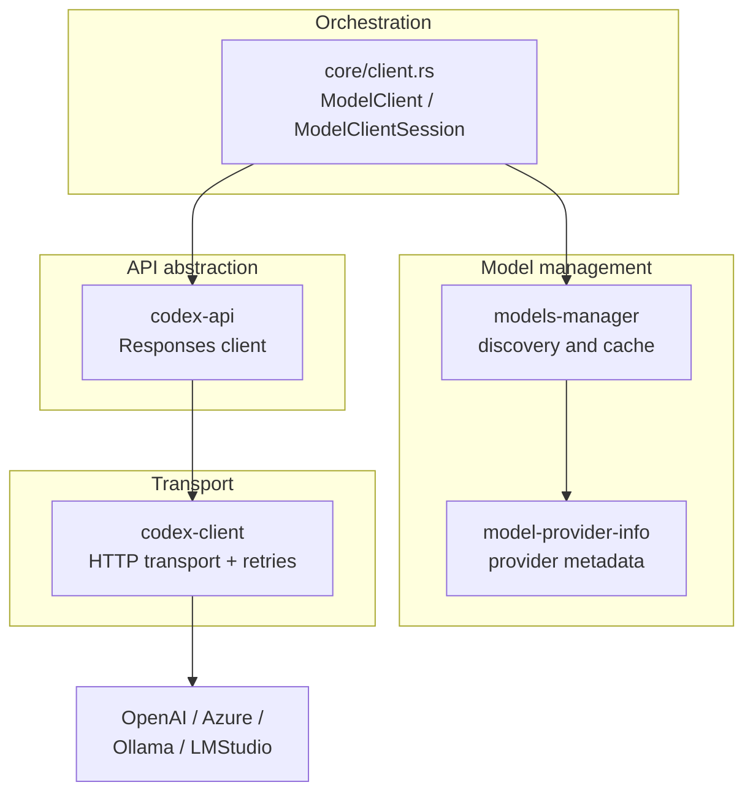

> **Language**: **English** · [中文](08-api-model-interaction.zh.md)

# 08 — API and Model Interaction

> This chapter focuses on how the Codex Agent communicates with the LLM: model selection, provider adaptation, transport protocols, and streaming response handling.

## 1. Big picture

When the Agent Loop needs to call the model, the request flows through four layers: the **orchestration layer** picks a transport and injects context → **model management** resolves the model and provider → the **API abstraction** builds the protocol request → the **transport layer** issues the HTTP / WebSocket call.



| Layer | Crate | Responsibility | Source |
|-------|-------|----------------|--------|
| **Orchestration** | `core/client.rs` | Two-tier client, transport selection, WebSocket connection reuse, telemetry injection | [client.rs](https://github.com/openai/codex/blob/main/codex-rs/core/src/client.rs) (~1,900 lines) |
| **Model management** | `models-manager` | Model discovery, local cache (TTL ~300s), metadata enrichment | [models-manager/](https://github.com/openai/codex/blob/main/codex-rs/models-manager/src/) (11 files) |
| **Model management** | `model-provider-info` | Provider definitions: base_url, wire_api, WebSocket support, timeouts | [model-provider-info/](https://github.com/openai/codex/blob/main/codex-rs/model-provider-info/src/) (~384 lines) |
| **API abstraction** | `codex-api` | Responses HTTP/WebSocket client, SSE parsing, request construction | [codex-api/](https://github.com/openai/codex/blob/main/codex-rs/codex-api/src/) (33 files) |
| **Transport** | `codex-client` | reqwest wrapper, exponential-backoff retries, compression, custom CA | [codex-client/](https://github.com/openai/codex/blob/main/codex-rs/codex-client/src/) (10 files) |

> Supporting modules — auth (`login`, `keyring-store`), local-inference bootstrap (`ollama`, `lmstudio`), network-policy proxy (`network-proxy`) — are out of scope here; they belong to the configuration / safety subsystems.

## 2. Model management and provider adaptation

### 2.1 Model discovery

`models-manager` is responsible for resolving a user-specified model name into complete model information ([models-manager/src/manager.rs](https://github.com/openai/codex/blob/main/codex-rs/models-manager/src/manager.rs)):

```
User specifies --model gpt-5.4
  → Manager checks the local cache (TTL ~300s)
    → cache hit: return ModelInfo
    → cache miss:
        → call codex-api::ModelsClient to request /v1/models
        → merge with default config from the built-in models.json
        → enrich metadata (capabilities, cost, limits)
        → write to cache and return
```

**Source**: [models-manager/src/manager.rs](https://github.com/openai/codex/blob/main/codex-rs/models-manager/src/manager.rs)

`ModelInfo` carries capability flags (whether the model supports reasoning, tool calls, image input, etc.), token limits, and pricing information, which the Agent Loop uses to make decisions when building a request.

### 2.2 Provider registration

`model-provider-info` defines the provider metadata struct `ModelProviderInfo`, which describes how to connect to an LLM service endpoint:

```rust
// model-provider-info/src/lib.rs
pub struct ModelProviderInfo {
    pub name: String,              // display name
    pub base_url: String,          // API endpoint
    pub wire_api: WireApi,         // protocol (currently only Responses)
    pub supports_websockets: bool, // whether WebSocket is supported
    pub env_key: Option<String>,   // env var name for the API key
    pub headers: HashMap<...>,     // custom request headers
    pub timeout: Option<Duration>, // request timeout
    // ...
}
```

Three providers are built in; users can add custom ones via `config.toml`:

| Provider | ID | base_url | WebSocket |
|----------|-----|----------|-----------|
| **OpenAI** | `openai` | `https://api.openai.com/v1` | supported |
| **Ollama** | `ollama` | `http://localhost:11434/v1` | not supported |
| **LM Studio** | `lmstudio` | `http://localhost:1234/v1` | not supported |

```toml
# config.toml — example custom provider
[model_providers.my_provider]
name = "My Provider"
base_url = "http://localhost:8080/v1"
wire_api = "responses"
supports_websockets = false
env_key = "MY_API_KEY"
```

**Source**: [model-provider-info/src/lib.rs](https://github.com/openai/codex/blob/main/codex-rs/model-provider-info/src/lib.rs)

## 3. Two-tier client

`core/client.rs` is the orchestration layer between the Agent Loop and the LLM. It implements a two-tier client, with each tier managing state at a different lifetime.

### 3.1 The two tiers

| Tier | Type | Lifetime | Holds |
|------|------|----------|-------|
| **Session-level** | `ModelClient` | Same as the Session | auth, provider, conversation_id, HTTP-fallback flag |
| **Turn-level** | `ModelClientSession` | Same as the Turn | WebSocket connection cache, sticky routing token |

> The actual lifetime of a WebSocket connection **spans Turns** — when a Turn ends, the connection is cached and reused by the next Turn. After context compaction the connection is reset (because the prompt cache is invalidated).

### 3.2 Transport selection: WebSocket vs HTTP SSE

```
async fn stream(prompt) {
    if provider.supports_websockets && !force_http_fallback {
        match try_websocket(prompt).await {
            Ok(stream) => return stream,       // WebSocket succeeded
            Err(_) => switch_to_http_fallback() // fall back to HTTP
        }
    }
    return try_http_sse(prompt).await;         // HTTP SSE
}
```

**Source**: [client.rs:1434-1482](https://github.com/openai/codex/blob/main/codex-rs/core/src/client.rs#L1434-L1482)

| Transport | Protocol | Pros | Cons |
|-----------|----------|------|------|
| **WebSocket** | `wss://` + `response.create` | Low latency, connection reuse, supports prewarm | Some proxies / firewalls do not support it |
| **HTTP SSE** | `POST /v1/responses` + `stream=true` | Best compatibility | New connection on every request |

WebSocket also supports **prewarm** (`generate=false`) — a connection is established while the user is still typing, so the formal request can reuse it directly, further reducing first-token latency.

### 3.3 Fallback strategy

Transport selection has **one-way fallback** semantics:

1. Try WebSocket first
2. On failure, set `force_http_fallback = true` (Session-level state)
3. All subsequent Turns in the same Session go straight to HTTP SSE; WebSocket is no longer tried
4. A new Session starts over from WebSocket

## 4. Request construction and response handling

### 4.1 Responses API request

`codex-api` builds the Agent Loop's `Prompt` into a `ResponsesApiRequest` and sends it to OpenAI's Responses API:

```json
{
  "model": "gpt-5.4",
  "instructions": "You are Codex...",
  "input": [ ... messages ... ],
  "tools": [ ... tool schemas ... ],
  "stream": true,
  "parallel_tool_calls": true,
  "reasoning": { "effort": "high" },
  "service_tier": "auto",
  "prompt_cache_key": "..."
}
```

Key fields:

| Field | Purpose |
|-------|---------|
| `input` | The full conversation history (user messages + agent messages + tool-call results) |
| `tools` | JSON Schema definitions of the currently available tools |
| `reasoning.effort` | Reasoning-depth control (`low` / `medium` / `high`) |
| `prompt_cache_key` | Server-side KV-cache reuse key, skipping recomputation of already-cached prompt prefixes |
| `parallel_tool_calls` | Allows the model to call multiple tools in parallel within a single response |

> Codex uses a **stateless request** design (no `previous_response_id`); every request carries the full context. This is to meet Zero Data Retention compliance — the server keeps no conversation history. The price is a larger request body, but prompt caching via `prompt_cache_key` brings the actual compute cost down from O(n²) to O(n).

**Source**: [codex-api/src/](https://github.com/openai/codex/blob/main/codex-rs/codex-api/src/)

### 4.2 Streaming response parsing

The API returns either a Server-Sent Events stream (HTTP) or a WebSocket message stream; `codex-api` parses both into a unified sequence of `ResponseEvent`s:

```
response.created          → response started
response.output_item.added → new output item (text / tool call)
response.content.delta    → content delta (streaming text)
response.function_call_arguments.delta → tool-call arguments delta
response.completed        → response finished (with usage stats)
```

**Source**: [codex-api/src/](https://github.com/openai/codex/blob/main/codex-rs/codex-api/src/) (ResponseEvent definition and parsing)

The Agent Loop consumes these events to drive tool execution and UI updates (see [03 — Agent Loop](03-agent-loop.md)).

### 4.3 Telemetry headers

Every API request injects custom headers, used for server-side routing and observability:

| Header | Purpose |
|--------|---------|
| `X-Codex-Turn-State` | Sticky routing token, ensuring requests of the same Turn land on the same server instance |
| `X-Codex-Turn-Metadata` | Turn execution metadata (Turn index, mode, etc.) |
| `X-Codex-Installation-Id` | Installation identifier, used for usage analytics |
| `OpenAI-Beta` | OpenAI feature flags (e.g. experimental APIs) |

## 5. Retries and error handling

`codex-client` provides the low-level HTTP retry mechanism (exponential backoff); `core/client.rs` layers business-level error handling on top.

| Error type | Strategy |
|------------|----------|
| Network drop / 5xx | Exponential-backoff retry (up to 5 times) |
| WebSocket failure | Fall back to HTTP SSE (see 3.3) |
| 401 / 403 | Trigger auth-token refresh, retry once |
| `ContextWindowExceeded` | Abort the current request and let the Agent Loop trigger context compaction |
| `UsageLimitReached` | Abort and notify the user that the quota is exhausted |

`codex-client` also handles transport-layer details: HTTP response decompression (gzip / br), loading custom CA certificates (for corporate intranet scenarios), and per-request telemetry callbacks.

**Source**: [client.rs:1434-1482](https://github.com/openai/codex/blob/main/codex-rs/core/src/client.rs#L1434-L1482), [codex-client/src/](https://github.com/openai/codex/blob/main/codex-rs/codex-client/src/)

## 6. Chapter summary

| Layer | Module | Responsibility |
|-------|--------|----------------|
| **Orchestration** | `core/client.rs` | Two-tier client, transport selection and fallback, connection reuse, telemetry injection |
| **Model management** | `models-manager` + `model-provider-info` | Model discovery and cache, multi-provider metadata registration |
| **API abstraction** | `codex-api` | Responses API request construction, HTTP/WebSocket client, SSE parsing |
| **Transport** | `codex-client` | HTTP transport, exponential-backoff retries, compression, custom CA |

---

**Previous**: [07 — Approval and safety system](07-approval-safety.md) | **Next**: [09 — MCP, Skills, and plugins](09-mcp-skills-plugins.md)
