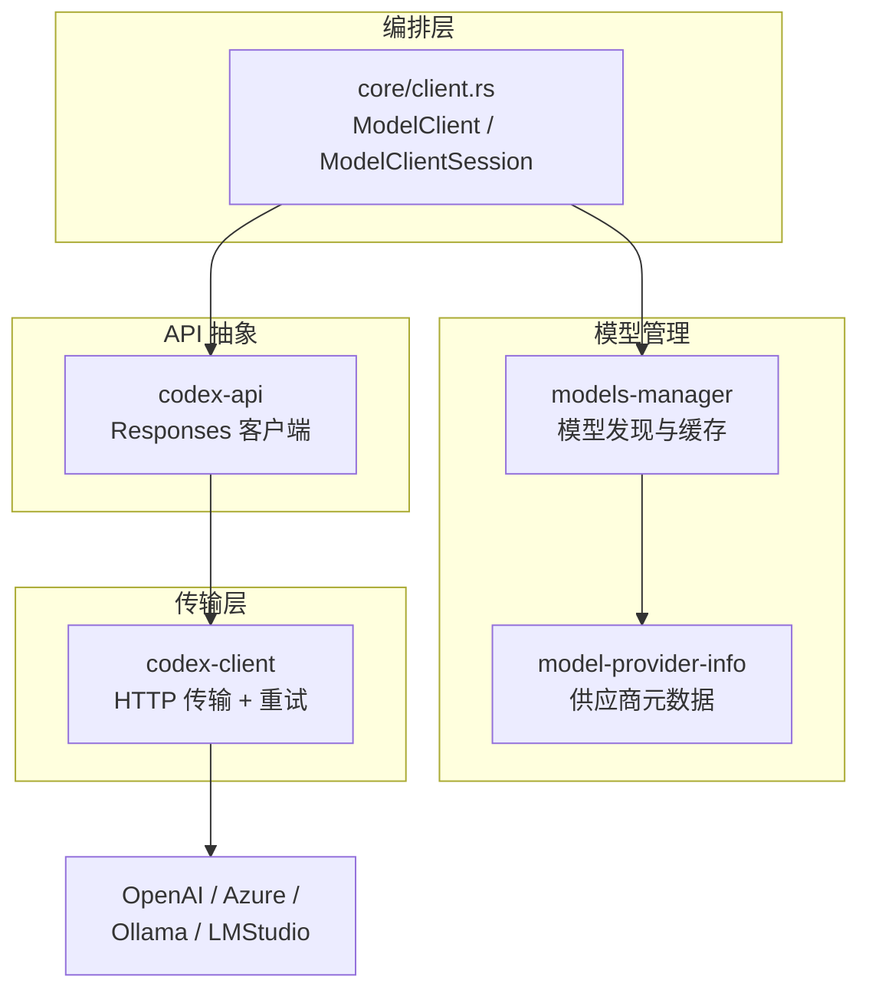

# 08 — API 与模型交互

> 本章聚焦 Codex Agent 如何与 LLM 通信：从模型选择、供应商适配、传输协议到流式响应处理。

## 1. 整体概览

当 Agent Loop 需要调用模型时，请求经过四层模块：**编排层**选传输和注入上下文 → **模型管理**解析模型和供应商 → **API 抽象**构建协议请求 → **传输层**发出 HTTP/WebSocket 调用。



| 层次 | Crate | 职责 | 源码 |
|------|-------|------|------|
| **编排** | `core/client.rs` | 双级客户端、传输选择、WebSocket 连接复用、遥测注入 | [client.rs](https://github.com/openai/codex/blob/main/codex-rs/core/src/client.rs)（~1,900 行） |
| **模型管理** | `models-manager` | 模型发现、本地缓存（TTL ~300s）、元数据增强 | [models-manager/](https://github.com/openai/codex/blob/main/codex-rs/models-manager/src/)（11 个文件） |
| **模型管理** | `model-provider-info` | 供应商定义：base_url、wire_api、WebSocket 支持、超时 | [model-provider-info/](https://github.com/openai/codex/blob/main/codex-rs/model-provider-info/src/)（~384 行） |
| **API 抽象** | `codex-api` | Responses HTTP/WebSocket 客户端、SSE 解析、请求构建 | [codex-api/](https://github.com/openai/codex/blob/main/codex-rs/codex-api/src/)（33 个文件） |
| **传输** | `codex-client` | reqwest 封装、指数退避重试、压缩、自定义 CA | [codex-client/](https://github.com/openai/codex/blob/main/codex-rs/codex-client/src/)（10 个文件） |

> 认证（`login`、`keyring-store`）、本地推理引导（`ollama`、`lmstudio`）、网络策略代理（`network-proxy`）等支撑模块不在本章范围，它们分别属于配置/安全体系。

## 2. 模型管理与供应商适配

### 2.1 模型发现

`models-manager` 负责将用户指定的模型名解析为完整的模型信息（[models-manager/src/manager.rs](https://github.com/openai/codex/blob/main/codex-rs/models-manager/src/manager.rs)）：

```
用户指定 --model gpt-5.4
  → Manager 查本地缓存（TTL ~300s）
    → 缓存命中：返回 ModelInfo
    → 缓存未命中：
        → 调用 codex-api::ModelsClient 请求 /v1/models
        → 合并内置 models.json 的默认配置
        → 增强元数据（能力、成本、限制）
        → 写入缓存并返回
```

**源码**: [models-manager/src/manager.rs](https://github.com/openai/codex/blob/main/codex-rs/models-manager/src/manager.rs)

`ModelInfo` 包含模型的能力标记（是否支持 reasoning、工具调用、图片输入等）、token 限制、定价信息，供 Agent Loop 在构建请求时做决策。

### 2.2 供应商注册

`model-provider-info` 定义了供应商的元数据结构 `ModelProviderInfo`，描述如何连接一个 LLM 服务端点：

```rust
// model-provider-info/src/lib.rs
pub struct ModelProviderInfo {
    pub name: String,              // 显示名
    pub base_url: String,          // API 端点
    pub wire_api: WireApi,         // 协议（目前仅 Responses）
    pub supports_websockets: bool, // 是否支持 WebSocket
    pub env_key: Option<String>,   // API Key 环境变量名
    pub headers: HashMap<...>,     // 自定义请求头
    pub timeout: Option<Duration>, // 请求超时
    // ...
}
```

内置三个供应商，用户可通过 `config.toml` 添加自定义供应商：

| 供应商 | ID | base_url | WebSocket |
|--------|-----|---------|-----------|
| **OpenAI** | `openai` | `https://api.openai.com/v1` | 支持 |
| **Ollama** | `ollama` | `http://localhost:11434/v1` | 不支持 |
| **LM Studio** | `lmstudio` | `http://localhost:1234/v1` | 不支持 |

```toml
# config.toml — 自定义供应商示例
[model_providers.my_provider]
name = "My Provider"
base_url = "http://localhost:8080/v1"
wire_api = "responses"
supports_websockets = false
env_key = "MY_API_KEY"
```

**源码**: [model-provider-info/src/lib.rs](https://github.com/openai/codex/blob/main/codex-rs/model-provider-info/src/lib.rs)

## 3. 双级客户端

`core/client.rs` 是 Agent Loop 与 LLM 之间的编排层，实现了两级客户端，分别管理不同生命周期的状态。

### 3.1 两级结构

| 级别 | 类型 | 生命周期 | 持有状态 |
|------|------|----------|---------|
| **Session 级** | `ModelClient` | 与 Session 相同 | auth、provider、conversation_id、HTTP 降级标记 |
| **Turn 级** | `ModelClientSession` | 与 Turn 相同 | WebSocket 连接缓存、sticky routing token |

> WebSocket 连接的实际生命周期**跨越 Turn**——Turn 结束时缓存连接，下个 Turn 复用。上下文压缩后连接重置（因为 prompt cache 失效）。

### 3.2 传输选择：WebSocket vs HTTP SSE

```
async fn stream(prompt) {
    if provider.supports_websockets && !force_http_fallback {
        match try_websocket(prompt).await {
            Ok(stream) => return stream,       // WebSocket 成功
            Err(_) => switch_to_http_fallback() // 降级到 HTTP
        }
    }
    return try_http_sse(prompt).await;         // HTTP SSE
}
```

**源码**: [client.rs:1434-1482](https://github.com/openai/codex/blob/main/codex-rs/core/src/client.rs#L1434-L1482)

| 传输 | 协议 | 优势 | 劣势 |
|------|------|------|------|
| **WebSocket** | `wss://` + `response.create` | 低延迟、连接复用、支持 prewarm | 部分代理/防火墙不支持 |
| **HTTP SSE** | `POST /v1/responses` + `stream=true` | 兼容性最好 | 每次请求新建连接 |

WebSocket 还支持 **prewarm**（`generate=false`）——在用户输入时预先建立连接，等正式请求时直接复用，进一步减少首 token 延迟。

### 3.3 降级策略

传输选择有**单向降级**语义：

1. 首次尝试 WebSocket
2. 失败后 `force_http_fallback = true`（Session 级状态）
3. 同 Session 内后续所有 Turn 直接走 HTTP SSE，不再尝试 WebSocket
4. 新 Session 重新从 WebSocket 开始

## 4. 请求构建与响应处理

### 4.1 Responses API 请求

`codex-api` 将 Agent Loop 的 `Prompt` 构建为 `ResponsesApiRequest`，发往 OpenAI 的 Responses API：

```json
{
  "model": "gpt-5.4",
  "instructions": "You are Codex...",
  "input": [ ... messages ... ],
  "tools": [ ... tool schemas ... ],
  "stream": true,
  "parallel_tool_calls": true,
  "reasoning": { "effort": "high" },
  "service_tier": "auto",
  "prompt_cache_key": "..."
}
```

关键字段说明：

| 字段 | 作用 |
|------|------|
| `input` | 完整的对话历史（用户消息 + Agent 消息 + 工具调用结果） |
| `tools` | 当前可用工具的 JSON Schema 定义 |
| `reasoning.effort` | 推理深度控制（`low` / `medium` / `high`） |
| `prompt_cache_key` | 服务端 KV cache 复用 key，跳过已缓存的 prompt 前缀计算 |
| `parallel_tool_calls` | 允许模型在一次响应中并行调用多个工具 |

> Codex 使用**无状态请求**设计（不传 `previous_response_id`），每次请求携带完整上下文。这是为了满足 Zero Data Retention 合规要求——服务端不保留任何对话历史。代价是请求体更大，但通过 `prompt_cache_key` 实现的 prompt caching 将实际计算成本从 O(n²) 降为 O(n)。

**源码**: [codex-api/src/](https://github.com/openai/codex/blob/main/codex-rs/codex-api/src/)

### 4.2 流式响应解析

API 返回 Server-Sent Events 流（HTTP）或 WebSocket 消息流，`codex-api` 将其统一解析为 `ResponseEvent` 序列：

```
response.created          → 响应开始
response.output_item.added → 新输出项（文本/工具调用）
response.content.delta    → 内容增量（流式文本）
response.function_call_arguments.delta → 工具调用参数增量
response.completed        → 响应结束（含 usage 统计）
```

**源码**: [codex-api/src/](https://github.com/openai/codex/blob/main/codex-rs/codex-api/src/)（ResponseEvent 定义与解析）

Agent Loop 消费这些事件来驱动工具执行和 UI 更新（详见 [03 — Agent Loop](03-agent-loop.md)）。

### 4.3 请求头遥测

每个 API 请求注入自定义 Header，用于服务端路由和可观测性：

| Header | 作用 |
|--------|------|
| `X-Codex-Turn-State` | Sticky routing token，确保同一 Turn 的请求路由到同一服务端实例 |
| `X-Codex-Turn-Metadata` | Turn 执行元数据（Turn 序号、模式等） |
| `X-Codex-Installation-Id` | 安装标识，用于使用分析 |
| `OpenAI-Beta` | OpenAI 功能标记（如实验性 API） |

## 5. 重试与错误处理

`codex-client` 提供底层 HTTP 重试机制（指数退避），`core/client.rs` 在其上叠加业务级错误处理：

| 错误类型 | 处理策略 |
|---------|---------|
| 网络断连 / 5xx | 指数退避重试（最多 5 次） |
| WebSocket 失败 | 降级到 HTTP SSE（见 3.3） |
| 401 / 403 | 触发 auth token 刷新，重试一次 |
| `ContextWindowExceeded` | 终止当前请求，交由 Agent Loop 触发上下文压缩 |
| `UsageLimitReached` | 终止，通知用户配额用完 |

`codex-client` 还处理了传输层的细节：HTTP 响应压缩（gzip/br）、自定义 CA 证书加载（企业内网场景）、per-request 遥测回调。

**源码**: [client.rs:1434-1482](https://github.com/openai/codex/blob/main/codex-rs/core/src/client.rs#L1434-L1482), [codex-client/src/](https://github.com/openai/codex/blob/main/codex-rs/codex-client/src/)

## 6. 本章小结

| 层次 | 模块 | 职责 |
|------|------|------|
| **编排** | `core/client.rs` | 双级客户端、传输选择与降级、连接复用、遥测注入 |
| **模型管理** | `models-manager` + `model-provider-info` | 模型发现与缓存、多供应商元数据注册 |
| **API 抽象** | `codex-api` | Responses API 请求构建、HTTP/WebSocket 客户端、SSE 解析 |
| **传输** | `codex-client` | HTTP 传输、指数退避重试、压缩、自定义 CA |

---

**上一章**: [07 — 审批与安全系统](07-approval-safety.md) | **下一章**: [09 — MCP、Skills 与插件](09-mcp-skills-plugins.md)
