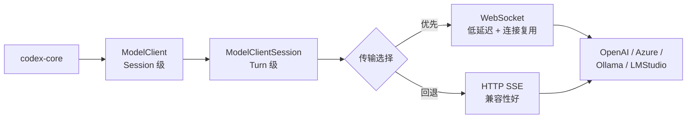

# 08 — API 与模型交互

> 本章剖析 Codex 如何与 LLM 供应商通信：从客户端架构、双传输层到多供应商适配。

## 1. 整体架构与伪代码

```
// 两级客户端架构
ModelClient        // Session 级：持有 auth、provider、传输降级状态
  └── ModelClientSession  // Turn 级：缓存 WebSocket 连接、sticky routing token

// 一次请求的传输选择
async fn stream(prompt) {
    if websocket_enabled && !force_http_fallback {
        match try_websocket(prompt).await {
            Ok(stream) => return stream,       // WebSocket 成功
            Err(_) => switch_to_http_fallback() // 降级到 HTTP
        }
    }
    return try_http_sse(prompt).await;         // HTTP SSE
}
```



## 2. 双级客户端

### ModelClient（Session 级）

生命周期与 Session 相同，持有不会变的配置：

| 字段 | 说明 |
|------|------|
| `auth` | 认证信息（API key 或 OAuth token） |
| `provider` | 供应商信息（base_url、wire_api、supports_websockets） |
| `conversation_id` | 会话 ID（用于请求关联） |
| `force_http_fallback` | 是否已降级到 HTTP（Turn 间保持） |

### ModelClientSession（Turn 级）

每个 Turn 创建一个，复用 WebSocket 连接：

| 字段 | 说明 |
|------|------|
| `websocket_connection` | 懒初始化的 WebSocket 连接（Turn 内复用） |
| `turn_state_token` | 服务端 sticky routing token（确保请求路由到同一节点） |

Turn 结束或压缩后，WebSocket 连接重置。

**源码**: [core/src/client.rs](https://github.com/openai/codex/blob/main/codex-rs/core/src/client.rs)

## 3. 传输层：WebSocket vs HTTP SSE

### 3.1 WebSocket（优先）

- **优势**：低延迟、连接复用、支持 prewarm（`generate=false` 预热连接）
- **协议**：`wss://` + `response.create` 消息
- **回退条件**：连接失败 → `force_http_fallback = true` → 同 Turn 后续请求直接走 HTTP

### 3.2 HTTP SSE（回退）

- **优势**：兼容所有 HTTP 代理和负载均衡器
- **协议**：`POST /v1/responses` + `stream=true` → Server-Sent Events
- **事件格式**：`data: {...}\n\n`，逐行解析

### 3.3 重试逻辑

| 错误类型 | 处理 |
|---------|------|
| Stream 断连 | 指数退避重试（最多 5 次） |
| WebSocket 失败 | 降级到 HTTP SSE |
| `ContextWindowExceeded` | 终止（需要压缩） |
| `UsageLimitReached` | 终止（配额用完） |
| 401/403 | 尝试 token 刷新（ChatGPT 登录场景） |

**源码**: [core/src/client.rs:1434-1482](https://github.com/openai/codex/blob/main/codex-rs/core/src/client.rs#L1434-L1482)

## 4. Responses API 请求格式

每次请求构建一个 `ResponsesApiRequest`：

```json
{
  "model": "gpt-5.4",
  "instructions": "You are Codex...",
  "input": [ ... messages ... ],
  "tools": [ ... tool schemas ... ],
  "stream": true,
  "parallel_tool_calls": true,
  "reasoning": { "effort": "high" },
  "service_tier": "auto",
  "prompt_cache_key": "..."
}
```

`prompt_cache_key` 用于服务端 prompt 缓存——相同 key 的请求可以复用之前的 KV cache，减少首 token 延迟。

**源码**: [codex-api/src/](https://github.com/openai/codex/blob/main/codex-rs/codex-api/src/)

## 5. 多供应商支持

Codex 通过 `ModelProviderInfo` 适配不同供应商：

| 供应商 | base_url | wire_api | WebSocket |
|--------|---------|----------|-----------|
| OpenAI | `https://api.openai.com/v1` | responses | 支持 |
| Azure | 自定义 | responses | 取决于配置 |
| Ollama | `http://localhost:11434/v1` | responses | 不支持 |
| LMStudio | `http://localhost:1234/v1` | responses | 不支持 |
| 自定义 | 用户配置 | responses | 取决于 `supports_websockets` |

配置方式（`config.toml`）：

```toml
[model_providers.my_provider]
name = "My Provider"
base_url = "http://localhost:8080/v1"
wire_api = "responses"
supports_websockets = false
env_key = "MY_API_KEY"
```

**源码**: [model-provider-info/src/](https://github.com/openai/codex/blob/main/codex-rs/model-provider-info/src/), [config/src/config_toml.rs](https://github.com/openai/codex/blob/main/codex-rs/config/src/config_toml.rs)

## 6. 本章小结

| 组件 | 职责 | 源码 |
|------|------|------|
| **ModelClient** | Session 级客户端，auth + provider + 降级状态 | [client.rs](https://github.com/openai/codex/blob/main/codex-rs/core/src/client.rs) |
| **ModelClientSession** | Turn 级，WebSocket 复用 + sticky routing | [client.rs](https://github.com/openai/codex/blob/main/codex-rs/core/src/client.rs) |
| **codex-api** | API 协议实现（SSE 解析、请求构建） | [codex-api/](https://github.com/openai/codex/blob/main/codex-rs/codex-api/src/) |
| **ModelProviderInfo** | 多供应商配置适配 | [model-provider-info/](https://github.com/openai/codex/blob/main/codex-rs/model-provider-info/src/) |

---

**上一章**: [07 — 审批与安全系统](07-approval-safety.md) | **下一章**: [09 — SDK 与协议](09-sdk-protocol.md)
