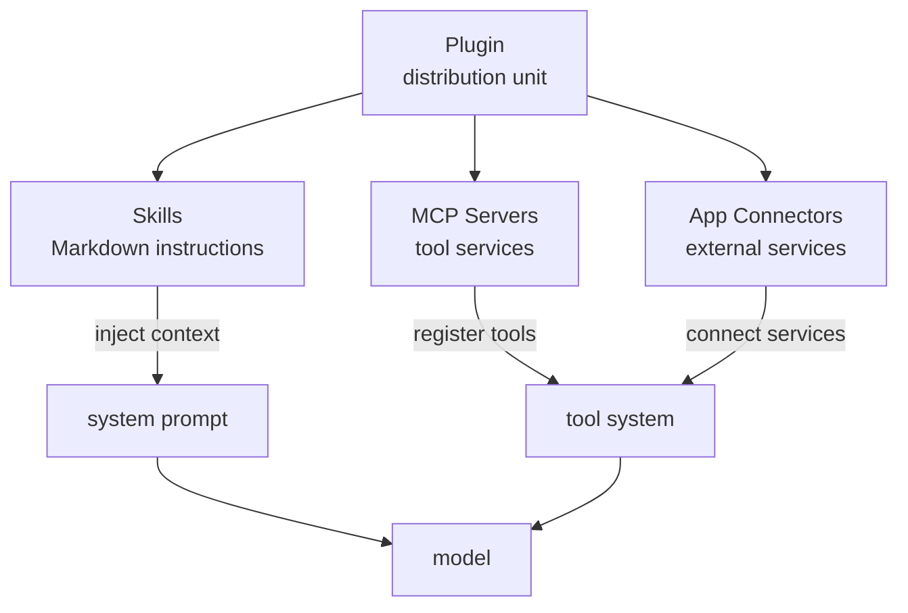
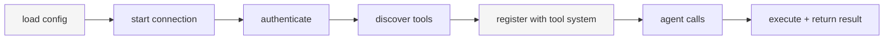

> **Language**: **English** · [中文](09-mcp-skills-plugins.zh.md)

# 09 — MCP, Skills, and Plugins

> Codex plugs into external tools through MCP, injects domain knowledge through Skills, and packages both for distribution through Plugins. This chapter dissects the design and implementation of that extension system.

## 1. The big picture: three extension mechanisms

Codex's extension system has three layers, each solving a different problem:

| Mechanism | Problem it solves | What it really is | Analogy |
|-----------|-------------------|-------------------|---------|
| **MCP** | Which external tools the agent **can call** | A tool protocol (JSON-RPC) | Browser Web APIs |
| **Skills** | **How** the agent should approach a class of tasks | Domain knowledge (Markdown instructions) | An ops manual |
| **Plugin** | How to **package and distribute** Skills + MCP + Apps | A distribution unit (directory + manifest) | An npm package |

How they fit together:



**Relationship to Chapter 04**: [04 — The tool system](04-tool-system.md) covers tool registration, routing, and the execution pipeline. This chapter covers the **sources** of tools and knowledge — MCP supplies external tools, Skills supply domain instructions, and Plugins package them up.

## 2. Skills: injecting domain knowledge

### 2.1 What is a Skill?

A Skill is a Markdown file (`SKILL.md`) containing agent-facing domain instructions. When the user triggers a Skill, its contents are **injected into the conversation context** to guide the agent through a specific kind of task.

```
skill-name/
├── SKILL.md              # required: instruction body (YAML front matter + Markdown)
├── agents/
│   └── openai.yaml       # optional: UI metadata (icon, description)
├── scripts/              # optional: executable scripts
├── references/           # optional: reference docs
└── assets/               # optional: icons, templates, and other assets
```

**SKILL.md format**:

```yaml
---
name: skill-creator
description: Guide for creating effective skills
metadata:
  short-description: Create or update a skill
---

# Skill Creator

Below are best practices for creating a Skill...
(Markdown instruction body)
```

### 2.2 Discovery and loading

`SkillsManager` discovers Skills from four scopes in priority order ([core-skills/src/loader.rs:186-276](https://github.com/openai/codex/blob/main/codex-rs/core-skills/src/loader.rs#L186-L276)):

| Priority | Scope | Path | Notes |
|----------|-------|------|-------|
| 1 | **Repo** | `./.agents/skills/` | Project-level, lives with the repo |
| 2 | **User** | `~/.agents/skills/` | User-level, shared across projects |
| 3 | **System** | `$CODEX_HOME/skills/.system/` | Built-in, ships with Codex |
| 4 | **Admin** | `/etc/codex/skills` | Admin-level (enterprise scenarios) |

The 5 built-in System Skills are `skill-creator`, `plugin-creator`, `skill-installer`, `openai-docs`, and `imagegen`. They're embedded into the binary at compile time via the `include_dir!` macro and unpacked to disk on first run.

### 2.3 Triggering and injection

Skills can be triggered in two ways.

**Explicit trigger**: the user mentions a Skill by name (e.g., `/skill-name` or just by name) in their message. `collect_explicit_skill_mentions()` recognizes the mention, reads the full `SKILL.md` from disk, and wraps it as `SkillInstructions` to be injected into the context:

```rust
// instructions/src/user_instructions.rs
impl From<SkillInstructions> for ResponseItem {
    fn from(si: SkillInstructions) -> Self {
        // Wrap as <name>...</name><path>...</path> + Markdown content
        // Inject into the model-visible conversation history
    }
}
```

**Source**: [instructions/src/user_instructions.rs](https://github.com/openai/codex/blob/main/codex-rs/instructions/src/user_instructions.rs)

**Implicit trigger**: the user runs a script under a Skill directory or reads its `SKILL.md`. `detect_implicit_skill_invocation_for_command()` detects this automatically.

### 2.4 How Skills appear in the prompt

The Skills list is rendered as a section of the system prompt to the model ([core-skills/src/render.rs](https://github.com/openai/codex/blob/main/codex-rs/core-skills/src/render.rs)):

```markdown
## Skills

### Available skills
- skill-creator: Guide for creating effective skills (file: ~/.agents/skills/skill-creator/SKILL.md)
- ...

### How to use skills
- If the user mentions a skill, read its SKILL.md and follow the instructions
- Resolve relative paths inside a skill directory against the skill directory
- Prefer running scripts the skill provides over reimplementing them from scratch
```

> **Key distinction**: Skills are **context injection** (Markdown → prompt), not tool calls. After seeing a Skill's content, the model decides on its own how to act.

### 2.5 Hot reload

`SkillsWatcher` watches the Skill directories for file changes and notifies core via a tokio broadcast channel, with 10-second throttling to avoid thrashing ([core/src/skills_watcher.rs](https://github.com/openai/codex/blob/main/codex-rs/core/src/skills_watcher.rs)).

## 3. MCP: an external tool protocol

### 3.1 What is MCP?

MCP ([Model Context Protocol](https://modelcontextprotocol.io/)) is an open protocol that lets AI agents discover and call external tool servers. Codex is both an MCP **client** (connecting to external MCP servers) and, in `mcp-server` mode, an MCP **server** (callable from other agents).

### 3.2 MCP client: connecting to external tools

#### Configuration

MCP servers are configured in `config.toml` ([config/src/mcp_types.rs](https://github.com/openai/codex/blob/main/codex-rs/config/src/mcp_types.rs)):

```toml
# Stdio transport: launch a child process
[mcp_servers.my_server]
command = "python"
args = ["-m", "my_mcp_server"]
env = { MY_VAR = "value" }
startup_timeout_sec = 30
enabled_tools = ["tool1", "tool2"]   # tool allowlist (optional)
disabled_tools = ["dangerous_tool"]  # tool denylist (optional)

# HTTP transport: connect to a remote service
[mcp_servers.remote_server]
url = "https://api.example.com/mcp"
bearer_token_env_var = "API_TOKEN"
scopes = ["read:data"]              # OAuth scopes
```

Two transports are supported:

| Transport | Config fields | Notes |
|-----------|--------------|-------|
| **Stdio** | `command` + `args` | Spawns a child process; communicates over stdin/stdout |
| **StreamableHttp** | `url` | HTTP + SSE; supports OAuth |

#### Lifecycle



The full flow ([codex-mcp/src/mcp_connection_manager.rs](https://github.com/openai/codex/blob/main/codex-rs/codex-mcp/src/mcp_connection_manager.rs)):

1. **Load config**: merge `config.toml` with the MCP config contributed by Plugins
2. **Start connection**: `McpConnectionManager::new()` creates an `AsyncManagedClient` for each server, with a 30s startup timeout
3. **Authenticate**: the StreamableHttp transport supports OAuth (discovery → authorization → store the token in the OS keyring)
4. **Discover tools**: `list_all_tools()` aggregates the tool list from every server
5. **Register tools**: tools are registered with the tool system under qualified names of the form `mcp__<server>__<tool>`
6. **Agent invocation**: the model emits a tool call → it's routed to the right server
7. **Execute**: `call_tool()` forwards the request, with a 120s timeout (configurable)

#### Tool naming

MCP tools use **qualified names** internally to avoid collisions:

```
mcp__<server_name>__<tool_name>

Examples:  mcp__github__create_issue
           mcp__slack__send_message
```

`split_qualified_tool_name()` and `group_tools_by_server()` parse and group these qualified names.

#### Tool call details

When the model decides to call an MCP tool ([core/src/mcp_tool_call.rs](https://github.com/openai/codex/blob/main/codex-rs/core/src/mcp_tool_call.rs)):

1. **Parse arguments**: validate the JSON
2. **Look up metadata**: fetch the tool schema, `connector_id`, and approval annotations
3. **Approval check**: based on config, decide whether the user must approve (Auto / Prompt / Approve)
4. **Argument rewriting**: handle OpenAI file parameters (`openai/fileParams`) — convert them to absolute paths
5. **Execute the call**: forward via `McpConnectionManager.call_tool()` to the MCP server
6. **Result handling**: strip unsupported content types (e.g., remove image results when the model doesn't support images)
7. **Telemetry**: emit `McpToolCallBegin/End` events; record duration and an OpenTelemetry span

#### Tool filtering

Each MCP server supports per-tool allow- and denylists ([mcp_connection_manager.rs](https://github.com/openai/codex/blob/main/codex-rs/codex-mcp/src/mcp_connection_manager.rs)):

```rust
struct ToolFilter {
    enabled_tools: Option<Vec<String>>,  // allowlist (when set, only these are allowed)
    disabled_tools: Option<Vec<String>>, // denylist
}
```

### 3.3 MCP server: Codex exposing capabilities outward

Codex can also run as an MCP server (`codex mcp-server`), callable from other AI agents ([mcp-server/src/](https://github.com/openai/codex/blob/main/codex-rs/mcp-server/src/)):

- Receives JSON-RPC requests over stdin/stdout
- Exposes Codex's tool capabilities (command execution, file editing, etc.)
- Supports the approval flow (the caller has to respond to approval requests)

This lets Codex be embedded into other agent systems as a "coding tool".

### 3.4 Sandbox state sync

Tools running inside an MCP server may need to know about Codex's sandbox policy. Codex pushes the current sandbox configuration (policy, working directory, Linux sandbox path) to MCP servers that opt in, via a custom MCP request `codex/sandbox-state/update`.

## 4. Plugins: packaging and distribution

### 4.1 What is a Plugin?

A Plugin is a **packaging unit** for Skills, MCP servers, and App connectors, defined by a `plugin.json` manifest:

```
my-plugin/
├── plugin.json            # manifest
├── skills/                # Skills this plugin provides
│   └── my-skill/
│       └── SKILL.md
├── .mcp.json              # MCP server config this plugin provides
└── .app.json              # App connectors this plugin provides
```

```json
// plugin.json
{
  "name": "my-plugin",
  "version": "1.0.0",
  "description": "A plugin that adds ...",
  "skills": "./skills",
  "mcp_servers": "./.mcp.json",
  "apps": "./.app.json",
  "interface": {
    "displayName": "My Plugin",
    "category": "developer-tools",
    "capabilities": ["code-review", "testing"]
  }
}
```

### 4.2 Plugin loading

`PluginsManager` handles plugin discovery, installation, and loading ([core/src/plugins/manager.rs](https://github.com/openai/codex/blob/main/codex-rs/core/src/plugins/manager.rs)). Once loaded, a `PluginLoadOutcome` decomposes the plugin's capabilities and feeds them into the relevant subsystems:

```
PluginLoadOutcome
  ├── effective_skill_roots()    → merged into SkillsManager's search paths
  ├── effective_mcp_servers()    → merged into McpConfig's server list
  └── effective_apps()           → merged into the App Connector list
```

### 4.3 Marketplace

Codex supports a plugin marketplace ([core/src/plugins/marketplace.rs](https://github.com/openai/codex/blob/main/codex-rs/core/src/plugins/marketplace.rs)):

- **OpenAI's official marketplace**: a curated plugin list, browsable through the `plugin/list` API
- **Custom marketplaces**: companies can host their own plugin marketplaces
- Install flow: `plugin/install` → download → parse the manifest → register Skills + MCP + Apps

### 4.4 How Plugins appear in the prompt

Like Skills, the available Plugins are also listed in the system prompt ([core/src/plugins/render.rs](https://github.com/openai/codex/blob/main/codex-rs/core/src/plugins/render.rs)):

```markdown
## Plugins

### Available plugins
- `my-plugin`: A plugin that adds code review capabilities

### How to use plugins
- If the user mentions a plugin, prefer the skills and tools it provides
- Skills provided by a plugin are prefixed with `plugin_name:`
```

## 5. How the three work together

A complete extension scenario:

```
The user installs the "code-review" Plugin
  │
  ├── Plugin provides Skill: "code-review-guide"
  │     → SKILL.md describes code-review best practices and workflow
  │     → injected into the system prompt
  │
  ├── Plugin provides MCP Server: "lint-server"
  │     → starts a local linter process
  │     → exposes tools: run_eslint, run_prettier
  │     → registered as mcp__lint-server__run_eslint, etc.
  │
  └── Plugin provides App Connector: "jira"
        → connects to Jira
        → exposes tools: create_ticket, update_status

User says: "review this PR for me"
  │
  ├── 1. Skill triggered: agent reads code-review-guide/SKILL.md
  │      → review process and standards injected into context
  │
  ├── 2. MCP tool call: agent invokes mcp__lint-server__run_eslint
  │      → gets lint results
  │
  ├── 3. App tool call: agent invokes Jira create_ticket
  │      → creates tickets for the issues found
  │
  └── 4. Agent response: combines Skill guidance + tool results into a review report
```

## 6. Chapter summary

| Mechanism | What it really is | How it takes effect | Where it's configured |
|-----------|-------------------|---------------------|------------------------|
| **Skills** | Markdown instructions | Injected into context to steer model behavior | `.agents/skills/`, `~/.agents/skills/` |
| **MCP** | Tool protocol | Registered as callable tools | `[mcp_servers]` in `config.toml` |
| **Plugin** | Packaging / distribution unit | Provides Skills + MCP + Apps | `plugin.json` manifest |

| Component | Source |
|-----------|--------|
| Skills loading and rendering | [core-skills/](https://github.com/openai/codex/blob/main/codex-rs/core-skills/src/) |
| MCP connection management | [codex-mcp/](https://github.com/openai/codex/blob/main/codex-rs/codex-mcp/src/) |
| MCP tool calls | [core/src/mcp_tool_call.rs](https://github.com/openai/codex/blob/main/codex-rs/core/src/mcp_tool_call.rs) |
| MCP protocol client | [rmcp-client/](https://github.com/openai/codex/blob/main/codex-rs/rmcp-client/src/) |
| MCP server mode | [mcp-server/](https://github.com/openai/codex/blob/main/codex-rs/mcp-server/src/) |
| Plugin management | [core/src/plugins/](https://github.com/openai/codex/blob/main/codex-rs/core/src/plugins/) |
| MCP config types | [config/src/mcp_types.rs](https://github.com/openai/codex/blob/main/codex-rs/config/src/mcp_types.rs) |

---

**Previous**: [08 — API and model interaction](08-api-model-interaction.md) | **Next**: [10 — Product integration and the App Server](10-sdk-protocol.md)
