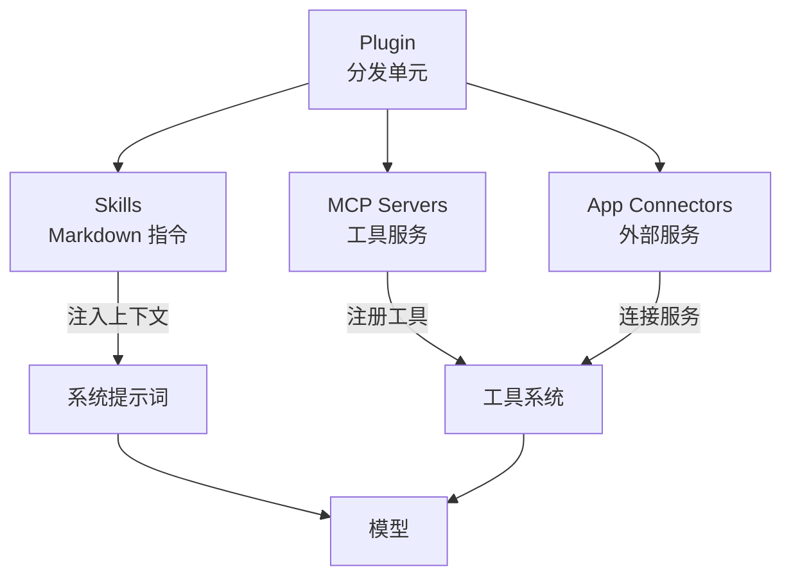

# 09 — MCP、Skills 与插件

> Codex 的能力不是硬编码的——它通过 MCP 接入外部工具、通过 Skills 注入领域知识、通过 Plugin 将两者打包分发。本章剖析这套扩展体系的设计与实现。

## 1. 整体概览：三种扩展机制

Codex 的扩展体系由三个层次组成，解决不同的问题：

| 机制 | 解决的问题 | 本质 | 类比 |
|------|-----------|------|------|
| **MCP** | Agent 能**调用**什么外部工具 | 工具协议（JSON-RPC） | 浏览器的 Web API |
| **Skills** | Agent 应该**怎么做**某类任务 | 领域知识（Markdown 指令） | 操作手册 |
| **Plugin** | 如何**打包分发** Skills + MCP + Apps | 分发单元（目录 + manifest） | npm 包 |

三者的关系：



**与第 04 章的关系**：[04 — 工具系统](04-tool-system.md) 讲的是工具的注册、路由和执行管线。本章讲的是工具和知识的**来源**——MCP 提供外部工具，Skills 提供领域指令，Plugin 将它们打包。

## 2. Skills：领域知识注入

### 2.1 什么是 Skill

Skill 是一个 Markdown 文件（`SKILL.md`），包含面向 Agent 的领域指令。当用户触发某个 Skill 时，其内容被**注入到对话上下文**中，指导 Agent 如何完成特定类型的任务。

```
skill-name/
├── SKILL.md              # 必需：指令内容（YAML 前置 + Markdown）
├��─ agents/
│   └── openai.yaml       # 可选：UI 展示元数据（图标、描述）
├── scripts/              # 可选：可执行脚本
├── references/           # 可选：参考文档
└── assets/               # 可选：图标、模板等资源
```

**SKILL.md 格式**：

```yaml
---
name: skill-creator
description: Guide for creating effective skills
metadata:
  short-description: Create or update a skill
---

# Skill Creator

以下是创建 Skill 的最佳实践...
（Markdown 指令内容）
```

### 2.2 发现与加载

`SkillsManager` 从四个作用域按优先级发现 Skills（[core-skills/src/loader.rs:186-276](https://github.com/openai/codex/blob/main/codex-rs/core-skills/src/loader.rs#L186-L276)）：

| 优先级 | 作用域 | 路径 | 说明 |
|--------|--------|------|------|
| 1 | **Repo** | `./.agents/skills/` | 项目级，跟随仓库 |
| 2 | **User** | `~/.agents/skills/` | 用户级，跨项目 |
| 3 | **System** | `$CODEX_HOME/skills/.system/` | 内置，随 Codex 安装 |
| 4 | **Admin** | `/etc/codex/skills` | 管理员级（企业场景） |

内置的 5 个 System Skills：`skill-creator`、`plugin-creator`、`skill-installer`、`openai-docs`、`imagegen`，编译时通过 `include_dir!` 宏嵌入二进制，首次运行时释放到磁盘。

### 2.3 触发与注入

Skills 有两种触发方式：

**显式触发**：用户在消息中提到 Skill 名（如 `/skill-name` 或直接提到名称），`collect_explicit_skill_mentions()` 识别后从磁盘读取 `SKILL.md` 全文，包装为 `SkillInstructions` 注入上下文：

```rust
// instructions/src/user_instructions.rs
impl From<SkillInstructions> for ResponseItem {
    fn from(si: SkillInstructions) -> Self {
        // 包装为 <name>...</name><path>...</path> + Markdown 内容
        // 注入到模型可见的对话历史中
    }
}
```

**隐式触发**：用户执行了某个 Skill 目录下的脚本或读取了其 SKILL.md，`detect_implicit_skill_invocation_for_command()` 自动检测。

### 2.4 Skills 在提示词中的呈现

Skills 列表作为系统提示词的一个 section 呈现给模型（[core-skills/src/render.rs](https://github.com/openai/codex/blob/main/codex-rs/core-skills/src/render.rs)）：

```markdown
## Skills

### Available skills
- skill-creator: Guide for creating effective skills (file: ~/.agents/skills/skill-creator/SKILL.md)
- ...

### How to use skills
- 如果用户提到某个 skill，读取其 SKILL.md 并遵循指令
- 解析 skill 目录下的相对路径时，以 skill 目录为基准
- 优先运行 skill 提供的脚本，而非从头实现
```

> **关键区别**：Skills 是**上下文注入**（Markdown → 提示词），不是工具调用。模型看到 Skill 内容后自主决定如何行动。

### 2.5 热重载

`SkillsWatcher` 监听 Skill 目录的文件变更，通过 tokio broadcast channel 通知 core，10 秒节流避免频繁刷新（[core/src/skills_watcher.rs](https://github.com/openai/codex/blob/main/codex-rs/core/src/skills_watcher.rs)）。

## 3. MCP：外部工具协议

### 3.1 什么是 MCP

MCP（[Model Context Protocol](https://modelcontextprotocol.io/)）是一个开放协议，让 AI Agent 能够发现和调用外部工具服务器。Codex 既是 MCP **客户端**（连接外部 MCP Server），也可以作为 MCP **服务器**（供其他 Agent 调用）。

### 3.2 MCP 客户端：连接外部工具

#### 配置

MCP Server 在 `config.toml` 中配置（[config/src/mcp_types.rs](https://github.com/openai/codex/blob/main/codex-rs/config/src/mcp_types.rs)）：

```toml
# Stdio 传输：启动子进程
[mcp_servers.my_server]
command = "python"
args = ["-m", "my_mcp_server"]
env = { MY_VAR = "value" }
startup_timeout_sec = 30
enabled_tools = ["tool1", "tool2"]   # 工具白名单（可选）
disabled_tools = ["dangerous_tool"]  # 工具黑名单（可选）

# HTTP 传输：连接远程服务
[mcp_servers.remote_server]
url = "https://api.example.com/mcp"
bearer_token_env_var = "API_TOKEN"
scopes = ["read:data"]              # OAuth 作用域
```

两种传输方式：

| 传输 | 配置字段 | 说明 |
|------|---------|------|
| **Stdio** | `command` + `args` | 启动子进程，stdin/stdout 通信 |
| **StreamableHttp** | `url` | HTTP + SSE，支持 OAuth 认证 |

#### 生命周期


完整流程（[codex-mcp/src/mcp_connection_manager.rs](https://github.com/openai/codex/blob/main/codex-rs/codex-mcp/src/mcp_connection_manager.rs)）：

1. **加载配置**：从 `config.toml` + Plugin 提供的 MCP 配置合并
2. **启动连接**：`McpConnectionManager::new()` 为每个 Server 创建 `AsyncManagedClient`，超时 30s
3. **认证**：StreamableHttp 传输支持 OAuth（发现 → 授权 → token 存储到 keyring）
4. **发现工具**：`list_all_tools()` 聚合所有 Server 的工具列表
5. **注册工具**：工具以 `mcp__<server>__<tool>` 的限定名注册到工具系统
6. **Agent 调用**：模型输出工具调用 → 路由到对应 Server
7. **执行**：`call_tool()` 转发请求，超时 120s（可配置）

#### 工具命名

MCP 工具在 Codex 内部使用**限定名**避免冲突：

```
mcp__<server_name>__<tool_name>

例如：mcp__github__create_issue
      mcp__slack__send_message
```

`split_qualified_tool_name()` 和 `group_tools_by_server()` 负责限定名的解析和分组。

#### 工具调用详情

当模型决定调用一个 MCP 工具时（[core/src/mcp_tool_call.rs](https://github.com/openai/codex/blob/main/codex-rs/core/src/mcp_tool_call.rs)）：

1. **解析参数**：验证 JSON 格式
2. **查找元数据**：获取 tool schema、connector_id、审批注解
3. **审批检查**：根据配置决定是否需要用户审批（Auto / Prompt / Approve）
4. **参数改写**：处理 OpenAI 文件参数（`openai/fileParams`），转为绝对路径
5. **执行调用**：通过 `McpConnectionManager.call_tool()` 转发到 MCP Server
6. **结果处理**：清理不支持的内容类型（如模型不支持图片时移除图片结果）
7. **遥测**：发出 `McpToolCallBegin/End` 事件，记录耗时和 OTel span

#### 工具过滤

每个 MCP Server 支持工具级的白名单和黑名单（[mcp_connection_manager.rs](https://github.com/openai/codex/blob/main/codex-rs/codex-mcp/src/mcp_connection_manager.rs)）：

```rust
struct ToolFilter {
    enabled_tools: Option<Vec<String>>,  // 白名单（设置后仅允许这些）
    disabled_tools: Option<Vec<String>>, // 黑名单
}
```

### 3.3 MCP 服务器：Codex 对外暴露能力

Codex 也可以作为 MCP Server 运行（`codex mcp-server`），供其他 AI Agent 调用（[mcp-server/src/](https://github.com/openai/codex/blob/main/codex-rs/mcp-server/src/)）：

- 通过 stdin/stdout 接收 JSON-RPC 请求
- 暴露 Codex 的工具能力（命令执行、文件编辑等）
- 支持审批机制（调用方需要响应审批请求）

这使得 Codex 可以被集成到其他 Agent 系统中作为"编码工具"使用。

### 3.4 沙箱状态同步

MCP Server 运行的工具可能需要感知 Codex 的沙箱策略。Codex 通过自定义 MCP 请求 `codex/sandbox-state/update` 将当前沙箱配置（策略、工作目录、Linux sandbox 路径）推送给支持此能力的 MCP Server。

## 4. Plugin：打包与分发

### 4.1 什么是 Plugin

Plugin 是 Skills、MCP Servers 和 App Connectors 的**打包单元**，通过 `plugin.json` manifest 定义：

```
my-plugin/
├── plugin.json            # manifest
├── skills/                # 该插件提供的 Skills
│   └── my-skill/
│       └── SKILL.md
├── .mcp.json              # 该插件提供的 MCP Server 配置
└── .app.json              # 该插件提供的 App Connectors
```

```json
// plugin.json
{
  "name": "my-plugin",
  "version": "1.0.0",
  "description": "A plugin that adds ...",
  "skills": "./skills",
  "mcp_servers": "./.mcp.json",
  "apps": "./.app.json",
  "interface": {
    "displayName": "My Plugin",
    "category": "developer-tools",
    "capabilities": ["code-review", "testing"]
  }
}
```

### 4.2 Plugin 加载

`PluginsManager` 负责插件的发现、安装和加载（[core/src/plugins/manager.rs](https://github.com/openai/codex/blob/main/codex-rs/core/src/plugins/manager.rs)）。加载后的 `PluginLoadOutcome` 将插件的能力拆解并汇入各子系统：

```
PluginLoadOutcome
  ├── effective_skill_roots()    → 合并到 SkillsManager 的搜索路径
  ├── effective_mcp_servers()    → 合并到 McpConfig 的 server 列表
  └── effective_apps()           → 合并到 App Connector 列表
```

### 4.3 Marketplace

Codex 支持插件市场（[core/src/plugins/marketplace.rs](https://github.com/openai/codex/blob/main/codex-rs/core/src/plugins/marketplace.rs)）：

- **OpenAI 官方市场**：策划的插件列表，可通过 `plugin/list` API 浏览
- **自定义市场**：企业可搭建自己的插件市场
- 安装流程：`plugin/install` → 下载 → 解析 manifest → 注册 Skills + MCP + Apps

### 4.4 Plugin 在提示词中的呈现

与 Skills 类似，可用的 Plugins 也会在系统提示词中列出（[core/src/plugins/render.rs](https://github.com/openai/codex/blob/main/codex-rs/core/src/plugins/render.rs)）：

```markdown
## Plugins

### Available plugins
- `my-plugin`: A plugin that adds code review capabilities

### How to use plugins
- 如果用户提到某个 plugin，优先使用该 plugin 提供的 skills 和工具
- Plugin 提供的 skills 以 `plugin_name:` 为前缀
```

## 5. 三者如何协作

一个完整的扩展场景：

```
用户安装了 "code-review" Plugin
  │
  ├── Plugin 提供 Skill: "code-review-guide"
  │     → SKILL.md 描述代码审查的最佳实践和流程
  │     → 注入到系统提示词
  │
  ├── Plugin 提供 MCP Server: "lint-server"
  │     → 启动本地 linter 进程
  │     → 暴露工具: run_eslint, run_prettier
  │     → 注册为 mcp__lint-server__run_eslint 等
  │
  └── Plugin 提供 App Connector: "jira"
        → 连接 Jira 服务
        → 暴露工具: create_ticket, update_status

用户说: "帮我 review 这个 PR"
  │
  ├── 1. Skill 触发: Agent 读取 code-review-guide/SKILL.md
  │      → 上下文注入审查流程和标准
  │
  ├── 2. MCP 工具调用: Agent 调用 mcp__lint-server__run_eslint
  │      → 获取 lint 结果
  │
  ├── 3. App 工具调用: Agent 调用 Jira create_ticket
  │      → 为发现的问题创建工单
  │
  └── 4. Agent 输出: 综合 Skill 指导 + 工具结果，给出审查报告
```

## 6. 本章小结

| 机制 | 本质 | 生效方式 | 配置位置 |
|------|------|---------|---------|
| **Skills** | Markdown 指令 | 注入上下文，指导模型行为 | `.agents/skills/`、`~/.agents/skills/` |
| **MCP** | 工具协议 | 注册为可调用工具 | `config.toml` 的 `[mcp_servers]` |
| **Plugin** | 打包分发单元 | 提供 Skills + MCP + Apps | `plugin.json` manifest |

| 组件 | 源码 |
|------|------|
| Skills 加载与渲染 | [core-skills/](https://github.com/openai/codex/blob/main/codex-rs/core-skills/src/) |
| MCP 连接管理 | [codex-mcp/](https://github.com/openai/codex/blob/main/codex-rs/codex-mcp/src/) |
| MCP 工具调用 | [core/src/mcp_tool_call.rs](https://github.com/openai/codex/blob/main/codex-rs/core/src/mcp_tool_call.rs) |
| MCP 协议客户端 | [rmcp-client/](https://github.com/openai/codex/blob/main/codex-rs/rmcp-client/src/) |
| MCP 服务器模式 | [mcp-server/](https://github.com/openai/codex/blob/main/codex-rs/mcp-server/src/) |
| Plugin 管理 | [core/src/plugins/](https://github.com/openai/codex/blob/main/codex-rs/core/src/plugins/) |
| MCP 配置类型 | [config/src/mcp_types.rs](https://github.com/openai/codex/blob/main/codex-rs/config/src/mcp_types.rs) |

---

**上一章**: [08 — API 与模型交互](08-api-model-interaction.md) | **下一章**: [10 — 产品集成与 App Server](10-sdk-protocol.md)
