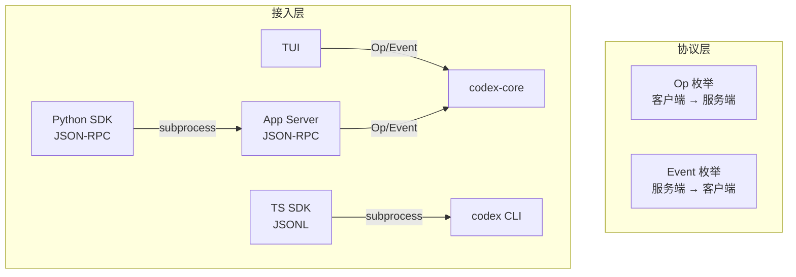

# 09 — SDK 与协议

> 本章剖析 Codex 的通信协议（Op/Event）、App Server 的 JSON-RPC 接口，以及 TypeScript/Python SDK 的接入方式。

## 1. 整体架构与伪代码

```
// Codex 的对外通信全部基于 Op/Event 协议
Client → Codex:  submit(Op::UserTurn { ... })       // 客户端发送操作
Codex → Client:  Event { msg: TurnStarted { ... } } // 服务端返回事件

// 三种接入方式共用同一个协议：
TUI        → embedded App Server → ThreadManager → Codex (Op/Event)
IDE (VS Code) → standalone App Server (JSON-RPC over stdio/ws) → ThreadManager
SDK        → subprocess (JSON-RPC or JSONL) → ThreadManager
```



## 2. Op/Event 协议

### 2.1 Op（客户端 → 服务端）

Op 是客户端提交给 Codex 的操作指令。关键类型：

| 类别 | Op | 说明 |
|------|-----|------|
| **用户输入** | `UserTurn` | 提交用户消息（可附带模型/策略覆盖） |
| **流程控制** | `Interrupt` / `Shutdown` | 中断当前任务 / 关闭会话 |
| **审批响应** | `ExecApproval` / `PatchApproval` | 回复命令/补丁的审批请求 |
| **上下文** | `Compact` / `Undo` / `ThreadRollback` | 压缩 / 撤销 / 回滚 |
| **配置** | `OverrideTurnContext` / `ReloadUserConfig` | 修改配置 |
| **查询** | `ListMcpTools` / `ListSkills` / `ListModels` | 查询可用资源 |

### 2.2 Event（服务端 → 客户端）

Event 是 Codex 返回给客户端的事件流。关键类型：

| 类别 | Event | 说明 |
|------|-------|------|
| **生命周期** | `SessionConfigured` / `TurnStarted` / `TurnComplete` | 会话/Turn 生命周期 |
| **模型输出** | `AgentMessage` / `AgentMessageDelta` | 完整消息 / 流式增量 |
| **推理** | `AgentReasoning` / `AgentReasoningDelta` | 思维链输出 |
| **工具** | `ExecCommandBegin/End` / `McpToolCallBegin/End` | 工具执行生命周期 |
| **审批** | `ExecApprovalRequest` / `RequestPermissions` | 等待用户审批 |
| **上下文** | `TokenCount` / `ContextCompacted` | Token 使用 / 压缩完成 |
| **错误** | `Error` / `Warning` / `StreamError` | 各类错误 |

> Op 和 Event 共定义了 **120+ 种消息类型**，覆盖了 Codex 的全部交互场景。

**源码**: [protocol/src/protocol.rs](https://github.com/openai/codex/blob/main/codex-rs/protocol/src/protocol.rs)（5,081 行）

## 3. App Server：JSON-RPC 接口

App Server 是 Codex 面向 IDE 和 SDK 的统一后端，提供 JSON-RPC 2.0 接口。

### 3.1 传输方式

| 方式 | 命令 | 用途 |
|------|------|------|
| **stdio** | `codex app-server --listen stdio://` | IDE 扩展（VS Code、Cursor） |
| **WebSocket** | `codex app-server --listen ws://IP:PORT` | 远程连接（实验性） |

### 3.2 MessageProcessor

`MessageProcessor` 是 App Server 的请求路由器：

```
Client Request (JSON-RPC)
  → MessageProcessor
    ├── CodexMessageProcessor  → 线程操作（submit、events）
    ├── ConfigApi              → 配置读写
    ├── FsApi                  → 文件系统操作
    └── ExternalAgentConfigApi → MCP/Skill 配置发现
```

### 3.3 协议版本

App Server 有 v1 和 v2 两个版本的协议：

| 版本 | 状态 | 说明 |
|------|------|------|
| **v1** | 旧版 | 基础功能，不再新增 API |
| **v2** | 当前 | 丰富的结构化响应，支持实验性 API |

v2 约定：`*Params` 表示请求参数，`*Response` 表示响应，`*Notification` 表示通知。方法名格式 `<resource>/<method>`（如 `thread/read`）。

**源码**: [app-server/src/message_processor.rs](https://github.com/openai/codex/blob/main/codex-rs/app-server/src/message_processor.rs), [app-server-protocol/](https://github.com/openai/codex/blob/main/codex-rs/app-server-protocol/src/)

## 4. SDK 接入

### 4.1 TypeScript SDK

包装 `codex` CLI 进程，通过 JSONL 事件流通信：

```
TypeScript SDK
  → spawn("codex", ["exec", "--experimental-json", ...])
  → stdout 接收 JSONL 事件（每行一个 JSON 对象）
  → SDK 封装为 Codex / Thread / TurnOptions API
```

核心类：`Codex`（入口）→ `Thread`（对话线程）→ `TurnOptions`（Turn 配置）

### 4.2 Python SDK

作为 `codex app-server` 的 JSON-RPC v2 客户端：

```
Python SDK
  → spawn("codex", ["app-server", "--listen", "stdio://"])
  → stdin/stdout 发送 JSON-RPC 请求和接收响应
  → SDK 封装为 async/sync 客户端 API
```

### 4.3 核心区别

| 方面 | TypeScript SDK | Python SDK |
|------|---------------|------------|
| 通信方式 | CLI + JSONL | App Server + JSON-RPC |
| 协议 | JSONL 事件流 | JSON-RPC 2.0 |
| 状态管理 | SDK 端维护 | App Server 端维护 |

**源码**: [sdk/typescript/](https://github.com/openai/codex/blob/main/sdk/typescript/src/), [sdk/python/](https://github.com/openai/codex/blob/main/sdk/python/)

## 5. 本章小结

| 组件 | 职责 | 源码 |
|------|------|------|
| **Op/Event** | 双向通信协议（120+ 种消息） | [protocol/src/protocol.rs](https://github.com/openai/codex/blob/main/codex-rs/protocol/src/protocol.rs) |
| **App Server** | JSON-RPC 接口（stdio/WebSocket） | [app-server/](https://github.com/openai/codex/blob/main/codex-rs/app-server/src/) |
| **App Server Protocol** | v1/v2 RPC 定义 | [app-server-protocol/](https://github.com/openai/codex/blob/main/codex-rs/app-server-protocol/src/) |
| **TypeScript SDK** | CLI + JSONL 封装 | [sdk/typescript/](https://github.com/openai/codex/blob/main/sdk/typescript/src/) |
| **Python SDK** | App Server + JSON-RPC 封装 | [sdk/python/](https://github.com/openai/codex/blob/main/sdk/python/) |

---

**上一章**: [08 — API 与模型交互](08-api-model-interaction.md) | **下一章**: [10 — 配置系统](10-config-system.md)
