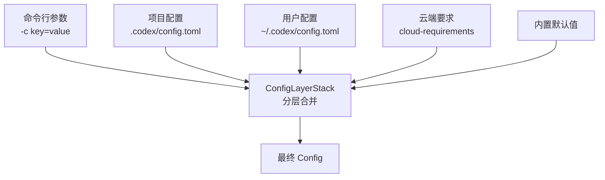

# 10 — 配置系统

> 本章剖析 Codex 的配置分层合并机制、Feature Flags 系统和权限配置。

## 1. 整体架构与伪代码

Codex 的配置来自多个层级，按优先级从高到低合并：

```
// 配置解析优先级（高 → 低）
final_config = merge(
    cli_args,                    // 1. 命令行参数 (-c key=value)
    project_config,              // 2. 项目级 .codex/config.toml（从 cwd 向上查找）
    user_config,                 // 3. 用户级 ~/.codex/config.toml
    cloud_requirements,          // 4. 云端推送的配置要求
    defaults                     // 5. 内置默认值
);
```



## 2. 配置文件格式

### 2.1 用户级配置（`~/.codex/config.toml`）

```toml
model = "gpt-5.4"
model_provider = "openai"
approval_policy = "on-request"

[sandbox]
mode = "workspace-write"
writable_roots = ["/tmp"]

[model_providers.my_ollama]
name = "Local Ollama"
base_url = "http://localhost:11434/v1"
wire_api = "responses"
supports_websockets = false
```

### 2.2 项目级配置（`.codex/config.toml`）

项目级配置从 cwd 向上查找，最近的文件优先。可以覆盖用户级配置的任何字段。

```toml
# 项目特定的模型和策略
model = "o3"
model_reasoning_effort = "high"
```

### 2.3 命令行覆盖

```bash
codex -c 'model="o3"' -c 'sandbox_permissions=["disk-full-read-access"]'
codex --enable some_feature --disable another_feature
```

支持点号路径访问嵌套值：`-c 'model_providers.proxy.base_url="http://..."'`

**源码**: [config/src/config_toml.rs](https://github.com/openai/codex/blob/main/codex-rs/config/src/config_toml.rs)

## 3. ConfigLayerStack：分层合并

`ConfigLayerStack` 管理多层配置的有序合并：

```
ConfigLayerStack
  → 收集所有配置层（cli → project → user → cloud → defaults）
  → 按优先级逐层合并
  → 解析为最终 Config 结构体
```

`Config` 是一个包含所有配置项的大结构体（约 2,300 行），涵盖：

| 配置类别 | 示例字段 |
|---------|---------|
| **模型选择** | model, model_provider, model_reasoning_effort |
| **沙箱策略** | sandbox_mode, writable_roots, network_access |
| **审批策略** | approval_policy (Never/OnFailure/OnRequest/...) |
| **MCP 服务器** | mcp_servers（外部工具服务器列表） |
| **Hooks** | hooks（pre/post 工具执行钩子） |
| **Feature Flags** | features（功能开关） |
| **Agent 角色** | agent_roles（自定义角色定义） |
| **UI 配置** | theme, terminal 相关 |

**源码**: [core/src/config/mod.rs](https://github.com/openai/codex/blob/main/codex-rs/core/src/config/mod.rs), [core/src/config_loader/](https://github.com/openai/codex/blob/main/codex-rs/core/src/config_loader/)

## 4. Feature Flags

通过 `codex-features` crate 管理功能开关：

```rust
pub enum Feature {
    WebSearch,
    ImageGeneration,
    CollaborationMode,
    SpawnAgentsCsv,
    JsRepl,
    // ... 更多
}
```

Feature flags 可以从三个来源控制：

| 来源 | 优先级 | 示例 |
|------|--------|------|
| CLI | 最高 | `--enable web_search` |
| Config | 中 | `features.web_search = true` |
| 服务端推送（ManagedFeatures） | 最低 | 云端动态启用/禁用 |

`FEATURES` 全局实例在进程启动时初始化，运行时通过 `FEATURES.enabled(feature)` 查询。

**源码**: [features/](https://github.com/openai/codex/blob/main/codex-rs/features/src/)

## 5. 权限配置

### 5.1 SandboxPolicy

| 模式 | 文件系统 | 网络 |
|------|---------|------|
| `read-only` | 只读 | 禁止 |
| `workspace-write` | cwd + writable_roots 可写 | 禁止 |
| `full-access` | 全部可写 | 允许 |

### 5.2 额外权限

通过 `sandbox_permissions` 数组可以授予额外能力：

```toml
sandbox_permissions = [
  "disk-full-read-access",    # 完整磁盘读
  "network-full-access"       # 完整网络访问
]
```

### 5.3 Approval Presets

预定义的审批策略组合，简化常见配置：

```toml
# 等价于 approval_policy = "on-request" + sandbox = "workspace-write"
preset = "suggest-and-auto-edit"
```

**源码**: [config/src/](https://github.com/openai/codex/blob/main/codex-rs/config/src/), [utils/approval-presets/](https://github.com/openai/codex/blob/main/codex-rs/utils/approval-presets/)

## 6. 本章小结

| 组件 | 职责 | 源码 |
|------|------|------|
| **ConfigToml** | TOML 配置文件解析 | [config/src/config_toml.rs](https://github.com/openai/codex/blob/main/codex-rs/config/src/config_toml.rs) |
| **Config** | 最终合并后的配置结构体 | [core/src/config/mod.rs](https://github.com/openai/codex/blob/main/codex-rs/core/src/config/mod.rs) |
| **ConfigLayerStack** | 多层配置的有序合并 | [core/src/config_loader/](https://github.com/openai/codex/blob/main/codex-rs/core/src/config_loader/) |
| **Feature** | 功能开关（CLI/Config/服务端） | [features/](https://github.com/openai/codex/blob/main/codex-rs/features/src/) |
| **SandboxPolicy** | 沙箱策略配置 | [config/src/](https://github.com/openai/codex/blob/main/codex-rs/config/src/) |

---

> **源码版本说明**: 本文基于 [openai/codex](https://github.com/openai/codex) 主分支分析。

---

**上一章**: [09 — SDK 与协议](09-sdk-protocol.md)
