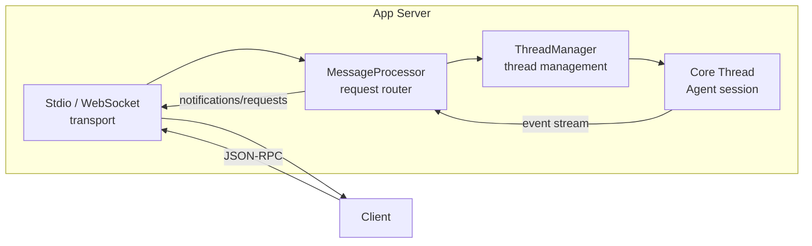
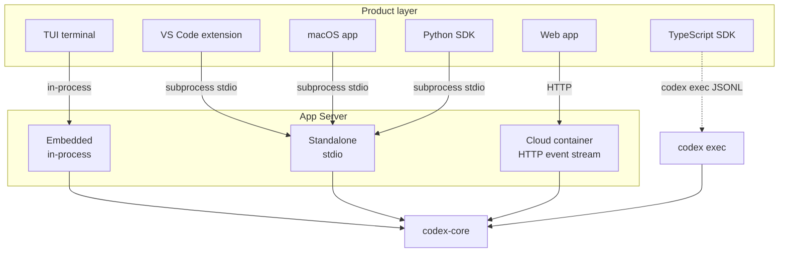

> **Language**: **English** · [中文](10-sdk-protocol.zh.md)

# 10 — Product Integration and the App Server

> Codex drives multiple product surfaces — CLI, Web, the VS Code extension, the macOS desktop app, and more — from a single Agent core. This chapter dissects the design that makes "one core, many faces" possible: the App Server's architecture, its session model, and how SDKs hook into it.

## 1. The big picture: the Harness idea

In the official blog post [Unlocking the Codex harness](https://openai.com/index/unlocking-the-codex-harness/), OpenAI introduces the concept of a **Harness** (used much like a "test harness" — the runtime scaffolding wrapped around the core logic):

> "The model does the reasoning at each step, but the harness handles everything else."

The model handles reasoning; the harness handles **everything else** — running commands, collecting output, managing permissions, deciding when to stop the loop, maintaining context. Codex's various product forms (CLI, Web, IDE extensions, the macOS app) all share the same harness; they only differ in **how they talk to it**:

```
┌──────────────────────────────────────────────────────┐
│                    Codex Harness                     │
│  ┌──────────────┐  ┌────────────┐  ┌──────────────┐ │
│  │Thread mgmt   │  │ Auth/config │  │Sandbox/approve│ │
│  └──────────────┘  └────────────┘  └──────────────┘ │
│  ┌──────────────────────────────────────────────────┐ │
│  │            codex-core (Agent loop)               │ │
│  └──────────────────────────────────────────────────┘ │
└───────────────────────┬──────────────────────────────┘
                        │ App Server JSON-RPC
        ┌───────────────┼───────────────┐
        ▼               ▼               ▼
   ┌─────────┐    ┌──────────┐    ┌──────────┐
   │  TUI    │    │IDE plugin│    │   SDK    │
   │(embedded)    │ (stdio)  │    │(subproc) │
   └─────────┘    └──────────┘    └──────────┘
```

### How it evolved

The App Server went through three stages (see [Unlocking the Codex harness](https://openai.com/index/unlocking-the-codex-harness/)):

| Stage | Approach | Problem |
|-------|----------|---------|
| **v1** | CLI calls `codex-core` directly | Only drives the terminal UI; cannot serve IDE or Web clients |
| **v2** | Tried the MCP protocol | MCP is designed for tool calls; not a great fit for driving a full Agent session |
| **v3** | **App Server (JSON-RPC)** | Bidirectional comms, session persistence, multiple concurrent clients — the current answer |

## 2. App Server architecture

The App Server is a JSON-RPC service process that bridges upper-layer products and the underlying Agent core.

### 2.1 Four core components



| Component | Responsibility | Source |
|-----------|----------------|--------|
| **Transport** | Receives JSON-RPC messages; supports stdio (default) and WebSocket (experimental) | [transport/](https://github.com/openai/codex/blob/main/codex-rs/app-server/src/transport/) |
| **MessageProcessor** | Request router; dispatches to handlers for thread ops, config API, filesystem API, MCP, etc. | [message_processor.rs](https://github.com/openai/codex/blob/main/codex-rs/app-server/src/message_processor.rs) |
| **ThreadManager** | Manages Thread creation, resume, and archive; each Thread maps to an independent core session | [thread_manager.rs](https://github.com/openai/codex/blob/main/codex-rs/core/src/thread_manager.rs) |
| **Core Thread** | The session instance that actually runs the Agent loop; wires into `codex-core`'s Turn loop | [codex.rs](https://github.com/openai/codex/blob/main/codex-rs/core/src/codex.rs) |

### 2.2 The dual-loop design

Inside the App Server, two async loops run concurrently ([lib.rs:104-127](https://github.com/openai/codex/blob/main/codex-rs/app-server/src/lib.rs#L104-L127)):

- **Processor loop**: receives and dispatches JSON-RPC requests; fast
- **Outbound loop**: writes notifications and responses back to the client; potentially slow (network latency), kept decoupled from the processing logic to avoid blocking

The two loops are connected by a bounded channel (capacity 128). When it fills up the server returns `-32001 Server overloaded`, and clients are expected to retry with exponential backoff.

### 2.3 Transports

| Transport | Command | Use |
|-----------|---------|-----|
| **stdio** | `codex app-server --listen stdio://` | IDE extensions, Python SDK (default; JSONL framed) |
| **WebSocket** | `codex app-server --listen ws://IP:PORT` | Remote connections (experimental; supports Bearer/HMAC auth) |

**Source**: [App Server README — Protocol](https://github.com/openai/codex/blob/main/codex-rs/app-server/README.md)

## 3. The session model: Thread / Turn / Item

The App Server defines three layers of **session primitives**, and every product form shares this same model:


### 3.1 The three primitives

| Primitive | Definition | Lifecycle |
|-----------|------------|-----------|
| **Thread** | A complete conversation between user and Agent, made up of multiple Turns | created → in progress → archived; resumable, forkable |
| **Turn** | A single round of interaction, usually starting with a user message and ending with an Agent message | `turn/start` → streamed events → `turn/completed` (or `interrupted`) |
| **Item** | An atomic unit inside a Turn: user message, Agent reasoning, command execution, file edit, etc. | `item/started` → delta stream → `item/completed` |

Threads are **persisted** — the event history is written to disk (`~/.codex/sessions/`), and a client that has disconnected can call `thread/resume` to reconnect and re-render the full timeline.

### 3.2 Item types

Items are the data clients consume most directly. Every Item has a streaming lifecycle of `started → delta → completed`. The main types:

| Item type | Description |
|-----------|-------------|
| `UserMessage` | User input (text, images) |
| `AgentMessage` | Agent text output |
| `Reasoning` | Agent chain-of-thought reasoning |
| `Plan` | Plan text |
| `WebSearch` | Search query |
| `CommandExecution` | Shell command execution (with stdout/stderr stream) |
| `FileChange` | File edit (apply-patch) |
| `ContextCompaction` | Context-compaction marker |

**Source**: [protocol/src/items.rs](https://github.com/openai/codex/blob/main/codex-rs/protocol/src/items.rs)

### 3.3 A typical lifecycle

```
Client                          App Server
  │                                │
  │── thread/start ──────────────→ │  create Thread
  │←── thread/started notification │
  │                                │
  │── turn/start (user message) ─→ │  start Turn
  │←── turn/started notification ──│
  │←── item/started (reasoning) ── │  Agent starts reasoning
  │←── item/agentMessage/delta ─── │  streaming output
  │←── item/commandExecution/      │
  │    requestApproval ──────────→ │  request approval (bidirectional!)
  │── approval response ─────────→ │
  │←── item/completed ───────────  │  command execution done
  │←── item/completed (message) ── │  Agent message done
  │←── turn/completed ───────────  │  Turn ends
  │                                │
  │── turn/start (next round) ───→ │  new Turn...
```

Note that `requestApproval` is **a request the server sends to the client** — the Agent's Turn pauses until the user replies allow/deny. This is exactly where JSON-RPC's bidirectional nature pays off.

## 4. How the various products plug in

### 4.1 Integration overview



### 4.2 Per-product details

| Product | Integration | Transport | Notes |
|---------|-------------|-----------|-------|
| **TUI** | Embedded App Server | in-process channel | Same-process communication, no serialization overhead |
| **VS Code / Cursor** | Standalone App Server subprocess | stdio JSONL | The plugin `spawn`s `codex app-server --listen stdio://` |
| **macOS app** | Standalone App Server subprocess | stdio JSONL | Shares the same integration mode as IDEs |
| **Web app** | App Server inside a cloud container | HTTP event stream | Browsers cannot speak stdio directly, so traffic is bridged over HTTP |
| **Python SDK** | Standalone App Server subprocess | stdio JSON-RPC | Full session-management capabilities |
| **TypeScript SDK** | `codex exec --experimental-json` | stdout JSONL | Lightweight integration; bypasses the App Server |

#### TUI's embedded mode

When the TUI starts, it does not spawn a separate App Server process — it starts an embedded App Server **inside the same process**. The code distinguishes the two modes via the `AppServerTarget` enum ([tui/src/lib.rs:217](https://github.com/openai/codex/blob/main/codex-rs/tui/src/lib.rs#L217)):

```rust
enum AppServerTarget {
    Embedded,                               // same process
    Remote { websocket_url, auth_token },   // remote WebSocket
}
```

Embedded mode uses an `InProcessAppServerClient` that talks directly through in-memory channels, with no JSON serialization/deserialization needed.

#### IDE extensions' stdio mode

The VS Code extension launches a `codex app-server --listen stdio://` subprocess and exchanges JSONL-framed JSON-RPC messages over stdin/stdout. After the connection is established, a handshake runs first:

```json
// 1. Client sends initialize
{ "method": "initialize", "id": 0, "params": {
    "clientInfo": { "name": "codex_vscode", "title": "Codex VS Code Extension", "version": "0.1.0" }
}}

// 2. Server returns the initialize response
{ "id": 0, "result": { "userAgent": "...", "codexHome": "~/.codex", ... }}

// 3. Client sends the initialized notification (no id)
{ "method": "initialized" }

// After this, normal calls like thread/start, turn/start, etc. are allowed
```

**Source**: [App Server README — Initialization](https://github.com/openai/codex/blob/main/codex-rs/app-server/README.md)

## 5. JSON-RPC protocol overview

The App Server's protocol borrows from [MCP](https://modelcontextprotocol.io/)'s design and uses JSON-RPC 2.0 (the `"jsonrpc":"2.0"` header is omitted to reduce wire size). The full TypeScript types and JSON Schema for the protocol can be generated via:

```bash
codex app-server generate-ts --out DIR           # TypeScript types
codex app-server generate-json-schema --out DIR   # JSON Schema
```

### 5.1 Three message directions

| Direction | Type | Examples |
|-----------|------|----------|
| **Client → server request** | Client initiates, server responds | `thread/start`, `turn/start`, `fs/readFile` |
| **Server → client request** | Server initiates, client responds | `item/commandExecution/requestApproval` (approval) |
| **Server → client notification** | One-way, no response expected | `turn/started`, `item/agentMessage/delta` (streaming) |

The bidirectional-request capability is what sets the App Server apart from a plain REST API — mid-execution, the Agent can **proactively pause and ask the client a question** (such as for approval), and the Turn stays suspended until a response arrives.

### 5.2 Method categories

The protocol defines 60+ client request methods and 6 server request methods, grouped by domain:

| Domain | Key methods | Description |
|--------|-------------|-------------|
| **Thread lifecycle** | `thread/start`, `thread/resume`, `thread/fork`, `thread/archive`, `thread/list`, `thread/read`, `thread/rollback` | Create, resume, fork, archive, list, read, and roll back conversations |
| **Turn control** | `turn/start`, `turn/steer`, `turn/interrupt` | Start a Turn, steer it mid-flight, interrupt it |
| **Filesystem** | `fs/readFile`, `fs/writeFile`, `fs/watch`, etc. | File operations exposed for the IDE |
| **Config & auth** | `config/read`, `account/login/start`, `account/logout` | Read/write config, login flow |
| **Skills / Plugins** | `skills/list`, `plugin/install`, `app/list` | Manage skills and plugins |
| **MCP integration** | `mcpServer/tool/call`, `mcpServer/resource/read` | Invoke tools and read resources from an MCP server |
| **Approvals (server requests)** | `item/commandExecution/requestApproval`, `item/fileChange/requestApproval`, `item/permissions/requestApproval` | Agent asks the user to approve a command, file change, or permission |

**Source**: [app-server-protocol/src/protocol/common.rs](https://github.com/openai/codex/blob/main/codex-rs/app-server-protocol/src/protocol/common.rs) (uses macros to generate every method definition, plus TypeScript types and JSON Schema)

### 5.3 Backwards compatibility

The protocol has two versions, v1 and v2. v1 is the legacy API (e.g. `GetConversationSummary`, `GetAuthStatus`); it is marked DEPRECATED but still available. v2 is the current main line and follows the `<resource>/<method>` naming convention. Experimental APIs require the client to declare `experimentalApi: true` during `initialize` before they can be called.

## 6. SDK integration

### 6.1 TypeScript SDK

The TypeScript SDK takes the **lightweight path** — it does not start an App Server. Instead it runs `codex exec --experimental-json` directly and reads a JSONL event stream from stdout:

```typescript
// sdk/typescript/src/exec.ts
const commandArgs = ["exec", "--experimental-json"];
const child = spawn(codexBinary, commandArgs);
// Read JSON events from stdout line by line
```

The SDK wraps three core classes:

| Class | Responsibility |
|-------|----------------|
| `Codex` | Entry point; creates or resumes a Thread |
| `Thread` | A conversation thread; manages multiple Turns |
| `Turn` | The result of one round of interaction (items + finalResponse + usage) |

```typescript
const codex = new Codex({ apiKey: "..." });
const thread = codex.startThread({ model: "o3" });
const result = await thread.run("fix this bug");
console.log(result.finalResponse);
```

**Source**: [sdk/typescript/src/](https://github.com/openai/codex/blob/main/sdk/typescript/src/)

### 6.2 Python SDK

The Python SDK takes the **full path** — it spawns a `codex app-server --listen stdio://` subprocess and talks to it as a JSON-RPC client:

```python
# sdk/python/src/codex_app_server/client.py
args = [str(codex_bin), "app-server", "--listen", "stdio://"]
self._proc = subprocess.Popen(args, stdin=PIPE, stdout=PIPE, ...)
# Send/receive JSON-RPC messages over stdin/stdout
```

It provides both sync and async clients:

| Class | Description |
|-------|-------------|
| `AppServerClient` | Sync client, suited to scripts and simple use cases |
| `AsyncAppServerClient` | Async client, suited to concurrent workloads |

```python
from codex_app_server import AppServerClient, AppServerConfig

with AppServerClient(AppServerConfig(cwd="/my/project")) as client:
    thread = client.thread_start(model="o3")
    turn = client.turn_start(thread_id=thread.id, message="fix this bug")
    for event in client.turn_stream(thread_id=thread.id, turn_id=turn.id):
        print(event)
```

The Python SDK's type definitions are auto-generated from the Rust `app-server-protocol` crate (TypeScript types are exported via `ts-rs` and then converted into Python Pydantic models).

**Source**: [sdk/python/src/codex_app_server/](https://github.com/openai/codex/blob/main/sdk/python/src/codex_app_server/)

### 6.3 Trade-offs between the two SDKs

| Aspect | TypeScript SDK | Python SDK |
|--------|----------------|------------|
| Wire protocol | `codex exec` JSONL event stream | App Server JSON-RPC |
| Session ownership | Maintained on the SDK side | Maintained on the App Server side |
| Multi-Turn capability | Each `run()` is a separate invocation | Multiple `turn_start` calls within one Thread |
| Thread persistence | Supported (resume by thread ID) | Supported (full thread-lifecycle API) |
| Approval handling | Configured via `approvalPolicy` | Register an `approval_handler` callback |
| Best for | Quick integrations, one-shot tasks | Apps that need full session control |

## 7. Chapter summary

| Concept | Key points |
|---------|------------|
| **Harness** | Everything around the model — execution, approvals, context, persistence; shared across products |
| **App Server** | JSON-RPC bidirectional service, four components: transport, MessageProcessor, ThreadManager, Core Thread |
| **Thread / Turn / Item** | A three-layer session model: conversation → round → atomic unit; every layer has a streaming lifecycle |
| **Integration paths** | TUI (embedded), IDE/SDK (stdio subprocess), Web (cloud container); the TypeScript SDK takes the lightweight `exec` JSONL path |
| **Protocol** | 60+ methods, bidirectional requests (approvals), v1/v2 compatibility, experimental APIs are opt-in |

> **Further reading**:
> - [Unlocking the Codex harness: how we built the App Server](https://openai.com/index/unlocking-the-codex-harness/) — OpenAI's official blog post; the full App Server design write-up
> - [Unrolling the Codex agent loop](https://openai.com/index/unrolling-the-codex-agent-loop/) — a deep dive on the Agent main loop
> - [App Server README](https://github.com/openai/codex/blob/main/codex-rs/app-server/README.md) — the full protocol reference

---

**Previous**: [09 — MCP, Skills, and Plugins](09-mcp-skills-plugins.md) | **Next**: [11 — Configuration system](11-config-system.md)
