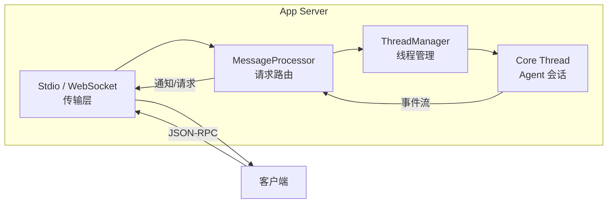
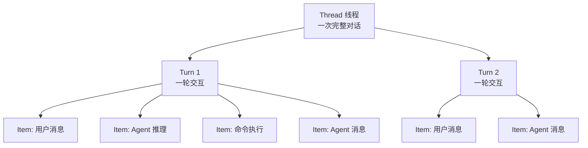
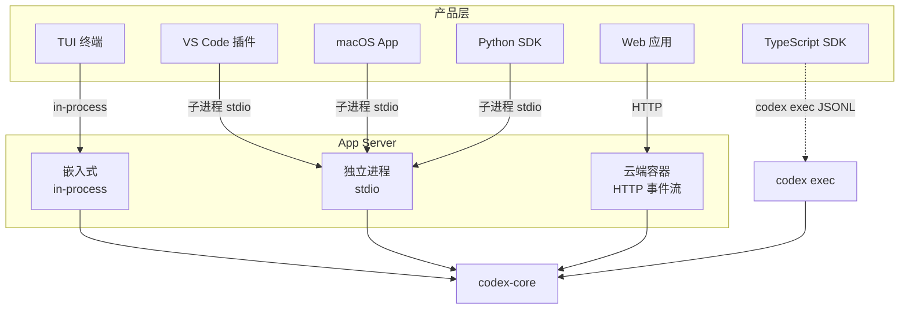

# 10 — 产品集成与 App Server

> Codex 以同一个 Agent 内核驱动 CLI、Web、VS Code 插件、macOS 桌面应用等多个产品形态。本章剖析这一"一核多面"设计的关键——App Server 的架构、会话模型和 SDK 接入方式。

## 1. 整体概览：Harness 的思想

OpenAI 在官方博客 [Unlocking the Codex harness](https://openai.com/index/unlocking-the-codex-harness/) 中提出了 **Harness**（直译"线束"）的概念：

> "The model does the reasoning at each step, but the harness handles everything else."

模型负责推理，harness 负责**推理之外的一切**——执行命令、收集输出、管理权限、判断何时结束循环、维护上下文。Codex 的多个产品形态（CLI、Web、IDE 插件、macOS App）共享同一套 harness，差异仅在于**如何与 harness 通信**：

```
┌──────────────────────────────────────────────────────┐
│                    Codex Harness                     │
│  ┌──────────────┐  ┌────────────┐  ┌──────────────┐ │
│  │ Thread 管理   │  │ 认证与配置  │  │  沙箱与审批   │ │
│  └──────────────┘  └────────────┘  └──────────────┘ │
│  ┌──────────────────────────────────────────────────┐ │
│  │              codex-core (Agent 循环)              │ │
│  └──────────────────────────────────────────────────┘ │
└───────────────────────┬──────────────────────────────┘
                        │ App Server JSON-RPC
        ┌───────────────┼───────────────┐
        ▼               ▼               ▼
   ┌─────────┐    ┌──────────┐    ┌──────────┐
   │  TUI    │    │ IDE 插件  │    │   SDK    │
   │(嵌入式) │    │ (stdio)  │    │(子进程)  │
   └─────────┘    └──────────┘    └──────────┘
```

### 演进路径

App Server 不是一步到位的设计，而是经历了三个阶段（见 [Unlocking the Codex harness](https://openai.com/index/unlocking-the-codex-harness/)）：

| 阶段 | 方案 | 问题 |
|------|------|------|
| **v1** | CLI 直接调用 `codex-core` | 只能驱动终端界面，无法供 IDE 或 Web 使用 |
| **v2** | 尝试 MCP 协议 | MCP 面向工具调用设计，不适合驱动完整的 Agent 会话 |
| **v3** | **App Server (JSON-RPC)** | 双向通信、会话持久化、多客户端并发——成为当前方案 |

## 2. App Server 架构

App Server 是一个 JSON-RPC 服务进程，连接上层产品与底层 Agent 内核。

### 2.1 四个核心组件



| 组件 | 职责 | 源码 |
|------|------|------|
| **传输层** | 接收 JSON-RPC 消息，支持 stdio（默认）和 WebSocket（实验性） | [transport/](https://github.com/openai/codex/blob/main/codex-rs/app-server/src/transport/) |
| **MessageProcessor** | 请求路由器，分发到线程操作、配置 API、文件系统 API、MCP 等处理器 | [message_processor.rs](https://github.com/openai/codex/blob/main/codex-rs/app-server/src/message_processor.rs) |
| **ThreadManager** | 管理 Thread 的创建、恢复、归档，每个 Thread 对应一个独立的 core session | [thread_manager.rs](https://github.com/openai/codex/blob/main/codex-rs/core/src/thread_manager.rs) |
| **Core Thread** | 真正运行 Agent 循环的会话实例，与 `codex-core` 的 Turn 循环对接 | [codex.rs](https://github.com/openai/codex/blob/main/codex-rs/core/src/codex.rs) |

### 2.2 双循环设计

App Server 内部跑两个异步循环（[lib.rs:104-127](https://github.com/openai/codex/blob/main/codex-rs/app-server/src/lib.rs#L104-L127)）：

- **Processor 循环**：接收并分发 JSON-RPC 请求，速度快
- **Outbound 循环**：向客户端写出通知和响应，可能慢（网络延迟），与处理逻辑解耦避免阻塞

两个循环之间通过有界通道（容量 128）连接，满时返回 `-32001 Server overloaded` 错误，客户端应使用指数退避重试。

### 2.3 传输方式

| 方式 | 命令 | 用途 |
|------|------|------|
| **stdio** | `codex app-server --listen stdio://` | IDE 扩展、Python SDK（默认，JSONL 格式） |
| **WebSocket** | `codex app-server --listen ws://IP:PORT` | 远程连接（实验性，支持 Bearer/HMAC 认证） |

**源码**: [App Server README — Protocol](https://github.com/openai/codex/blob/main/codex-rs/app-server/README.md)

## 3. 会话模型：Thread / Turn / Item

App Server 定义了三个层次的**会话原语**，所有产品形态共享这一套模型：



### 3.1 三个原语

| 原语 | 定义 | 生命周期 |
|------|------|----------|
| **Thread** | 用户与 Agent 之间的一次完整对话，包含多个 Turn | 创建 → 进行中 → 归档；可恢复、可分叉 |
| **Turn** | 一轮交互，通常从用户消息开始、以 Agent 消息结束 | `turn/start` → 流式事件 → `turn/completed`（或 `interrupted`） |
| **Item** | Turn 内的原子单元：用户消息、Agent 推理、命令执行、文件编辑等 | `item/started` → delta 流 → `item/completed` |

Thread 支持**持久化**——事件历史写入磁盘（`~/.codex/sessions/`），客户端断开后可通过 `thread/resume` 重新连接并渲染完整时间线。

### 3.2 Item 类型

Item 是客户端最直接消费的数据。每个 Item 都有 `started → delta → completed` 的流式生命周期。主要类型：

| Item 类型 | 说明 |
|-----------|------|
| `UserMessage` | 用户输入（文本、图片） |
| `AgentMessage` | Agent 的文本输出 |
| `Reasoning` | Agent 的思维链推理 |
| `Plan` | 规划文本 |
| `WebSearch` | 搜索查询 |
| `CommandExecution` | Shell 命令执行（含 stdout/stderr 流） |
| `FileChange` | 文件编辑（apply-patch） |
| `ContextCompaction` | 上下文压缩标记 |

**源码**: [protocol/src/items.rs](https://github.com/openai/codex/blob/main/codex-rs/protocol/src/items.rs)

### 3.3 典型生命周期

```
客户端                          App Server
  │                                │
  │── thread/start ──────────────→ │  创建 Thread
  │←── thread/started 通知 ────── │
  │                                │
  │── turn/start (用户消息) ─────→ │  开始 Turn
  │←── turn/started 通知 ──────── │
  │←── item/started (reasoning) ── │  Agent 开始推理
  │←── item/agentMessage/delta ─── │  流式输出
  │←── item/commandExecution/      │
  │    requestApproval ──────────→ │  请求审批（双向！）
  │── 审批响应 ──────────────────→ │
  │←── item/completed ───────────  │  命令执行完成
  │←── item/completed (message) ── │  Agent 消息完成
  │←── turn/completed ───────────  │  Turn 结束
  │                                │
  │── turn/start (下一轮) ───────→ │  新的 Turn...
```

注意 `requestApproval` 是**服务端向客户端发出的请求**——Agent 的 Turn 会暂停，直到用户回复 allow/deny。这就是 JSON-RPC 双向通信的价值。

## 4. 多产品接入方式

### 4.1 接入方式总览



### 4.2 各产品的接入细节

| 产品 | 接入方式 | 传输 | 特点 |
|------|---------|------|------|
| **TUI** | 嵌入式 App Server | in-process 通道 | 同进程内通信，无序列化开销 |
| **VS Code / Cursor** | 独立 App Server 子进程 | stdio JSONL | 插件 `spawn("codex", ["app-server", "--listen", "stdio://"])` |
| **macOS App** | 独立 App Server 子进程 | stdio JSONL | 与 IDE 共享同一种接入方式 |
| **Web 应用** | 云端容器中的 App Server | HTTP 事件流 | 浏览器无法直接 stdio，通过 HTTP 转接 |
| **Python SDK** | 独立 App Server 子进程 | stdio JSON-RPC | 完整的会话管理能力 |
| **TypeScript SDK** | `codex exec --experimental-json` | stdout JSONL | 轻量接入，不经过 App Server |

#### TUI 的嵌入式模式

TUI 启动时不会创建独立的 App Server 进程，而是在**同一进程内**启动一个 embedded App Server。代码中通过 `AppServerTarget` 枚举区分两种模式（[tui/src/lib.rs:217](https://github.com/openai/codex/blob/main/codex-rs/tui/src/lib.rs#L217)）：

```rust
enum AppServerTarget {
    Embedded,                               // 同进程
    Remote { websocket_url, auth_token },   // 远程 WebSocket
}
```

嵌入式模式使用 `InProcessAppServerClient`，通过内存通道直接通信，无需 JSON 序列化/反序列化。

#### IDE 插件的 stdio 模式

VS Code 插件启动一个 `codex app-server --listen stdio://` 子进程，通过 stdin/stdout 交换 JSONL 格式的 JSON-RPC 消息。连接建立后需要先完成握手：

```json
// 1. 客户端发送 initialize
{ "method": "initialize", "id": 0, "params": {
    "clientInfo": { "name": "codex_vscode", "title": "Codex VS Code Extension", "version": "0.1.0" }
}}

// 2. 服务端返回 initialize 响应
{ "id": 0, "result": { "userAgent": "...", "codexHome": "~/.codex", ... }}

// 3. 客户端发送 initialized 通知（无 id）
{ "method": "initialized" }

// 此后可以正常调用 thread/start, turn/start 等方法
```

**源码**: [App Server README — Initialization](https://github.com/openai/codex/blob/main/codex-rs/app-server/README.md)

## 5. JSON-RPC 协议概览

App Server 的协议借鉴了 [MCP](https://modelcontextprotocol.io/) 的设计，使用 JSON-RPC 2.0（省略了 `"jsonrpc":"2.0"` 头以减少传输体积）。协议的完整 TypeScript 类型和 JSON Schema 可以通过命令生成：

```bash
codex app-server generate-ts --out DIR           # TypeScript 类型
codex app-server generate-json-schema --out DIR   # JSON Schema
```

### 5.1 三种消息方向

| 方向 | 类型 | 示例 |
|------|------|------|
| **客户端 → 服务端请求** | 客户端发起，服务端响应 | `thread/start`, `turn/start`, `fs/readFile` |
| **服务端 → 客户端请求** | 服务端发起，客户端响应 | `item/commandExecution/requestApproval`（审批） |
| **服务端 → 客户端通知** | 单向，无需响应 | `turn/started`, `item/agentMessage/delta`（流式） |

双向请求能力是 App Server 区别于普通 REST API 的关键——Agent 执行过程中可以**主动暂停并向客户端提问**（如请求审批），Turn 在收到响应前一直挂起。

### 5.2 方法分类

协议定义了 60+ 个客户端请求方法和 6 个服务端请求方法，按领域分组：

| 领域 | 主要方法 | 说明 |
|------|---------|------|
| **Thread 生命周期** | `thread/start`, `thread/resume`, `thread/fork`, `thread/archive`, `thread/list`, `thread/read`, `thread/rollback` | 会话的创建、恢复、分叉、归档、列表、读取、回滚 |
| **Turn 控制** | `turn/start`, `turn/steer`, `turn/interrupt` | 启动 Turn、中途引导、中断 |
| **文件系统** | `fs/readFile`, `fs/writeFile`, `fs/watch` 等 | 供 IDE 进行文件操作 |
| **配置与认证** | `config/read`, `account/login/start`, `account/logout` | 配置读写、登录流程 |
| **Skills / Plugins** | `skills/list`, `plugin/install`, `app/list` | 技能与插件管理 |
| **MCP 集成** | `mcpServer/tool/call`, `mcpServer/resource/read` | 调用 MCP Server 的工具和资源 |
| **审批（服务端请求）** | `item/commandExecution/requestApproval`, `item/fileChange/requestApproval`, `item/permissions/requestApproval` | Agent 请求用户审批命令/文件/权限 |

**源码**: [app-server-protocol/src/protocol/common.rs](https://github.com/openai/codex/blob/main/codex-rs/app-server-protocol/src/protocol/common.rs)（通过宏生成所有方法定义、TypeScript 类型和 JSON Schema）

### 5.3 向后兼容

协议分 v1 和 v2 两个版本。v1 为旧版 API（如 `GetConversationSummary`、`GetAuthStatus`），标记为 DEPRECATED 但仍可用。v2 是当前主力，命名约定 `<resource>/<method>`。实验性 API 需要客户端在 `initialize` 时声明 `experimentalApi: true` 才能调用。

## 6. SDK 接入

### 6.1 TypeScript SDK

TypeScript SDK 采用**轻量路径**——不启动 App Server，而是直接运行 `codex exec --experimental-json`，通过 stdout 读取 JSONL 事件流：

```typescript
// sdk/typescript/src/exec.ts
const commandArgs = ["exec", "--experimental-json"];
const child = spawn(codexBinary, commandArgs);
// 逐行读取 stdout 中的 JSON 事件
```

SDK 封装为三个核心类：

| 类 | 职责 |
|----|------|
| `Codex` | 入口，创建或恢复 Thread |
| `Thread` | 对话线程，管理多轮 Turn |
| `Turn` | 一轮交互的结果（items + finalResponse + usage） |

```typescript
const codex = new Codex({ apiKey: "..." });
const thread = codex.startThread({ model: "o3" });
const result = await thread.run("修复这个 bug");
console.log(result.finalResponse);
```

**源码**: [sdk/typescript/src/](https://github.com/openai/codex/blob/main/sdk/typescript/src/)

### 6.2 Python SDK

Python SDK 采用**完整路径**——启动一个 `codex app-server --listen stdio://` 子进程，作为 JSON-RPC 客户端与之通信：

```python
# sdk/python/src/codex_app_server/client.py
args = [str(codex_bin), "app-server", "--listen", "stdio://"]
self._proc = subprocess.Popen(args, stdin=PIPE, stdout=PIPE, ...)
# 通过 stdin/stdout 收发 JSON-RPC 消息
```

提供同步和异步两种客户端：

| 类 | 说明 |
|----|------|
| `AppServerClient` | 同步客户端，适合脚本和简单场景 |
| `AsyncAppServerClient` | 异步客户端，适合并发场景 |

```python
from codex_app_server import AppServerClient, AppServerConfig

with AppServerClient(AppServerConfig(cwd="/my/project")) as client:
    thread = client.thread_start(model="o3")
    turn = client.turn_start(thread_id=thread.id, message="修复这个 bug")
    for event in client.turn_stream(thread_id=thread.id, turn_id=turn.id):
        print(event)
```

Python SDK 的类型定义从 Rust 的 `app-server-protocol` crate 自动生成（通过 `ts-rs` 导出 TypeScript 类型，再转为 Python Pydantic 模型）。

**源码**: [sdk/python/src/codex_app_server/](https://github.com/openai/codex/blob/main/sdk/python/src/codex_app_server/)

### 6.3 两种 SDK 的设计取舍

| 方面 | TypeScript SDK | Python SDK |
|------|---------------|------------|
| 通信协议 | `codex exec` JSONL 事件流 | App Server JSON-RPC |
| 会话管理 | SDK 端维护 | App Server 端维护 |
| 多 Turn 能力 | 每次 `run()` 独立调用 | 同一 Thread 内多次 `turn_start` |
| Thread 持久化 | 支持（通过 thread ID 恢复） | 支持（完整的 thread 生命周期 API） |
| 审批处理 | 通过配置 `approvalPolicy` | 可注册 `approval_handler` 回调 |
| 适用场景 | 快速集成、单次任务 | 需要完整会话控制的应用 |

## 7. 本章小结

| 概念 | 要点 |
|------|------|
| **Harness** | 模型之外的一切——执行、审批、上下文、持久化；多产品共享同一套 |
| **App Server** | JSON-RPC 双向通信服务，四组件：传输层、MessageProcessor、ThreadManager、Core Thread |
| **Thread / Turn / Item** | 三层会话模型：对话 → 轮次 → 原子单元，每层都有流式生命周期 |
| **接入方式** | TUI（嵌入式）、IDE/SDK（stdio 子进程）、Web（云端容器）；TypeScript SDK 走 exec JSONL 轻量路径 |
| **协议** | 60+ 方法，双向请求（审批），v1/v2 版本兼容，实验性 API 需 opt-in |

> **延伸阅读**:
> - [Unlocking the Codex harness: how we built the App Server](https://openai.com/index/unlocking-the-codex-harness/) — OpenAI 官方博客，App Server 设计全文
> - [Unrolling the Codex agent loop](https://openai.com/index/unrolling-the-codex-agent-loop/) — Agent 主循环剖析
> - [App Server README](https://github.com/openai/codex/blob/main/codex-rs/app-server/README.md) — 完整的协议参考文档

---

**上一章**: [09 — MCP、Skills 与插件](09-mcp-skills-plugins.md) | **下一章**: [11 — 配置系统](11-config-system.md)
