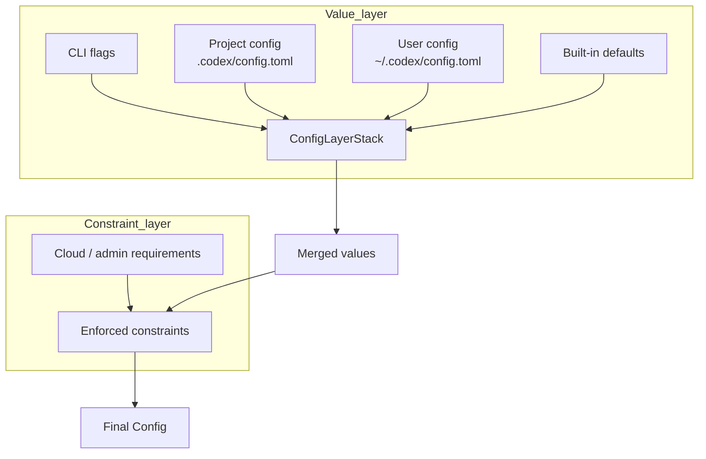

> **Language**: **English** · [中文](11-config-system.zh.md)

# 11 — Configuration system

> This chapter dissects Codex's layered configuration merging, the Feature Flags system, and the permission configuration.

## 1. Overall architecture and pseudocode

Codex's configuration is split into two independent systems: a **value layer** and a **constraint layer**:

```
// Value layer: merged in priority order (high → low)
config_values = merge(
    runtime_overrides,       // 1. CLI flags (-c key=value)
    project_configs,         // 2. project-level .codex/config.toml (walks upward from cwd)
    user_config,             // 3. user-level ~/.codex/config.toml
    system_defaults          // 4. built-in defaults
);

// Constraint layer: independent of the value layer, enforced unconditionally
constraints = cloud_requirements + admin_requirements;
// Constraints cannot be overridden by the value layer (e.g. enforced sandbox or minimum approval bar)

final_config = apply_constraints(config_values, constraints);
```

**Source**: [config/src/config_toml.rs](https://github.com/openai/codex/blob/main/codex-rs/config/src/config_toml.rs) (config parsing), [core/src/config_loader/](https://github.com/openai/codex/blob/main/codex-rs/core/src/config_loader/) (layered merge)



> The key difference between the constraint layer and the value layer: values can be overridden by a higher-priority layer, but constraint-layer limits **cannot be overridden by the user** — they are a safety floor.

## 2. Configuration file format

### 2.1 User-level config (`~/.codex/config.toml`)

```toml
model = "gpt-5.4"
model_provider = "openai"
approval_policy = "on-request"
sandbox_mode = "workspace-write"

[sandbox_workspace_write]
writable_roots = ["/tmp"]

[model_providers.my_ollama]
name = "Local Ollama"
base_url = "http://localhost:11434/v1"
wire_api = "responses"
supports_websockets = false
```

### 2.2 Project-level config (`.codex/config.toml`)

Located by walking upward from the cwd, with **multi-level merge** (closest wins):

```
/project/.codex/config.toml      ← project root level
/project/packages/app/.codex/config.toml  ← subdirectory level (higher priority)
```

### 2.3 Command-line overrides

```bash
codex -c 'model="o3"'
codex -c 'model_providers.proxy.base_url="http://..."'
codex --enable some_feature --disable another_feature
```

**Source**: [config/src/config_toml.rs](https://github.com/openai/codex/blob/main/codex-rs/config/src/config_toml.rs), [core/src/config_loader/](https://github.com/openai/codex/blob/main/codex-rs/core/src/config_loader/)

## 3. Feature Flags

Feature toggles are managed through the `codex-features` crate. The currently relevant features (using the actual names from the source) are:

| Feature | Description |
|---------|-------------|
| `WebSearchRequest` / `WebSearchCached` | Web search |
| `Collab` | Multi-agent collaboration mode |
| `SpawnCsv` | CSV-driven batch agent spawning |
| `JsRepl` | JavaScript REPL |
| `ImageGen` | Image generation |

Feature resolution flow (it is not a simple global singleton):

```
Features::from_sources(config_features, cli_features)
  → ManagedFeatures::from_configured(features, constraints)
    → apply forced enable/disable from the constraint layer
  → the final ManagedFeatures is attached to the Config
```

**Source**: [features/src/lib.rs](https://github.com/openai/codex/blob/main/codex-rs/features/src/lib.rs)

The constraint layer (for example, `managed_features` pushed from the cloud) can **forcibly override** the user's feature settings.

**Source**: [features/src/lib.rs](https://github.com/openai/codex/blob/main/codex-rs/features/src/lib.rs), [core/src/config/mod.rs](https://github.com/openai/codex/blob/main/codex-rs/core/src/config/mod.rs)

## 4. Permission configuration

### 4.1 SandboxPolicy

The sandbox is configured through the top-level field `sandbox_mode` (not a `[sandbox]` table):

| sandbox_mode | Filesystem | Network |
|--------------|------------|---------|
| `read-only` | Read-only | Blocked |
| `workspace-write` | cwd + writable_roots are writable | Blocked |
| `full-access` | Everything writable | Allowed |

Detailed `workspace-write` settings live in the `[sandbox_workspace_write]` table:

```toml
sandbox_mode = "workspace-write"

[sandbox_workspace_write]
writable_roots = ["/tmp", "/var/data"]
```

### 4.2 Approval Presets

Built-in approval-policy presets:

| Preset | Approval policy | Sandbox |
|--------|-----------------|---------|
| `read-only` | Strict approval | Read-only |
| `auto` | on-request (model asks when needed) | workspace-write |
| `full-access` | never (no approval) | full-access |

**Source**: [utils/approval-presets/src/lib.rs](https://github.com/openai/codex/blob/main/codex-rs/utils/approval-presets/src/lib.rs)

## 5. Chapter summary

| Component | Responsibility | Source |
|-----------|----------------|--------|
| **ConfigToml** | TOML config file parsing | [config/src/config_toml.rs](https://github.com/openai/codex/blob/main/codex-rs/config/src/config_toml.rs) |
| **ConfigLayerStack** | Ordered merge of multi-level value configs | [core/src/config_loader/](https://github.com/openai/codex/blob/main/codex-rs/core/src/config_loader/) |
| **Config** | Final merged struct | [core/src/config/mod.rs](https://github.com/openai/codex/blob/main/codex-rs/core/src/config/mod.rs) |
| **ManagedFeatures** | Feature Flags (value-layer + constraint-layer resolution) | [features/src/lib.rs](https://github.com/openai/codex/blob/main/codex-rs/features/src/lib.rs) |
| **Approval Presets** | Predefined approval + sandbox bundles | [utils/approval-presets/](https://github.com/openai/codex/blob/main/codex-rs/utils/approval-presets/src/) |

---

**Previous**: [10 — Product integration and the App Server](10-sdk-protocol.md)
