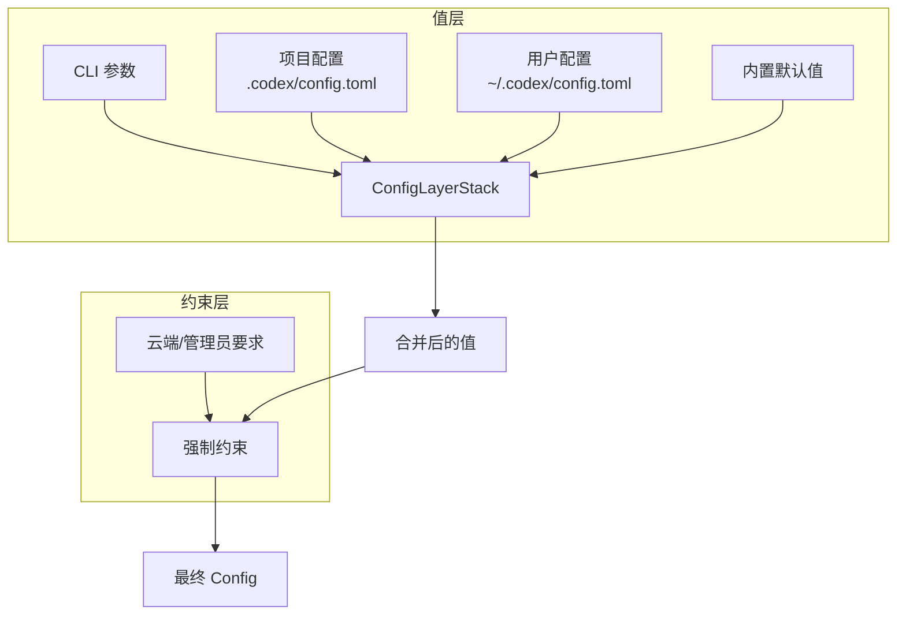

# 11 — 配置系统

> 本章剖析 Codex 的配置分层合并机制、Feature Flags 系统和权限配置。

## 1. 整体架构与伪代码

Codex 的配置分为**值层**和**约束层**两个独立体系：

```
// 值层：按优先级合并（高 → 低）
config_values = merge(
    runtime_overrides,       // 1. CLI 参数 (-c key=value)
    project_configs,         // 2. 项目级 .codex/config.toml（从 cwd 向上多层）
    user_config,             // 3. 用户级 ~/.codex/config.toml
    system_defaults          // 4. 内置默认值
);

// 约束层：独立于值层，强制执行
constraints = cloud_requirements + admin_requirements;
// 约束不可被值层覆盖（如强制 sandbox 或 approval 最低标准）

final_config = apply_constraints(config_values, constraints);
```



> 约束层和值层的关键区别：值层的配置可以被更高优先级的层覆盖，但约束层的限制**不可被用户覆盖**——它们是安全下限。

## 2. 配置文件格式

### 2.1 用户级配置（`~/.codex/config.toml`）

```toml
model = "gpt-5.4"
model_provider = "openai"
approval_policy = "on-request"
sandbox_mode = "workspace-write"

[sandbox_workspace_write]
writable_roots = ["/tmp"]

[model_providers.my_ollama]
name = "Local Ollama"
base_url = "http://localhost:11434/v1"
wire_api = "responses"
supports_websockets = false
```

### 2.2 项目级配置（`.codex/config.toml`）

从 cwd 向上查找，**多层合并**（最近的优先）：

```
/project/.codex/config.toml      ← 项目根级
/project/packages/app/.codex/config.toml  ← 子目录级（更高优先级）
```

### 2.3 命令行覆盖

```bash
codex -c 'model="o3"'
codex -c 'model_providers.proxy.base_url="http://..."'
codex --enable some_feature --disable another_feature
```

**源码**: [config/src/config_toml.rs](https://github.com/openai/codex/blob/main/codex-rs/config/src/config_toml.rs), [core/src/config_loader/](https://github.com/openai/codex/blob/main/codex-rs/core/src/config_loader/)

## 3. Feature Flags

通过 `codex-features` crate 管理功能开关。当前主要的 Feature（使用源码中的实际名称）：

| Feature | 说明 |
|---------|------|
| `WebSearchRequest` / `WebSearchCached` | 网页搜索 |
| `Collab` | 多 Agent 协作模式 |
| `SpawnCsv` | CSV 批量 Agent 生成 |
| `JsRepl` | JavaScript REPL |
| `ImageGen` | 图片生成 |

Feature 解析流程（不是简单的全局单例）：

```
Features::from_sources(config_features, cli_features)
  → ManagedFeatures::from_configured(features, constraints)
    → 应用约束层的强制启用/禁用
  → 最终的 ManagedFeatures 挂载到 Config 上
```

约束层（如云端推送的 `managed_features`）可以**强制覆盖**用户的 feature 设置。

**源码**: [features/src/lib.rs](https://github.com/openai/codex/blob/main/codex-rs/features/src/lib.rs), [core/src/config/mod.rs](https://github.com/openai/codex/blob/main/codex-rs/core/src/config/mod.rs)

## 4. 权限配置

### 4.1 SandboxPolicy

配置顶层字段 `sandbox_mode`（不是 `[sandbox]` 表）：

| sandbox_mode | 文件系统 | 网络 |
|-------------|---------|------|
| `read-only` | 只读 | 禁止 |
| `workspace-write` | cwd + writable_roots 可写 | 禁止 |
| `full-access` | 全部可写 | 允许 |

workspace-write 的详细配置通过 `[sandbox_workspace_write]` 表：

```toml
sandbox_mode = "workspace-write"

[sandbox_workspace_write]
writable_roots = ["/tmp", "/var/data"]
```

### 4.2 Approval Presets

内置的审批策略预设：

| Preset | 审批策略 | 沙箱 |
|--------|---------|------|
| `read-only` | 严格审批 | 只读 |
| `auto` | on-request（模型自主请求） | workspace-write |
| `full-access` | never（从不审批） | full-access |

**源码**: [utils/approval-presets/src/lib.rs](https://github.com/openai/codex/blob/main/codex-rs/utils/approval-presets/src/lib.rs)

## 5. 本章小结

| 组件 | 职责 | 源码 |
|------|------|------|
| **ConfigToml** | TOML 配置文件解析 | [config/src/config_toml.rs](https://github.com/openai/codex/blob/main/codex-rs/config/src/config_toml.rs) |
| **ConfigLayerStack** | 多层值配置的有序合并 | [core/src/config_loader/](https://github.com/openai/codex/blob/main/codex-rs/core/src/config_loader/) |
| **Config** | 最终合并后的结构体 | [core/src/config/mod.rs](https://github.com/openai/codex/blob/main/codex-rs/core/src/config/mod.rs) |
| **ManagedFeatures** | Feature Flags（值层 + 约束层解析） | [features/src/lib.rs](https://github.com/openai/codex/blob/main/codex-rs/features/src/lib.rs) |
| **Approval Presets** | 预定义的审批+沙箱组合 | [utils/approval-presets/](https://github.com/openai/codex/blob/main/codex-rs/utils/approval-presets/src/) |

---

> **源码版本说明**: 本文基于 [openai/codex](https://github.com/openai/codex) 主分支分析。

---

**上一章**: [10 — 产品集成与 App Server](10-sdk-protocol.md)
